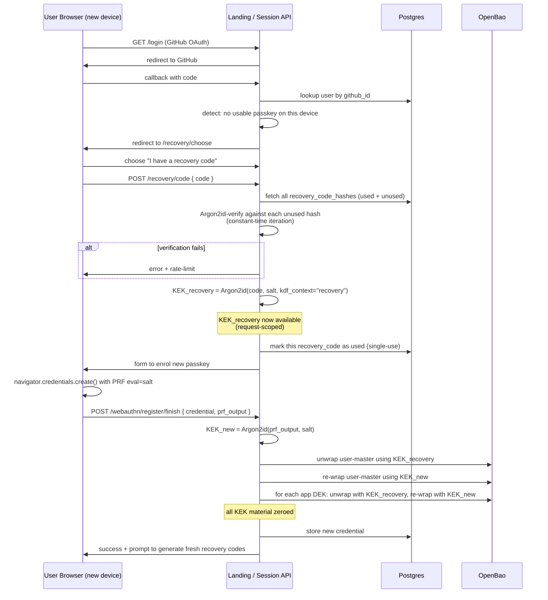

# Secrets Management — Lifecycle Sequence Diagrams

> **Draft.** Companion to [secrets-threat-model.md](./secrets-threat-model.md). All KEK material in these flows is held in request-scoped Node.js buffers and best-effort overwritten before the request handler returns. V8 heap management means deterministic zeroing is not guaranteed in JS/TS; see [Assumption A7](./secrets-threat-model.md#8-assumptions) for the honest accounting and the structural mitigations (process isolation, audit, attestation) that do the actual security lifting.
>
> **Passkey is a hard gate.** Diagram 1 includes an explicit PRF-capability probe before enrolment can complete. Users on devices that fail the probe cannot create an account; see [secrets-device-requirements.md](./secrets-device-requirements.md) for the support matrix and exclusion handling.
>
> **Session-creation freshness.** Every session creation requires a fresh passkey assertion at v1 — no pre-staging between sessions. See [§7 of the threat model](./secrets-threat-model.md#7-session-creation-freshness-policy) for the decision and the deferred convenience-mode option.

## Diagram 1 — First-login enrolment + KEK derivation

Identity comes from a consumer OAuth provider (Google / Apple / Microsoft) or email magic-link — GitHub is not exposed on the user-facing surface even though the platform uses it server-side for repo storage. Passkey enrolment is a hard gate: a PRF-capability probe runs before the credential is accepted, and failure routes to the device-requirements error path rather than creating a partial account.

```mermaid
sequenceDiagram
    participant U as User Browser
    participant L as Landing / Session API
    participant DB as Postgres (user metadata)
    participant V as OpenBao

    U->>L: GET /signup
    L->>U: page with OAuth (Google/Apple/Microsoft) + email magic-link options
    U->>L: select provider; complete OAuth or magic-link flow
    L->>L: verify provider response; extract verified email
    L->>DB: INSERT user(id, email, oauth_provider, created_at)
    L->>U: redirect to /onboarding/passkey (mandatory)

    U->>L: POST /webauthn/register/begin
    L->>L: generate challenge + per-user salt (16B random) + probe nonce
    L->>DB: store challenge (TTL 5min), salt (permanent)
    L->>U: PublicKeyCredentialCreationOptions { challenge, prf.eval.first=salt }

    U->>U: navigator.credentials.create() — user touches authenticator
    U->>L: POST /webauthn/register/finish { credential, prf_output? }

    alt prf_output absent (device/browser cannot satisfy PRF)
        L->>DB: DELETE user (no partial account left behind)
        L->>U: redirect to /signup/device-not-supported<br/>(see device-requirements doc)
    end

    L->>L: verify attestation + challenge
    L->>L: KEK = Argon2id(prf_output, salt) — request-scoped memory only
    L->>V: transit/keys/create user-{userId}
    L->>V: wrap a freshly-generated 32B user-master with KEK; store wrapped form
    Note over L: KEK + plaintext user-master<br/>zeroed at end of handler
    L->>DB: store credential_id, public_key

    L->>U: generate 10 recovery codes, display ONCE
    U->>U: user records codes (download or paper)
    L->>L: prompt for type-back of one code (verify saved)
    L->>L: Argon2id-hash each code
    L->>DB: store recovery_code_hashes[]

    L->>U: redirect to /dashboard
```

**Invariants**

- PRF output exists in browser memory and one HTTPS request body only.
- Salt is per-user and stable (not secret).
- Recovery codes are display-once; only Argon2id hashes persist.
- A signup that fails the PRF probe leaves no user row in the database — the account is not partially created. The user sees a clear "your device isn't supported" page and the system stays clean.
- GitHub does not appear on the user-facing OAuth surface. The platform-owned GitHub org used for per-app repo storage authenticates via a platform PAT, not via user OAuth (see the tenancy memory note: many-users / one-platform-owned source-control account).

## Diagram 2 — User stores a new secret (OpenRouter key)

```mermaid
sequenceDiagram
    participant U as User Browser
    participant L as Landing / Session API
    participant V as OpenBao

    U->>L: POST /webauthn/authenticate/begin
    L->>L: generate challenge
    L->>U: PublicKeyCredentialRequestOptions { challenge, prf.eval.first=salt }

    U->>U: navigator.credentials.get() — user touches authenticator
    U->>L: POST /settings/integrations<br/>{ assertion, prf_output,<br/>  app_id, secret_name: "OPENROUTER_API_KEY",<br/>  secret_value: "sk-or-v1-..." }

    L->>L: verify assertion against stored credential
    L->>L: KEK = Argon2id(prf_output, salt)

    alt App DEK does not yet exist
        L->>V: transit/keys/create app-{appId}
        L->>V: wrap app DEK with KEK; store wrapped form
    end

    L->>L: unwrap app DEK using KEK
    L->>V: transit/encrypt app-{appId} plaintext=secret_value
    V-->>L: ciphertext
    L->>V: kv put secret/data/users/{userId}/apps/{appId}/integrations/OPENROUTER_API_KEY<br/>{ ciphertext }

    Note over L: KEK + DEK + plaintext secret<br/>zeroed before response
    L->>U: 200 OK
```

**Design choice flagged.** In this v1 design, encryption is performed *server-side* in Session API memory using the request-scoped KEK. A stricter "platform never sees plaintext" variant would do the encryption client-side in WebCrypto and ship only ciphertext to the server. That is a v1.5 hardening worth documenting as a follow-up — for v1, server-side encryption with a request-scoped KEK + comprehensive audit is a defensible security/complexity tradeoff. The threat model notes this as the source of T6's residual risk window.

**Alternative considered (and rejected for v1).** Client-side encryption in WebCrypto. Rejected because it requires the user's browser to do the AES-GCM, store derived sub-keys in the IndexedDB-bound CryptoKey objects, and handle key versioning client-side. The UX cost (slower onboarding, complex recovery flow when the IndexedDB is wiped) outweighs the marginal threat reduction at the cohort stage. Re-evaluate at graduation to open signup.

## Diagram 3 — Session start: secret materialisation into per-session pod

This is the trickiest flow because the user is present at session *creation* (PRF is available) but the pod may need secrets at *boot* (PRF is no longer available). The chosen v1 design has Session API decrypt at creation time and stage plaintext to a short-lived per-session OpenBao path that the pod's ServiceAccount can read once.

```mermaid
sequenceDiagram
    participant U as User Browser
    participant L as Session API
    participant V as OpenBao
    participant K as Kubernetes API
    participant P as Per-session Pod
    participant CSI as CSI Secrets Store Driver

    U->>L: POST /sessions { app_id, assertion, prf_output }
    L->>L: verify assertion; KEK = Argon2id(prf_output, salt)
    L->>V: unwrap app DEK using KEK
    L->>V: fetch all ciphertexts under<br/>secret/data/users/{userId}/apps/{appId}/integrations/*
    L->>L: decrypt all secrets using DEK<br/>(plaintexts in request-scoped memory)

    L->>V: create policy session-{sessionId}: read secret/data/sessions/{sessionId}/staged/*
    L->>V: create K8s-auth role session-{sessionId} bound to SA session-{sessionId}, TTL 4h
    L->>V: kv put secret/data/sessions/{sessionId}/staged/* { plaintexts },<br/>TTL 10min, max_reads=1

    Note over L: KEK, DEK, all plaintexts<br/>zeroed before response

    L->>K: create ServiceAccount session-{sessionId}
    L->>K: create Pod with SA + SecretProviderClass referencing staged path

    K->>P: schedule pod
    P->>CSI: mount /var/run/secrets/integrations
    CSI->>K: get projected SA token
    CSI->>V: POST /v1/auth/kubernetes/login { role, jwt }
    V->>V: verify JWT against K8s OIDC issuer
    V-->>CSI: vault token (TTL 4h, scoped policy)

    CSI->>V: read secret/data/sessions/{sessionId}/staged/*
    V-->>CSI: plaintexts (then path TTL expires)
    CSI->>P: write plaintexts to tmpfs
    Note over V: staged path now empty;<br/>only copy lives in pod tmpfs

    P->>P: opencode entrypoint reads tmpfs into env vars
    L->>U: { sessionId, agentUrl, previewUrl } after readiness gate
```

**Invariants**

- User KEK is required *only* at session creation, never during the session.
- The staged path has TTL 10min and max_reads=1 — even if compromised, the window for second-reader exfiltration is minimal.
- Secrets reach the pod via tmpfs only — no `kubectl get secret` exfiltration path exists.
- On pod termination, the OpenBao role + SA + policy are deleted (Session API cleanup) — leases auto-revoke.

**Alternative considered (and rejected).** Plaintext-passthrough via K8s `Secret` with `emptyDir{medium: Memory}`. Rejected because it adds a kubectl-visible plaintext surface (anyone with `get secret` RBAC sees the value) — the CSI-driver-from-OpenBao path keeps secrets out of the Kubernetes API entirely.

**Alternative also considered.** Session API holds a long-lived per-user agent that proxies decryption requests from the pod, requiring user re-attestation periodically. Rejected for v1 because it requires durable user-presence infrastructure (push notifications? polling?) and breaks the "agent runs autonomously while user is away" UX that long-running coding sessions depend on. Worth re-evaluating if/when periodic user re-attestation becomes a product feature for high-sensitivity workflows.

## Diagram 4 — Device-loss recovery



**Note on the re-wrap step.** The new passkey's PRF produces a *different* KEK than the old one. Without re-wrapping app DEKs against `KEK_new`, the recovery code would be required on every login forever. The re-wrap is the step that makes recovery a one-time event, not a permanent crutch.

## Diagram 5 — Per-app DEK rotation

Omitted in this draft. When a user wants to rotate the wrapping for an app, OpenBao's transit `rotate` operation rotates the DEK version. Old ciphertexts remain decryptable until garbage-collected via `transit/rewrap`. This is the OpenBao-native pattern and will be documented as part of the operational runbook alongside KEK rotation on passkey change.
