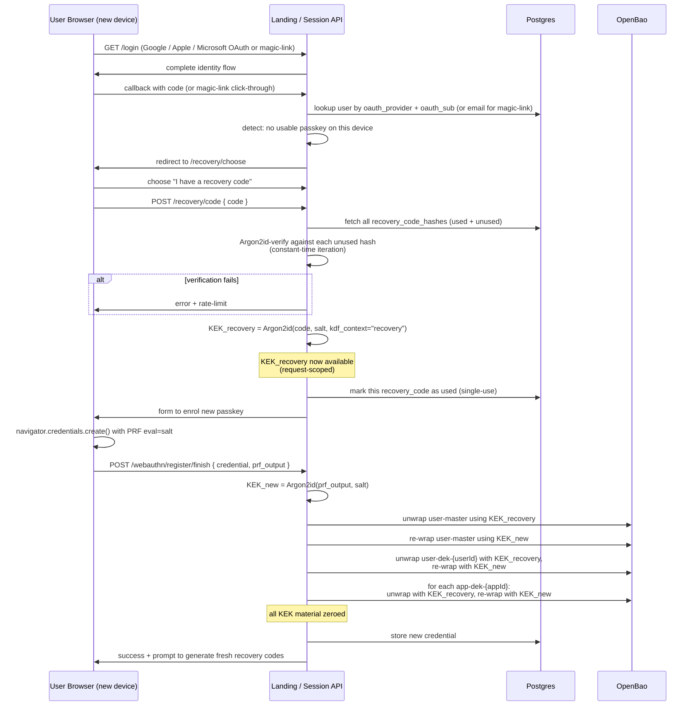

# Secrets Management — Lifecycle Sequence Diagrams

> **Draft.** Companion to [secrets-threat-model.md](./secrets-threat-model.md). All KEK material in these flows is held in request-scoped Node.js buffers and best-effort overwritten before the request handler returns. V8 heap management means deterministic zeroing is not guaranteed in JS/TS; see [Assumption A7](./secrets-threat-model.md#8-assumptions) for the honest accounting and the structural mitigations (process isolation, audit, attestation) that do the actual security lifting.
>
> **Passkey is a hard gate.** Diagram 1 includes an explicit PRF-capability probe before enrolment can complete. Users on devices that fail the probe cannot create an account; see [secrets-device-requirements.md](./secrets-device-requirements.md) for the support matrix and exclusion handling.
>
> **Session-creation freshness.** Every session creation requires a fresh passkey assertion at v1 — no pre-staging between sessions. See [§7 of the threat model](./secrets-threat-model.md#7-session-creation-freshness-policy) for the decision and the deferred convenience-mode option.

## Diagram 1 — First-login enrolment + KEK derivation

Identity comes from a consumer OAuth provider (Google / Apple / Microsoft) or email magic-link — GitHub is not exposed on the user-facing surface even though the platform uses it server-side for repo storage. Passkey enrolment is a hard gate: a PRF-capability probe runs before the credential is accepted, and failure routes to the device-requirements error path rather than creating a partial account.

```mermaid
sequenceDiagram
    participant U as User Browser
    participant L as Landing / Session API
    participant DB as Postgres (user metadata)
    participant V as OpenBao

    U->>L: GET /signup
    L->>U: page with OAuth (Google/Apple/Microsoft) + email magic-link options
    U->>L: select provider; complete OAuth or magic-link flow
    L->>L: verify provider response; extract verified email
    L->>DB: INSERT user(id, email, oauth_provider, created_at)
    L->>U: redirect to /onboarding/passkey (mandatory)

    U->>L: POST /webauthn/register/begin
    L->>L: generate challenge + per-user salt (16B random) + probe nonce
    L->>DB: store challenge (TTL 5min), salt (permanent)
    L->>U: PublicKeyCredentialCreationOptions { challenge, prf.eval.first=salt }

    U->>U: navigator.credentials.create() — user touches authenticator
    U->>L: POST /webauthn/register/finish { credential, prf_output? }

    alt prf_output absent (device/browser cannot satisfy PRF)
        L->>DB: DELETE user (no partial account left behind)
        L->>U: redirect to /signup/device-not-supported<br/>(see device-requirements doc)
    end

    L->>L: verify attestation + challenge
    L->>L: KEK = Argon2id(prf_output, salt) — request-scoped memory only
    L->>V: transit/keys/create user-{userId}
    L->>V: wrap a freshly-generated 32B user-master with KEK; store wrapped form
    Note over L: KEK + plaintext user-master<br/>zeroed at end of handler
    L->>DB: store credential_id, public_key

    L->>U: generate 10 recovery codes, display ONCE
    U->>U: user records codes (download or paper)
    L->>L: prompt for type-back of one code (verify saved)
    L->>L: Argon2id-hash each code
    L->>DB: store recovery_code_hashes[]

    L->>U: redirect to /dashboard
```

**Invariants**

- PRF output exists in browser memory and one HTTPS request body only.
- Salt is per-user and stable (not secret).
- Recovery codes are display-once; only Argon2id hashes persist.
- A signup that fails the PRF probe leaves no user row in the database — the account is not partially created. The user sees a clear "your device isn't supported" page and the system stays clean.
- GitHub does not appear on the user-facing OAuth surface. The platform-owned GitHub org used for per-app repo storage authenticates via a platform PAT, not via user OAuth (see the tenancy memory note: many-users / one-platform-owned source-control account).

## Diagram 2 — User stores a new secret

The user picks a scope when storing: `user` (cross-app — e.g. the user's own OpenRouter dev key) or `app` (one specific app — e.g. Zapier, or a deployed app's runtime LLM key). The two scopes have separate DEKs and ownership-neutral storage paths; the wrapping flow is identical, only the key name and storage path differ. See [threat-model §2.1](./secrets-threat-model.md#21-secret-scope-hierarchy) for the scope hierarchy and the app-overrides-user collision rule.

```mermaid
sequenceDiagram
    participant U as User Browser
    participant L as Landing / Session API
    participant V as OpenBao

    U->>L: POST /webauthn/authenticate/begin
    L->>L: generate challenge
    L->>U: PublicKeyCredentialRequestOptions { challenge, prf.eval.first=salt }

    U->>U: navigator.credentials.get() — user touches authenticator
    U->>L: POST /settings/integrations<br/>{ assertion, prf_output,<br/>  scope: "user" | "app",<br/>  app_id?: appId,   // required iff scope == "app"<br/>  secret_name: "OPENROUTER_API_KEY",<br/>  secret_value: "sk-or-v1-..." }

    L->>L: verify assertion against stored credential
    L->>L: KEK = Argon2id(prf_output, salt)

    alt scope == "user"
        alt user-scope DEK does not yet exist
            L->>V: transit/keys/create user-dek-{userId}
            L->>V: wrap user-dek with KEK; store wrapped form
        end
        L->>L: unwrap user-dek using KEK
        L->>V: transit/encrypt user-dek-{userId} plaintext=secret_value
        V-->>L: ciphertext
        L->>V: kv put secret/data/users/{userId}/integrations/{secret_name}<br/>{ ciphertext }
    else scope == "app"
        alt app-scope DEK does not yet exist
            L->>V: transit/keys/create app-dek-{appId}
            L->>V: wrap app-dek with KEK; store wrapped form
        end
        L->>L: unwrap app-dek using KEK
        L->>V: transit/encrypt app-dek-{appId} plaintext=secret_value
        V-->>L: ciphertext
        L->>V: kv put secret/data/apps/{appId}/integrations/{secret_name}<br/>{ ciphertext }
    end

    Note over L: KEK + DEK + plaintext secret<br/>zeroed before response
    L->>U: 200 OK
```

**Design choice flagged.** In this v1 design, encryption is performed *server-side* in Session API memory using the request-scoped KEK. A stricter "platform never sees plaintext" variant would do the encryption client-side in WebCrypto and ship only ciphertext to the server. That is a v1.5 hardening worth documenting as a follow-up — for v1, server-side encryption with a request-scoped KEK + comprehensive audit is a defensible security/complexity tradeoff. The threat model notes this as the source of T6's residual risk window.

**Alternative considered (and rejected for v1).** Client-side encryption in WebCrypto. Rejected because it requires the user's browser to do the AES-GCM, store derived sub-keys in the IndexedDB-bound CryptoKey objects, and handle key versioning client-side. The UX cost (slower onboarding, complex recovery flow when the IndexedDB is wiped) outweighs the marginal threat reduction at the cohort stage. Re-evaluate at graduation to open signup.

## Diagram 3 — Session start: secret materialisation into per-session pod

This is the trickiest flow because the user is present at session *creation* (PRF is available) but the pod may need secrets at *boot* (PRF is no longer available, and the pod may take seconds-to-minutes to schedule + image-pull). The chosen v1 design is **two-phase staging**: Session API decrypts plaintexts into request-scoped memory at creation, mints the per-session OpenBao policy + role + K8s SA, then creates the Pod. A small in-cluster reaper controller observes the Pod's phase transitions and triggers materialisation of the OpenBao staged path *only when the CSI mount is about to read it*, collapsing the staged-path TTL window from "10 minutes from session creation" to seconds. After CSI mount completes, the reaper deletes the OpenBao policy (functional `max_reads=1`).

**Scope merging.** The session fetches both user-scope and app-scope secrets, decrypts both, and merges them with the app-overrides-user collision rule — see [threat-model §2.1](./secrets-threat-model.md#21-secret-scope-hierarchy). An audit event records every override.

```mermaid
sequenceDiagram
    participant U as User Browser
    participant L as Session API
    participant V as OpenBao
    participant K as Kubernetes API
    participant R as Session Reaper
    participant P as Per-session Pod
    participant CSI as CSI Secrets Store Driver

    U->>L: POST /sessions { app_id, assertion, prf_output }
    L->>L: verify assertion; KEK = Argon2id(prf_output, salt)
    L->>V: unwrap user-dek-{userId} using KEK
    opt app has app-scope secrets
        L->>V: unwrap app-dek-{appId} using KEK
    end
    L->>V: fetch user-scope ciphertexts at<br/>secret/data/users/{userId}/integrations/*
    L->>V: fetch app-scope ciphertexts at<br/>secret/data/apps/{appId}/integrations/*
    L->>L: decrypt user-scope with user-dek<br/>(plaintexts in request-scoped memory)
    L->>L: decrypt app-scope with app-dek<br/>(plaintexts in request-scoped memory)
    L->>L: merge maps: app-scope overrides user-scope<br/>on name collision; audit each override

    L->>L: hold merged plaintexts in in-process map<br/>keyed by sessionId, TTL 5min
    Note over L: KEK + DEKs zeroed before next step;<br/>plaintexts persist in map until reaper callback

    L->>V: create policy session-{sessionId}:<br/>read secret/data/sessions/{sessionId}/staged/*
    L->>V: create K8s-auth role session-{sessionId}<br/>bound to SA session-{sessionId}, TTL 4h
    L->>K: create ServiceAccount session-{sessionId}
    L->>K: create Pod with SA + SecretProviderClass<br/>referencing staged path

    K->>P: schedule pod (Pending)
    R->>K: watch pod phase
    K-->>R: phase = ContainerCreating
    R->>L: POST /internal/reaper/stage/{sessionId}<br/>(shared-secret authed)
    L->>V: kv put secret/data/sessions/{sessionId}/staged/*<br/>{ merged plaintexts }, TTL 10min
    L->>L: zero plaintexts from in-process map
    L-->>R: 200 OK

    P->>CSI: mount /var/run/secrets/integrations
    CSI->>K: get projected SA token (audience: openbao)
    CSI->>V: POST /v1/auth/kubernetes/login { role, jwt }
    V->>V: verify JWT against K8s OIDC issuer
    V-->>CSI: vault token (TTL 4h, scoped policy)
    CSI->>V: read secret/data/sessions/{sessionId}/staged/*
    V-->>CSI: plaintexts
    CSI->>P: write plaintexts to tmpfs
    K-->>R: phase = Running

    R->>V: DELETE sys/policies/acl/session-{sessionId}<br/>(functional max_reads=1)
    Note over V: staged path may still exist until TTL,<br/>but no live policy grants read access

    P->>P: opencode entrypoint sources tmpfs into env<br/>and unsets from parent shell
    L->>U: { sessionId, agentUrl, previewUrl } after readiness gate

    Note over P,R: ... session runs ...

    K-->>R: phase = Succeeded | Failed
    R->>V: DELETE auth/kubernetes/role/session-{sessionId}
    R->>K: DELETE ServiceAccount session-{sessionId}
```

**Invariants**

- User KEK is required *only* at session creation, never during the session.
- KEK and DEK bytes are zeroed before the Pod is created; only the *decrypted plaintexts* persist (in Session API's in-process map) for the duration of pod scheduling, then move into the OpenBao staged path.
- The staged path lives at most from "Pod enters ContainerCreating" to "Pod enters Running" — typically seconds. Combined with the reaper's policy-delete, this gives functional `max_reads=1` (CSI is the only reader, and after Running there is no live policy granting read access). The 10min path TTL is a safety net, not the primary security boundary.
- App-scope reads scope to exactly *this app* (`apps/{appId}`); cross-app pivot is denied at policy level.
- User-scope reads scope to *this user* (`users/{userId}`); cross-user pivot is denied at policy level.
- Secrets reach the pod via tmpfs only — no `kubectl get secret` exfiltration path exists.
- On Pod terminal phase, the reaper deletes the OpenBao role + K8s SA (idempotent on 404).

**Alternative considered (and rejected).** Eager staging (single-phase): Session API writes plaintexts to OpenBao staged path immediately at session creation. Rejected because slow image pull on cold-scheduled nodes can expire the 10min TTL before CSI mounts, producing CrashLoopBackOff and a confusing user-facing error. The reaper-coordinated two-phase design moves staging to the moment of need.

**Alternative considered (and rejected).** Plaintext-passthrough via K8s `Secret` with `emptyDir{medium: Memory}`. Rejected because it adds a kubectl-visible plaintext surface (anyone with `get secret` RBAC sees the value) — the CSI-driver-from-OpenBao path keeps secrets out of the Kubernetes API entirely.

**Alternative also considered.** Session API holds a long-lived per-user agent that proxies decryption requests from the pod, requiring user re-attestation periodically. Rejected for v1 because it requires durable user-presence infrastructure (push notifications? polling?) and breaks the "agent runs autonomously while user is away" UX that long-running coding sessions depend on. Worth re-evaluating if/when periodic user re-attestation becomes a product feature for high-sensitivity workflows.

## Diagram 4 — Device-loss recovery



**Note on the re-wrap step.** The new passkey's PRF produces a *different* KEK than the old one. Without re-wrapping every DEK (user-scope + all per-app) against `KEK_new`, the recovery code would be required on every login forever. The re-wrap is the step that makes recovery a one-time event, not a permanent crutch.

## Diagram 5 — Per-app DEK rotation

Omitted in this draft. When a user wants to rotate the wrapping for an app, OpenBao's transit `rotate` operation rotates the DEK version. Old ciphertexts remain decryptable until garbage-collected via `transit/rewrap`. This is the OpenBao-native pattern and will be documented as part of the operational runbook alongside KEK rotation on passkey change.
