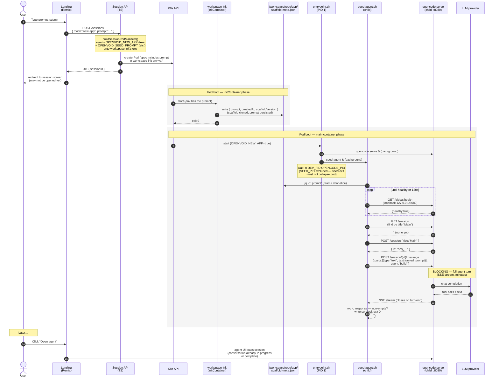

# Auto-seed prompt flow

How the user's landing-form prompt gets from the browser to the OpenCode
agent's first turn at session boot. The key transport: the prompt rides
on the **pod manifest itself** as an env var on the `workspace-init`
initContainer — it never traverses cluster network *into* the pod after
creation.

## Mental-model notes

- **Transport for the prompt:** Session API embeds the prompt in the
  pod manifest's env block (step 3). `workspace-init` reads from its
  own env (step 5) and writes to the `emptyDir` volume. `seed-agent`
  reads from the same volume (step 9). No post-creation HTTP into the
  pod is involved.
- **Why a file, not a pipe:** initContainers always exit before the
  main container starts, so they cannot share memory or stdin. The
  `emptyDir` mounted at `/workspace` is the only cross-container
  channel; `scaffold-meta.json` is the contract.
- **Why loopback for all `seed-agent` → OpenCode calls:** the agent's
  public URL goes through an Ingress that may not yet be wired when
  the seed runs, and we have a documented loopback trap from
  `docs/solutions/runtime-errors/landing-ingress-probe-stuck-running-pre-ingress-2026-05-09.md`.
  `127.0.0.1:8080` is reachable the instant `opencode serve` binds.
- **Why `SEED_PID` is excluded from `wait -n`:** the entrypoint exits
  when the first named child dies. A successful seed exit (`exit 0`
  after `write_sentinel`) must not collapse the pod — only `pnpm dev`
  or `opencode serve` deaths should.

## Failure-mode coverage

The diagram shows the happy path. Failure classifications (transient
vs. permanent, sentinel-or-not) are documented in
`infra/images/opencode/README.md` "Seed-on-boot → Failure handling"
and operator-side in `docs/runbooks/platform-github-org-setup.md`
"Troubleshooting — seed-on-boot not firing".
