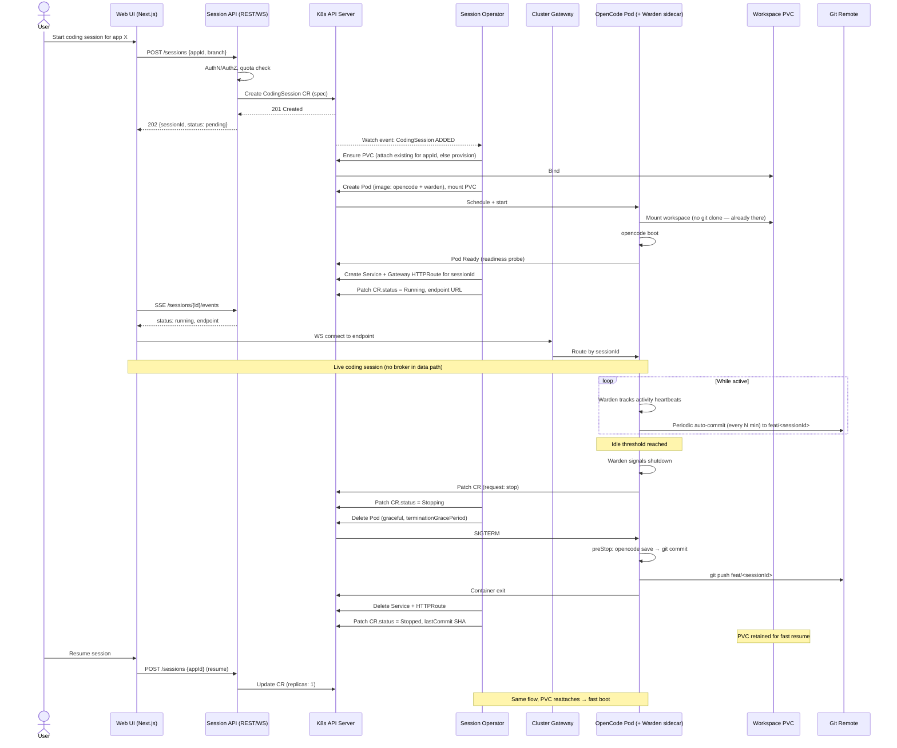

# Ideation: Monorepo Layout & Coding Session Controller

## Codebase Context

**Repo state:** Greenfield. Only `LICENSE` is committed. No prior code, no AGENTS.md/CLAUDE.md/README.md to ground in.

**Architectural systems described by the user:**

1. **Web UI** — fullstack React (Next.js / Remix focus). Lets users start coding sessions and create fullstack web apps.
2. **Coding session controller/broker** — receives a "start session" signal, spins up an OpenCode pod, attaches it to the user's account, idle-shuts-down with a save-to-`feat/fix` branch on the way out.
3. **Deployment controller (tentative)** — code lands in a per-app remote Git repo with two branches (`production`, `development`) mapping to two K8s clusters; ArgoCD-driven sync.

**Hard constraints from the user:**

- **No Git in the middle of session start/stop.** Boot reads from a PVC; Git is only the durable backup target.
- Monorepo with appropriate component separation.
- Two architectural options on the table for the controller: K8s Operator (controller-runtime) vs REST API service.
- Wants a sequence diagram of the end-to-end controller flow.

**Ancillary requirements:** linkable component libraries (Shadcn, Malvine, etc.), external API connections, packaging/containerization for ArgoCD-based deploy.

**Past learnings:** None on file (`docs/solutions/` does not exist yet).

## Ranked Ideas

### A. Monorepo & repo split

#### A1. Turborepo + pnpm workspaces, polyglot-ready: `apps/`, `services/`, `packages/`, `infra/`
**Description:** Top-level layout: `apps/web` (Next.js Web UI), `services/session-api` (REST gateway, TS), `services/session-operator` (Go, K8s controller built with kubebuilder/controller-runtime), `services/deploy-controller` (TS or stub for now), `packages/protocol` (shared OpenAPI/CRD schemas, generated TS types), `packages/shared-config`, `infra/helm`, `infra/argocd`, `infra/crds`. Turborepo for caching/tasks, pnpm for JS deps, Go module rooted at `services/session-operator/`.
**Rationale:** Lets each service evolve independently, supports polyglot (Go-first ecosystem for K8s operators is non-negotiable in 2026), and `packages/protocol` enforces a single source of truth between Web UI ↔ API ↔ CRD.
**Downsides:** Polyglot CI is more complex than single-language. Two package managers (pnpm + go.mod) requires discipline.
**Confidence:** 85% · **Complexity:** Low · **Status:** Explored (brainstorm 2026-05-01)

#### A2. Contract-first `packages/protocol` package
**Description:** All cross-service contracts in one package: OpenAPI for the Session API, CRD YAML + generated types for `CodingSession`, event schemas (Zod or JSON Schema). Generators emit TS types for Web UI/API and Go types for the operator.
**Rationale:** "No Git in the middle" depends on rock-solid API contracts between Web UI → API → K8s. A contract package prevents drift across three languages and three runtimes.
**Downsides:** Up-front investment in codegen pipeline. Wrong abstraction here would slow everything down.
**Confidence:** 75% · **Complexity:** Medium · **Status:** Unexplored

#### A3. Infra-as-code as a first-class workspace, not a dotfile
**Description:** `infra/` holds Helm charts (one per service), CRD manifests, Argo `Application` definitions, and per-environment values files. Versioned alongside code; CI promotes Helm chart versions on merge.
**Rationale:** Since deployment is via ArgoCD, the manifests *are* product. Hiding them in `.github/` or a separate ops repo creates the exact drift you'd suffer from later.
**Downsides:** Couples app and infra release cadence. Mitigation: independent Helm chart versions per service.
**Confidence:** 80% · **Complexity:** Low · **Status:** Unexplored

### B. Session controller / broker

#### B1. Hybrid: `CodingSession` CRD + thin Session API gateway (RECOMMENDED)
**Description:** A `CodingSession` Custom Resource defines desired state (`userId`, `appId`, `branch`, `idleTimeoutSeconds`, `componentLibraries`, etc.). A Go operator (kubebuilder) reconciles it: creates PVC, Pod (OpenCode + idle-watch sidecar), updates `status` (pending/running/stopping/stopped, endpoint URL, last commit SHA). A separate `services/session-api` (TS, stateless) is the *only* thing the Web UI talks to — it does authn/authz, quota checks, then creates/patches/deletes CRs via the K8s API. Web UI never touches K8s directly.
**Rationale:** K8s-native reconciliation (drift recovery, declarative status, native eventing) AND a friendly HTTP/WebSocket surface for the Web UI without leaking K8s primitives. Pure REST loses reconciliation; pure operator forces the Web UI to be a K8s client. Standard pattern in the K8s ecosystem (Crossplane, Knative serving control plane).
**Downsides:** Two services to operate. CRD schema migrations need care.
**Confidence:** 85% · **Complexity:** Medium · **Status:** Unexplored

#### B2. Sidecar-driven idle detection + `preStop` save-and-push hook
**Description:** Each session Pod runs OpenCode + a small "warden" sidecar. The warden tracks last-activity heartbeats from OpenCode (file edits, prompts, terminal use). When idle exceeds threshold, warden requests pod termination via the operator (CR patch). Pod's `preStop` hook runs `opencode commit && git push origin feat/<session-id>` before container exits. `terminationGracePeriodSeconds` set generously (e.g., 120s) for clean push.
**Rationale:** Keeps the operator simple — it doesn't need to peek into pod internals. Each pod manages its own shutdown saga. The warden becomes a natural place to also enforce per-session resource policy, sandbox checks, and emit telemetry.
**Downsides:** Failure mode: pod OOM-killed = no preStop runs = lost work. Mitigation: periodic auto-commits every N minutes (still no Git in the spin-up path, only spin-down).
**Confidence:** 80% · **Complexity:** Low-Medium · **Status:** Unexplored

#### B3. Sticky session routing via in-cluster Gateway API, not through the broker
**Description:** Web UI gets back a session URL like `https://sessions.openvoid.dev/<sessionId>/...`. An Envoy/Gateway-API ingress routes by `sessionId` directly to the session pod (Service per session, or headless Service + path-based routing). The Session API does *not* proxy traffic — it only manages lifecycle. WebSocket connections flow Web UI ↔ ingress ↔ Pod.
**Rationale:** Keeps the API stateless and horizontally scalable. The broker doesn't become a bottleneck for live agent traffic.
**Downsides:** Routing config must be reconciled when sessions come/go (operator's job). Per-session DNS subdomain simplifies routing if you accept short-lived `*.sessions.openvoid.dev` certs.
**Confidence:** 75% · **Complexity:** Medium · **Status:** Unexplored

#### B4. Workspace persistence via per-session PVC, pooled & reusable across resumes
**Description:** Each `CodingSession` gets a PVC keyed by `userId/appId`. On session start, operator attaches the existing PVC (or provisions fresh). Workspace state survives shutdown: when user resumes, the PVC re-attaches → instant boot, no `git clone` in the boot path (honors "no Git in the middle"). Git push only happens on idle/explicit save, *not* on boot.
**Rationale:** Replit-class UX requires fast resumes. PVC-per-app is cheaper than rebuilding workspace from Git on every start. Git stays as durable backup, not the runtime source.
**Downsides:** Storage cost grows with users. Need a TTL/eviction policy for inactive apps. Cross-zone PVC scheduling can pin pods to nodes.
**Confidence:** 80% · **Complexity:** Medium · **Status:** Unexplored

#### B5. Pluggable runtime adapter — Pod today, microVM tomorrow
**Description:** The operator's reconciler has a `Runtime` interface (`Provision`, `Attach`, `Terminate`). v1 implementation: standard Pod. v2 swap-in: Kata Containers or Firecracker (gVisor) for stronger isolation when running untrusted user code. Selection per-CR via `spec.runtime: pod | microvm`.
**Rationale:** An open-source Replit alternative *will* run untrusted code. Designing the boundary now (a thin Go interface) is nearly free; retrofitting later is expensive. Don't build microVM in v1, but don't paint yourself into a Pod-only corner either.
**Downsides:** Premature interface risk if v1 ships and microVM never happens. Mitigation: keep the interface minimal — three methods, not ten.
**Confidence:** 65% · **Complexity:** Low (in v1) · **Status:** Unexplored

## Recommended Sequence — Controller End-to-End Flow (B1 + B2 + B3 + B4)

**Invariants this honors:**

- No Git in the spin-up path — boot reads from PVC, not from `git clone`.
- Web UI never talks K8s — only the Session API does.
- Operator owns reconciliation — broker crashes don't orphan pods; CRs survive and reconcile on restart.
- Data plane (live agent traffic) bypasses the broker — broker stays stateless and scales independently.

## Naming Note

Recommended terminology to use throughout the codebase:

- **Session Operator** — the Go controller (`services/session-operator`). Owns the K8s reconcile loop.
- **Session API** — the user-facing REST/WS gateway (`services/session-api`). Stateless, scales horizontally.
- **CodingSession** — the CRD kind.
- **Warden** — the sidecar inside each session pod.

Avoid generic names like "Session Manager" or "Workbench Controller" — they don't map cleanly to K8s vocabulary and will create confusion when the team grows.

## Rejection Summary

| # | Idea | Reason Rejected |
|---|------|-----------------|
| 1 | Pure REST-only controller (no CRD/operator) | Loses reconciliation; broker crash → orphaned pods; no declarative status |
| 2 | Pure operator with Web UI calling K8s API directly | Web UI shouldn't do auth/quota/billing; couples UI release to K8s API surface |
| 3 | TypeScript-everywhere (TS operator) | TS K8s operator ecosystem is immature; Go is the unambiguous path in 2026 |
| 4 | Knative scale-to-zero for sessions | Agent state can't survive scale-down without snapshotting; wrong primitive |
| 5 | Job-based sessions | Sessions are long-lived interactive things, not batch units |
| 6 | Single-binary collapsing Web UI + broker | Couples wildly different lifecycles; kills horizontal scaling story |
| 7 | BYO-cluster in v1 | Operationally explosive; revisit post-MVP |
| 8 | Nx/Bazel for monorepo | Overkill for ~4 services; Turborepo+pnpm is the right weight class for v1 |
| 9 | Git-clone-on-boot workspace | Violates "no Git in the middle" and slows resumes |
| 10 | Broker-as-WebSocket-proxy | Makes broker stateful and a bottleneck for live agent traffic |
| 11 | Naming: "Session Manager" / "Workbench Controller" | Generic; doesn't map to K8s vocabulary |

## Open Questions for Brainstorm

These should be resolved when a specific idea moves into `ce:brainstorm`:

1. **Session API language** — TS (shares contract package easily with Web UI) or Go (shares with operator)? Default: TS.
2. **Per-session DNS vs path-based routing** — `<id>.sessions.openvoid.dev` vs `sessions.openvoid.dev/<id>/`. Cert/TLS implications differ.
3. **PVC TTL policy** — how long to retain idle workspaces before relying solely on Git? Cost vs UX tradeoff.
4. **Periodic auto-commit cadence** — every 1m? 5m? Only on file-change quiet windows?
5. **Multi-cluster topology** — single control-plane cluster + per-region session clusters, or one cluster does both?
6. **Git host abstraction** — assume GitHub, or design a `GitProvider` interface from day one (GitHub/GitLab/Gitea)?

## Session Log

- 2026-05-01: Initial ideation — ~25 raw candidates generated across monorepo and controller domains; 8 survived (3 monorepo + 5 controller). Recommended composition is B1 + B2 + B3 + B4. Sequence diagram included for the recommended composition.
- 2026-05-01: Brainstorm started on A1 (monorepo layout). Controller brainstorm (B1) queued to follow.
