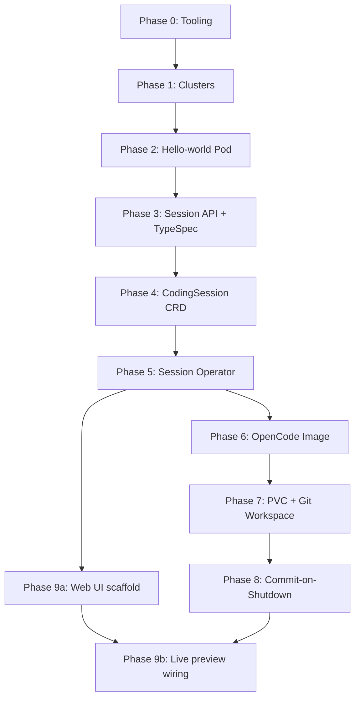
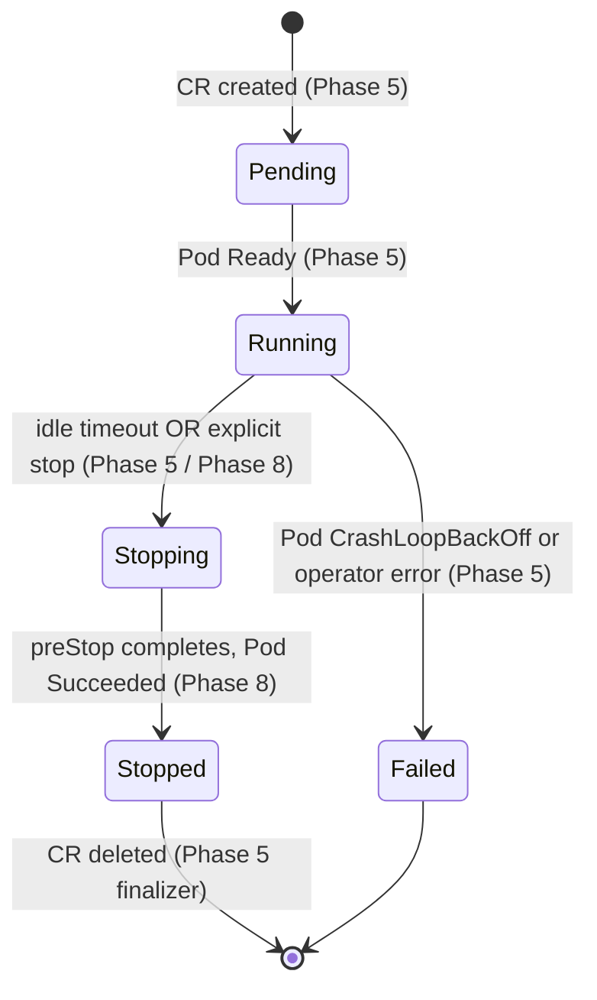

# v1 Staged Walkthrough — Coding-Session Lifecycle Proof

## Overview

This plan implements openvoid v1: a layered, learn-by-doing walkthrough that proves the coding-session lifecycle works end-to-end. v1 is **not** a polished platform; it is a runnable demo that an implementer (Kubernetes-novice) can build slice by slice, with every step ending in a concrete checkpoint they can `kubectl` and `curl` against.

The plan is structured as **9 phases (one per vertical slice from the brainstorm)**, plus a **Phase 0 toolchain setup**. Each phase ends in a demoable artifact. Earlier phases use simpler stand-ins (raw `kubectl apply`, no Helm, no CI) and graduate to richer machinery (kustomize, then Helm, then nightly CI) only when a slice demonstrably needs it.

## Problem Frame

openvoid is a greenfield open-source platform (Replit/v0/Lovable alternative). The repo currently contains only `LICENSE`. The implementer is comfortable with Docker but has no hands-on Kubernetes experience. v1 must prove the coding-session lifecycle works — start a session, run an OpenCode pod, let the agent edit code in a Git workspace, see a live preview, idle-stop the pod, push the work back to a `feat/<session-id>` branch — across both a local kind cluster and a remote DigitalOcean Kubernetes (DOKS) cluster.

(See origin: `docs/brainstorms/2026-05-01-monorepo-layout-requirements.md` — sections "v1 Milestone & Build Strategy" and "Success Criteria".)

## Requirements Trace

The plan satisfies the brainstorm's milestone success criterion and the supporting monorepo-property criteria:

- **R1 (milestone).** Local + DOKS end-to-end: Web UI → Session API → CodingSession CR → Operator → OpenCode Pod → Git workspace → live preview → idle-stop → `feat/<session-id>` push.
- **R2 (one-source-file API contract).** Phase 3 introduces TypeSpec; Phase 4+ keep it as the only edit point for the HTTP/WS contract.
- **R3 (per-service CI scoping).** Phase 2 establishes the monorepo layout; CI is layered in incrementally — minimum viable CI in Phase 5 (operator unit tests), end-to-end CI gate added in Phase 9.
- **R4 (Go developer reasoning in isolation).** Phase 4–5 produce a self-contained `services/session-operator/` Go module.
- **R5 (drift bounded by integration tests).** Phase 5+ exercise API → CR → operator end-to-end via integration tests.

(All Rs above map to the brainstorm's R1–R17. Cross-references in implementation units use the brainstorm's IDs verbatim.)

## Scope Boundaries

Carried from the brainstorm; reaffirmed here so the plan stays disciplined:

- **No `services/deploy-controller` in v1.** ArgoCD reconciles `infra/helm/` (introduced in Phase 9). No openvoid-side deploy controller.
- **No `cli/` workspace, no `openvoid` CLI in v1.**
- **No microVM/Firecracker runtime.** v1 uses standard Pods.
- **No multi-cluster topology.** v1 = one kind cluster locally, one DOKS cluster remotely.
- **No Go emission from `packages/protocol`.** The operator does not consume HTTP/WS contracts.
- **No automated API↔CRD schema-compat tooling.** Drift is bounded by integration tests in Phases 5, 7, 8.
- **No Changesets / NPM publishing in v1.**
- **No livenessProbe on the OpenCode pod** (per best-practice research — a thinking LLM looks dead but isn't). Readiness only. `activeDeadlineSeconds` is the failsafe.
- **No semver tags on services in v1.** SHA-tagged images, ArgoCD reconciles values updates in `infra/helm/`.

## Threat Model (v1 Posture)

Recorded so reviewers and future contributors know what is in/out of v1's security scope.

**Assets:** the implementer's GitHub PAT (scoped to one test repo), session workspace contents (user-authored code), the OpenCode HTTP password, cluster Secrets in `openvoid-system`, DigitalOcean billing.

**Trust boundaries:**
- Web UI is publicly reachable through cloudflared but requires a valid GitHub OAuth session.
- Session API requires a valid signed JWT on every request.
- Session pod is treated as **untrusted** even for v1's single user — an LLM agent following user prompts can be steered by prompt injection in cloned-repo content or webfetch responses.
- The operator and Session API are trusted (they manage cluster state and credentials).

**In-scope mitigations for v1:**
- Authn at the Web UI (GitHub OAuth via NextAuth, username allowlist).
- Authn between Web UI and Session API (signed JWT, shared signing key in Secret).
- Network isolation: default-deny NetworkPolicy in `openvoid-sessions` with explicit egress allowlist.
- `automountServiceAccountToken: false` on session pods.
- Fine-grained GitHub PAT scoped to one repo.
- Tightened `opencode.json` (deny reading `/etc/git*`, deny webfetch to GitHub, restricted bash).
- `activeDeadlineSeconds` failsafe.

**Known v1 limitations (accepted, deferred to v1.5):**
- No microVM/Firecracker isolation — pod escape is theoretically possible.
- Long-lived PAT stored in cluster Secret (vs. per-session GitHub App tokens).
- Live preview iframe served on a public Cloudflare subdomain — predictable session-id-based URL is reachable by anyone who guesses it (mitigated by session-id being a ULID with ~80 bits of entropy, but no defense against session-id leak).
- Single-user assumption — multi-tenant isolation (per-tenant namespaces, NetworkPolicies, RBAC) is v1.5+.

**Top-three exploits if v1 ships as written:**
1. **Compromised LLM provider response or malicious cloned repo steers the agent.** Mitigation: tightened opencode.json + NetworkPolicy egress allowlist limit blast radius even if the agent is steered.
2. **GitHub OAuth username allowlist drift.** Mitigation: allowlist is in env-var/values; treat changes like code changes.
3. **Cloudflare account compromise.** Out of openvoid's control; document as upstream dependency in Risks.

## Cross-Platform Parity Matrix (kind vs DOKS)

The plan's R1 success criterion requires the milestone to work on both kind and DOKS. The differences are scattered across phases; this matrix consolidates them so the implementer doesn't discover them at integration time.

| Concern | kind (local) | DOKS (remote) | Where it surfaces |
|---|---|---|---|
| Cluster context | `kind-openvoid-local` | `do-nyc1-openvoid-dev` | Phase 1 |
| Storage class | `standard` | `do-block-storage` | Phase 7.1 — Helm value |
| PVC provision latency | <1 s | 15–45 s | Phase 7 UX (provisioning state) |
| Container registry | `localhost:5001/openvoid/...` | `ghcr.io/openvoid/...` | Phase 5+ — operator env var |
| Image build flow | Tilt + ko/buildx → local registry | CI builds + pushes to GHCR; Helm values updated | Phase 5, 9 |
| Live preview routing | `kubectl port-forward` (Tilt-managed) | `cloudflared` tunnel + wildcard CNAMEs | Phase 9.4 |
| Web UI public URL | `localhost:3000` | `https://app.<domain>` | Phase 9 |
| Session pod public URL | `localhost:<port>` (port-forwarded) | `<sessionId>.{agent,preview}.<domain>` | Phase 9 |
| Network policies | Optional in v1 (kind doesn't enforce by default without a CNI plugin); document but don't require | **Required** — DOKS uses Cilium/Calico, NetworkPolicies enforced | Phase 5+ — Helm value `networkPolicies.enabled` |
| Auth | NextAuth still required (consistent UX) | NextAuth required | Phase 9 |
| Cluster cost | $0 | ~$24/mo while running | `infra/remote/doks-destroy.sh` between sessions |
| Concurrent sessions | Limited by laptop RAM | 1 on `s-2vcpu-4gb`; bump to `s-2vcpu-8gb` ($48/mo) for ≥2 | Document in `infra/remote/README.md` |
| `cloudflared` Deployment | Not present | Present | Phase 9.4 — Helm value `cloudflared.enabled` |
| ArgoCD | Not present (Tilt manages reconciliation locally) | Present | Phase 6+ |

**Implementer rule:** Every Helm value with cluster-specific behavior MUST appear in both `infra/helm/values/local.yaml` and `infra/helm/values/dev.yaml` so a value-set diff between them tells you exactly what changes per cluster.

## Context & Research

### Repository state

Greenfield. Only `LICENSE`. Existing planning artifacts at `docs/ideation/`, `docs/brainstorms/`. `.claude/settings.local.json` already permits `git`, `github.com`, and `tilt.dev`. No `package.json`, `go.mod`, `tsconfig.json`, Dockerfile, or CI workflow yet.

### Key technologies and versions (pinned at planning time)

| Layer | Choice | Version (May 2026) | Notes |
|---|---|---|---|
| Local cluster | `kind` | v0.27+ | Containerd-config-path patch optional in v0.27+ |
| Local registry | `localhost:5001` | per kind doc | Standard "kind + local registry" pattern |
| Local dev orchestrator | `Tilt` | latest stable | Tiltfile in Starlark; `cluster-api` Tiltfile is the gold-standard reference |
| Remote cluster | DOKS | k8s 1.32 | `s-2vcpu-4gb` × 1 node = ~$24/mo; skip HA control plane |
| Remote CLI | `doctl` | latest | `--update-kubeconfig` and `--set-current-context` default true |
| Operator framework | `kubebuilder` | v4.14.0 | Min Go 1.22; pairs with controller-runtime v0.23.x |
| Operator language | Go | latest stable (1.x) | Single Go module rooted at `services/session-operator/` |
| TS package manager | `pnpm` | 9+ | Workspaces |
| TS task runner | `Turborepo` | latest major | Affected-task detection |
| Contract IDL | `@typespec/openapi3` | latest | Configure `openapi-versions: ["3.1.0"]` |
| TS client codegen | `openapi-typescript` | v7.x | Consumes 3.1 cleanly |
| Go container builds | `ko` | latest | Tilt: `ko_build()` extension |
| TS container builds | `docker buildx` | latest | Tilt: `docker_build()` with `live_update` |
| Container registry | GHCR | n/a | `ghcr.io/openvoid/...`; v1 is repo-public so anonymous pulls work |
| Helm | latest 3.x | n/a | Introduced in Phase 9 only |
| ArgoCD | latest stable | n/a | Introduced in Phase 9 only |
| OpenCode | `opencode-ai` | latest | `opencode serve` mode; install via `npm i -g opencode-ai` or `curl ... | bash` |
| Live preview (kind) | `kubectl port-forward` | n/a | Tilt-managed |
| Live preview (DOKS) | Cloudflare Tunnel (`cloudflared`) | latest | Zero LB cost; no DNS/cert wiring needed for v1 |
| TS test framework | `vitest` | v2+ | Fast, ESM-native |
| Go test framework | stdlib `testing` + `envtest` | per kubebuilder v4.14 | `make envtest` resolves binaries |

### Patterns to follow (external references)

- **Cluster API Tiltfile** (`cluster-api.sigs.k8s.io/developer/core/tilt`) — gold standard for kubebuilder-style operator dev with Tilt.
- **kind local registry** (`kind.sigs.k8s.io/docs/user/local-registry/`) — copy verbatim for Phase 1.
- **kubebuilder cronjob tutorial** (`book.kubebuilder.io`) — canonical reconciler skeleton; mirror in Phase 5.
- **kubernetes.io container-lifecycle-hooks** — `preStop` semantics for Phase 8.
- **OpenCode docs** (`opencode.ai/docs/`) — install, `serve` mode, permissions config.

### Institutional learnings

`docs/solutions/` does not exist. Recommend starting it during Phase 5+ to capture operator gotchas as they're discovered (use `/ce:compound`).

### 2026-current gotchas surfaced by research

- **kubebuilder v4 envtest binaries** moved away from the legacy bucket; always run `make envtest` and let it resolve.
- **DOKS Block Storage is RWO only.** Don't attempt RWX; one PVC per session, attached to one pod.
- **Provisioning latency on DOKS PVCs is 15–45 s.** This dominates cold-start UX — show a "provisioning workspace…" state in Phase 9.
- **OpenCode has no official container image.** We build a thin Dockerfile in Phase 6.
- **`preStop` does not run on `--grace-period=0 --force`.** Document as "do not force-delete sessions."
- **Don't use livenessProbe on the agent pod.** A thinking LLM looks dead but isn't.

## Key Technical Decisions

- **Slice independently before scaling structure.** Slices 1–4 use raw `kubectl apply`. Slice 5 introduces a Helm chart (operator is the first consumer); subsequent slices add to it. ArgoCD wires up at the end of Slice 6. This keeps the K8s novice's surface area small while avoiding a Phase 9 Helm/ArgoCD cliff.
- **One namespace per logical concern, not per session.** v1: `openvoid-system` (operator + Session API + Web UI + cloudflared), `openvoid-sessions` (per-session Pods/PVCs). v1.5 may split per-tenant.
- **Authentication via GitHub OAuth (NextAuth) on Web UI; Session API verifies a signed JWT.** The auth boundary lives at the Web UI; Session API rejects requests without a valid JWT signed with a shared signing key from a Secret. Single OAuth app for v1; users authorized by GitHub username allowlist (env var) until v1.5 multi-tenancy lands. cloudflared still exposes the public URLs but every request must hold a valid session.
- **Cloudflare Tunnel over Ingress for v1 DOKS demos.** Zero LoadBalancer cost; one `cloudflared` Deployment routes both the agent's WS and the live-preview port. **Prerequisites (not optional):** (a) a Cloudflare-managed DNS zone for the demo domain, (b) a manually-created wildcard CNAME (`*.agent.<domain>`, `*.preview.<domain>`) pointing at `<tunnel-id>.cfargotunnel.com`, (c) Cloudflare Universal SSL covers one wildcard depth — accept that constraint or budget for Advanced Certificate Manager. Implementers without a domain use the Cloudflare Quick Tunnel fallback (`cloudflared tunnel --url ...`, ephemeral `*.trycloudflare.com` URL). ingress-nginx + cert-manager + wildcard DNS is deferred to v1.5.
- **Operator polls agent activity via HTTP — implementation determined by the Phase 0.3 spike.** Path (a) native `/last-activity` if upstream exposes it, (b) thin wrapper sidecar that fronts `opencode serve` and exposes the endpoint, or (c) creation-time-based idle-only with activity-awareness deferred to v1.5. The Phase 0.3 spike picks one before Phase 5.
- **Pod-level failsafe: `activeDeadlineSeconds = idleTimeoutSeconds * 4`.** K8s kills the session pod when the deadline passes regardless of operator state. Defends against operator crash, panic, or API-throttle without adding new components. preStop still runs within the activeDeadlineSeconds window if the deadline trips during normal operation.
- **Periodic auto-commits as belt-and-braces alongside `preStop` push.** Per best-practice research, `preStop` is best-effort. Phase 8 adds a 60-s background commit loop in the agent container; `preStop` becomes the final flush.
- **Fine-grained GitHub PAT scoped to one test repo + tightened agent permissions.** PAT is mounted at `/etc/git-credentials` for the initContainer + preStop hook. `opencode.json` denies `read` on `/etc/git*`, denies `bash` for `cat /etc/* | curl *` patterns, and denies `webfetch` to `*.github.com` (push goes through git over HTTPS, not webfetch). v1.5 graduates to GitHub App installation tokens to remove the long-lived secret entirely.
- **Default-deny NetworkPolicy on `openvoid-sessions` namespace.** Session pods can egress only to: the configured Git host (e.g., GitHub HTTPS:443), the configured LLM provider domain(s) (Anthropic/OpenAI APIs as required by OpenCode), and DNS. Cannot reach the K8s API server (also enforced by `automountServiceAccountToken: false` from Unit 6.2), the metadata service (169.254.169.254), or other namespaces.
- **Single cluster-wide `OPENCODE_SERVER_PASSWORD` Secret for v1.** Per-session generation is unjustified for single-user hosted-first; one Secret in `openvoid-system` is referenced by every session pod via `valueFrom.secretKeyRef`. Rotates manually; per-session generation graduates with multi-tenancy.
- **CRD spec is intentionally lean.** v1 spec fields: `repo`, `branch`, `idleTimeoutSeconds`. Dropped from v1: `image` (operator env-var driven), `userId` (no consumer), `workspaceSize` (operator default 10Gi), `spec.stop` (use CR DELETE — finalizer handles graceful shutdown). Easy to add back when there's a real consumer.
- **Use `kubectl port-forward` end-to-end for kind, `cloudflared` for DOKS.** No conditional Ingress logic in the operator; the cloudflared Deployment is environment-specific (only present in DOKS).
- **No kind-based e2e CI in v1.** Per-PR CI runs lint + typecheck + unit tests + envtest + generated-artifact freshness. The full kind-spinning e2e (brainstorm R13 with team-scale assumptions) defers to v1.5 when there's a team to benefit from a PR-level safety net. Manual demo verification at each phase's checkpoint replaces the gate for solo v1.

## Open Questions

### Resolved during planning (rev 1)

- Per-slice scaffolding granularity. Each slice scaffolds only what it needs.
- Generated TypeSpec artifact location: TS + OpenAPI under `packages/protocol/generated/`; CRD YAML under `infra/crds/`.
- OpenCode mode in-pod: `opencode serve`.
- Tilt-managed local registry on `localhost:5001`, per kind documentation.

### Resolved during planning (rev 2 — review pass)

- **v1 audience for the Web UI:** authenticated GitHub OAuth users (NextAuth) gated by `OPENVOID_ALLOWED_USERS`. No public unauthenticated access.
- **Helm + ArgoCD timing:** chart authored in Phase 5 (operator first consumer); ArgoCD wired in Unit 5.9. Avoids the Phase 9 cliff.
- **Idle-detection mechanism:** Phase 0.3 spike resolved (see [`docs/spikes/2026-05-02-opencode-endpoints.md`](../spikes/2026-05-02-opencode-endpoints.md)). OpenCode does **not** expose `/last-activity`. Path chosen: operator polls `GET /session/:id` every 30s and reads `time.updated` (Unix ms) as `lastActivityTime`. Phases 5.3, 6.3 reference the spike rather than the originally-planned `/last-activity` endpoint. Also resolved in the spike: the agent's output stream is **Server-Sent Events** (`/global/event` and `POST /session/:id/message` SSE response), **not WebSocket** — Phase 9.2's chat-box client wires up to SSE.
- **DOKS node sizing:** 1× `s-2vcpu-4gb` for solo v1 demos; document scale-up to `s-2vcpu-8gb` for multi-user demos. Capacity table in `infra/remote/README.md`.
- **PAT hardening:** fine-grained GitHub PAT scoped to one repo + tightened `opencode.json` (deny `/etc/git*` reads, deny webfetch to GitHub, restricted bash).
- **Defense-in-depth on operator failure:** `activeDeadlineSeconds = idleTimeoutSeconds * 4` on session pods.
- **CRD spec scope:** intentionally lean — `repo`, `branch`, `idleTimeoutSeconds` only. `image`/`workspaceSize`/`userId`/`spec.stop` deferred.
- **OPENCODE_SERVER_PASSWORD:** single cluster-wide Secret; per-session generation deferred to v1.5.
- **NetworkPolicy:** default-deny on `openvoid-sessions` with explicit egress allowlist.
- **Service per session:** one Service with two named ports (`agent-http`, `preview-http`); not two Services.
- **CI scope:** lint + typecheck + unit/envtest + freshness on every PR. Kind-based e2e gate deferred to v1.5.
- **Web UI scope:** desktop ≥1024 px; mobile out of scope. UI states enumerated in Phase 9.1's Session States table.

### Deferred to implementation

- **Exact OpenCode CLI flags for `opencode serve`** (`--port`, `--host`, model selection): resolve in Phase 6 once running the image locally.
- **Whether to route the agent WS through Session API or directly via cloudflared subdomain**: resolve in Phase 9 when the live-preview UX is built. Default in Phase 6: cloudflared subdomain (simpler).
- **Tiltfile final shape** (resource ordering, port-forward strategy): resolve incrementally — start in Phase 3 with the minimum and grow it.
- **GitHub App vs PAT credentials**: PAT in v1 (decided); App migration deferred to v1.5.
- **Helm chart structure** (one chart per service vs umbrella): defer to Phase 9 planning detail.
- **Wildcard DNS + cert-manager for ingress**: deferred to v1.5+ self-host concession.
- **PVC provisioning UX** (preview state, retry, cleanup of orphaned PVCs): the operator garbage-collects via owner refs; the UX state is a Phase 9 concern.

## High-Level Technical Design

> *This illustrates the intended approach and is directional guidance for review, not implementation specification. The implementing agent should treat it as context, not code to reproduce.*

### Slice dependency graph



Phase 9a (Web UI scaffold) can run in parallel with Phases 6–8 if the implementer wants to interleave; Phase 9b (live preview wiring) requires Phase 8 complete.

### CodingSession CRD lifecycle (phases when each transition is implemented)



### Session-creation request flow at v1 milestone

```mermaid
sequenceDiagram
    actor User
    participant Web as apps/web (Next.js)
    participant API as services/session-api
    participant K8s as K8s API server
    participant Op as services/session-operator
    participant Pod as OpenCode Pod
    participant PVC as PVC (do-block-storage)
    participant Tunnel as cloudflared (DOKS only)
    User->>Web: Click "Start session"
    Web->>API: POST /sessions {repo, idleTimeout}
    API->>K8s: Create CodingSession CR
    K8s->>Op: Reconcile event
    Op->>K8s: Create PVC (RWO, 10Gi)
    Op->>K8s: Create Pod (initContainer: git clone; main: opencode serve)
    K8s->>PVC: Provision (15–45s on DOKS)
    K8s->>Pod: Start
    Pod-->>Op: /healthz Ready (poll)
    Op->>K8s: status.phase = Running
    User->>Web: Stream chat to OpenCode
    Web->>Tunnel: WS connect (DOKS) or port-forward (kind)
    Tunnel->>Pod: WS to opencode serve
    Note over Pod: Periodic background git commit (60s)
    Note over Op,Pod: Op polls /last-activity every 30s
    Op->>K8s: idle > 1800s → status.phase = Stopping
    Op->>K8s: Delete Pod (graceful)
    Pod->>Pod: preStop: git push feat/<session-id>
    K8s->>Op: Pod Succeeded
    Op->>K8s: Detach + delete PVC (owner ref GC)
    Op->>K8s: status.phase = Stopped
```

## Implementation Units

The plan groups units into 9 phases (one per vertical slice from the brainstorm) plus Phase 0 (toolchain). Each phase ends in a demoable checkpoint.

---

### Phase 0: Toolchain & Repo Bootstrap

- [x] **Unit 0.1: Install local toolchain**

**Goal:** Implementer's machine has every CLI needed for Phases 1–9.

**Requirements:** Foundation for all Rs.

**Dependencies:** None.

**Files:**
- Create: `README.md` — top-of-repo bootstrap section listing required tools, versions, and install commands.
- Create: `scripts/check-tools.sh` — verifies required CLIs exist at supported versions; called by Phase 0.2.

**Approach:**
- Required CLIs (document install commands per macOS Homebrew + Linux apt/pacman/Podman path):
  - `docker` (engine running; macOS: Docker Desktop or `colima`; Linux: docker.io or rootless)
  - `kind` ≥ v0.27
  - `kubectl` (any 1.30+ client; serves both kind 1.32 and DOKS 1.32)
  - `tilt`
  - `doctl` (only needed for Phase 1 DOKS exercise; document but don't gate on it)
  - `node` LTS, `pnpm` ≥ 9
  - `go` ≥ 1.22
  - `kubebuilder` ≥ v4.14
  - `ko`
  - `cloudflared` (only for Phase 9b DOKS demo)
- Recommended ergonomic extras: `kubectx` + `kubens` (context/namespace switching), `stern` (multi-pod log tail), `k9s` (TUI for K8s).

**Patterns to follow:**
- Many projects ship a `tools.sh` or `Brewfile`; for openvoid keep it explicit so the user sees every step.

**Test scenarios:**
- Test expectation: none — toolchain documentation only. Verified via Unit 0.2.

**Verification:**
- `bash scripts/check-tools.sh` exits 0 with all green checkmarks.
- `docker info` returns a working daemon.

---

- [x] **Unit 0.2: Repo skeleton + `.gitignore` + base `package.json`**

**Goal:** Repo has a workable structure for the next 9 phases without committing to every category yet.

**Requirements:** R1, R2 (brainstorm).

**Dependencies:** Unit 0.1.

**Files:**
- Create: `.gitignore` (Node, Go, generated artifacts, OS noise, Tilt's `tilt_modules/`).
- Create: `package.json` (private, root, workspaces declaration).
- Create: `pnpm-workspace.yaml`.
- Create: `turbo.json` (minimal: `tasks: { build, lint, test, typecheck }`).
- Create: `.editorconfig`, `.nvmrc`.
- Create empty directories with `.gitkeep`: `apps/`, `services/`, `packages/`, `infra/`, `scripts/`.

**Approach:**
- pnpm workspace globs: `apps/*`, `services/*`, `packages/*`. (`services/session-operator` is Go; pnpm ignores it because it has no `package.json` — fine.)
- Conventional Commits: install `commitlint` + a `.husky/commit-msg` hook in a later phase when there's an actual codebase to commit. Keep Phase 0 minimal.

**Patterns to follow:**
- `turbo.json` minimum — copy the documented "Getting Started" example; deepen in Phase 3.

**Test scenarios:**
- Test expectation: none — scaffold-only, no behavior.

**Verification:**
- `pnpm install` succeeds in an empty workspace tree without errors.
- `git status` shows the new structure tracked.

---

- [x] **Unit 0.3: OpenCode endpoint surface spike (30 minutes)**

**Goal:** Verify what `opencode serve` actually exposes before Phase 5 commits to a polling-based idle-stop mechanism that may rely on a non-existent endpoint.

**Requirements:** R1 (idle-stop is a milestone behavior); risk mitigation for the load-bearing assumption flagged in Unit 6.3.

**Dependencies:** Unit 0.1.

**Files:**
- Create: `docs/spikes/2026-05-NN-opencode-endpoints.md` — recorded findings.

**Approach:**
- `docker run --rm -p 8080:8080 -e OPENCODE_SERVER_PASSWORD=spike opencode-ai/opencode:latest serve --host 0.0.0.0 --port 8080` (or `npm i -g opencode-ai && opencode serve` directly).
- `curl localhost:8080/` to discover the OpenAPI spec / endpoint list.
- Probe for: `/healthz`, `/last-activity`, `/sessions`, WS handshake at `/ws` or similar. Note the auth header name and format.
- Verify the permission JSON schema URL (`https://opencode.ai/config.json`) loads.
- Document every endpoint observed, the WS subprotocol if any, and required env vars.

**Decision output:** One of three paths chosen for Phase 5/6 idle detection:
- (a) **Native** — `/last-activity` (or equivalent activity-revealing endpoint) exists; operator polls it directly.
- (b) **Wrapper** — endpoint absent; build a thin sidecar (or wrap `opencode serve` in a tiny Hono process) that exposes `/last-activity` from log-file mtime.
- (c) **Time-based only** — accept that v1 has no activity-aware idle, just creation-time-based; revisit in v1.5.

**Test scenarios:**
- Test expectation: none — investigation spike with documented findings.

**Verification:**
- `docs/spikes/2026-05-NN-opencode-endpoints.md` records every endpoint hit and the chosen idle-detection path. Phase 5 and Phase 6 plans reference this decision.

---

### Phase 1: Cluster Bring-up (Slice 1)

**Demo checkpoint at end of phase:** `kubectl get nodes` returns a Ready node on both kind and DOKS. The implementer can switch contexts cleanly.

- [x] **Unit 1.1: Create local kind cluster + local registry**

**Goal:** A working local Kubernetes cluster with a local image registry the implementer can push to.

**Requirements:** R1 (milestone — local execution path).

**Dependencies:** Unit 0.1.

**Files:**
- Create: `infra/local/kind-cluster.yaml` — kind Config with 1 control-plane node, containerd patches for `localhost:5001`.
- Create: `scripts/kind-up.sh` — idempotent: starts the local registry container at `localhost:5001` if absent, creates the kind cluster from `infra/local/kind-cluster.yaml` if absent, connects the registry to the kind network, applies the documented "registry hosting" ConfigMap.
- Create: `scripts/kind-down.sh` — tears down both kind and the local registry container.

**Approach:**
- Follow `kind.sigs.k8s.io/docs/user/local-registry/` verbatim. The hosting ConfigMap is `kind-local-registry-hosting` namespace `kube-public`.
- Single control-plane node is enough for v1 (saves CPU/RAM).
- The kind config sets the node name to `openvoid-local` so the resulting context is `kind-openvoid-local` (predictable).

**Patterns to follow:**
- kind documentation's local-registry shell snippet. Adapt verbatim.

**Test scenarios:**
- Happy path: `bash scripts/kind-up.sh` from a clean machine produces a Ready cluster + reachable registry.
- Idempotent: re-running `bash scripts/kind-up.sh` is a no-op.
- Edge case: `bash scripts/kind-up.sh` with a stale registry container running on `localhost:5001` from a previous run reuses it cleanly (script must detect and reconnect to the kind network).

**Verification:**
- `kubectl --context kind-openvoid-local get nodes` → 1 Ready node.
- `curl -s http://localhost:5001/v2/_catalog` returns `{"repositories":[]}`.

---

- [x] **Unit 1.2: Create remote DOKS cluster (one-time per demo)**

**Goal:** A working remote Kubernetes cluster on DigitalOcean.

**Requirements:** R1 (milestone — remote execution path).

**Dependencies:** Unit 0.1; the implementer has `doctl auth init` completed with a DigitalOcean API token.

**Files:**
- Create: `infra/remote/doks-create.sh` — wraps `doctl kubernetes cluster create openvoid-dev --region nyc1 --version latest --node-pool "name=pool-a;size=s-2vcpu-4gb;count=1;auto-scale=false"`.
- Create: `infra/remote/doks-destroy.sh` — `doctl kubernetes cluster delete openvoid-dev`.
- Create: `infra/remote/README.md` — cost reminder, region-selection guidance, "delete between sessions" tip.

**Approach:**
- Default region `nyc1`; document changing for non-US implementers.
- 1× `s-2vcpu-4gb` node = ~$24/mo while running. The `infra/remote/README.md` is explicit about this and recommends `bash infra/remote/doks-destroy.sh` between work sessions.
- Skip HA control plane (v1 doesn't need 99.95% SLA; saves $40/mo).
- `--update-kubeconfig` and `--set-current-context` default true; the resulting context is `do-nyc1-openvoid-dev`.

**Patterns to follow:**
- DigitalOcean's `doctl kubernetes` reference docs.

**Test scenarios:**
- Happy path: `bash infra/remote/doks-create.sh` produces a Ready node within ~5 min.
- Edge case: re-running the create script with the cluster already existing should fail loudly (doctl returns non-zero); document the destroy-first workflow.

**Verification:**
- `kubectl --context do-nyc1-openvoid-dev get nodes` → 1 Ready node.
- `kubectl config current-context` shows the DOKS context after script run.

---

- [x] **Unit 1.3: Context-switching discipline**

**Goal:** Implementer never accidentally applies a kind manifest to DOKS or vice versa.

**Requirements:** R1.

**Dependencies:** Units 1.1, 1.2.

**Files:**
- Modify: `README.md` — add a "Context safety" section documenting: (a) `kubectl config current-context` before any destructive command, (b) `kubectx` shortcut for switching, (c) recommended shell prompt integration showing current context.
- Create: `scripts/kctx-check.sh` — utility that prints the current context with red/green color; documented for use in operator-level commands.

**Approach:**
- Encourage `kubectl config set-context --current --namespace=openvoid-system` to avoid `-n` typos.
- Document `kube-ps1` or starship's K8s module for the shell prompt.

**Test scenarios:**
- Test expectation: none — documentation + utility script.

**Verification:**
- Implementer can demonstrate switching kind→DOKS→kind and confirms current context each time.

---

### Phase 2: Hello-world Pod (Slice 2)

**Demo checkpoint at end of phase:** A trivial `nginx` pod is deployed to both clusters, port-forwarded, and reachable via `curl localhost:8080`. The implementer has internalized `apply`, `get`, `describe`, `logs`, `exec`, `port-forward`, `delete`.

- [x] **Unit 2.1: Hello-world Deployment + Service**

**Goal:** Runnable proof of cluster + image-pull + Service + port-forward, with no openvoid code yet.

**Requirements:** R1 (foundation).

**Dependencies:** Unit 1.1 (kind), Unit 1.2 (DOKS optional this phase).

**Files:**
- Create: `infra/local/hello-world.yaml` — single file with `Deployment` (nginx:alpine, 1 replica) + `Service` (ClusterIP, port 80).

**Approach:**
- One file, two kinds. Public image `nginx:alpine` (no registry config needed yet).
- Use `openvoid-system` namespace (will reuse later).

**Patterns to follow:**
- Kubernetes documentation's "Use a Service to access an application" example, slimmed.

**Test scenarios:**
- Happy path: `kubectl apply -f infra/local/hello-world.yaml -n openvoid-system` (after `kubectl create namespace openvoid-system`); `kubectl port-forward svc/hello-world 8080:80 -n openvoid-system`; `curl localhost:8080` returns nginx welcome page.
- Edge case: `kubectl describe pod <hello-world-pod>` after `kubectl edit deployment hello-world` (change image to a non-existent tag) shows ImagePullBackOff — exercises the implementer's debugging muscle.
- Error path: `kubectl logs <pod>` (success), then `kubectl exec -it <pod> -- sh` (success), then `nginx -V` from inside (success). Walks the kubectl essentials checklist.

**Verification:**
- `curl http://localhost:8080` returns nginx welcome.
- `kubectl get all -n openvoid-system` shows Deployment, ReplicaSet, Pod, Service.

---

### Phase 3: Session API Skeleton (Slice 3)

**Demo checkpoint at end of phase:** A TS Session API runs in kind, exposes one OpenAPI endpoint (`POST /sessions`), and creating a session via the OpenAPI page (`GET /` → Scalar UI) results in a Pod appearing in the cluster.

- [ ] **Unit 3.1: TypeSpec contract package**

**Goal:** `packages/protocol` exists, defines the v1 HTTP API surface in TypeSpec, and emits OpenAPI 3.1 + TS types.

**Requirements:** R5 (TypeSpec source of truth), R8 (committed generated artifacts).

**Dependencies:** Unit 0.2.

**Files:**
- Create: `packages/protocol/package.json`.
- Create: `packages/protocol/tspconfig.yaml` — `emit: ["@typespec/openapi3"]`, `openapi-versions: ["3.1.0"]`, `output-file: openapi.yaml`.
- Create: `packages/protocol/main.tsp` — initial spec: `POST /sessions` (request: `{ repo: string, idleTimeoutSeconds?: int }`; response: `{ sessionId: string, status: "Pending"|"Running"|"Stopping"|"Stopped"|"Failed", endpointUrl?: string }`); `GET /sessions/{id}`; `DELETE /sessions/{id}`.
- Create: `packages/protocol/generated/openapi.yaml` (committed; CI verifies freshness — wired up in Phase 5).
- Create: `packages/protocol/generated/types.ts` (committed; produced by `openapi-typescript`).
- Create: `packages/protocol/scripts/generate.sh` — runs `tsp compile .` then `openapi-typescript packages/protocol/generated/openapi.yaml -o packages/protocol/generated/types.ts`.

**Approach:**
- Minimum viable contract: just the 3 endpoints above. Phase 4 adds session listing, status streaming. Phase 8 adds explicit `branchName` to response.
- Don't try to model the WS streaming endpoint in TypeSpec yet — Phase 6 surfaces those needs.

**Patterns to follow:**
- TypeSpec official "Getting started with HTTP" tutorial. Keep operations small.

**Test scenarios:**
- Happy path: `bash packages/protocol/scripts/generate.sh` produces non-empty `openapi.yaml` and `types.ts`.
- Idempotent: re-running with no source change produces no diff.
- Edge case: edit `main.tsp` to add a field; regenerate; both artifacts update. (CI freshness check enforces this in Phase 5.)

**Verification:**
- `cat packages/protocol/generated/openapi.yaml` is valid OpenAPI 3.1 (`openapi: 3.1.0`).
- `tsc --noEmit packages/protocol/generated/types.ts` succeeds.

---

- [ ] **Unit 3.2: Session API service skeleton**

**Goal:** `services/session-api` compiles, runs, serves the OpenAPI spec at `/openapi.yaml`, renders Scalar at `/`, and has a single `POST /sessions` handler that creates a stub Pod via the in-cluster K8s client.

**Requirements:** R5, R7 (API as translation boundary — stub for now), R12 (CI scope; future).

**Dependencies:** Unit 3.1.

**Files:**
- Create: `services/session-api/package.json`.
- Create: `services/session-api/tsconfig.json` (extends from a future `packages/tsconfig-base`; for now, inline minimal config).
- Create: `services/session-api/src/server.ts` — boots Hono on port 4000.
- Create: `services/session-api/src/routes/sessions.ts` — implements `POST /sessions`, `GET /sessions/{id}`, `DELETE /sessions/{id}` against the OpenAPI types from `packages/protocol`.
- Create: `services/session-api/src/k8s/client.ts` — K8s client wrapper (uses `@kubernetes/client-node`); reads in-cluster config when present, falls back to kubeconfig for local dev.
- Create: `services/session-api/src/lib/scalar.ts` — serves Scalar UI at `/` against `/openapi.yaml`.
- Create: `services/session-api/Dockerfile` — multi-stage Node-Alpine; runs as non-root.
- Create: `services/session-api/test/routes.sessions.test.ts`.
- Create: `infra/local/session-api.yaml` — `Deployment`, `Service` (ClusterIP port 4000), `ServiceAccount`, `Role`, `RoleBinding` granting `pods` create/get/delete in `openvoid-sessions` namespace.

**Approach:**
- Hono is the recommended TS API framework for this kind of small service in 2026 — minimal, fast, ESM-native.
- The `POST /sessions` handler in this slice creates a **plain Pod** directly (not yet a CR). The Pod is `nginx:alpine` for now — Phase 6 swaps in OpenCode. This keeps Phase 3 honestly simple.
- Pod spec includes labels: `openvoid.io/session-id=<sessionId>`, `openvoid.io/managed-by=session-api`. `sessionId` is a fresh ULID from `id128` or similar.
- `GET /sessions/{id}` reads the Pod via labels. `DELETE` removes the Pod.

**Execution note:** Implement test-first — write the route tests with a mocked K8s client first; then wire up the real client. Forces clean separation between routing logic and K8s ops.

**Patterns to follow:**
- `@kubernetes/client-node`'s in-cluster + kubeconfig fallback pattern (`kc.loadFromCluster()` vs `kc.loadFromDefault()`).
- Hono's official "Routing" + "Validator" docs.

**Test scenarios:**
- Happy path (unit, mocked K8s): `POST /sessions { repo: "x" }` returns 201 + `{ sessionId, status: "Pending" }`; the K8s mock is asserted to have been called with a Pod spec containing the expected labels and image.
- Happy path (unit, mocked K8s): `GET /sessions/{id}` returns 200 + the session's status.
- Error path: `POST /sessions` with malformed body returns 400 with a validation error.
- Error path: K8s client throws (simulate API server unreachable); endpoint returns 503 with a clear message.
- Edge case: `DELETE /sessions/{nonexistent}` returns 404, not 500.
- Integration (skipped in CI until Phase 9): real `POST /sessions` against kind creates a real Pod. Validated by hand in this phase via the demo checkpoint.

**Verification:**
- `pnpm --filter session-api test` passes.
- `pnpm --filter session-api dev` runs locally; `curl localhost:4000/` returns Scalar HTML.

---

- [ ] **Unit 3.3: Tilt up — kind-deployed Session API hot-reloading**

**Goal:** Single command `tilt up` starts the Session API in kind with file-sync hot-reload from `services/session-api/src/`.

**Requirements:** R9 (kind + Tilt as local dev), R10 (single bootstrap command target).

**Dependencies:** Unit 3.2; `tilt` installed (Unit 0.1).

**Files:**
- Create: `Tiltfile` (root) — uses `docker_build` for `services/session-api` with `live_update=[sync('./services/session-api/src','/app/src')]`; applies `infra/local/session-api.yaml`; declares `k8s_resource('session-api', port_forwards=4000)`.
- Modify: `README.md` — add Tilt instructions.

**Approach:**
- Image name `localhost:5001/openvoid/session-api:dev` so kind's local registry serves it.
- Live update: sync `src/` and restart Node when `package.json` changes.
- This Tiltfile grows in Phases 5 (operator), 6 (OpenCode image), 9 (Web UI).

**Patterns to follow:**
- Tilt's "Live Update with Node" recipe.
- Cluster API Tiltfile (already noted).

**Test scenarios:**
- Test expectation: none for the Tiltfile itself (config). Verified by demo.

**Verification:**
- `tilt up` brings up the Session API in `kind-openvoid-local`. `tilt up` UI shows green for `session-api`.
- Editing `services/session-api/src/server.ts` triggers a live update within ~5s; the in-pod app reflects the change.
- `curl localhost:4000/` returns Scalar UI.
- `curl -X POST localhost:4000/sessions -H 'content-type: application/json' -d '{"repo":"test"}'` returns 201; `kubectl get pods -n openvoid-sessions -l openvoid.io/session-id` shows the new Pod.

---

### Phase 4: CodingSession CRD (Slice 4)

**Demo checkpoint at end of phase:** `kubectl get codingsessions -n openvoid-sessions` lists CRs created by the Session API. No reconciler logic yet — CRs are just typed records in etcd.

- [ ] **Unit 4.1: kubebuilder init + create api**

**Goal:** `services/session-operator/` exists as a kubebuilder v4 project with the `CodingSession` v1alpha1 API scaffolded.

**Requirements:** R6 (CRD types Go-authored), brainstorm Slice 4.

**Dependencies:** Unit 0.1 (kubebuilder + Go).

**Files:**
- Create: `services/session-operator/PROJECT` (kubebuilder generates).
- Create: `services/session-operator/go.mod`, `go.sum`.
- Create: `services/session-operator/api/v1alpha1/codingsession_types.go` (kubebuilder generates skeleton; Unit 4.2 fills in fields).
- Create: `services/session-operator/internal/controller/codingsession_controller.go` (kubebuilder generates skeleton; Unit 5.1 fills it).
- Create: `services/session-operator/cmd/main.go`.
- Create: `services/session-operator/Makefile`.
- Create: `services/session-operator/config/...` (kubebuilder generates kustomize manifests).

**Approach:**
- Run from `services/session-operator/`:
  - `kubebuilder init --domain=openvoid.io --repo=github.com/openvoid/openvoid/services/session-operator`
  - `kubebuilder create api --group=session --version=v1alpha1 --kind=CodingSession --resource --controller`
- Don't deviate from `internal/controller/` — kubebuilder CLI assumes it.
- Single Go module per brainstorm R1 — no `go.work` until v1.5.

**Patterns to follow:**
- `book.kubebuilder.io` "Quick Start" verbatim through `create api`.

**Test scenarios:**
- Test expectation: none — scaffolding only. The kubebuilder-generated test stubs in `internal/controller/codingsession_controller_test.go` will be replaced in Unit 5.1.

**Verification:**
- `cd services/session-operator && make build` succeeds.
- `cd services/session-operator && make manifests` produces `config/crd/bases/session.openvoid.io_codingsessions.yaml`.

---

- [ ] **Unit 4.2: CodingSession spec/status types**

**Goal:** `CodingSession` CRD has the v1 fields needed for Phases 5–9.

**Requirements:** R6, brainstorm Slice 4.

**Dependencies:** Unit 4.1.

**Files:**
- Modify: `services/session-operator/api/v1alpha1/codingsession_types.go`.

**Approach:**
- Spec fields (intentionally lean — see Key Technical Decisions: "CRD spec is intentionally lean"):
  - `repo` (string, required) — Git URL of workspace.
  - `branch` (string, optional, default "main") — branch to clone.
  - `idleTimeoutSeconds` (int32, default 1800) — operator stops session after this much inactivity.
- Deferred from v1 spec (operator/env-var driven instead): `image` (`OPENVOID_DEFAULT_AGENT_IMAGE`), `workspaceSize` (operator default 10Gi), `userId` (no v1 consumer), `spec.stop` (use CR DELETE; finalizer handles graceful shutdown).
- Status fields:
  - `phase` (string enum: `Pending|Running|Stopping|Stopped|Failed`).
  - `endpointUrl` (string, optional) — populated when Pod ready.
  - `lastActivityTime` (metav1.Time, optional).
  - `lastCommitSha` (string, optional) — set by Phase 8.
  - `branchName` (string, optional) — set by Phase 8 (`feat/<sessionId>`).
  - `conditions` ([]metav1.Condition).
- Annotate the type with `+kubebuilder:subresource:status` so status updates use the subresource (per best-practice research).
- Annotate with printer columns: `Phase`, `Repo`, `Age` for `kubectl get codingsessions -o wide`.

**Patterns to follow:**
- kubebuilder cronjob tutorial's `CronJob_types.go`.

**Test scenarios:**
- Happy path: `make manifests && make generate` succeed; `config/crd/bases/session.openvoid.io_codingsessions.yaml` includes the new fields with correct OpenAPI schema.
- Edge case: omit `repo` field on a CR; `kubectl apply` is rejected with a validation error mentioning `repo` is required.
- Edge case: set `idleTimeoutSeconds: -1`; `kubectl apply` is rejected (validation: minimum=0).

**Verification:**
- `kubectl --context kind-openvoid-local apply -f services/session-operator/config/crd/bases/session.openvoid.io_codingsessions.yaml` succeeds.
- `kubectl explain codingsession.spec` describes the fields.

---

- [ ] **Unit 4.3: Update Session API to create CRs (not Pods)**

**Goal:** `POST /sessions` creates a `CodingSession` CR; `GET /sessions/{id}` reads it; `DELETE` deletes it. The pod-creation logic from Unit 3.2 is removed (the operator will reintroduce it in Phase 5).

**Requirements:** R7 (translation boundary lives in API).

**Dependencies:** Units 4.1, 4.2; the CRD must be installed (`kubectl apply -f services/session-operator/config/crd/bases/...`).

**Files:**
- Modify: `services/session-api/src/routes/sessions.ts` — replace Pod ops with `CustomObjectsApi` calls against `session.openvoid.io/v1alpha1/codingsessions`.
- Modify: `services/session-api/src/k8s/client.ts` — expose a typed wrapper for the custom-resource calls.
- Modify: `services/session-api/test/routes.sessions.test.ts` — adjust mocks.
- Modify: `infra/local/session-api.yaml` — RBAC: replace pod permissions with `codingsessions.session.openvoid.io` create/get/delete/watch in `openvoid-sessions`.
- Modify: `Tiltfile` — apply the CRD before bringing up the Session API.

**Approach:**
- Use `CustomObjectsApi.createNamespacedCustomObject({ group, version, namespace, plural, body })`. Group: `session.openvoid.io`, Version: `v1alpha1`, Plural: `codingsessions`.
- `GET /sessions/{id}` becomes a get of the CR; status is `Pending` until Phase 5 lands.
- The `endpointUrl` field is empty until Phase 5/6.

**Patterns to follow:**
- `@kubernetes/client-node` examples for custom resources.

**Test scenarios:**
- Happy path (unit, mocked): `POST /sessions { repo, idleTimeoutSeconds: 600 }` calls `createNamespacedCustomObject` with the expected CR body; response 201.
- Happy path (unit, mocked): `GET /sessions/{id}` calls `getNamespacedCustomObject`; returns the `status.phase`.
- Error path: K8s rejects (e.g., CRD not installed → 404 from K8s); API returns 503.
- Edge case: `POST /sessions` with `idleTimeoutSeconds` outside the validation range; the K8s API enforces and returns 422; the API surfaces it as 400 to the client.

**Verification:**
- `tilt up` (kind context); `curl -X POST localhost:4000/sessions -d '{"repo":"x"}'` returns 201.
- `kubectl get codingsessions -n openvoid-sessions` lists the new CR with `Phase: Pending` (no operator yet).

---

### Phase 5: Session Operator Skeleton (Slice 5)

**Demo checkpoint at end of phase:** Creating a CodingSession CR via `POST /sessions` causes an `nginx:alpine` Pod to appear; the CR's `status.phase` cycles `Pending → Running → Stopping → Stopped`; idle-stop and force-stop both work; deleting the CR cleanly removes the Pod via owner references.

- [ ] **Unit 5.1: Reconciler creates Pod from CR spec**

**Goal:** The reconciler observes `CodingSession` CRs and creates a child Pod with owner references.

**Requirements:** R6, brainstorm Slice 5.

**Dependencies:** Units 4.1–4.3.

**Files:**
- Modify: `services/session-operator/internal/controller/codingsession_controller.go` — reconcile logic.
- Modify: `services/session-operator/cmd/main.go` — start the manager (kubebuilder default is fine).
- Create: `services/session-operator/internal/controller/pod_builder.go` — pure function `buildPod(cs *v1alpha1.CodingSession) *corev1.Pod`. Phase 6 fills it with the OpenCode image; Phase 7 adds PVC; Phase 8 adds preStop.

**Approach:**
- Reconciler logic (idempotent):
  1. Fetch the CR. If `DeletionTimestamp != nil`, handle deletion (Unit 5.5 finalizer).
  2. Compute the desired Pod spec via `buildPod(cs)`.
  3. `controllerutil.CreateOrUpdate` against the existing Pod (by name `<sessionId>` in `openvoid-sessions`).
  4. Set `controllerutil.SetControllerReference(&cs, &pod, r.Scheme)` so K8s GC removes the Pod when the CR is deleted.
  5. Update CR status (Unit 5.2).
  6. Return `ctrl.Result{}` (or `RequeueAfter` for polling — Unit 5.3).
- RBAC markers above `Reconcile`:
  - `+kubebuilder:rbac:groups=session.openvoid.io,resources=codingsessions,verbs=get;list;watch;create;update;patch;delete`
  - `+kubebuilder:rbac:groups=session.openvoid.io,resources=codingsessions/status,verbs=get;update;patch`
  - `+kubebuilder:rbac:groups=session.openvoid.io,resources=codingsessions/finalizers,verbs=update`
  - `+kubebuilder:rbac:groups="",resources=pods,verbs=get;list;watch;create;update;patch;delete`
- `make manifests` regenerates Role/ClusterRole.

**Execution note:** Implement test-first using `envtest`. Kubebuilder scaffolds the harness; fill in scenarios before writing reconciler code.

**Patterns to follow:**
- kubebuilder cronjob tutorial's reconciler structure.
- `controllerutil.CreateOrUpdate` from `sigs.k8s.io/controller-runtime/pkg/controller/controllerutil`.

**Test scenarios:**
- Happy path (envtest): create a `CodingSession`; reconcile fires; a Pod with the expected labels appears; owner reference points back to the CR.
- Idempotency (envtest): reconcile twice in a row; no spurious updates (`pod.ResourceVersion` unchanged on second reconcile if nothing in spec changed).
- Edge case (envtest): mutate the Pod's labels by hand (`kubectl patch`); next reconcile restores them (or accepts them — pick the policy and test it).
- Error path (envtest): `buildPod` returns invalid spec (e.g., negative `terminationGracePeriodSeconds`); reconcile returns an error and the CR has a `Failed` condition.
- Integration (envtest, full lifecycle): create CR → Pod appears → delete CR → Pod is GC'd via owner ref.

**Verification:**
- `cd services/session-operator && make test` — envtest passes.
- `tilt up` (with the operator now in the Tiltfile); `curl -X POST localhost:4000/sessions -d '{"repo":"x"}'`; `kubectl get pods -n openvoid-sessions` shows the child Pod.
- `kubectl delete codingsession <name>`; the Pod disappears within seconds.

---

- [ ] **Unit 5.2: Status subresource updates (Pending → Running → Failed)**

**Goal:** `kubectl get codingsessions` shows meaningful phase + Pod readiness.

**Requirements:** R6, R5 (drift bounded by integration tests).

**Dependencies:** Unit 5.1.

**Files:**
- Modify: `services/session-operator/internal/controller/codingsession_controller.go`.
- Modify: `services/session-operator/internal/controller/codingsession_controller_test.go` — add status assertions.

**Approach:**
- After Pod creation, watch its phase. Update CR status:
  - `Pending` until Pod has `status.phase == Running` AND readiness probe passing.
  - `Running` once both above hold; populate `status.endpointUrl` (Phase 6; for now leave empty).
  - `Failed` if Pod is `Failed` or stuck `CrashLoopBackOff` for > N reconcile attempts.
- Track `observedGeneration` so external readers can tell if status reflects current spec.
- Update via `r.Status().Update(ctx, &cs)` — never via the main `Update` (per best-practice research).
- Watch the child Pod via `Owns(&corev1.Pod{})` so reconcile fires on Pod state changes.

**Test scenarios:**
- Happy path (envtest): create CR → status.phase progresses Pending → Running once Pod is Ready.
- Edge case (envtest): Pod transitions Running → Failed (simulated); status.phase becomes Failed; condition has a useful message.
- Integration (envtest): API integration — POST /sessions, then GET /sessions/{id} returns `Pending`; wait for Pod ready; GET returns `Running`. (Run via the in-test K8s client; full HTTP integration deferred to Phase 9 e2e.)

**Verification:**
- `kubectl get codingsessions -n openvoid-sessions` shows the `Phase` column populating correctly across the lifecycle.

---

- [ ] **Unit 5.3: Idle-stop via timer**

**Goal:** A session whose CR was created more than `idleTimeoutSeconds` ago (and has no recorded recent activity yet) transitions to Stopping → Stopped, deleting the Pod.

**Requirements:** Brainstorm Slice 5 (idle-stop).

**Dependencies:** Unit 5.2.

**Files:**
- Modify: `services/session-operator/internal/controller/codingsession_controller.go`.

**Approach:**
- For v1, idle = "time since CR creation, with `lastActivityTime` overriding when set." Phase 6 will populate `lastActivityTime` from the agent's `/last-activity` HTTP endpoint.
- Reconcile compares `now - max(creationTimestamp, status.lastActivityTime)` to `spec.idleTimeoutSeconds`.
- If exceeded, set `status.phase = Stopping`, then delete the Pod. Owner-ref GC handles cleanup. Once Pod is gone, set `status.phase = Stopped`.
- Use `RequeueAfter: <remaining-time-until-idle>` to wake up at the right moment; don't poll every second.

**Test scenarios:**
- Happy path (envtest, with fake clock): create CR with `idleTimeoutSeconds: 60`; advance the clock 61s; reconcile fires and Pod is deleted; status.phase progresses Stopping → Stopped.
- Edge case (envtest): `lastActivityTime` is updated mid-flight (simulating Phase 6); the idle deadline shifts forward; the Pod is not deleted prematurely.
- Edge case (envtest): `idleTimeoutSeconds: 0` (allow immediate stop) — define behavior (e.g., disallow via validation, or stop within next reconcile). Decide and test.
- Error path (envtest): Pod deletion fails (simulated); reconcile retries with backoff; status remains Stopping until the Pod is gone.

**Verification:**
- Demo: `curl -X POST localhost:4000/sessions -d '{"repo":"x","idleTimeoutSeconds":30}'`; wait; observe the Pod disappear and the CR's status.phase reach Stopped.

---

- [ ] **Unit 5.4: Explicit-stop via CR DELETE**

**Goal:** A user (or the Session API) can stop a session by deleting the CR. Finalizer (Unit 5.5) ensures preStop runs before GC.

**Requirements:** Brainstorm Slice 5 (manual lifecycle).

**Dependencies:** Unit 5.3.

**Files:**
- Modify: `services/session-api/src/routes/sessions.ts` — `DELETE /sessions/{id}` issues a single CR delete (`deleteNamespacedCustomObject`). Phase 8 adds `?force=true` for `--grace-period=0` (skipping preStop).

**Approach:**
- No `spec.stop` field — see Key Technical Decisions. CR DELETE alone triggers the finalizer-gated Stopping → preStop → Stopped flow.
- Force-stop (`?force=true`) maps to `--grace-period=0`; document loudly that preStop won't run and any uncommitted work is lost.

**Test scenarios:**
- Happy path (envtest): create CR; delete CR; reconcile transitions Stopping → Stopped, finalizer runs, CR is GC'd.
- Edge case (envtest): delete CR with no Pod (already cleaned up); finalizer removed immediately.
- Integration (env+API): API DELETE causes the operator to stop; verifiable end-to-end via integration test.

**Verification:**
- `kubectl delete codingsession <name>` causes the Pod to terminate within ~5s; CR status reaches Stopped before GC.

---

- [ ] **Unit 5.5: Finalizer for clean deletion**

**Goal:** Deleting a CR runs cleanup before K8s GC removes the object, so Phase 8's git-push hook has somewhere to live.

**Requirements:** R6, brainstorm Slice 5; Phase 8 builds on this.

**Dependencies:** Unit 5.4.

**Files:**
- Modify: `services/session-operator/internal/controller/codingsession_controller.go`.

**Approach:**
- Add finalizer `session.openvoid.io/git-push` on first reconcile.
- On deletion (`DeletionTimestamp != nil`):
  1. If the Pod still exists, request graceful deletion and requeue (preStop runs in Phase 8).
  2. Once the Pod is gone, remove the finalizer.
- Add a timeout-and-force-remove path: if the CR has been Stopping for > 5 minutes, remove the finalizer to avoid stuck objects.
- Note: owner-ref GC handles Pod cleanup; we just block CR deletion until the Pod's preStop has had a chance to run.

**Test scenarios:**
- Happy path (envtest): delete CR; finalizer prevents immediate GC; Pod terminates; finalizer is removed; CR is GC'd.
- Edge case (envtest): Pod stuck terminating (simulated); after 5 minutes, finalizer is force-removed and CR is GC'd.
- Edge case (envtest): delete CR with no Pod (already cleaned up); finalizer removed immediately.
- Error path (envtest): cluster API errors during finalizer removal; reconcile retries.

**Verification:**
- `kubectl delete codingsession <name>` blocks for ~10–15s while Pod terminates, then completes cleanly. (Demo really lands in Phase 8 once preStop is doing real work.)

---

- [ ] **Unit 5.6: Helm chart skeleton — operator as the first consumer**

**Goal:** `infra/helm/openvoid` is a Helm chart that templates the operator's CRD, RBAC, and manager Deployment. Subsequent phases add components to the same chart incrementally — avoiding a Phase 9 cliff.

**Requirements:** R15 (Helm-driven trunk-based deploy).

**Dependencies:** Units 5.1–5.5.

**Files:**
- Create: `infra/helm/openvoid/Chart.yaml` (apiVersion v2).
- Create: `infra/helm/openvoid/values.yaml` — operator-only at this stage. Values: `namespace.system`, `namespace.sessions`, `operator.image.{repository,tag}`, `operator.replicas`, `operator.defaultAgentImage` (becomes `OPENVOID_DEFAULT_AGENT_IMAGE` env), `operator.idleTimeoutSecondsDefault`, `networkPolicies.enabled`, `storageClass`.
- Create: `infra/helm/openvoid/templates/operator/{crd.yaml,rbac.yaml,deployment.yaml}` and `templates/namespaces.yaml` — port the kubebuilder-generated kustomize manifests into Helm templates.
- Create: `infra/helm/values/local.yaml` (kind defaults: image=`localhost:5001/openvoid/session-operator:dev`, networkPolicies disabled, storageClass=`standard`).
- Create: `infra/helm/values/dev.yaml` (DOKS defaults: image=`ghcr.io/openvoid/session-operator:<sha>`, networkPolicies enabled, storageClass=`do-block-storage`).

**Approach:**
- Author the chart by porting the kubebuilder kustomize output. Verification: `helm template ... | diff - <(kustomize build services/session-operator/config/default)` should be a small, explicable diff (mostly label conventions and namespace handling).
- Subsequent phases add: `templates/session-api/` (Phase 3 backfill into chart), `templates/cloudflared/` (Phase 9.4), `templates/web/` (Phase 9), `templates/sessions/networkpolicy.yaml` (Unit 5.8 below).
- Document in the chart README which values are kind-specific vs DOKS-specific. The Cross-Platform Parity Matrix at the top of the plan is the canonical reference.

**Patterns to follow:**
- Bitnami's chart structure for `tpl` env-var expansion and named templates for boilerplate.

**Test scenarios:**
- Happy path: `helm template infra/helm/openvoid -f infra/helm/values/local.yaml` produces valid YAML.
- Happy path: `helm install openvoid infra/helm/openvoid -f infra/helm/values/local.yaml` (against kind) installs the operator; CRD is registered; manager Deployment becomes Ready.
- Edge case: `helm upgrade` with a values change rolls the manager Deployment without disrupting in-flight CRs.

**Verification:**
- `helm list -A` shows the `openvoid` release.
- `kubectl get all -n openvoid-system` includes the operator Deployment + Service.

---

- [ ] **Unit 5.7: Default-deny NetworkPolicy on `openvoid-sessions`**

**Goal:** Session pods cannot reach the K8s API, the metadata service (169.254.169.254), or arbitrary external hosts. Allowed egress: DNS, the configured Git host, and configured LLM provider domains.

**Requirements:** Threat Model — network isolation in v1.

**Dependencies:** Unit 5.6.

**Files:**
- Create: `infra/helm/openvoid/templates/sessions/networkpolicy.yaml` — gated by `networkPolicies.enabled`.
- Modify: `infra/helm/openvoid/values.yaml` — add `networkPolicies.allowedEgress.gitHosts` (list, default `["github.com"]`), `networkPolicies.allowedEgress.llmHosts` (list, default `["api.anthropic.com","api.openai.com"]`).

**Approach:**
- Default-deny ingress + default-deny egress on `openvoid-sessions`.
- Explicit allow-egress rules for each host in `gitHosts` and `llmHosts` (use `ipBlock` since NetworkPolicy doesn't support DNS — pre-resolve at chart-render time, or accept that hostname-based egress requires Cilium DNS-aware policies which DOKS supports via Calico GlobalNetworkPolicy in 2026; document the trade-off).
- Allow ingress only from `openvoid-system` (the operator polling endpoints, the Session API relaying WS).
- `kind` doesn't enforce NetworkPolicy without a CNI plugin; on local dev the policy is rendered but inert. DOKS uses Cilium, which enforces.

**Test scenarios:**
- Happy path (DOKS): create CR; pod can `git push` to GitHub.
- Edge case (DOKS): `kubectl exec` into session pod; `curl https://example.com` is blocked; `curl https://github.com` succeeds.
- Edge case (DOKS): from session pod, `curl https://kubernetes.default.svc` fails (network-blocked AND token absent — defense in depth confirmed).
- Edge case (DOKS): `curl http://169.254.169.254/...` (DOKS metadata service) fails.

**Verification:**
- DOKS deploy with `networkPolicies.enabled=true` blocks the negative cases above.

---

- [ ] **Unit 5.8: Tilt integration (Helm-aware)**

**Goal:** `tilt up` deploys the operator via Helm in kind with file-sync rebuilds.

**Requirements:** R9 (Tilt-driven local dev).

**Dependencies:** Units 5.6, 5.7.

**Files:**
- Modify: `Tiltfile` — `load('ext://ko', 'ko_build')`; `ko_build('localhost:5001/openvoid/session-operator', './services/session-operator/cmd/manager', deps=['./services/session-operator/api','./services/session-operator/internal','./services/session-operator/cmd'])`; `k8s_yaml(helm('./infra/helm/openvoid', name='openvoid', values=['./infra/helm/values/local.yaml']))`; `k8s_resource('openvoid-controller-manager', port_forwards=8081)`.

**Approach:**
- Tilt re-renders the Helm chart on every change to templates or values. The operator binary rebuilds via `ko_build` on Go source change.
- `helm()` Starlark generates manifests; Tilt applies them. Local-dev path; Phase 6 wires ArgoCD for DOKS.

**Test scenarios:**
- Test expectation: none — Tilt config + glue.

**Verification:**
- `tilt up` brings up the Helm-rendered CRD + operator. Tilt UI green.
- Editing operator code triggers a `ko` rebuild + Pod restart within ~30s.
- Editing a Helm template triggers a re-apply within ~5s.

---

- [ ] **Unit 5.9: ArgoCD wiring for DOKS**

**Goal:** ArgoCD watches `infra/helm/openvoid` against `infra/helm/values/dev.yaml` and reconciles the DOKS cluster.

**Requirements:** R15 (Helm-driven trunk-based deploy with ArgoCD).

**Dependencies:** Unit 5.6 (chart exists); DOKS cluster (Unit 1.2).

**Files:**
- Create: `infra/argocd/install.sh` — installs ArgoCD into the DOKS cluster (`kubectl create namespace argocd && kubectl apply -n argocd -f https://raw.githubusercontent.com/argoproj/argo-cd/<pinned-version>/manifests/install.yaml`).
- Create: `infra/argocd/application.yaml` — Argo `Application` pointing at the openvoid repo, path `infra/helm/openvoid`, values from `infra/helm/values/dev.yaml`. Auto-sync enabled; **auto-prune disabled** in v1 (per security-lens — auto-prune on a fresh chart is the textbook scenario for accidental cluster wipes).
- Create: `infra/argocd/README.md` — login flow (`argocd admin initial-password`), how to access the UI via `kubectl port-forward svc/argocd-server -n argocd 8443:443`, how to enable auto-prune later.

**Approach:**
- ArgoCD installs via vanilla manifest (no Helm-of-Helm). Pinned version (e.g., `v2.13.0`).
- The Application points at `main` branch initially; image tags in `values/dev.yaml` are SHA-driven (Phase 9.5 will add a CI step to rewrite the SHA after image push).
- Auto-prune off in v1; flip on after the first release survives a manual prune review.
- ArgoCD self-managing (the Application that manages openvoid is itself stored in `infra/argocd/application.yaml` and applied manually on cluster bring-up).

**Test scenarios:**
- Happy path (DOKS): `bash infra/argocd/install.sh`; `kubectl apply -f infra/argocd/application.yaml`; ArgoCD UI shows openvoid as Synced + Healthy.
- Edge case: change `values/dev.yaml` operator image tag; ArgoCD auto-syncs and rolls the Deployment.
- Edge case: a chart template change that would delete a resource — ArgoCD shows OutOfSync, requires manual sync (auto-prune off).

**Verification:**
- ArgoCD UI shows openvoid app Synced + Healthy on DOKS.
- Editing `values/dev.yaml` and pushing to main triggers a sync within polling interval (default 3 min).

---

### Phase 6: Real OpenCode Image (Slice 6)

**Demo checkpoint at end of phase:** A `CodingSession` CR creates a real OpenCode pod. The user `kubectl port-forward`s into `opencode serve` and sends prompts via curl to the OpenCode HTTP API. The agent has bash, read, write, and webfetch permissions configured.

- [ ] **Unit 6.1: OpenCode container image**

**Goal:** A minimal Dockerfile installs OpenCode and runs `opencode serve`.

**Requirements:** Brainstorm Slice 6.

**Dependencies:** Phase 5 complete.

**Files:**
- Create: `infra/images/opencode/Dockerfile`.
- Create: `infra/images/opencode/opencode.json` — permissions config (allow `read`, `edit`, `bash` with denylist, `webfetch`).
- Create: `infra/images/opencode/entrypoint.sh` — sources auth env vars; starts `opencode serve --host 0.0.0.0 --port 8080`.
- Create: `infra/images/opencode/README.md` — explains the image's interface (port 8080, `OPENCODE_SERVER_PASSWORD` env var, `/healthz` endpoint per upstream).

**Approach:**
- Base image: `node:20-alpine` (small, has tini available, OpenCode is npm-installable as `opencode-ai`).
- Multi-stage to keep the runtime image lean; install only the binary.
- Run as non-root (UID 1000); `opencode` doesn't need root.
- Permissions config (tightened per Threat Model — agent must not be able to read PAT or exfiltrate via webfetch):
  ```json
  {
    "$schema": "https://opencode.ai/config.json",
    "permission": {
      "bash": {
        "*": "ask",
        "git *": "allow",
        "npm *": "allow", "pnpm *": "allow", "node *": "allow",
        "cat /etc/*": "deny", "cat /var/run/secrets/*": "deny",
        "rm -rf /*": "deny", "rm -rf /workspace/.git": "deny"
      },
      "edit": "allow",
      "read": { "*": "allow", "/etc/*": "deny", "/var/run/secrets/*": "deny" },
      "webfetch": { "*": "allow", "*github.com*": "deny", "169.254.169.254*": "deny" },
      "external_directory": "deny"
    }
  }
  ```
  Rationale per rule: `read` denylist prevents the agent from reading `/etc/git-credentials`. `webfetch` denylist prevents exfiltration via GitHub API (push still works because git uses HTTPS protocol, not webfetch) and prevents metadata service access. `bash` denylist closes the `cat` exfil path. The tightening is meaningful even with NetworkPolicy in place (defense in depth — NetworkPolicy is enforced at the cluster but not on kind by default).
- Image tag pattern: `localhost:5001/openvoid/opencode:dev` for kind, `ghcr.io/openvoid/opencode:<sha>` for DOKS.

**Test scenarios:**
- Happy path: `docker build -t openvoid/opencode:dev infra/images/opencode/`; `docker run --rm -p 8080:8080 -e OPENCODE_SERVER_PASSWORD=dev openvoid/opencode:dev`; `curl localhost:8080/healthz` returns 200.
- Error path: missing `OPENCODE_SERVER_PASSWORD` causes the entrypoint to fail loudly.
- Edge case: image runs as UID 1000 (`docker exec ... id` confirms).

**Verification:**
- The OpenCode HTTP API responds to a basic prompt request locally before deploying to kind.

---

- [ ] **Unit 6.2: Operator builds the OpenCode Pod spec**

**Goal:** `buildPod()` (Unit 5.1) now produces a real OpenCode Pod with the right env vars, ports, and probes.

**Requirements:** R6, brainstorm Slice 6.

**Dependencies:** Unit 6.1.

**Files:**
- Modify: `services/session-operator/internal/controller/pod_builder.go`.
- Modify: `services/session-operator/internal/controller/codingsession_controller.go` — read agent ready state via Pod's readiness probe.

**Approach:**
- Pod spec:
  - `image: spec.image` (default `localhost:5001/openvoid/opencode:dev`).
  - Container port 8080 named `agent-http`.
  - `OPENCODE_SERVER_PASSWORD` via `valueFrom.secretKeyRef` (NOT a literal env var — kubectl describe pod must not surface the password). Per-session Secret holds the value.
  - **`automountServiceAccountToken: false`** at Pod spec level — agent container has no business reading the in-cluster K8s API. Without this, a prompt-injection compromise hands the attacker a SA token they can use to enumerate cluster Secrets.
  - Resources: `requests: { cpu: 500m, memory: 1Gi }`, `limits: { memory: 3Gi }` (no CPU limit, per best-practice research).
  - `readinessProbe: httpGet /healthz on 8080`.
  - **No livenessProbe** (per best-practice research — a thinking LLM looks dead but isn't). See "Defense-in-depth on operator failure" in Risks for what catches stuck-but-Ready pods.
  - `terminationGracePeriodSeconds: 120` (Phase 8 confirms; safe to set now).
- **Single cluster-wide Secret** `openvoid-opencode-password` in `openvoid-system`, mounted into every session pod via `valueFrom.secretKeyRef`. Created at chart install time (Helm template with random value generated via `randAlphaNum`). Per-session generation is deferred to v1.5 along with multi-tenancy.
- **`activeDeadlineSeconds = idleTimeoutSeconds * 4`** on the Pod spec (defense-in-depth per Key Technical Decisions). E.g., for the default 1800s idle, the pod's hard ceiling is 7200s (2 hours). When the deadline trips, K8s force-stops the pod regardless of operator state.
- One Service per session: `Service` selecting on `openvoid.io/session-id`, **two named ports** (`agent-http: 8080`, `preview-http: 3000`). One Service with two ports is cleaner than two Services. Phase 9.3 fills in the preview port logic; the Service exposing both ports lands here so cloudflared (Phase 9.4) can route them on a single backend.
- The CR's `status.endpointUrl` is set to the in-cluster DNS `<sessionId>.openvoid-sessions.svc.cluster.local:8080` (Phase 9.4 swaps to the cloudflared subdomain via Helm value).

**Test scenarios:**
- Happy path (envtest): CR with `image: <opencode-image>`; reconcile creates a Pod with the right env vars, ports, probes, and limits.
- Edge case (envtest): Pod's readiness probe fails (simulated); CR's `status.phase` stays `Pending` until probe succeeds.
- Edge case (envtest): per-session Secret is owner-ref'd to the CR; deleting the CR GCs the Secret.
- Integration (kind): real OpenCode pod boots; `kubectl port-forward svc/<sessionId> 8080:8080 -n openvoid-sessions`; `curl -u :<password> localhost:8080/healthz` returns 200.

**Verification:**
- The Tilt-up demo checkpoint passes: real OpenCode pod responds to a curl'd prompt.

---

- [ ] **Unit 6.3: Activity polling in operator**

**Goal:** The operator keeps `status.lastActivityTime` updated by polling the agent's `/last-activity` endpoint, so idle-stop (Unit 5.3) becomes activity-aware instead of creation-time-based.

**Requirements:** Brainstorm Slice 6 + Slice 5 connection.

**Dependencies:** Unit 6.2.

**Files:**
- Modify: `services/session-operator/internal/controller/codingsession_controller.go`.

**Approach:**
- The reconciler sets `RequeueAfter: 30s` while CR is in Running phase.
- Each reconcile makes an in-cluster HTTP GET to `<sessionId>-svc.openvoid-sessions.svc.cluster.local:8080/last-activity`. (If OpenCode doesn't expose this endpoint upstream, document and either add it via a small wrapper or fall back to inferring from connection presence — defer the precise mechanism to implementation; tracked under "Deferred to implementation".)
- Update `status.lastActivityTime`. Idle-stop (Unit 5.3) reads this.

**Test scenarios:**
- Happy path (envtest, mocked HTTP): poll returns recent activity; `status.lastActivityTime` updates; idle-stop deadline pushes forward.
- Edge case (envtest, mocked HTTP): poll fails (timeout); `status.lastActivityTime` is not updated; idle proceeds based on stale value.

**Verification:**
- Demo: create a session with `idleTimeoutSeconds: 60`; send a prompt every 20s for 3 minutes; the session does not idle-stop. Stop sending prompts; the session idle-stops within 60–90s.

---

### Phase 7: Workspace + Git (Slice 7)

**Demo checkpoint at end of phase:** A `CodingSession` mounts a 10Gi PVC; an initContainer clones the user's repo into it; the agent reads, writes, and executes code in the workspace. Restarting the Pod reuses the PVC content; deleting the CR reclaims the PVC via owner-ref GC.

- [ ] **Unit 7.1: Add PVC to operator's Pod spec**

**Goal:** Each session has a per-session PVC mounted at `/workspace` in the agent container.

**Requirements:** Brainstorm Slice 7; Phase 4 R6 status fields.

**Dependencies:** Phase 6 complete.

**Files:**
- Modify: `services/session-operator/internal/controller/pod_builder.go` — emit a PVC + Pod volumeMount.
- Modify: `services/session-operator/internal/controller/codingsession_controller.go` — `CreateOrUpdate` PVC alongside Pod.
- Modify: `infra/helm/openvoid/values.yaml` — already has `storageClass`; add `workspaceSize` (default `10Gi`).

**Approach:**
- PVC spec: `accessModes: [ReadWriteOnce]`, `storageClassName: <from operator env, set via Helm value `storageClass`>`, `resources.requests.storage: <from operator env, set via Helm value `workspaceSize`>`.
- StorageClass + workspaceSize are **operator-level config (env vars from Helm values)**, not CRD spec fields — see "CRD spec is intentionally lean" in Key Technical Decisions. Local: `standard`. DOKS: `do-block-storage`.
- Mount path inside the agent container: `/workspace`.
- Owner-ref the PVC to the CR for GC.
- Update CR status with `status.workspaceClaimRef`.

**Test scenarios:**
- Happy path (envtest): create CR; reconcile creates both the PVC (Bound on a fake provisioner) and the Pod with the volume mount.
- Edge case (envtest): existing PVC for the same session (e.g., from a previous Pod restart); reconcile reuses it.
- Edge case (envtest, real DOKS): PVC takes 30s+ to provision; CR status remains Pending; once Bound, Pod schedules.
- Integration (kind): `kubectl exec` into the agent container; `ls -la /workspace`; PVC is mounted and writable.

**Verification:**
- `kubectl get pvc -n openvoid-sessions` shows a Bound PVC per session.
- Deleting the CR cleans up both Pod and PVC.

---

- [ ] **Unit 7.2: initContainer clones the user's Git repo**

**Goal:** On Pod start, an initContainer clones `spec.repo` (branch `spec.branch`) into `/workspace` if not already there. On subsequent restarts, it fast-fetches.

**Requirements:** Brainstorm Slice 7; "no Git in the spin-up path" — clarification: the user's repo IS the spin-up source for the workspace; the brainstorm constraint is about NOT round-tripping through Git for the platform's own state. User-repo cloning is fine.

**Dependencies:** Unit 7.1.

**Files:**
- Modify: `services/session-operator/internal/controller/pod_builder.go` — initContainer.
- Create: `infra/images/git-init/Dockerfile` (alpine + git) or use a public image like `alpine/git:latest` directly.

**Approach:**
- initContainer command (preserves any local `wip/` commits the Phase 8.2 background loop may have made):
  ```
  if [ -d /workspace/.git ]; then
    cd /workspace
    git fetch origin
    # Detect local-only commits on any branch (typically wip/<sessionId>) and refuse to clobber them.
    LOCAL_ONLY=$(git for-each-ref --format='%(refname:short)' refs/heads/ \
      | xargs -I {} sh -c 'git rev-list --count {} ^origin/${BRANCH} 2>/dev/null || echo 0' | awk '{s+=$1} END {print s}')
    if [ "${LOCAL_ONLY}" -gt 0 ]; then
      echo "Local-only commits detected (likely wip/* from previous session); not resetting workspace."
      git checkout ${BRANCH} || git checkout -b ${BRANCH} origin/${BRANCH}
    else
      git reset --hard origin/${BRANCH}
    fi
  else
    git clone --branch=${BRANCH} ${REPO_URL} /workspace
  fi
  ```
  Rationale: a Pod restart during an active session preserves the PVC; the previous Pod's wip-commit loop (Unit 8.2) may have committed unpushed work locally. A naive `git reset --hard origin/${BRANCH}` deletes those commits before preStop has a chance to push them. The detection above is conservative — if any local-only commits exist on any branch, skip the reset.
- Mount the same `/workspace` PVC.
- Credentials in v1: implementer's GitHub PAT in a cluster Secret (`openvoid-git-credentials`), mounted at `/etc/git-credentials`. The init script configures `git config --global credential.helper "store --file=/etc/git-credentials"`.
- Document the `openvoid-git-credentials` Secret format; create it manually for the demo (`kubectl create secret generic openvoid-git-credentials --from-literal=...`); Phase 9 may add a UI for it.

**Test scenarios:**
- Happy path (kind, demo): `POST /sessions { repo: "<your-test-repo-url>" }`; agent container starts with the repo populated under `/workspace`.
- Edge case (kind): re-create the same session (same `userId`+`appId` if Phase 7 supports persistent PVCs); `git fetch` brings it up to date.
- Edge case (kind): clone fails (bad URL, missing creds); initContainer enters CrashLoopBackOff; CR status reaches Failed with a clear condition message.

**Verification:**
- Agent reads files from `/workspace` and edits succeed.

---

- [ ] **Unit 7.3: Demo — agent reads, writes, executes code**

**Goal:** End-to-end demonstration of the v1 promise: a user prompts the agent, it reads/writes code in the workspace, runs `npm test`, sees output.

**Requirements:** R1 (milestone outcome — this is the qualitative demo).

**Dependencies:** Units 7.1, 7.2.

**Files:**
- Create: `docs/demos/2026-05-01-phase-7.md` — recorded transcript or screencast outline of the demo.

**Approach:**
- Use a simple test repo (e.g., a public Vite + React starter) as `spec.repo`.
- Demo script:
  1. `POST /sessions` with that repo.
  2. Wait for `Phase: Running`.
  3. `kubectl port-forward svc/<sessionId> 8080:8080 -n openvoid-sessions`.
  4. `curl -u :<password> localhost:8080/...` to send a prompt: "Add a button that says 'Hello openvoid' to the home page."
  5. Observe the agent edit `src/App.tsx` (or equivalent).
  6. Prompt: "Run the tests."
  7. Observe `npm test` output.

**Test scenarios:**
- Test expectation: none — narrative demo.

**Verification:**
- The demo transcript is captured. (No automated CI yet; Phase 9 introduces automated e2e.)

---

### Phase 8: Commit-on-Shutdown (Slice 8)

**Demo checkpoint at end of phase:** A session that idle-stops (or is deleted via the API) pushes a `feat/<sessionId>` branch to the user's remote before the Pod terminates. Force-deletion (`?force=true`) skips the push.

- [ ] **Unit 8.1: `preStop` lifecycle hook + git-push script**

**Goal:** The agent container has a `preStop` hook that commits and pushes any uncommitted work as `feat/<sessionId>` before SIGTERM.

**Requirements:** Brainstorm Slice 8.

**Dependencies:** Phase 7 complete.

**Files:**
- Create: `infra/images/opencode/preStop.sh` — script executed by `lifecycle.preStop`.
- Modify: `infra/images/opencode/Dockerfile` — bake the script into the image at `/usr/local/bin/openvoid-preStop.sh`.
- Modify: `services/session-operator/internal/controller/pod_builder.go` — add the `lifecycle.preStop` block + ensure `terminationGracePeriodSeconds: 120`.

**Approach:**
- Script (sketch):
  ```sh
  set -e
  cd /workspace
  if [ -n "$(git status --porcelain)" ]; then
    git config user.email "agent@openvoid.io"
    git config user.name  "openvoid agent"
    git checkout -b "feat/${OPENVOID_SESSION_ID}"
    git add -A
    git commit -m "openvoid: session ${OPENVOID_SESSION_ID} auto-save"
    git push origin "feat/${OPENVOID_SESSION_ID}"
  fi
  ```
- `OPENVOID_SESSION_ID` env var is set by the operator from `spec.sessionId` / CR name. `OPENVOID_POD_INCARNATION` is also set (a UUID generated per Pod creation by the operator); the branch name is `feat/${OPENVOID_SESSION_ID}-${OPENVOID_POD_INCARNATION}` to avoid concurrent pushes on the same branch when a Pod is replaced (OOMKill, eviction, restart) and both the old and new pods race to push.
- Credentials reuse the `openvoid-git-credentials` Secret from Phase 7.
- After push, the agent container can't update the CR directly (it has no RBAC — see `automountServiceAccountToken: false` in Unit 6.2). Hand-off pattern: the script writes a sentinel file `/workspace/.openvoid/last-commit.txt` with three possible states — `<sha> <branch>` on success, `error: <reason>` on failure (push rejected, no creds, etc.), absent if preStop never ran. The operator reads it during Pod-deleted reconcile and updates status accordingly. Status conditions: `GitPush=True` (success), `GitPush=False` (failure), `GitPush=Unknown` (sentinel absent — likely SIGKILL).

**Test scenarios:**
- Happy path (kind, manual): create a session, exec into the agent, edit a file, then `DELETE /sessions/{id}`; observe `feat/<sessionId>` appearing on the remote.
- Edge case: no uncommitted changes; preStop is a no-op (no empty commit).
- Edge case: push fails (auth issue); preStop logs the error and exits non-zero; the Pod still terminates after grace period; operator records the failure in CR status.
- Edge case: `terminationGracePeriodSeconds` exceeded; SIGKILL hits before push completes; the next slice's belt-and-braces (Unit 8.2) catches this.

**Verification:**
- A live session, after edits, produces a real branch on the remote when stopped.

---

- [ ] **Unit 8.2: Periodic background commit (belt-and-braces)**

**Goal:** Every 60s while the session is running, the agent commits any work-in-progress to a local `wip/<sessionId>` branch. preStop becomes the "final flush," not the only safety mechanism.

**Requirements:** Brainstorm Slice 8 — protects against SIGKILL escape hatches noted in best-practice research.

**Dependencies:** Unit 8.1.

**Files:**
- Modify: `infra/images/opencode/entrypoint.sh` — start a background loop alongside `opencode serve`.
- Create: `infra/images/opencode/bg-commit.sh` — local-commit loop (no push).

**Approach:**
- The loop only commits locally; pushing every 60s is too noisy and costly. preStop pushes everything (including local commits accumulated in the loop) at the end.
- `tini` (default in node:20-alpine) reaps the background loop cleanly when SIGTERM hits.

**Test scenarios:**
- Happy path (kind): create session; edit `/workspace/foo.txt` via exec; wait 90s; `git log` inside the workspace shows a `wip/<sessionId>` commit.
- Edge case: the loop fails to commit (e.g., locked index); errors are logged; main process unaffected.

**Verification:**
- After a `kill -9` to the agent process (simulating SIGKILL), the workspace PVC retains intermediate commits when reattached on next session start.

---

- [ ] **Unit 8.3: API exposes `force` and `branch` semantics**

**Goal:** The Session API surfaces the post-shutdown state in `GET /sessions/{id}` and supports a `force` query param on DELETE.

**Requirements:** R5 (TypeSpec contract evolution).

**Dependencies:** Units 8.1, 8.2.

**Files:**
- Modify: `packages/protocol/main.tsp` — `GET /sessions/{id}` response includes `lastCommitSha`, `branchName`. `DELETE /sessions/{id}?force=boolean`.
- Modify: `packages/protocol/generated/...` (regenerated).
- Modify: `services/session-api/src/routes/sessions.ts`.
- Modify: `services/session-api/test/routes.sessions.test.ts`.

**Approach:**
- `force=false` (default): patch `spec.stop=true`, let preStop run, then delete the CR.
- `force=true`: delete the CR with `--grace-period=0`. preStop does not run; document this loudly in the OpenAPI description.

**Test scenarios:**
- Happy path: graceful delete returns 202 + `{ branchName, lastCommitSha }` once the session has fully stopped.
- Happy path: force delete returns 204 immediately; no branchName.
- Edge case: graceful delete on a session with no edits returns 200 + `{ branchName: null }`.

**Verification:**
- Demo: `DELETE /sessions/{id}` returns the new branch name; visit the GitHub UI; the branch is there.

---

### Phase 9: Web UI + Live Preview (Slice 9)

**Demo checkpoint at end of phase:** A user signs in with GitHub, opens `apps/web`, clicks Start session, picks a repo, watches the agent provision (with visible state progression), types a prompt, sees the agent edit code, sees a live preview of the running app on a second port. The session idle-stops with a visible warning, a `feat/<sessionId>-<incarnation>` branch appears on the remote, and the post-stop view shows the branch URL.

> Note: Helm chart authoring (Unit 5.6), ArgoCD wiring (Unit 5.9), NetworkPolicy (Unit 5.7) are already done by this point. Phase 9 is now scoped to UX + cloudflared. The full kind-based e2e CI gate is **deferred to v1.5** (see Key Technical Decisions).

- [ ] **Unit 9.1: Next.js app scaffold + NextAuth (GitHub OAuth)**

**Goal:** `apps/web` is a working Next.js 14+ App Router project with GitHub OAuth sign-in. Authenticated users land on a session list + Start form. Authorized usernames are gated by an env-var allowlist.

**Requirements:** R1 (milestone — Web UI is the entry point); Threat Model (auth at the Web UI).

**Dependencies:** Unit 0.2; a registered GitHub OAuth App (callback URL `https://<domain>/api/auth/callback/github`).

**Files:**
- Create: `apps/web/package.json`, `apps/web/tsconfig.json`, `apps/web/next.config.mjs`.
- Create: `apps/web/app/page.tsx` — session list + Start form (only reachable when signed in).
- Create: `apps/web/app/sessions/[id]/page.tsx` — session detail page (chat + live preview slot — see Session States below).
- Create: `apps/web/app/api/auth/[...nextauth]/route.ts` — NextAuth handler with GitHub provider.
- Create: `apps/web/auth.ts` — NextAuth config: providers, signIn callback enforcing username allowlist (`OPENVOID_ALLOWED_USERS` env, comma-separated), JWT session strategy.
- Create: `apps/web/middleware.ts` — gate every non-auth route on a valid session.
- Create: `apps/web/lib/api.ts` — typed client using `packages/protocol/generated/types.ts`; injects the JWT in the `Authorization` header for every Session API call.
- Create: `apps/web/Dockerfile`.
- Modify: `infra/helm/openvoid/templates/web/{deployment.yaml,service.yaml}` — add to the chart.
- Modify: `infra/helm/openvoid/values.yaml` — add `web.image.{repository,tag}`, `auth.github.clientId`, `auth.github.clientSecretRef` (Secret name), `auth.allowedUsers` (list), `auth.signingKeyRef` (the JWT signing key Secret shared with Session API).

**Approach:**
- NextAuth v5 (Auth.js) with the GitHub provider. Session strategy: JWT (so the same JWT can be forwarded to Session API).
- The `signIn` callback runs first; reject when the GitHub username is not in `OPENVOID_ALLOWED_USERS`.
- The Session API uses the same signing key (read from a Secret) to verify the JWT. Auth boundary lives at the Web UI; the API is a stateless verifier.
- Helm value `auth.allowedUsers` makes adding users a values-file change, not a code change.

**Session States (UI design subsection):**
The session detail page shows different content per `status.phase` and `status.condition`. Implementer must wire these explicitly — do not let the implementation infer them ad hoc.

| Phase / Condition | Header copy | Body / Chat panel | Preview iframe | Primary action |
|---|---|---|---|---|
| `Pending` (PVC binding) | "Provisioning workspace…" | spinner + ETA "~30s on DOKS" | placeholder "preview not ready" | Cancel |
| `Pending` (Pod scheduling) | "Starting agent…" | spinner | placeholder | Cancel |
| `Pending` (initContainer git clone) | "Cloning repo…" | log tail (last 10 lines) | placeholder | Cancel |
| `Running` (agent ready, no preview yet) | "Ready" | chat input enabled | placeholder "Ask the agent to start your dev server" | Stop |
| `Running` (preview probe success) | "Ready" | chat | live iframe | Stop |
| `Running` (idle warning, T-2min) | "Idle in 2 minutes" with "Keep working" button | chat (still enabled) | iframe | Keep working / Stop |
| `Stopping` | "Saving and stopping…" | log tail of preStop | iframe disabled | (no action) |
| `Stopped` (GitPush=True) | "Stopped — branch pushed" | summary: branch URL with copy button, last commit SHA | placeholder | Start new session |
| `Stopped` (GitPush=False) | "Stopped — push failed" | error reason from `status.conditions` | placeholder | Retry push (Phase 8 deferred to v1.5) / Start new session |
| `Stopped` (GitPush=Unknown) | "Stopped — uncertain push state" | warning + branch URL guess | placeholder | Check remote |
| `Failed` (clone error) | "Couldn't clone repo" | repo URL field + "Retry" button | placeholder | Edit repo URL |
| `Failed` (image pull) | "Couldn't start agent" | log tail | placeholder | Retry |
| `Failed` (agent crashed) | "Agent crashed" | log tail | placeholder | Restart |

**Idle activity:** counts as activity → server-streamed agent output, chat send. Does NOT reset idle: iframe interaction, preview navigation. Documented in the Web UI README.

**Scope statement:** v1 targets desktop ≥1024 px. Mobile is out of scope. Minimum a11y baseline: keyboard send/cancel, `aria-live` for streaming output, iframe `title` attribute, visible focus rings, Stop button reachable without leaving keyboard.

**Test scenarios:**
- Happy path (vitest): the typed client exposes `POST /sessions` typed correctly against `types.ts`.
- Edge case: API returns 503; the UI shows a friendly error.

**Verification:**
- `pnpm --filter web dev`; open `localhost:3000`; the list page loads.

---

- [ ] **Unit 9.2: Chat box (WebSocket to OpenCode)**

**Goal:** A user types in the chat; messages stream to the agent's `opencode serve` over WebSocket; agent output streams back.

**Requirements:** R1.

**Dependencies:** Units 9.1, 6.2.

**Files:**
- Create: `apps/web/app/sessions/[id]/Chat.client.tsx` — client component.
- Create: `apps/web/lib/agent-ws.ts` — WS client wrapper.
- Modify: `services/session-api/src/routes/sessions.ts` — add `GET /sessions/{id}/agent-info` returning `{ wsUrl, password }` for the client to connect.

**Approach:**
- For kind: `wsUrl = ws://localhost:<localPort>` after a Tilt-managed port-forward.
- For DOKS: `wsUrl = wss://<sessionId>-agent.openvoid.app` once cloudflared is wired up (Unit 9.4).
- Send the password in a header on initial connection.

**Test scenarios:**
- Happy path: connect, send a prompt, receive streamed tokens.
- Edge case: connection drops mid-stream; UI shows a reconnect state.

**Verification:**
- A live demo shows agent output streaming in real time.

---

- [ ] **Unit 9.3: Live preview port**

**Goal:** The agent runs `npm run dev` (or equivalent) in `/workspace`; the resulting port (e.g., 3000) is exposed as a second port on the Pod; the Web UI embeds it via an iframe.

**Requirements:** R1, brainstorm Slice 9.

**Dependencies:** Units 9.1, 9.2, 7.3.

**Files:**
- Modify: `services/session-operator/internal/controller/pod_builder.go` — add a second container port `preview-http:3000` and a second Service.
- Modify: `services/session-api/src/routes/sessions.ts` — `GET /sessions/{id}` returns `previewUrl`.
- Modify: `apps/web/app/sessions/[id]/page.tsx` — render an iframe of `previewUrl`.

**Approach:**
- Two ports per session pod: `agent-http: 8080` (OpenCode), `preview-http: 3000` (the agent's dev server).
- Two Services per session, or one Service with two ports — pick one. (One Service with two named ports is cleaner.)
- For kind: Tilt port-forwards both.
- For DOKS: Unit 9.4 routes both via cloudflared subdomains.
- The agent is responsible for starting `npm run dev` (or the project's equivalent) on port 3000; OpenCode's permissions allow `bash` for `npm` etc. Document a small instruction prompt that nudges the agent to start the dev server.

**Test scenarios:**
- Happy path: prompt agent to start the dev server; iframe loads the running app.
- Edge case: dev server crashes; iframe shows error; status is detectable.
- Edge case: agent never starts the dev server; iframe shows a "no preview yet" placeholder.

**Verification:**
- Live demo: agent makes a code change; live preview updates within ~3s (Next/Vite HMR).

---

- [ ] **Unit 9.4: Cloudflare Tunnel for DOKS demos**

**Goal:** The DOKS demo exposes session WS + preview ports without provisioning a DO LoadBalancer.

**Requirements:** R1 (milestone — DOKS path); brainstorm hosted-first.

**Dependencies:** Units 9.1–9.3; the implementer has a Cloudflare account + a tunnel token (free tier OK for v1).

**Files:**
- Create: `infra/remote/cloudflared.yaml` — Deployment + Secret + ConfigMap for cloudflared.
- Create: `infra/remote/cloudflared-config.example.yaml` — tunnel config (ingress rules) — committed as example, real config is per-deploy.
- Modify: `infra/remote/README.md` — Cloudflare setup steps.

**Approach:**
- One cloudflared Deployment in `openvoid-system`, with a tunnel pointing at:
  - `*.agent.openvoid.app` → `<service>.openvoid-sessions.svc.cluster.local:8080`
  - `*.preview.openvoid.app` → `<service>.openvoid-sessions.svc.cluster.local:3000`
- Use Cloudflare Tunnel's wildcard ingress (one tunnel, many subdomains routed by wildcard pattern matching SNI).
- Cost: $0 for the tunnel itself; Cloudflare DNS hosting is free. No DO LoadBalancer.
- Alternative for users without a domain: the Cloudflare Quick Tunnel (`*.trycloudflare.com`) is fine for personal demos but URLs change per tunnel restart.

**Test scenarios:**
- Happy path (DOKS demo): create session; visit `https://<sessionId>.preview.openvoid.app`; the running app loads.
- Edge case: cloudflared pod restarts; existing connections recover within seconds.
- Edge case: tunnel token rotates; document the redeploy procedure.

**Verification:**
- Live preview from a DOKS-hosted session works in the browser without any DO LoadBalancer.

---

- [ ] **Unit 9.5: Add Web UI + Session API + cloudflared to the existing chart**

**Goal:** The Helm chart authored in Unit 5.6 now includes Session API (added when?) and Web UI templates; cloudflared is added (DOKS only). ArgoCD reconciles the new components automatically.

**Requirements:** R15 (Helm-driven trunk-based deploy).

**Dependencies:** Units 5.6, 5.9, 9.1, 9.4.

**Files:**
- Create: `infra/helm/openvoid/templates/session-api/{deployment.yaml,service.yaml,rbac.yaml}` — port from Phase 3 manifests.
- Modify: `infra/helm/openvoid/templates/web/{deployment.yaml,service.yaml}` — finalize Phase 9.1 work.
- Create: `infra/helm/openvoid/templates/cloudflared/{deployment.yaml,configmap.yaml}` — gated by `cloudflared.enabled`.
- Modify: `infra/helm/values/local.yaml` (add `cloudflared.enabled=false`, `web.image=localhost:5001/openvoid/web:dev`, etc.).
- Modify: `infra/helm/values/dev.yaml` (add `cloudflared.enabled=true`, `cloudflared.tunnelTokenSecretRef`, `web.image=ghcr.io/openvoid/web:<sha>`, etc.).

**Approach:**
- Each component is a separate `templates/<component>/` directory in the same chart for clarity.
- Backfill: the Phase 3 Session API was deployed via `infra/local/session-api.yaml`. That file is replaced by `templates/session-api/` here and removed from the repo.
- Image tags are SHA-driven; v1 has no CI auto-update for `values/dev.yaml` (deferred with the e2e CI to v1.5). For v1, the implementer manually edits `values/dev.yaml` to bump the SHA after each push to GHCR.

**Test scenarios:**
- Happy path: `helm upgrade openvoid infra/helm/openvoid -f infra/helm/values/local.yaml` adds the Web UI and Session API templates without affecting the operator.
- Happy path: ArgoCD detects the change in `values/dev.yaml` and rolls the new components on DOKS.
- Edge case: `cloudflared.enabled=false` (kind path) renders no cloudflared resources.

**Verification:**
- DOKS deployment via ArgoCD shows operator + Session API + Web UI + cloudflared all Synced + Healthy.

---

- [ ] **Unit 9.6: Minimum-viable CI**

**Goal:** Every PR runs the cheap, high-value checks. No kind cluster spinning, no e2e gate (deferred to v1.5).

**Requirements:** R12 (path-filtered per-workspace CI), R8 (generated-artifact freshness).

**Dependencies:** All prior phases (real code exists to lint/test).

**Files:**
- Create: `.github/workflows/ci.yml`.

**Approach:**
- Single workflow with path-filtered jobs:
  - `ts-lint-typecheck`: triggered by changes under `apps/`, `services/session-api/`, `packages/`. Runs `pnpm turbo run lint typecheck` against affected workspaces.
  - `ts-test`: same trigger; runs `pnpm turbo run test`.
  - `go-test`: triggered by changes under `services/session-operator/`. Runs `make test` (envtest in the runner — no kind).
  - `freshness`: triggered by changes under `packages/protocol/`. Regenerates artifacts and `git diff --exit-code`.
  - `helm-lint`: triggered by changes under `infra/helm/`. Runs `helm lint` and `kubeconform` against rendered manifests.
- No kind cluster, no real-image e2e. The brainstorm's R13 (kind e2e on every PR) is **deferred to v1.5** along with the OpenCode-shaped test stub.
- Manual demo verification at the end of each phase substitutes for the gate during v1.

**Test scenarios:**
- Happy path: PR that doesn't break anything passes CI within ~3 min.
- Edge case: PR that edits TypeSpec without regenerating fails `freshness`.
- Edge case: PR that breaks operator reconciler fails `go-test` (envtest catches it).

**Verification:**
- A trial PR exercises every job; failures produce useful error messages.

---

## System-Wide Impact

- **Interaction graph:** The full chain is Web UI → Session API → K8s API server → Operator → Pod → PVC → Git remote → cloudflared (DOKS only). Phase 5+ guarantees that each link is owned by exactly one component (the operator owns all cluster-state mutations after CR creation; the Session API owns the user-facing translation only).
- **Error propagation:** Operator failures surface as CR `status.phase = Failed` with a `Condition`; Session API maps these to HTTP 500 with the condition message. Pod-internal failures (preStop fails to push) are logged in the Pod, recorded by the operator into `status.conditions`, and surfaced in the Web UI via `GET /sessions/{id}` after the session ends.
- **State lifecycle risks:** PVC orphaning if owner-ref GC fails (rare but possible); document `kubectl get pvc -n openvoid-sessions --field-selector=status.phase=Released` as a manual cleanup check. Stuck finalizers handled by Unit 5.5's force-remove timeout.
- **API surface parity:** The TypeSpec contract is the single source for API DTOs. The CRD schema is the single source for cluster state. The Session API is the only place these vocabularies meet (per brainstorm R7).
- **Integration coverage:** Unit 9.6's e2e covers the full chain. envtest in Phase 5 covers operator-internal logic. Phase 9.6 catches drift between TypeSpec and CRD that would otherwise only surface at runtime.
- **Unchanged invariants:** No existing systems to invariant — greenfield. The only assertion is that Phase N never breaks the demo from Phase N-1.

## Risks & Dependencies

| Risk | Mitigation |
|------|------------|
| OpenCode upstream breaks the `serve` mode CLI before Phase 6 | Phase 0.3 spike verifies endpoint surface; pin `opencode-ai` version in the Dockerfile; document upgrade procedure |
| DOKS PVC provisioning latency (15–45s) makes UX feel broken | Phase 9.1 Session States table specifies the "Provisioning workspace…" state with ETA |
| `preStop` doesn't always run (node failure, force-delete) | `activeDeadlineSeconds` failsafe + periodic background commits (Unit 8.2) + per-incarnation branch names prevent push races |
| Operator crash / panic / API throttle stalls idle-stop | `activeDeadlineSeconds = idleTimeoutSeconds * 4` on session pods catches the pod even when the operator is unhealthy |
| Cloudflare account + domain requirement adds setup steps | Document Cloudflare Quick Tunnel (`cloudflared tunnel --url ...`, ephemeral) as a no-domain fallback. Plan-level: a vendor-neutral path (ingress-nginx + cert-manager) is named for v1.5+ |
| Implementer hits an unfamiliar K8s primitive mid-phase and stalls | Each phase's verification section is a clean fallback — always reset to the previous demoable checkpoint |
| TypeSpec OpenAPI 3.1 emitter regression | Pin `@typespec/openapi3` version in `package.json`; freshness-check in CI catches output changes |
| GHCR anonymous-pull requires manual visibility flip after first push | Phase 5.9 prerequisite: `Settings → Packages → Package settings → Public` for each pushed package, OR use authenticated pulls with image-pull-secret |
| Long-running `tilt up` accumulates state across phases | Tiltfile is built incrementally; `tilt down` resets cleanly |
| Single-node DOKS (`s-2vcpu-4gb`) hosts only one concurrent session | Document scale-up to `s-2vcpu-8gb` (~$48/mo) before any multi-stakeholder demo. Capacity table in `infra/remote/README.md` |
| ArgoCD auto-prune misconfiguration deletes resources | Auto-prune **disabled** in v1 (Unit 5.9); enable manually after first release survives a manual prune review |
| Stub-OpenCode-vs-real-OpenCode regression slips through | Manual demo verification at each phase's checkpoint. v1 has no automated e2e against real image; v1.5 reintroduces with team-scale CI |
| GitHub username allowlist drift | `auth.allowedUsers` is a Helm value; treat changes like code changes. Reviewed via PR |
| Prompt-injection driven credential exfil | Threat-modeled: tightened opencode.json (deny `/etc/git*` reads, deny webfetch to `*.github.com`), NetworkPolicy egress allowlist, fine-grained PAT scoped to one repo, `automountServiceAccountToken: false`. v1.5 graduates to per-session GitHub App tokens |

## Documentation / Operational Notes

- After each phase, write a short `docs/demos/2026-MM-DD-phase-N.md` capturing the demo (transcript, screenshot, or short screencast). Light institutional knowledge for the OSS audience.
- After Phase 5 and Phase 8, add a `docs/solutions/` entry for any non-obvious gotcha discovered (use `/ce:compound`).
- DOKS cost: monitor in DigitalOcean console between phases; document `bash infra/remote/doks-destroy.sh` between work sessions to avoid leaving the cluster running.
- Tilt UI port `10350` by default — document so the implementer can find the Tilt status page.
- Conventional Commits enforcement: defer until Phase 5 (when there's enough history to justify commitlint setup); install via `.husky/commit-msg`.

## Phased Delivery

The phases above are exactly the phased delivery. Recommended execution order:

1. **Week 1:** Phase 0 (toolchain + OpenCode endpoint spike) + Phases 1–2 (clusters, hello-world). Pure K8s onboarding.
2. **Week 2:** Phases 3–4 (Session API + CRD). Bridges TS and Go work.
3. **Week 3:** Phase 5 (operator + Helm chart skeleton + NetworkPolicy + ArgoCD wiring). The biggest single phase; reserve focus time. Helm/ArgoCD lands here so the chart grows incrementally rather than appearing all at once at the end.
4. **Week 4:** Phase 6 (OpenCode image, with tightened permissions). Real agent in the loop.
5. **Week 5:** Phases 7–8 (workspace + commit-on-shutdown). Phase 7.2's wip-protection guard added.
6. **Week 6:** Phase 9 (Web UI + NextAuth + live preview + cloudflared + minimum-viable CI). Helm chart already exists (Phase 5) — just adds web/session-api/cloudflared templates.

Total wall time: ~6 calendar weeks at part-time learning pace; ~2–3 weeks at full-time. Phases 1, 2, 5.9 (ArgoCD), 9 can be done against DOKS; Phases 3–8 stay on kind to control cost.

## Sources & References

- **Origin document:** `docs/brainstorms/2026-05-01-monorepo-layout-requirements.md`
- **Ideation:** `docs/ideation/2026-05-01-monorepo-and-session-controller-ideation.md`
- kubebuilder v4: https://book.kubebuilder.io/
- kind local registry: https://kind.sigs.k8s.io/docs/user/local-registry/
- Tilt API + Cluster API Tiltfile reference: https://docs.tilt.dev/, https://cluster-api.sigs.k8s.io/developer/core/tilt
- DOKS pricing + cluster create: https://docs.digitalocean.com/products/kubernetes/details/pricing/, https://docs.digitalocean.com/reference/doctl/reference/kubernetes/cluster/create/
- OpenCode docs: https://opencode.ai/docs/
- TypeSpec OpenAPI 3.1 emitter: https://typespec.io/docs/emitters/openapi3/openapi/
- openapi-typescript: https://github.com/openapi-ts/openapi-typescript
- K8s container lifecycle hooks: https://kubernetes.io/docs/concepts/containers/container-lifecycle-hooks
- ingress-nginx WebSocket support (deferred to v1.5+): https://kubernetes.github.io/ingress-nginx/user-guide/miscellaneous/#websockets
- Cloudflare Tunnel: https://developers.cloudflare.com/cloudflare-one/connections/connect-networks/
