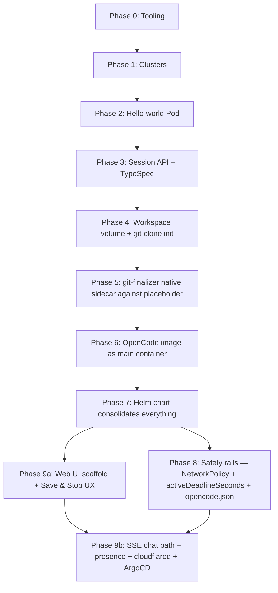

# v1 Staged Walkthrough — Coding-Session Lifecycle Proof

## Overview

This plan implements openvoid v1: a layered, learn-by-doing walkthrough that proves the coding-session lifecycle works end-to-end. v1 is **not** a polished platform; it is a runnable demo that an implementer (Kubernetes-novice) can build slice by slice, with every step ending in a concrete checkpoint they can `kubectl` and `curl` against.

The plan is structured as **9 phases (one per vertical slice from the brainstorm)**, plus a **Phase 0 toolchain setup**. Each phase ends in a demoable artifact. Earlier phases use simpler stand-ins (raw `kubectl apply`, no Helm, no CI) and graduate to richer machinery (Helm, then nightly CI) only when a slice demonstrably needs it.

**Architecture (rev 4 — sidecar pattern, not custom operator).** Each coding session is a single Pod. A regular `initContainer` clones the repo into a shared workspace volume; a Kubernetes-native sidecar (init container with `restartPolicy: Always`, GA in K8s 1.33+) idles for the lifetime of the agent and runs `git add/commit/push` on `SIGTERM`; the main container is OpenCode talking to the workspace. The Session API is the only openvoid-side controller — it creates and deletes Pods directly, with no `CodingSession` custom resource and no Go reconciler. Lifecycle is **user-driven**: the Web UI's "Save & Stop" button issues `DELETE /sessions/:id`; an SSE keep-alive between Web UI and Session API doubles as the presence signal so a closed tab triggers cleanup; `activeDeadlineSeconds = 4h` is the kubelet-level failsafe. Activity-aware idle, cluster-level CR observability, and node-failure recovery are explicitly deferred to v1.5. The full rationale and the operator-path trade-offs are documented in [`docs/research/compass_artifact_wf-1d15406b-b208-438f-b5fc-2eca8ce7267e_text_markdown.md`](../research/compass_artifact_wf-1d15406b-b208-438f-b5fc-2eca8ce7267e_text_markdown.md) and recorded in "Resolved during pivot review (rev 4)" below.

## Problem Frame

openvoid is a greenfield open-source platform (Replit/v0/Lovable alternative). At rev 1 the repo contained only `LICENSE`; at rev 4 Phases 0–3 have shipped (toolchain, kind+DOKS, hello-world, Session API skeleton). The implementer is comfortable with Docker but has no hands-on Kubernetes experience. v1 must prove the coding-session lifecycle works — **start a session, run an OpenCode pod, let the agent edit code in a Git workspace, see a live preview, stop the session (user-initiated via Save & Stop or implicit via Web-UI disconnect), push the work back to a `feat/<session-id>` branch** — across both a local kind cluster and a remote DigitalOcean Kubernetes (DOKS) cluster. *(Rev 4: replaced "idle-stop" with the user-driven stop verbiage; activity-aware idle is deferred to v1.5.)*

(See origin: `docs/brainstorms/2026-05-01-monorepo-layout-requirements.md` — sections "v1 Milestone & Build Strategy" and "Success Criteria".)

## Requirements Trace

The plan satisfies the brainstorm's milestone success criterion and the supporting monorepo-property criteria, **reframed in rev 4** to reflect the sidecar pivot:

- **R1 (milestone).** Local + DOKS end-to-end: Web UI → Session API → per-session Pod (init-clone + main agent + finalizer sidecar) → live preview → user-driven session-stop (Save button or Web-UI disconnect) → `feat/<session-id>` push. *Rev 4: replaces the original "...CodingSession CR → Operator → OpenCode Pod → ... idle-stop ..." chain with a leaner one. Activity-aware idle is deferred to v1.5; v1's stop signal is user-initiated, not LLM-activity-driven.*
- **R2 (one-source-file API contract).** Phase 3 introduces TypeSpec; Phase 4+ keep it as the only edit point for the HTTP/WS contract.
- **R3 (per-service CI scoping).** Phase 2 establishes the monorepo layout; CI is layered in incrementally — minimum viable CI in Phase 7 (Session API + chart linting), end-to-end CI gate added in Phase 9.
- **R4** *(retired in rev 4).* The brainstorm's "Go developer reasoning in isolation" requirement assumed a `services/session-operator/` Go module. The sidecar pivot removes the operator entirely — there is no Go module in v1. R4 graduates to v1.5 if the activity-aware idle reconciler ever needs to be built as a controller. No v1 unit advances R4.
- **R5 (drift bounded by integration tests).** Phase 5+ exercise API → Pod (with init + sidecar) end-to-end via integration tests. *Rev 4: same intent, smaller surface — no CR layer to drift between.* *(Rev 5: still Phase 5+ — the sidecar moved to Phase 5, so the integration test lives there from the start.)*

(R1, R2, R3, R5 map to the brainstorm's R1–R17. The brainstorm's R6 — "Go-authored CRD types so the operator owns its schema in Go" — is also superseded by rev 4 alongside R4. Cross-references in implementation units use the brainstorm's IDs verbatim, with the supersession noted where it applies.)

## Scope Boundaries

Carried from the brainstorm; reaffirmed here so the plan stays disciplined:

- **No `CodingSession` CRD in v1.** *(rev 4 — supersedes the brainstorm's R6.)* The session lifecycle is modelled directly as a Pod with init container + main agent + native sidecar finalizer. No custom resource, no admission/validation webhooks, no `kubectl get codingsessions`. The Session API is the user-facing contract; `kubectl get pods -l openvoid.io/session-id` is the operator-facing one.
- **No `services/session-operator` in v1.** *(rev 4 — supersedes the brainstorm's R4.)* No Go module, no controller-runtime, no kubebuilder, no reconciliation loop. The Session API creates and deletes Pods directly via `@kubernetes/client-node`. Activity-aware idle (the original justification for the operator) is deferred to v1.5; v1's session-stop signal is user-initiated.
- **No `services/deploy-controller` in v1.** ArgoCD reconciles `infra/helm/` (introduced in Phase 9). No openvoid-side deploy controller.
- **No `cli/` workspace, no `openvoid` CLI in v1.**
- **No microVM/Firecracker runtime.** v1 uses standard Pods.
- **No multi-cluster topology.** v1 = one kind cluster locally, one DOKS cluster remotely.
- **No Go emission from `packages/protocol`.** *(rev 4: with no operator, this becomes definitional rather than a deliberate exclusion.)*
- **No activity-aware idle-stop in v1.** *(rev 4.)* v1 cleans up sessions via the explicit Save & Stop button (Phase 9), via Web-UI disconnect (SSE keep-alive close + 60s grace, Phase 9), and via `activeDeadlineSeconds = 4h` (kubelet failsafe, Phase 8). Polling the agent's `/session/:id` for `time.updated` and treating long inactivity as "stop the pod" is a v1.5 add-on; the Phase 0.3 spike's findings remain valid for that future work.
- **No node-failure recovery in v1.** *(rev 4.)* If a node dies hard mid-session, the Pod dies with it and any uncommitted work in the workspace is lost. This is a fundamental limitation of any in-Pod cleanup mechanism (sidecar or otherwise) and is the one capability an operator + external snapshot would add. Mitigation in v1 is the user's habit of clicking Save periodically; v1.5 may add a snapshot loop or graduate to a controller.
- **No automated `OpenAPI ↔ Pod-spec` schema-compat tooling.** Drift between the API contract and the Pod-creation logic is bounded by integration tests in Phases 5, 7, 8 — same shape as the original plan, just without a CR in the middle.
- **No Changesets / NPM publishing in v1.**
- **No livenessProbe on the OpenCode pod** (per best-practice research — a thinking LLM looks dead but isn't). Readiness only. `activeDeadlineSeconds` is the failsafe.
- **No semver tags on services in v1.** SHA-tagged images, ArgoCD reconciles values updates in `infra/helm/`.
- **No OpenShift implementation in v1.** v1 ships and is exercised on kind + DOKS only. The Helm chart's routing layer is structured (rev 3) so an OpenShift `Route`-based mode can be added in v1.5 without rearchitecting; v1 leaves the seam in place but does not author the alternate impl.

## Threat Model (v1 Posture)

Recorded so reviewers and future contributors know what is in/out of v1's security scope.

**Assets:** the implementer's GitHub PAT (scoped to one test repo), the implementer's LLM provider API key (Anthropic / OpenAI / OpenRouter — whichever the platform operator configured; openvoid pays the LLM bill), session workspace contents (user-authored code), the OpenCode HTTP password, cluster Secrets in `openvoid-system`, DigitalOcean billing.

**Trust boundaries:**
- Web UI is publicly reachable through cloudflared but requires a valid GitHub OAuth session.
- Session API requires a valid signed JWT on every request, including the SSE keep-alive that doubles as the presence channel (rev 4).
- Session pod (init-clone container, OpenCode main container, finalizer sidecar) is treated as **untrusted** even for v1's single user — an LLM agent following user prompts can be steered by prompt injection in cloned-repo content or webfetch responses. The finalizer sidecar runs `git push` with a PAT it reads from a mounted Secret, so the sidecar's threat model matters too: the sidecar must run from a known-good image, must inject the token only at push time (never on disk in `.git/config`), and must not expose the token to the main container's filesystem (separate `volumeMounts` for the credential). The agent main container has its own credential — the LLM provider API key — mounted from a separate Secret; this is **never** mounted on the init or sidecar containers (they don't need it). Each container sees only the credentials its job requires.
- The Session API is trusted (it manages cluster state and credentials). *(Rev 4: the operator is no longer in the trust set; there is no operator. This is a contraction of the trusted control plane, not an expansion.)*
- Web UI ↔ Session API ↔ Session pod is the only call chain that leaves cluster boundaries. The agent's HTTP endpoint is **never** exposed to the public internet directly — chat SSE is proxied through the Session API (Phase 9 decision in rev 4). Live-preview ports are routed via cloudflared but only the agent's `:8080` (chat) and the user's web preview port; nothing else.

**In-scope mitigations for v1:**
- Authn at the Web UI (GitHub OAuth via NextAuth, username allowlist).
- Authn between Web UI and Session API (signed JWT, shared signing key in Secret).
- Network isolation: default-deny NetworkPolicy in `openvoid-sessions` with explicit egress allowlist.
- `automountServiceAccountToken: false` on session pods.
- Fine-grained GitHub PAT scoped to one repo.
- LLM provider API key in a dedicated `opencode-auth` Secret, mounted on the agent main container only (per-credential mount discipline — see Phase 6.2).
- Tightened `opencode.json` (deny reading `/etc/git*` and the OpenCode auth-file path, deny webfetch to GitHub, restricted bash).
- `activeDeadlineSeconds` failsafe.

**Known v1 limitations (accepted, deferred to v1.5):**
- No microVM/Firecracker isolation — pod escape is theoretically possible.
- Long-lived PAT stored in cluster Secret (vs. per-session GitHub App tokens).
- Live preview iframe served on a public Cloudflare subdomain — predictable session-id-based URL is reachable by anyone who guesses it (mitigated by session-id being a ULID with ~80 bits of entropy, but no defense against session-id leak).
- Single-user assumption — multi-tenant isolation (per-tenant namespaces, NetworkPolicies, RBAC) is v1.5+.

**Top-three exploits if v1 ships as written:**
1. **Compromised LLM provider response or malicious cloned repo steers the agent.** Mitigation: tightened opencode.json + NetworkPolicy egress allowlist limit blast radius even if the agent is steered. Specific concern for the LLM API key: the agent reads its own auth file by design — but the file is mounted only on the agent (not on the sidecar/init containers), and `opencode.json` denies bash patterns that exfiltrate file contents (e.g., `cat /etc/* | curl *`).
2. **GitHub OAuth username allowlist drift.** Mitigation: allowlist is in env-var/values; treat changes like code changes.
3. **Cloudflare account compromise.** Out of openvoid's control; document as upstream dependency in Risks.

## Cross-Platform Parity Matrix (kind vs DOKS)

The plan's R1 success criterion requires the milestone to work on both kind and DOKS. The differences are scattered across phases; this matrix consolidates them so the implementer doesn't discover them at integration time.

| Concern | kind (local) | DOKS (remote) | Where it surfaces |
|---|---|---|---|
| Cluster context | `kind-openvoid-local` | `do-nyc1-openvoid-dev` | Phase 1 |
| K8s minor version | 1.32+ (1.35.0 confirmed in use) | 1.32 (DOKS) | Both ≥1.29; native sidecars are GA in 1.33+ — both are well past the gate (rev 4) |
| Workspace volume | `emptyDir` per Pod | `emptyDir` per Pod (DOKS Block Storage RWO is overkill for ephemeral v1 sessions) | Phase 4 — Helm value `session.workspace.type` (PVC reserved for v1.5) |
| Container registry | `localhost:5001/openvoid/...` | `ghcr.io/openvoid/...` | Phase 7+ — Helm value `images.<svc>.repository` |
| Image build flow | Tilt + buildx → local registry | CI builds + pushes to GHCR; Helm values updated | Phase 7, 9 |
| Live preview routing | `kubectl port-forward` (Tilt-managed; per-session port allocated by Web UI) | cloudflared tunnel + wildcard CNAMEs (`<sid>.preview.<domain>`) | Phase 9 |
| Web UI public URL | `localhost:3000` | `https://app.<domain>` | Phase 9 |
| Session pod public URL | `localhost:<port>` (port-forwarded) | `<sessionId>.{agent,preview}.<domain>` | Phase 9 |
| Presence channel (Web UI ↔ Session API) | SSE (rev 4) | SSE (rev 4) | Phase 9 — same wire on both fabrics |
| Network policies | Optional in v1 (kind doesn't enforce by default without a CNI plugin); document but don't require | **Required** — DOKS uses Cilium/Calico, NetworkPolicies enforced | Phase 8 — Helm value `networkPolicies.enabled` |
| Auth | NextAuth still required (consistent UX) | NextAuth required | Phase 9 |
| Cluster cost | $0 | ~$24/mo while running | `infra/remote/doks-destroy.sh` between sessions |
| Concurrent sessions | Limited by laptop RAM | 1 on `s-2vcpu-4gb`; bump to `s-2vcpu-8gb` ($48/mo) for ≥2 | Document in `infra/remote/README.md` |
| `cloudflared` Deployment | Not present | Present | Phase 9 — Helm value `routing.mode == "cloudflared"` |
| ArgoCD | Not present (Tilt manages reconciliation locally) | Present | Phase 9 (rev 4: ArgoCD wiring moves from Phase 5.9 — there's no operator earlier to manage) |

**Implementer rule:** Every Helm value with cluster-specific behavior MUST appear in both `infra/helm/values/local.yaml` and `infra/helm/values/dev.yaml` so a value-set diff between them tells you exactly what changes per cluster.

### v1.5 OpenShift readiness matrix (informational — not implemented in v1)

Recorded so v1 design choices don't paint v1.5 into a corner. v1 keeps the seams; v1.5 fills them in.

| Concern | v1 (kind/DOKS) | v1.5 OpenShift delta | Where the seam lives |
|---|---|---|---|
| Public per-session URL | cloudflared tunnel + wildcard CNAME | Native `Route` per session under `*.apps.<cluster>.example.com`; HAProxy router serves it. No tunnel. | Helm value `routing.mode: cloudflared\|openshift-route\|ingress` (default `cloudflared` in v1) |
| TLS for session URLs | Cloudflare Universal SSL | Cluster default cert (or per-namespace edge termination) | Routing-mode template — no operator-side change |
| Cloudflared Deployment | Present on DOKS | Removed; not authored | Conditional `if .Values.routing.mode == "cloudflared"` in Helm |
| GitOps | ArgoCD installed manually | OpenShift GitOps (Red-Hat-shipped ArgoCD) | Same `Application` CRDs; `infra/argocd/` works as-is |
| Container registry | GHCR | OpenShift internal registry (`image-registry.openshift-image-registry.svc:5000`) or GHCR | Helm value `images.<svc>.repository` |
| Pod identity | runs as `node`/UID 1000 | SCC `restricted-v2` overrides UID with a per-namespace random one; image must be writable by **any** UID | Phase 6.1 image hardening (`chgrp 0 + chmod g=u`) is SCC-friendly by construction |
| `automountServiceAccountToken: false` | applied | applied (no change) | Phase 6.2 |
| NetworkPolicy | enforced on DOKS, optional on kind | **mandatory** — OpenShift CNI (OVN-Kubernetes) enforces by default | Unit 5.7 default-deny works as-is |
| Local dev cluster | kind | CRC (CodeReady Containers) — heavier; recommend keeping kind as the daily loop and only sanity-checking SCCs against a real OpenShift cluster pre-merge | Phase 0 tooling stays kind-only in v1 |
| `ingress-nginx` / `cert-manager` | absent | absent (Routes replace both) | n/a |

## Context & Research

### Repository state

*(Updated rev 4 — at the time the pivot was decided.)* Phases 0–3 shipped: kind cluster bring-up, DOKS bootstrap, hello-world Pod, and the Session API skeleton (`packages/protocol` TypeSpec contract, `services/session-api` Hono service, root `Tiltfile`). Working tree includes:
- `packages/protocol/` — TypeSpec source, generated OpenAPI 3.1 + TS types, `scripts/generate.sh`.
- `services/session-api/` — Hono on `:4000`, `PodOps` interface backed by `@kubernetes/client-node`, multi-stage Dockerfile (builder + dev + runtime), 18 vitest tests, Scalar UI at `/`.
- `infra/local/{kind-cluster,hello-world,session-api}.yaml` — kind config + Phase 2 nginx + Phase 3 Session API manifest with namespace-scoped RBAC.
- `infra/remote/` — DOKS create/destroy scripts.
- `Tiltfile` — kind-only (`allow_k8s_contexts("kind-openvoid-local")`), tsx-watch hot-reload for the Session API.
- `docs/solutions/best-practices/helm-routing-abstraction-2026-05-03.md` — first institutional learning.
- `docs/research/compass_artifact_wf-1d15406b-b208-438f-b5fc-2eca8ce7267e_text_markdown.md` — sidecar-vs-operator research that triggered rev 4.

No `services/session-operator/` (and per rev 4, never will be in v1). No `go.mod`. No CI workflow yet.

### Key technologies and versions (pinned at planning time)

| Layer | Choice | Version (May 2026) | Notes |
|---|---|---|---|
| Local cluster | `kind` | v0.27+ | Confirmed running v1.35.0 — well past the 1.33 GA gate for native sidecars |
| Local registry | `localhost:5001` | per kind doc | Standard "kind + local registry" pattern |
| Local dev orchestrator | `Tilt` | latest stable | Tiltfile in Starlark; `cluster-api` Tiltfile is the gold-standard reference |
| Remote cluster | DOKS | k8s 1.32+ | `s-2vcpu-4gb` × 1 node = ~$24/mo; skip HA control plane. Native sidecars require ≥1.29; 1.32 is comfortably past the gate |
| Remote CLI | `doctl` | latest | `--update-kubeconfig` and `--set-current-context` default true |
| ~~Operator framework~~ | ~~`kubebuilder`~~ | — | *Removed in rev 4. No operator in v1.* |
| ~~Operator language~~ | ~~Go~~ | — | *Removed in rev 4. No Go module in v1.* |
| TS package manager | `pnpm` | 9+ | Workspaces |
| TS task runner | `Turborepo` | latest major | Affected-task detection |
| Contract IDL | `@typespec/openapi3` | 1.11.0 | `openapi-versions: ["3.1.0"]`; pinned in `packages/protocol/package.json` |
| TS client codegen | `openapi-typescript` | 7.13.0 | Consumes 3.1 cleanly |
| TS API framework | `hono` + `@hono/node-server` | 4.12+ | Phase 3 baseline |
| K8s client (TS) | `@kubernetes/client-node` | 1.4.0 | In-cluster + kubeconfig fallback |
| TS container builds | `docker buildx` | latest | Tilt: `docker_build()` with `live_update` |
| Sidecar git image | `alpine/git` | 2.45+ | Used by both the `git-clone` init container (Phase 4) and the `git-finalizer` native sidecar (Phase 5). ~25 MB |
| Container registry | GHCR | n/a | `ghcr.io/openvoid/...`; v1 is repo-public so anonymous pulls work |
| Helm | 3.x latest | n/a | Introduced in Phase 7 (rev 5 — later than rev 4's Phase 5 because the finalizer sidecar and OpenCode moved earlier; Helm is now the consolidation phase that absorbs all hard-coded constants and out-of-band Secrets in one go) |
| ArgoCD | latest stable | n/a | Introduced in Phase 9 (unchanged) |
| OpenCode | `opencode-ai` | 1.14+ | `opencode serve` mode; tested in Phase 0.3 spike at v1.14.31 |
| Live preview (kind) | `kubectl port-forward` | n/a | Tilt-managed; per-session ports allocated by the Web UI |
| Live preview (DOKS) | Cloudflare Tunnel (`cloudflared`) | latest | Zero LB cost; no DNS/cert wiring needed for v1 |
| TS test framework | `vitest` | 4.x | Phase 3 baseline |

### Patterns to follow (external references)

*(Updated rev 4 — operator-specific references removed; sidecar-specific references added.)*

- **kind local registry** (`kind.sigs.k8s.io/docs/user/local-registry/`) — applied verbatim in Phase 1.
- **Kubernetes Native Sidecar Containers** (`kubernetes.io/docs/concepts/workloads/pods/sidecar-containers/`) and **KEP-753** — termination-signal ordering, restart-policy semantics, OOM-priority adjustments. Load-bearing for Phases 4 and 7.
- **kubernetes/git-sync** (`github.com/kubernetes/git-sync`) — canonical reference sidecar for git-into-filesystem patterns. Pull-only (we don't use it directly), but its volume-permissions and credential-mount conventions transfer to our `git-clone` init and `git-finalizer` sidecar.
- **Tekton `git-clone` task** (`github.com/tektoncd/catalog/blob/main/task/git-clone/`) — closest analogue to our clone+modify+push workflow. Workspace-volume layout and credential-injection patterns are directly applicable.
- **OpenCode docs** (`opencode.ai/docs/`) — install, `serve` mode, permissions config.
- **`docs/research/compass_artifact_wf-1d15406b-b208-438f-b5fc-2eca8ce7267e_text_markdown.md`** — internal: the sidecar-vs-operator comparison that triggered rev 4. Reference for: Pod-lifecycle phases (§2), termination-handling pitfalls (§4), git-from-sidecar concerns (§5), comparison matrix (§9), concrete YAML (§10), and the formal recommendation (§11).
- **`docs/spikes/2026-05-02-opencode-endpoints.md`** — internal: OpenCode endpoint surface (Phase 0.3 spike). Defines the chat SSE shape that Phase 9 reuses as the presence channel.

### Institutional learnings

`docs/solutions/` was seeded during Phase 3 with [`best-practices/helm-routing-abstraction-2026-05-03.md`](../solutions/best-practices/helm-routing-abstraction-2026-05-03.md) (cluster-portability via Helm-level routing abstraction). The store will continue to grow as Phases 4–9 land — sidecar gotchas (signal handling, PID 1, grace-period sizing) and the SSE-presence pattern are obvious next compound candidates. Use `/ce:compound` after each phase's checkpoint clears.

### 2026-current gotchas surfaced by research

- **DOKS Block Storage is RWO only.** Don't attempt RWX. *(Rev 4: v1 uses `emptyDir` for the workspace, so this is now defensive — applies if v1.5 introduces a session-PVC.)*
- **Provisioning latency on DOKS PVCs is 15–45 s.** *(Rev 4: not on the v1 critical path with `emptyDir`. Re-relevant if v1.5 adds PVCs.)*
- **OpenCode has no official container image.** We build a thin Dockerfile in Phase 6.
- **`preStop` does not run on `--grace-period=0 --force`.** Document as "do not force-delete sessions." *(Rev 4: same applies to the SIGTERM trap inside the finalizer sidecar — force-delete bypasses graceful shutdown entirely and the push will not happen.)*
- **Don't use livenessProbe on the agent pod.** A thinking LLM looks dead but isn't.
- **OpenShift SCC `restricted-v2` assigns a random per-namespace UID** that overrides the image's `USER` directive. Images that work on stock K8s (`USER 1000`) fail on OpenShift unless `/app` (or wherever the process writes) is owned by GID 0 and group-writable. Canonical Dockerfile pattern: `RUN chgrp -R 0 /app && chmod -R g=u /app`. Cheap to apply, and aligns with K8s security best-practice anyway.
- **OpenShift NetworkPolicy is enforced by default** (OVN-Kubernetes). The Phase 8 default-deny will *immediately* block traffic on OpenShift; the same policy on kind is silently inert. Don't rely on kind to validate the policy.

**Sidecar pattern gotchas (rev 4 — load-bearing for Phases 4, 7, and 8):**

- **Native sidecars are an `initContainers` entry with `restartPolicy: Always`.** No new top-level field; they're listed alongside regular init containers. The kubelet treats them specially: they start in init order but don't block, they get probes (regular init containers don't), and they receive SIGTERM **only after all main containers have exited**. GA in K8s 1.33+; both kind 1.35 and DOKS 1.32 are past the gate.
- **PID 1 swallows SIGTERM** unless you `exec`. A Dockerfile `CMD ["/bin/sh", "-c", "myapp ..."]` makes `/bin/sh` PID 1, and shells don't forward signals to children. Either use `exec myapp ...` in the entrypoint, or set `command:` to the binary directly, or add `tini`. The finalizer sidecar's shell entrypoint must use `trap ... TERM` and `wait` correctly to actually run on shutdown.
- **Distroless images don't have `/bin/sh` or `sleep`.** A `preStop` exec command using `sleep` will fail with `FailedPreStopHook`. Phase 5's finalizer uses `alpine/git`, which has both, so this is already mitigated for v1; flagged for v1.5 if anyone tries to slim further.
- **`terminationGracePeriodSeconds` is shared between `preStop` and SIGTERM handling.** v1 uses 180 s for session pods, which budgets a slow git push over a flaky network. Going below ~60 s is risky for the push leg.
- **Sidecar exit code 0 is not guaranteed at Pod end.** If the grace period runs out mid-push, the kubelet sends SIGKILL and the sidecar exits non-zero. The push needs to be **idempotent** — `git commit --allow-empty || true` for the empty case, and the next session's push converges from where the previous one left off.
- **Pod deletion vs. node failure.** SIGTERM cascade only fires if the kubelet on the node is alive. Hard node death = no push. v1 accepts this loss; v1.5 may add periodic snapshots or graduate to a controller.
- **Web UI presence is a per-process state in v1.** v1 runs the Session API at `replicas: 1`. Adding replicas in v1.5 requires either sticky sessions on the SSE connection or shared presence state (Redis, etc.). Documented in Risks.

## Key Technical Decisions

*Decisions marked **(rev 4)** were added or modified by the sidecar pivot. Decisions marked **(superseded — rev 4)** were retired by the pivot but kept here in struck-through form so the rev history is legible.*

- **(rev 4) Sidecar pattern, not custom operator + CRD.** The session lifecycle is modelled as a Pod with three roles: a regular `initContainer: git-clone` that clones the workspace, a main container running OpenCode, and a Kubernetes-native sidecar (`initContainer` with `restartPolicy: Always`, GA in 1.33+) that idles for the agent's lifetime and runs `git add/commit/push` on `SIGTERM`. No `CodingSession` CRD, no Go reconciler, no controller-runtime. Rationale: per the compass research (`docs/research/compass_artifact_wf-1d15406b-b208-438f-b5fc-2eca8ce7267e_text_markdown.md`), the operator pattern earns its keep on cluster-wide stateful concerns (ArgoCD, Tekton, Vault) — none of which apply to "clone a repo, run an agent, push on exit." Native sidecars were designed precisely for this shape. The sidecar pattern saves us a Go module, controller-runtime, kubebuilder scaffolding, CRD schema versioning, admission webhooks, leader election, and a controller Deployment. **Superseded:** ~~CodingSession CRD~~, ~~Session Operator skeleton~~.
- **(rev 4) Lifecycle is user-driven, not activity-driven.** Three signals, in priority order: (1) explicit "Save & Stop" button in the Web UI → `DELETE /sessions/:id`; (2) Web-UI presence via SSE keep-alive — connection close starts a 60 s grace timer in the Session API; if no reconnect, the pod is deleted; (3) `activeDeadlineSeconds = 4h` as a kubelet-level failsafe for forgotten sessions. Activity-aware idle (polling the agent's `/session/:id` for `time.updated`) is deferred to v1.5; the Phase 0.3 spike's findings remain valid for that future work.
- **(rev 4) Web UI's chat SSE flows through the Session API, not directly to the agent.** This resolves the "deferred to implementation" question from rev 2 about routing. Two benefits: the SSE connection lifecycle becomes the presence channel (no separate heartbeat wire), and the agent's HTTP endpoint stays cluster-internal (the Web UI never needs `<sessionId>.agent.<domain>` access in v1). The `<sessionId>.preview.<domain>` cloudflared subdomain is still used for the user's running web preview.
- **Slice independently before scaling structure.** *(Rev 4: timing shifts.)* Slices 1–3 use raw `kubectl apply`. Slice 5 introduces a Helm chart (the Session API is the first consumer; rev 4 — there is no operator). Subsequent slices add to the chart. ArgoCD wires up in Phase 9. The K8s-novice surface area stays small while avoiding a Phase 9 Helm/ArgoCD cliff.
- **One namespace per logical concern, not per session.** v1: `openvoid-system` (Session API + Web UI + cloudflared), `openvoid-sessions` (per-session Pods). *(Rev 4: removed "operator" from the system namespace inhabitants.)* v1.5 may split per-tenant.
- **Authentication via GitHub OAuth (NextAuth) on Web UI; Session API verifies a signed JWT.** The auth boundary lives at the Web UI; Session API rejects requests without a valid JWT signed with a shared signing key from a Secret. *(Rev 4: same JWT requirement applies to the SSE keep-alive endpoint that doubles as the presence channel.)* Single OAuth app for v1; users authorized by GitHub username allowlist (env var) until v1.5 multi-tenancy lands. **OAuth scopes are identity-only** (`read:user`, `user:email`) — openvoid never requests `repo` scope from end users, because users do not own the repos they edit (see "Tenancy & repo-ownership model" below). cloudflared still exposes the public URLs but every request must hold a valid session.
- **Tenancy & repo-ownership model: many users, one platform-owned source-control account.** openvoid (the platform) owns a single account on the configured source-control host (e.g., a GitHub organization); every user app is a repo under *that* account, named e.g. `<platform-org>/<userId>-<appId>`. End users authenticate against the Web UI but never authorize openvoid against their own GitHub — they have no repos of their own in the loop. Implications that propagate through the plan: (1) the v1 PAT and the v1.5 GitHub App are always credentials of the **platform** account, not per-user; (2) repo provisioning on first Start Session is openvoid's responsibility, performed with the same platform credential (v1 demo skips this by reusing the implementer's pre-existing test repo as the single-repo stand-in); (3) ToS, quota, and abuse exposure for the source-control host live with the platform operator, not with end users; (4) "bring-your-own-repo" / "bring-your-own-GitHub-account" is explicitly **not** a v1 or v1.5 mode — it would be a separate post-v1.5 product direction with its own threat model.
- **Cloudflare Tunnel over Ingress for v1 DOKS demos.** Zero LoadBalancer cost; one `cloudflared` Deployment routes the Web UI, the Session API (including the SSE chat path), and the live-preview port. **Prerequisites (not optional):** (a) a Cloudflare-managed DNS zone for the demo domain, (b) a manually-created wildcard CNAME (`*.preview.<domain>` and `app.<domain>`) pointing at `<tunnel-id>.cfargotunnel.com`, (c) Cloudflare Universal SSL covers one wildcard depth — accept that constraint or budget for Advanced Certificate Manager. Implementers without a domain use the Cloudflare Quick Tunnel fallback (`cloudflared tunnel --url ...`, ephemeral `*.trycloudflare.com` URL). ingress-nginx + cert-manager + wildcard DNS is deferred to v1.5.
- ~~**Operator polls agent activity via HTTP — implementation determined by the Phase 0.3 spike.**~~ **(superseded — rev 4)** Activity-aware idle-stop is deferred to v1.5; v1's session-stop is user-driven. The spike's findings (OpenCode emits SSE on `/global/event`, `time.updated` is the activity field, no `/last-activity` endpoint exists) remain valid context for v1.5 and inform Phase 9's chat-SSE-through-Session-API decision.
- **Pod-level failsafe: `activeDeadlineSeconds = 14400` (4 h).** *(Rev 4: simplified — was `idleTimeoutSeconds * 4` when activity-aware idle was the primary signal. With user-driven lifecycle as the primary signal, the failsafe becomes a flat wall-clock cap on forgotten sessions.)* The kubelet kills the pod when the deadline passes regardless of any other state. Defends against Session-API crash, network partition, or browser doing something weird. The SIGTERM cascade still fires within the deadline window, so the finalizer sidecar gets its push attempt before SIGKILL.
- ~~**Periodic auto-commits as belt-and-braces alongside `preStop` push.**~~ **(superseded — rev 4)** The original belt-and-braces was driven by `preStop`'s "best-effort" reputation. Native sidecars with a SIGTERM trap are materially more reliable than `preStop`-only — SIGTERM to the sidecar arrives **after** main containers have exited, giving a clean signal of "the work is done, push now." v1 ships only the SIGTERM-trap path. Periodic mid-session commits are a v1.5 add-on if real users need them.
- **Fine-grained GitHub PAT scoped to one test repo + tightened agent permissions.** The PAT belongs to the **platform's** source-control account (per the tenancy decision above), not to any end user. In v1 it is fine-grained and scoped to the implementer's single test repo, which stands in for "the one repo per user app under the platform org" until repo provisioning lands. PAT is mounted at `/etc/git-credentials` for the `git-clone` initContainer and the `git-finalizer` sidecar (rev 4: separate volume mounts so the main container's filesystem never sees the credential). `opencode.json` denies `read` on `/etc/git*`, denies `bash` for `cat /etc/* | curl *` patterns, and denies `webfetch` to `*.github.com` (push goes through git over HTTPS, not webfetch). v1.5 graduates to a GitHub App **installed on the platform org** to remove the long-lived secret entirely; the App is still platform-owned, never per-user.
- **Default-deny NetworkPolicy on `openvoid-sessions` namespace.** *(Rev 4: moved from Unit 5.7 to Phase 8 — same intent, different home.)* Session pods can egress only to: the configured Git host (e.g., GitHub HTTPS:443), the configured LLM provider domain(s) (Anthropic/OpenAI APIs as required by OpenCode), and DNS. Cannot reach the K8s API server (also enforced by `automountServiceAccountToken: false`), the metadata service (169.254.169.254), or other namespaces.
- **Single cluster-wide `OPENCODE_SERVER_PASSWORD` Secret for v1.** Per-session generation is unjustified for single-user hosted-first; one Secret in `openvoid-system` is referenced by every session pod via `valueFrom.secretKeyRef`. Rotates manually; per-session generation graduates with multi-tenancy.
- **LLM provider auth: platform-owned, multi-provider, out-of-band Secret in v1.** Following the same pattern as the source-control tenancy decision, openvoid (the platform) owns the LLM provider account(s) and pays the LLM bill — users do not bring their own API keys. v1 supports three provider configurations interchangeably: native Anthropic (`api.anthropic.com`), native OpenAI (`api.openai.com`), and OpenRouter (`openrouter.ai`, OpenAI-compatible aggregator that fronts dozens of upstream models, including Anthropic, behind a single key). The platform operator picks one (or more) at install time. The keys live in a single `opencode-auth` Secret in `openvoid-system`, applied out-of-band by the implementer (mirroring the `git-creds` pattern — real third-party keys can't be platform-auto-generated). The Secret is mounted on the **agent main container only** — not on `git-clone`, not on `git-finalizer`. The Secret format is OpenCode's `auth.json` shape; the exact path or env-var-fallback contract is verified by the Phase 6.0 spike before Unit 6.2 wires it. **Bring-your-own-key (BYOK)** is explicitly not a v1 mode — it would be a separate post-v1.5 product direction with a different threat model (per-user secrets, per-session credential injection, billing reconciliation).
- ~~**CRD spec is intentionally lean.**~~ **(superseded — rev 4)** With no CRD, the equivalent is **Pod-spec is intentionally lean**: the Session API parameterizes per-session Pods with only `repo` and `branch` (consumed by the `git-clone` init container as env vars). Workspace size, agent image, idle behavior, and stop semantics are all chart-value-driven (`session.workspace.sizeLimit`, `session.image`, `session.activeDeadlineSeconds`) — same lean philosophy, expressed at the Helm-values layer instead of a CR.
- **Use `kubectl port-forward` end-to-end for kind, `cloudflared` for DOKS.** No conditional routing logic in the Session API; the cloudflared Deployment is environment-specific (only present in DOKS via `routing.mode: cloudflared` Helm value).
- **Routing is a Helm-level abstraction, not an application-level one.** *(Rev 4: reframed — was "Helm-level, not operator-level"; now "Helm-level, not application-level" since there's no operator.)* The Session API always creates a `Service` per session with named ports `agent-http` and `preview-http`. *How* that Service is exposed publicly is decided by Helm values: `routing.mode: cloudflared` ships in v1; `openshift-route` and `ingress` are reserved values that v1.5 fills in. The Session API never branches on cluster type. Cost: ~one extra Helm template directory (`templates/routing/`) authored in Phase 9. Benefit: porting to OpenShift in v1.5 is a net-new template, not a refactor.
- **No kind-based e2e CI in v1.** Per-PR CI runs lint + typecheck + unit tests + generated-artifact freshness. *(Rev 4: removed "envtest" — no Go module to envtest.)* The full kind-spinning e2e (brainstorm R13 with team-scale assumptions) defers to v1.5 when there's a team to benefit from a PR-level safety net. Manual demo verification at each phase's checkpoint replaces the gate for solo v1.

## Open Questions

### Resolved during planning (rev 1)

- Per-slice scaffolding granularity. Each slice scaffolds only what it needs.
- Generated TypeSpec artifact location: TS + OpenAPI under `packages/protocol/generated/`. *(Rev 4: the original second clause about CRD YAML under `infra/crds/` is superseded — there is no CRD in v1.)*
- OpenCode mode in-pod: `opencode serve`.
- Tilt-managed local registry on `localhost:5001`, per kind documentation.

### Resolved during planning (rev 2 — review pass)

- **v1 audience for the Web UI:** authenticated GitHub OAuth users (NextAuth) gated by `OPENVOID_ALLOWED_USERS`. No public unauthenticated access.
- **Helm + ArgoCD timing:** chart authored in Phase 5 (operator first consumer); ArgoCD wired in Unit 5.9. Avoids the Phase 9 cliff.
- **Idle-detection mechanism:** Phase 0.3 spike resolved (see [`docs/spikes/2026-05-02-opencode-endpoints.md`](../spikes/2026-05-02-opencode-endpoints.md)). OpenCode does **not** expose `/last-activity`. Path chosen: operator polls `GET /session/:id` every 30s and reads `time.updated` (Unix ms) as `lastActivityTime`. Phases 5.3, 6.3 reference the spike rather than the originally-planned `/last-activity` endpoint. Also resolved in the spike: the agent's output stream is **Server-Sent Events** (`/global/event` and `POST /session/:id/message` SSE response), **not WebSocket** — Phase 9.2's chat-box client wires up to SSE.
- **DOKS node sizing:** 1× `s-2vcpu-4gb` for solo v1 demos; document scale-up to `s-2vcpu-8gb` for multi-user demos. Capacity table in `infra/remote/README.md`.
- **PAT hardening:** fine-grained GitHub PAT scoped to one repo + tightened `opencode.json` (deny `/etc/git*` reads, deny webfetch to GitHub, restricted bash).
- **Defense-in-depth on operator failure:** `activeDeadlineSeconds = idleTimeoutSeconds * 4` on session pods.
- **CRD spec scope:** intentionally lean — `repo`, `branch`, `idleTimeoutSeconds` only. `image`/`workspaceSize`/`userId`/`spec.stop` deferred.
- **OPENCODE_SERVER_PASSWORD:** single cluster-wide Secret; per-session generation deferred to v1.5.
- **NetworkPolicy:** default-deny on `openvoid-sessions` with explicit egress allowlist.
- **Service per session:** one Service with two named ports (`agent-http`, `preview-http`); not two Services.
- **CI scope:** lint + typecheck + unit/envtest + freshness on every PR. Kind-based e2e gate deferred to v1.5.
- **Web UI scope:** desktop ≥1024 px; mobile out of scope. UI states enumerated in Phase 9.1's Session States table.

### Resolved during Phase 3 demo (rev 3 — OpenShift readiness pass)

Triggered by a real-world question during the Phase 3 demo: "we'd like to replicate this inside our company on OpenShift; what changes?" The answer should not be "rearchitect Phase 5–9," so v1 absorbs a small structural commitment now.

- **Routing layer is a Helm-level abstraction** (see Key Technical Decisions). v1 ships only the `cloudflared` mode; the seam is `routing.mode` plus a `templates/routing/` directory in the chart. *(Rev 4 update: now framed as "Helm-level, not application-level" since there's no operator.)*
- **OpenCode image is SCC-friendly by construction** (Phase 6 — `chgrp 0 + chmod g=u`). *(Rev 3 originally placed this in Phase 6; rev 5 kept OpenCode in Phase 6 — same number, different surrounding context.)* Cheap; the same pattern is best-practice on stock K8s. v1 still runs as UID 1000 on kind/DOKS; the file ownership change just means OpenShift won't reject the image at admission.
- **Per-session port-forward orchestration on kind** is the Web UI's responsibility (Phase 9), not the operator's. `kubectl port-forward` against the per-session `Service` produces `localhost:<port>`; the iframe embeds that.
- **OpenShift implementation itself stays out of v1 scope.** No `oc` in Phase 0; no CRC; no second remote cluster. v1's two-target story (kind + DOKS) is unchanged.

### Resolved during pivot review (rev 4 — sidecar pattern adoption)

Triggered by a deliberate technical-direction review using the [`compass research`](../research/compass_artifact_wf-1d15406b-b208-438f-b5fc-2eca8ce7267e_text_markdown.md). The research compares the sidecar pattern against custom CRD + Operator for openvoid's specific shape (orchestrator-driven init, agent runs, finalizer pushes on exit, K8s novice on the implementing side). The conclusion was unambiguous: sidecars are the right tool; an operator earns its keep on cluster-wide stateful concerns that openvoid v1 simply doesn't have.

The session-3 demo discussion that followed sharpened two further decisions about lifecycle and routing.

- **Architecture: native sidecar, not custom operator + CRD.** The session is one Pod with `initContainer: git-clone` (regular init, exits before main), `container: opencode-agent` (main), and `initContainer: git-finalizer` with `restartPolicy: Always` (native sidecar; SIGTERM trap pushes to `feat/<sessionId>` on shutdown). Eliminates: `services/session-operator/` (Go module), CRD schemas, controller-runtime, kubebuilder, admission webhooks, leader election, `services/session-operator`'s Dockerfile. Saves an estimated 2–4 weeks of work and removes a whole class of failure modes (controller crash, finalizer deadlocks, schema drift).
- **Lifecycle is user-driven, not activity-driven.** Three signals, in priority order:
  1. **Save & Stop button** in the Web UI → `DELETE /sessions/:id` → SIGTERM cascade → push.
  2. **Web-UI presence** via SSE keep-alive — the chat-stream connection close starts a 60 s grace timer in the Session API; if the Web UI doesn't reconnect within the window, the pod is deleted.
  3. **`activeDeadlineSeconds = 14400` (4 h)** — kubelet-level failsafe for forgotten sessions.
  
  Activity-aware idle (polling agent's `/session/:id` for `time.updated`) is **deferred to v1.5**. The Phase 0.3 spike's findings stay valid for that future work; in the meantime, the cleaner user-driven signal is also a stronger one (presence > activity, since an LLM "thinking" doesn't mean the user is paying attention).
- **Web UI's chat SSE flows through the Session API.** This resolves the previously deferred-to-implementation question about routing the agent stream. Two concrete benefits: the SSE connection lifecycle is the presence channel (no separate heartbeat wire), and the agent's `:8080` HTTP endpoint stays cluster-internal (Web UI never gets a `<sessionId>.agent.<domain>` cloudflared subdomain in v1; only the user's web preview gets a public subdomain).
- **Brainstorm requirements R4 (Go developer reasoning in isolation) and R6 (Go-authored CRD types) are retired in v1.** The pivot supersedes them. They graduate to v1.5 only if a controller is reintroduced; otherwise they remain dropped.

### Resolved during Phase 4 verification (rev 5 — finalizer-before-OpenCode reorder)

Triggered by hands-on debugging during the Phase 4 manual demo. Three failure modes surfaced in sequence: (a) `Init:CreateContainerConfigError` because the `git-creds` Secret wasn't applied yet (expected; documented), (b) `Init:Error` because the target repo had zero branches (an *empty* GitHub repo created without an initial commit), (c) a 404 on `localhost:<port>/README.md` because the clone lands at `/usr/share/nginx/html/repo/`, not at the doc root. None of these were code defects — but the empty-repo case in particular surfaced a v1 precondition that wasn't explicit in the plan.

That sequence prompted a re-read of Phases 5–7. The original ordering — Phase 5 Helm chart → Phase 6 OpenCode → Phase 7 `git-finalizer` sidecar — bundles the single biggest architectural risk in v1 (does the native sidecar SIGTERM trap actually push reliably?) into the same phase that introduces OpenCode's image, server password, port wiring, and PID 1 / signal-handling quirks. Two unknowns colliding.

- **Phase reorder: finalizer first, OpenCode second, Helm consolidates last.** The new sequence is: **Phase 5 = `git-finalizer` sidecar against the placeholder nginx main** (lifecycle proven against a known-simple PID 1, demo workload via `kubectl exec` editing `/workspace/repo`); **Phase 6 = OpenCode image as main container** (real agent slots into a proven lifecycle, with `OPENCODE_SERVER_PASSWORD` applied out-of-band the same way `git-creds` already is); **Phase 7 = Helm chart consolidating everything** (every hard-coded constant and out-of-band Secret graduates to chart values or templates in one place). Phase 8 (safety rails) and Phase 9 (Web UI) are unchanged.
- **Why Helm last, not in the middle.** Helm-before-OpenCode (the original rev-5-draft ordering) is convenience, not necessity. The `OPENCODE_SERVER_PASSWORD` Secret pattern is identical to the `git-creds` pattern Phase 4 already established — reusing it costs zero new K8s knowledge. Putting OpenCode in Phase 6 lets the OpenCode-specific gotchas (PID 1 forwarding, `opencode.json` loading, server-password wiring, agent's read of `/workspace/repo`, model/provider config) cluster naturally with Phase 5's lifecycle-validation work — both are "make a real session pod work end-to-end." Phase 7 then becomes a clean conceptual chunk on its own ("packaging"). The "second magic moment" (real agent edits real code) arrives one phase sooner.
- **Empty-repo precondition is explicit.** v1 assumes the target repo already has at least one commit on the requested branch. `git clone --branch main <empty-repo>` fails with `Remote branch main not found in upstream origin`, by design. The v1.5 "Repo provisioning on first Start Session" deferred item now also covers seeding an initial commit so brand-new platform-owned repos work without manual setup.
- **What's gained.** If the SIGTERM cascade misbehaves, the user finds out against nginx (trivial PID 1) before introducing OpenCode. If OpenCode misbehaves, the lifecycle is already proven and the suspect is narrowed to the agent. End of Phase 5 becomes the **first** "magic moment" — a complete clone+modify+push lifecycle, no agent required — and end of Phase 6 becomes the second (real agent edits). Phase 7 absorbs all packaging concerns in one coherent unit.
- **What's lost.** Phase 6 runs against `infra/local/session-api.yaml` (Phase 3's raw manifest) one phase longer before the chart retires it. Negligible. The `infra/local/opencode-password-secret.yaml` example file is created in Phase 6 then deleted in Phase 7 — it serves as a temporary scaffold, exactly as `git-creds-secret.yaml.example` does on a longer timeline.
- **What does *not* change.** Brainstorm requirements (R1 etc.) are unchanged. The threat model is unchanged (credential mounted on init + sidecar only, never on main). The pod-lifecycle state diagram is unchanged in shape — only the *order in which Phases introduce each role* shifts. `git-creds` stays out-of-band even after Phase 7 — it's a real third-party PAT that openvoid can't auto-generate, unlike `OPENCODE_SERVER_PASSWORD`.
- **LLM provider auth gap closed (rev 5).** The original Phase 6 (rev 1–4) treated `opencode.json` as the only OpenCode config to ship, which left a hole: without LLM provider keys, the agent boots fine but cannot actually call any model. Rev 5 adds an explicit **`opencode-auth` Secret** to Phase 6, mounted on the agent main container only. The Secret holds OpenCode's `auth.json` shape. v1 supports three providers interchangeably (Anthropic native, OpenAI native, OpenRouter); the platform operator picks one or more at install time. A small Phase 6.0 spike verifies the exact OpenCode auth mechanism (file path vs. env-var fallback, OpenRouter format) before the implementation units run. See "LLM provider auth" Key Technical Decision above for the full rationale.

### Deferred to implementation

- **Exact OpenCode CLI flags for `opencode serve`** (`--port`, `--host`, model selection): resolve in Phase 6 once running the image locally.
- ~~**Whether to route the agent WS through Session API or directly via cloudflared subdomain**~~: **resolved in rev 4** as "Session API proxies the chat SSE." The original framing ("WS") was also superseded by the spike's SSE finding. The user's web preview port still uses a `<sessionId>.preview.<domain>` cloudflared subdomain.
- **Tiltfile final shape** (resource ordering, port-forward strategy): resolve incrementally — Phase 3 baseline + Phase 7 Helm-aware refresh.
- **GitHub App vs PAT credentials**: PAT in v1 (decided); App migration deferred to v1.5. Both are credentials of the **platform's** source-control account, not per-user — see the "Tenancy & repo-ownership model" key decision.
- **Repo provisioning on first Start Session**: deferred. v1 hard-codes the implementer's single test repo as the workspace target, **and that target must already have at least one commit on the requested branch** — empty repos fail Phase 4's `git clone --branch main` step with `Remote branch main not found in upstream origin`. The v1.5 unit covers two responsibilities behind the existing `repo` request field: (a) "ensure repo exists" — create `<platform-org>/<userId>-<appId>` if it doesn't exist, using the same platform credential; (b) "ensure default branch has at least one commit" — push an initial empty `README.md` (or similar) so subsequent clones succeed. Both run in the Session API before pod creation.
- **Helm chart structure** (one chart per service vs umbrella): defer to Phase 7's Unit 7.1 detail.
- **Wildcard DNS + cert-manager for ingress**: deferred to v1.5+ self-host concession.
- **PVC for workspace** (vs `emptyDir`): rev 4 makes `emptyDir` the v1 default — sessions are ephemeral and the SIGTERM-cascade push is the persistence mechanism. PVC reserved for v1.5 if "resume my session tomorrow" becomes a real requirement.
- **Activity-aware idle reconciler shape** (if v1.5 reintroduces it): Session API runs a `setInterval` polling each pod's `/session/:id` and deleting on stale `time.updated`. The seam is small; the v1.5 work is one `services/session-api/src/reconciler/idle.ts` module.

## High-Level Technical Design

> *This illustrates the intended approach and is directional guidance for review, not implementation specification. The implementing agent should treat it as context, not code to reproduce.*

### Slice dependency graph



*(Rev 5: phases 5/6/7 reordered. The sidecar finalizer (formerly Phase 7) moves to Phase 5 to validate the SIGTERM cascade against the placeholder nginx main before OpenCode is introduced. OpenCode (formerly Phase 6) becomes Phase 6 still, but now lands **before** Helm — using the same out-of-band Secret pattern Phase 4 established for `git-creds`, so the OpenCode-specific gotchas cluster with Phase 5's lifecycle work. Helm chart (formerly Phase 5) moves to Phase 7 and becomes the consolidation phase: every constant in `client.ts` and every out-of-band Secret graduates to chart values or templates here. Rationale recorded under "Resolved during Phase 4 verification (rev 5)" above.)*

*(Rev 4: dropped Phases "CodingSession CRD" and "Session Operator." Replaced with workspace+init in Phase 4 and Helm-chart-first in (then-)Phase 5. The sidecar finalizer was (then-)Phase 7. Phase 8 is reframed as safety rails — its old "belt-and-braces commit" content collapses into the finalizer's idempotent push.)*

Phase 9a (Web UI scaffold) can run in parallel with Phases 6–8 if the implementer wants to interleave; Phase 9b (presence + live preview wiring) requires Phase 8 complete.

### Per-session Pod lifecycle (sidecar pattern, rev 4)

```mermaid
stateDiagram-v2
    state "init: git-clone (regular initContainer, exits)" as Init
    state "main + sidecar (running)" as Running
    state "Terminating: SIGTERM cascade" as Terminating
    state "git-finalizer: SIGTERM trap fires push" as Finalizing
    state "Pod Completed (or activeDeadlineSeconds tripped → Failed)" as End

    [*] --> Init: Session API → POST → kubectl create pod (Phase 4 onward)
    Init --> Running: clone OK, agent main + finalizer sidecar start
    Running --> Terminating: DELETE /sessions/:id (Save & Stop) OR Web-UI presence lost OR activeDeadlineSeconds tripped
    Terminating --> Finalizing: kubelet sends SIGTERM to main; main exits; kubelet sends SIGTERM to finalizer (LIFO)
    Finalizing --> End: git add/commit/push → exit 0 (or SIGKILL if grace period exhausted)
    Init --> [*]: clone fails → Pod Failed (no main, no sidecar)
    End --> [*]
```



Key reliability point: the finalizer sidecar receives SIGTERM **only after** all main containers have exited (per K8s native-sidecar termination semantics, KEP-753). This means "main work is done, push now" is a clean signal — no race against the agent's writes.

### Session-creation request flow at v1 milestone (rev 4)

```mermaid
sequenceDiagram
    actor User
    participant Web as apps/web (Next.js)
    participant API as services/session-api
    participant K8s as K8s API server
    participant Pod as Session Pod (init + main + sidecar)
    participant Tunnel as cloudflared (DOKS only)
    participant Git as GitHub

    User->>Web: Click "Start session"
    Web->>API: POST /sessions {repo, branch}
    API->>K8s: Create Pod (initContainer git-clone; main opencode-agent; sidecar git-finalizer)
    K8s->>Pod: Schedule
    Note over Pod: initContainer git-clone runs<br/>clones into emptyDir workspace<br/>exits 0
    Note over Pod: main + sidecar start<br/>sidecar idles waiting for SIGTERM
    Pod-->>API: /global/health 200 (poll)
    API-->>Web: GET /sessions/:id → status: Running, endpointUrl
    Web->>API: GET /sessions/:id/events (SSE keep-alive — chat + presence)
    API->>Pod: GET /global/event (proxied SSE)
    User->>Web: Chat with OpenCode
    Web->>Tunnel: HTTPS to <sessionId>.preview.<domain> (DOKS only; kind uses port-forward)
    Tunnel->>Pod: live-preview port

    alt User clicks Save & Stop
        Web->>API: DELETE /sessions/:id
        API->>K8s: kubectl delete pod
    else Web UI disconnects (tab close, network drop)
        Note over API: SSE close → 60s grace timer
        API->>K8s: kubectl delete pod (timer expires without reconnect)
    else activeDeadlineSeconds tripped
        Note over K8s: kubelet kills pod after 4h wall-clock
    end

    K8s->>Pod: SIGTERM cascade (preStop hooks, then main containers)
    Note over Pod: main agent exits<br/>kubelet sends SIGTERM to git-finalizer<br/>trap fires
    Pod->>Git: git add / commit / push to feat/<sessionId>
    Pod->>K8s: All containers exit; Pod Completed
```

## Implementation Units

The plan groups units into 9 phases (one per vertical slice from the brainstorm) plus Phase 0 (toolchain). Each phase ends in a demoable checkpoint.

---

### Phase 0: Toolchain & Repo Bootstrap

- [x] **Unit 0.1: Install local toolchain**

**Goal:** Implementer's machine has every CLI needed for Phases 1–9.

**Requirements:** Foundation for all Rs.

**Dependencies:** None.

**Files:**
- Create: `README.md` — top-of-repo bootstrap section listing required tools, versions, and install commands.
- Create: `scripts/check-tools.sh` — verifies required CLIs exist at supported versions; called by Phase 0.2.

**Approach:**
- Required CLIs (document install commands per macOS Homebrew + Linux apt/pacman/Podman path):
  - `docker` (engine running; macOS: Docker Desktop or `colima`; Linux: docker.io or rootless)
  - `kind` ≥ v0.27
  - `kubectl` (any 1.30+ client; serves both kind 1.32 and DOKS 1.32)
  - `tilt`
  - `doctl` (only needed for Phase 1 DOKS exercise; document but don't gate on it)
  - `node` LTS, `pnpm` ≥ 9
  - `go` ≥ 1.22
  - `kubebuilder` ≥ v4.14
  - `ko`
  - `cloudflared` (only for Phase 9b DOKS demo)
- Recommended ergonomic extras: `kubectx` + `kubens` (context/namespace switching), `stern` (multi-pod log tail), `k9s` (TUI for K8s).

**Patterns to follow:**
- Many projects ship a `tools.sh` or `Brewfile`; for openvoid keep it explicit so the user sees every step.

**Test scenarios:**
- Test expectation: none — toolchain documentation only. Verified via Unit 0.2.

**Verification:**
- `bash scripts/check-tools.sh` exits 0 with all green checkmarks.
- `docker info` returns a working daemon.

---

- [x] **Unit 0.2: Repo skeleton + `.gitignore` + base `package.json`**

**Goal:** Repo has a workable structure for the next 9 phases without committing to every category yet.

**Requirements:** R1, R2 (brainstorm).

**Dependencies:** Unit 0.1.

**Files:**
- Create: `.gitignore` (Node, Go, generated artifacts, OS noise, Tilt's `tilt_modules/`).
- Create: `package.json` (private, root, workspaces declaration).
- Create: `pnpm-workspace.yaml`.
- Create: `turbo.json` (minimal: `tasks: { build, lint, test, typecheck }`).
- Create: `.editorconfig`, `.nvmrc`.
- Create empty directories with `.gitkeep`: `apps/`, `services/`, `packages/`, `infra/`, `scripts/`.

**Approach:**
- pnpm workspace globs: `apps/*`, `services/*`, `packages/*`. (`services/session-operator` is Go; pnpm ignores it because it has no `package.json` — fine.)
- Conventional Commits: install `commitlint` + a `.husky/commit-msg` hook in a later phase when there's an actual codebase to commit. Keep Phase 0 minimal.

**Patterns to follow:**
- `turbo.json` minimum — copy the documented "Getting Started" example; deepen in Phase 3.

**Test scenarios:**
- Test expectation: none — scaffold-only, no behavior.

**Verification:**
- `pnpm install` succeeds in an empty workspace tree without errors.
- `git status` shows the new structure tracked.

---

- [x] **Unit 0.3: OpenCode endpoint surface spike (30 minutes)**

**Goal:** Verify what `opencode serve` actually exposes before Phase 5 commits to a polling-based idle-stop mechanism that may rely on a non-existent endpoint.

**Requirements:** R1 (idle-stop is a milestone behavior); risk mitigation for the load-bearing assumption flagged in Unit 6.3.

**Dependencies:** Unit 0.1.

**Files:**
- Create: `docs/spikes/2026-05-NN-opencode-endpoints.md` — recorded findings.

**Approach:**
- `docker run --rm -p 8080:8080 -e OPENCODE_SERVER_PASSWORD=spike opencode-ai/opencode:latest serve --host 0.0.0.0 --port 8080` (or `npm i -g opencode-ai && opencode serve` directly).
- `curl localhost:8080/` to discover the OpenAPI spec / endpoint list.
- Probe for: `/healthz`, `/last-activity`, `/sessions`, WS handshake at `/ws` or similar. Note the auth header name and format.
- Verify the permission JSON schema URL (`https://opencode.ai/config.json`) loads.
- Document every endpoint observed, the WS subprotocol if any, and required env vars.

**Decision output:** One of three paths chosen for Phase 5/6 idle detection:
- (a) **Native** — `/last-activity` (or equivalent activity-revealing endpoint) exists; operator polls it directly.
- (b) **Wrapper** — endpoint absent; build a thin sidecar (or wrap `opencode serve` in a tiny Hono process) that exposes `/last-activity` from log-file mtime.
- (c) **Time-based only** — accept that v1 has no activity-aware idle, just creation-time-based; revisit in v1.5.

**Test scenarios:**
- Test expectation: none — investigation spike with documented findings.

**Verification:**
- `docs/spikes/2026-05-NN-opencode-endpoints.md` records every endpoint hit and the chosen idle-detection path. Phase 5 and Phase 6 plans reference this decision.

---

### Phase 1: Cluster Bring-up (Slice 1)

**Demo checkpoint at end of phase:** `kubectl get nodes` returns a Ready node on both kind and DOKS. The implementer can switch contexts cleanly.

- [x] **Unit 1.1: Create local kind cluster + local registry**

**Goal:** A working local Kubernetes cluster with a local image registry the implementer can push to.

**Requirements:** R1 (milestone — local execution path).

**Dependencies:** Unit 0.1.

**Files:**
- Create: `infra/local/kind-cluster.yaml` — kind Config with 1 control-plane node, containerd patches for `localhost:5001`.
- Create: `scripts/kind-up.sh` — idempotent: starts the local registry container at `localhost:5001` if absent, creates the kind cluster from `infra/local/kind-cluster.yaml` if absent, connects the registry to the kind network, applies the documented "registry hosting" ConfigMap.
- Create: `scripts/kind-down.sh` — tears down both kind and the local registry container.

**Approach:**
- Follow `kind.sigs.k8s.io/docs/user/local-registry/` verbatim. The hosting ConfigMap is `kind-local-registry-hosting` namespace `kube-public`.
- Single control-plane node is enough for v1 (saves CPU/RAM).
- The kind config sets the node name to `openvoid-local` so the resulting context is `kind-openvoid-local` (predictable).

**Patterns to follow:**
- kind documentation's local-registry shell snippet. Adapt verbatim.

**Test scenarios:**
- Happy path: `bash scripts/kind-up.sh` from a clean machine produces a Ready cluster + reachable registry.
- Idempotent: re-running `bash scripts/kind-up.sh` is a no-op.
- Edge case: `bash scripts/kind-up.sh` with a stale registry container running on `localhost:5001` from a previous run reuses it cleanly (script must detect and reconnect to the kind network).

**Verification:**
- `kubectl --context kind-openvoid-local get nodes` → 1 Ready node.
- `curl -s http://localhost:5001/v2/_catalog` returns `{"repositories":[]}`.

---

- [x] **Unit 1.2: Create remote DOKS cluster (one-time per demo)**

**Goal:** A working remote Kubernetes cluster on DigitalOcean.

**Requirements:** R1 (milestone — remote execution path).

**Dependencies:** Unit 0.1; the implementer has `doctl auth init` completed with a DigitalOcean API token.

**Files:**
- Create: `infra/remote/doks-create.sh` — wraps `doctl kubernetes cluster create openvoid-dev --region nyc1 --version latest --node-pool "name=pool-a;size=s-2vcpu-4gb;count=1;auto-scale=false"`.
- Create: `infra/remote/doks-destroy.sh` — `doctl kubernetes cluster delete openvoid-dev`.
- Create: `infra/remote/README.md` — cost reminder, region-selection guidance, "delete between sessions" tip.

**Approach:**
- Default region `nyc1`; document changing for non-US implementers.
- 1× `s-2vcpu-4gb` node = ~$24/mo while running. The `infra/remote/README.md` is explicit about this and recommends `bash infra/remote/doks-destroy.sh` between work sessions.
- Skip HA control plane (v1 doesn't need 99.95% SLA; saves $40/mo).
- `--update-kubeconfig` and `--set-current-context` default true; the resulting context is `do-nyc1-openvoid-dev`.

**Patterns to follow:**
- DigitalOcean's `doctl kubernetes` reference docs.

**Test scenarios:**
- Happy path: `bash infra/remote/doks-create.sh` produces a Ready node within ~5 min.
- Edge case: re-running the create script with the cluster already existing should fail loudly (doctl returns non-zero); document the destroy-first workflow.

**Verification:**
- `kubectl --context do-nyc1-openvoid-dev get nodes` → 1 Ready node.
- `kubectl config current-context` shows the DOKS context after script run.

---

- [x] **Unit 1.3: Context-switching discipline**

**Goal:** Implementer never accidentally applies a kind manifest to DOKS or vice versa.

**Requirements:** R1.

**Dependencies:** Units 1.1, 1.2.

**Files:**
- Modify: `README.md` — add a "Context safety" section documenting: (a) `kubectl config current-context` before any destructive command, (b) `kubectx` shortcut for switching, (c) recommended shell prompt integration showing current context.
- Create: `scripts/kctx-check.sh` — utility that prints the current context with red/green color; documented for use in operator-level commands.

**Approach:**
- Encourage `kubectl config set-context --current --namespace=openvoid-system` to avoid `-n` typos.
- Document `kube-ps1` or starship's K8s module for the shell prompt.

**Test scenarios:**
- Test expectation: none — documentation + utility script.

**Verification:**
- Implementer can demonstrate switching kind→DOKS→kind and confirms current context each time.

---

### Phase 2: Hello-world Pod (Slice 2)

**Demo checkpoint at end of phase:** A trivial `nginx` pod is deployed to both clusters, port-forwarded, and reachable via `curl localhost:8080`. The implementer has internalized `apply`, `get`, `describe`, `logs`, `exec`, `port-forward`, `delete`.

- [x] **Unit 2.1: Hello-world Deployment + Service**

**Goal:** Runnable proof of cluster + image-pull + Service + port-forward, with no openvoid code yet.

**Requirements:** R1 (foundation).

**Dependencies:** Unit 1.1 (kind), Unit 1.2 (DOKS optional this phase).

**Files:**
- Create: `infra/local/hello-world.yaml` — single file with `Deployment` (nginx:alpine, 1 replica) + `Service` (ClusterIP, port 80).

**Approach:**
- One file, two kinds. Public image `nginx:alpine` (no registry config needed yet).
- Use `openvoid-system` namespace (will reuse later).

**Patterns to follow:**
- Kubernetes documentation's "Use a Service to access an application" example, slimmed.

**Test scenarios:**
- Happy path: `kubectl apply -f infra/local/hello-world.yaml -n openvoid-system` (after `kubectl create namespace openvoid-system`); `kubectl port-forward svc/hello-world 8080:80 -n openvoid-system`; `curl localhost:8080` returns nginx welcome page.
- Edge case: `kubectl describe pod <hello-world-pod>` after `kubectl edit deployment hello-world` (change image to a non-existent tag) shows ImagePullBackOff — exercises the implementer's debugging muscle.
- Error path: `kubectl logs <pod>` (success), then `kubectl exec -it <pod> -- sh` (success), then `nginx -V` from inside (success). Walks the kubectl essentials checklist.

**Verification:**
- `curl http://localhost:8080` returns nginx welcome.
- `kubectl get all -n openvoid-system` shows Deployment, ReplicaSet, Pod, Service.

---

### Phase 3: Session API Skeleton (Slice 3)

**Demo checkpoint at end of phase:** A TS Session API runs in kind, exposes one OpenAPI endpoint (`POST /sessions`), and creating a session via the OpenAPI page (`GET /` → Scalar UI) results in a Pod appearing in the cluster.

- [x] **Unit 3.1: TypeSpec contract package**

**Goal:** `packages/protocol` exists, defines the v1 HTTP API surface in TypeSpec, and emits OpenAPI 3.1 + TS types.

**Requirements:** R5 (TypeSpec source of truth), R8 (committed generated artifacts).

**Dependencies:** Unit 0.2.

**Files:**
- Create: `packages/protocol/package.json`.
- Create: `packages/protocol/tspconfig.yaml` — `emit: ["@typespec/openapi3"]`, `openapi-versions: ["3.1.0"]`, `output-file: openapi.yaml`.
- Create: `packages/protocol/main.tsp` — initial spec: `POST /sessions` (request: `{ repo: string, idleTimeoutSeconds?: int }`; response: `{ sessionId: string, status: "Pending"|"Running"|"Stopping"|"Stopped"|"Failed", endpointUrl?: string }`); `GET /sessions/{id}`; `DELETE /sessions/{id}`.
- Create: `packages/protocol/generated/openapi.yaml` (committed; CI verifies freshness — wired up in Phase 7).
- Create: `packages/protocol/generated/types.ts` (committed; produced by `openapi-typescript`).
- Create: `packages/protocol/scripts/generate.sh` — runs `tsp compile .` then `openapi-typescript packages/protocol/generated/openapi.yaml -o packages/protocol/generated/types.ts`.

**Approach:**
- Minimum viable contract: just the 3 endpoints above. Phase 4 adds session listing, status streaming. Phase 8 adds explicit `branchName` to response.
- Don't try to model the WS streaming endpoint in TypeSpec yet — Phase 6 surfaces those needs.

**Patterns to follow:**
- TypeSpec official "Getting started with HTTP" tutorial. Keep operations small.

**Test scenarios:**
- Happy path: `bash packages/protocol/scripts/generate.sh` produces non-empty `openapi.yaml` and `types.ts`.
- Idempotent: re-running with no source change produces no diff.
- Edge case: edit `main.tsp` to add a field; regenerate; both artifacts update. (CI freshness check enforces this in Phase 7.)

**Verification:**
- `cat packages/protocol/generated/openapi.yaml` is valid OpenAPI 3.1 (`openapi: 3.1.0`).
- `tsc --noEmit packages/protocol/generated/types.ts` succeeds.

---

- [x] **Unit 3.2: Session API service skeleton**

**Goal:** `services/session-api` compiles, runs, serves the OpenAPI spec at `/openapi.yaml`, renders Scalar at `/`, and has a single `POST /sessions` handler that creates a stub Pod via the in-cluster K8s client.

**Requirements:** R5, R7 (API as translation boundary — stub for now), R12 (CI scope; future).

**Dependencies:** Unit 3.1.

**Files:**
- Create: `services/session-api/package.json`.
- Create: `services/session-api/tsconfig.json` (extends from a future `packages/tsconfig-base`; for now, inline minimal config).
- Create: `services/session-api/src/server.ts` — boots Hono on port 4000.
- Create: `services/session-api/src/routes/sessions.ts` — implements `POST /sessions`, `GET /sessions/{id}`, `DELETE /sessions/{id}` against the OpenAPI types from `packages/protocol`.
- Create: `services/session-api/src/k8s/client.ts` — K8s client wrapper (uses `@kubernetes/client-node`); reads in-cluster config when present, falls back to kubeconfig for local dev.
- Create: `services/session-api/src/lib/scalar.ts` — serves Scalar UI at `/` against `/openapi.yaml`.
- Create: `services/session-api/Dockerfile` — multi-stage Node-Alpine; runs as non-root.
- Create: `services/session-api/test/routes.sessions.test.ts`.
- Create: `infra/local/session-api.yaml` — `Deployment`, `Service` (ClusterIP port 4000), `ServiceAccount`, `Role`, `RoleBinding` granting `pods` create/get/delete in `openvoid-sessions` namespace.

**Approach:**
- Hono is the recommended TS API framework for this kind of small service in 2026 — minimal, fast, ESM-native.
- The `POST /sessions` handler in this slice creates a **plain Pod** directly (not yet a CR). The Pod is `nginx:alpine` for now — Phase 6 swaps in OpenCode. This keeps Phase 3 honestly simple.
- Pod spec includes labels: `openvoid.io/session-id=<sessionId>`, `openvoid.io/managed-by=session-api`. `sessionId` is a fresh ULID from `id128` or similar.
- `GET /sessions/{id}` reads the Pod via labels. `DELETE` removes the Pod.

**Execution note:** Implement test-first — write the route tests with a mocked K8s client first; then wire up the real client. Forces clean separation between routing logic and K8s ops.

**Patterns to follow:**
- `@kubernetes/client-node`'s in-cluster + kubeconfig fallback pattern (`kc.loadFromCluster()` vs `kc.loadFromDefault()`).
- Hono's official "Routing" + "Validator" docs.

**Test scenarios:**
- Happy path (unit, mocked K8s): `POST /sessions { repo: "x" }` returns 201 + `{ sessionId, status: "Pending" }`; the K8s mock is asserted to have been called with a Pod spec containing the expected labels and image.
- Happy path (unit, mocked K8s): `GET /sessions/{id}` returns 200 + the session's status.
- Error path: `POST /sessions` with malformed body returns 400 with a validation error.
- Error path: K8s client throws (simulate API server unreachable); endpoint returns 503 with a clear message.
- Edge case: `DELETE /sessions/{nonexistent}` returns 404, not 500.
- Integration (skipped in CI until Phase 9): real `POST /sessions` against kind creates a real Pod. Validated by hand in this phase via the demo checkpoint.

**Verification:**
- `pnpm --filter session-api test` passes.
- `pnpm --filter session-api dev` runs locally; `curl localhost:4000/` returns Scalar HTML.

---

- [x] **Unit 3.3: Tilt up — kind-deployed Session API hot-reloading**

**Goal:** Single command `tilt up` starts the Session API in kind with file-sync hot-reload from `services/session-api/src/`.

**Requirements:** R9 (kind + Tilt as local dev), R10 (single bootstrap command target).

**Dependencies:** Unit 3.2; `tilt` installed (Unit 0.1).

**Files:**
- Create: `Tiltfile` (root) — uses `docker_build` for `services/session-api` with `live_update=[sync('./services/session-api/src','/app/src')]`; applies `infra/local/session-api.yaml`; declares `k8s_resource('session-api', port_forwards=4000)`.
- Modify: `README.md` — add Tilt instructions.

**Approach:**
- Image name `localhost:5001/openvoid/session-api:dev` so kind's local registry serves it.
- Live update: sync `src/` and restart Node when `package.json` changes.
- This Tiltfile grows in Phases 5 (`git-finalizer` sidecar), 6 (OpenCode image), 7 (Helm chart), 9 (Web UI). *(Rev 4: original Phase 5 was "operator" — superseded by sidecar pivot. Rev 5: phases 5/6/7 reordered — sidecar first, OpenCode second using out-of-band Secret pattern, Helm last as the consolidation phase.)*

**Patterns to follow:**
- Tilt's "Live Update with Node" recipe.
- Cluster API Tiltfile (already noted).

**Test scenarios:**
- Test expectation: none for the Tiltfile itself (config). Verified by demo.

**Verification:**
- `tilt up` brings up the Session API in `kind-openvoid-local`. `tilt up` UI shows green for `session-api`.
- Editing `services/session-api/src/server.ts` triggers a live update within ~5s; the in-pod app reflects the change.
- `curl localhost:4000/` returns Scalar UI.
- `curl -X POST localhost:4000/sessions -H 'content-type: application/json' -d '{"repo":"test"}'` returns 201; `kubectl get pods -n openvoid-sessions -l openvoid.io/session-id` shows the new Pod.

---

### Phase 4: Workspace volume + git-clone init container (Slice 4 — rev 4)

**Demo checkpoint at end of phase:** `POST /sessions {repo: "https://github.com/<your-org>/<small-repo>"}` results in a Pod whose `git-clone` initContainer succeeds, the (still-stub) `nginx:alpine` main container starts with the cloned tree mounted at `/usr/share/nginx/html`, and `kubectl port-forward` to that pod returns the repo's `README.md` (or any committed file). No CRD, no operator. The Session API now creates richer Pod specs.

> Rev 4: this phase replaces the original "CodingSession CRD" phase. Its educational role — teaching the K8s primitives of pod creation — is preserved, but it teaches **init containers, shared volumes, and `fsGroup`** instead of CRDs. The CR-creation path is gone; the Session API still calls `createNamespacedPod` from `@kubernetes/client-node` (Phase 3 baseline), with a richer body.

> **v1 precondition (rev 5).** The target repo passed in the `POST /sessions {repo, branch}` body must already exist *and* have at least one commit on the requested branch. `git clone --branch main <empty-repo>` fails with `Remote branch main not found in upstream origin` — by design. Repo provisioning (create the repo + seed an initial commit) is platform-side work deferred to v1.5; see "Repo provisioning on first Start Session" in the Deferred-to-implementation list. For v1 demos, seed the test repo manually (e.g., GitHub UI's "Add a README" button, or `gh api repos/<org>/<repo>/contents/README.md -X PUT -f message="initial" -f content="$(printf '# init\n' | base64)"`).

- [ ] **Unit 4.1: Pod-spec evolution — shared workspace volume**

**Goal:** The Session API's per-session Pod spec gains a shared `emptyDir` volume mounted at `/workspace` in the (placeholder) main container. `securityContext.fsGroup` ensures all containers can read/write the volume regardless of their UID. No git yet — this unit proves the volume mounts cleanly before the next unit adds the clone.

**Requirements:** R1 (foundation for clone + push lifecycle).

**Dependencies:** Phase 3 complete (Session API + PodOps interface).

**Files:**
- Modify: `services/session-api/src/k8s/client.ts` — `buildSessionPodManifest` adds the `workspace` volume and `volumeMounts` on the main container; sets `securityContext.fsGroup: 65533` on the Pod.
- Modify: `services/session-api/test/routes.sessions.test.ts` — assert the manifest includes the workspace volume + mount + fsGroup.

**Approach:**
- Volume name: `workspace`. Type: `emptyDir: {}` (sufficient for v1's ephemeral sessions; PVC reserved for v1.5).
- Mount path: `/workspace`. Same path in every container that touches the volume — keeps cognitive load low.
- `fsGroup: 65533` matches the `nogroup` GID; this is what `kubernetes/git-sync`'s docs recommend, and it composes with OpenShift's per-namespace GID assignment (see `docs/solutions/best-practices/helm-routing-abstraction-2026-05-03.md`).
- The placeholder main container (still `nginx:alpine` from Phase 3) gets its `volumeMounts` updated to mount the workspace at `/usr/share/nginx/html` so the `git-clone` init container's output becomes immediately observable via curl.

**Patterns to follow:**
- Phase 3's existing `buildSessionPodManifest` shape — add to it, don't restructure.
- `kubernetes/git-sync` README's "Permissions / fsGroup" section.

**Test scenarios:**
- Happy path (unit, mocked K8s): `buildSessionPodManifest` output includes a `volumes[].name === "workspace"` entry with `emptyDir: {}`, and `containers[0].volumeMounts` includes `{ name: "workspace", mountPath: "/usr/share/nginx/html" }`.
- Happy path (unit): `securityContext.fsGroup === 65533` on the Pod spec.
- Edge case (unit): existing labels and managed-by metadata are preserved when the volume is added (regression guard for Phase 3 tests).

**Verification:**
- `pnpm --filter @openvoid/session-api test` passes (existing 18 tests + new ones).
- `tilt up` against kind; `curl -X POST localhost:4000/sessions -d '{"repo":"x"}'`; `kubectl describe pod -n openvoid-sessions -l openvoid.io/session-id=<sid>` shows the volume + mount + fsGroup.

---

- [ ] **Unit 4.2: `git-clone` init container**

**Goal:** The Session API's per-session Pod gains a regular `initContainer: git-clone` (alpine/git, no `restartPolicy`) that runs before the main container, clones the requested repo into `/workspace`, and exits. Credentials come from the cluster-wide `git-creds` Secret; the token is injected into the URL only at clone time and stripped from the persisted remote.

**Requirements:** R1, threat-model PAT-hardening item.

**Dependencies:** Unit 4.1.

**Files:**
- Modify: `services/session-api/src/k8s/client.ts` — `buildSessionPodManifest` adds the `git-clone` initContainer with env vars `REPO_URL`, `BRANCH` (from the request body) and `GIT_TOKEN` (from the Secret via `valueFrom.secretKeyRef`). Same `volumeMount` on `/workspace`.
- Create: `infra/local/git-creds-secret.yaml.example` — example Secret manifest documenting the `token` key shape; not committed with a real value. README pointer for "create your own from a fine-grained PAT scoped to one test repo."
- Modify: `services/session-api/src/routes/sessions.ts` — `POST /sessions` validation accepts `branch` (already in TypeSpec contract from Phase 3.1; verify the field still surfaces correctly).
- Modify: `services/session-api/test/routes.sessions.test.ts` — assert the init container shape, env-var wiring, and that `GIT_TOKEN` references a Secret (not a literal value).

**Approach:**
- Init container image: `alpine/git:2.45.2` (pinned for reproducibility).
- Entrypoint command (inline shell, with `set -eu` and `exec`-clean signal handling):
  - Build `AUTH_URL` by injecting `https://x-access-token:${GIT_TOKEN}@<host>/<repo>` only at clone time.
  - `git clone --branch "$BRANCH" "$AUTH_URL" /workspace/repo`
  - `git -C /workspace/repo remote set-url origin "$REPO_URL"` — strip the token from the persisted remote so the working tree on disk has no credential.
  - Configure `user.email`/`user.name` for downstream commits.
- The `git-creds` Secret lives in `openvoid-sessions` (created out-of-band by the implementer using the example manifest). It stays out-of-band even after Phase 7 (the chart references it but doesn't auto-generate it — `git-creds` holds a real third-party PAT, unlike `OPENCODE_SERVER_PASSWORD` which Phase 7 graduates to a chart-templated auto-generated Secret).

**Patterns to follow:**
- The compass research's `Sidecar approach` YAML, §10 — clone-init shape mirrors that example exactly.
- Tekton `git-clone` task's credential-injection pattern (token only in URL, never on disk).

**Test scenarios:**
- Happy path (unit, mocked K8s): manifest's `initContainers[0]` has name `git-clone`, image `alpine/git:2.45.2`, env including `REPO_URL` and `BRANCH` populated from the request, and `GIT_TOKEN` referencing the `git-creds` Secret.
- Edge case (unit): omitting `branch` in POST body defaults to `main`.
- Error path (unit): if the request body's `repo` is malformed, the existing 400 path still fires (no init container is built).
- Integration (manual demo, kind): POST a real public-or-token-accessible repo; init container completes with exit 0; `kubectl exec -n openvoid-sessions <pod> -- ls /usr/share/nginx/html` shows cloned files.
- Integration (manual demo, kind): POST a private repo with an invalid token; init container fails with `git clone` authentication error; main container never starts; pod stuck in `Init:Error` (which is the expected failure mode).

**Verification:**
- `pnpm --filter @openvoid/session-api test` passes.
- Demo: `tilt up`; create a session against a small public repo; `curl localhost:<forwarded-port>` returns content from the repo's root file.

---

- [ ] **Unit 4.3: Pod annotations + `activeDeadlineSeconds` failsafe stub**

**Goal:** The Pod spec carries `metadata.annotations` for session metadata (`openvoid.io/repo`, `openvoid.io/branch`, `openvoid.io/created-at`) and a placeholder `spec.activeDeadlineSeconds = 14400` (4 h hard cap). Annotations replace the would-have-been CRD spec/status fields for reflection via `kubectl get pod -o jsonpath`. `activeDeadlineSeconds` is the kubelet-level failsafe established by the rev 4 lifecycle decision.

**Requirements:** R1; "Pod-level failsafe" decision in Key Technical Decisions.

**Dependencies:** Unit 4.2.

**Files:**
- Modify: `services/session-api/src/k8s/client.ts` — annotations + `activeDeadlineSeconds`. Default value sourced from a constant (chart will override in Phase 7).
- Modify: `services/session-api/src/routes/sessions.ts` — `GET /sessions/:id` reads annotations to populate the response's `repo`, `branch`, and `createdAt` fields (extending the Phase 3 response shape — TypeSpec contract update if needed in Phase 3's `packages/protocol/main.tsp`).
- Modify: `packages/protocol/main.tsp` — add `repo`, `branch`, `createdAt` (RFC 3339) to the `Session` model. Regenerate `openapi.yaml` + `types.ts` via `pnpm --filter @openvoid/protocol generate`.

**Approach:**
- Annotations are written-only by the Session API at creation time; no in-pod process modifies them in v1. (A v1.5 activity-aware idle reconciler might add `openvoid.io/last-seen-at`.)
- `activeDeadlineSeconds = 14400` is hard-coded in v1; Phase 7's chart parameterizes it as `session.activeDeadlineSeconds`.

**Patterns to follow:**
- Phase 3's existing label conventions — annotations follow the same `openvoid.io/*` namespace.

**Test scenarios:**
- Happy path (unit): manifest carries the three annotations with expected values.
- Happy path (unit): manifest carries `activeDeadlineSeconds: 14400`.
- Happy path (unit): `GET /sessions/:id` returns `repo`, `branch`, `createdAt` populated from the pod's annotations.
- Edge case (unit): `GET /sessions/:id` for a session created before annotations existed (defensive — returns nulls/undefined for the new fields without throwing).
- Test expectation: regenerating `packages/protocol` is idempotent (`scripts/generate.sh` produces no diff on a no-op rerun).

**Verification:**
- `kubectl get pod -n openvoid-sessions <pod> -o jsonpath='{.metadata.annotations}'` shows the three annotations.
- `kubectl get pod -n openvoid-sessions <pod> -o jsonpath='{.spec.activeDeadlineSeconds}'` returns `14400`.
- `curl localhost:4000/sessions/<sid>` response body includes `repo`, `branch`, `createdAt`.

---

### Phase 5: `git-finalizer` native sidecar against placeholder main (Slice 5 — rev 5)

**Demo checkpoint at end of phase:** A session created via `POST /sessions` runs with the placeholder `nginx:alpine` main container plus a `git-finalizer` native sidecar. The implementer `kubectl exec`s into the pod, creates or modifies a file in `/workspace/repo`, then issues `DELETE /sessions/<sid>`. The SIGTERM cascade fires: kubelet signals main → main exits → kubelet signals sidecar → sidecar's `trap` runs `git add/commit/push` → a `feat/<sessionId>` branch appears on GitHub containing the edit. The push happens **after** main has exited and **before** the pod is removed — proving the SIGTERM cascade is wired correctly. **No agent yet** — that's Phase 6.

> Rev 5: this phase moved from the original (rev 4) Phase 7 position. The rationale is in "Resolved during Phase 4 verification (rev 5)" above. By proving clone+modify+push end-to-end against a known-simple main container (nginx, PID 1 trivially correct), we de-risk the single biggest architectural unknown — does the native sidecar SIGTERM trap actually push reliably? — *before* layering on OpenCode. The original Phase 7's content (units, scenarios, idempotency) is preserved here; what changes is the demo workload (`kubectl exec` instead of agent prompts) and the dependency (Phase 4 only — there's no Helm chart and no OpenCode at this point). Chart-parameterization of the finalizer image and grace period moves to Phase 6's Unit 6.2.

> Rev 4: this phase combines what was originally Phase 7 (Workspace + Git) and Phase 8 (Commit-on-Shutdown). The workspace volume + clone init came in Phase 4; the SIGTERM-trap finalizer + idempotent push live here. This is the hardest learning unit in v1 — signal handling, PID 1 semantics, grace-period sizing, idempotency, credential safety. Plan to spend more time here than the surrounding phases.

- [ ] **Unit 5.1: `git-finalizer` native sidecar — image and signal-handling shape**

**Goal:** A minimal `alpine/git`-based image (or just the upstream `alpine/git` directly) runs as a native sidecar (`initContainer` with `restartPolicy: Always`) inside every session pod. Its entrypoint is a shell script that traps `TERM` and runs `git add/commit/push`; until SIGTERM arrives, it idles. PID 1 forwards signals correctly.

**Requirements:** R1 (commit-on-shutdown is the load-bearing exit path); Threat Model PAT-hardening.

**Dependencies:** Phase 4 complete. (Rev 5: previously depended on rev-4 Phase 6 OpenCode; now the main container remains the Phase 4 placeholder nginx, and the agent integration is Phase 6's responsibility.)

**Files:**
- Create: `infra/images/git-finalizer/Dockerfile` (only if we want a custom-tagged image; otherwise use upstream `alpine/git:2.45.2` directly).
- Create: `infra/images/git-finalizer/entrypoint.sh` — the SIGTERM-trap script. Distroless-incompatible (uses `/bin/sh` and `sleep`); we ship it on `alpine/git` which has both.
- Modify: `services/session-api/src/k8s/client.ts` — `buildSessionPodManifest` adds the native sidecar to `initContainers` (with `restartPolicy: Always`), with the same `volumeMount` for `/workspace`, `volumeMount` for `git-creds` (separate from the main container — the credential must never appear in main, even when main is just nginx; the isolation guarantee is what carries forward into Phase 6's OpenCode swap), and env wiring for `BRANCH` and `GIT_TOKEN`.
- Modify: `services/session-api/test/routes.sessions.test.ts` — assert the sidecar shape and that the credential mount is on the sidecar only, not the main container.

**Approach:**
- Entrypoint script (canonical SIGTERM-trap shape from compass research §10):
  ```sh
  #!/bin/sh
  set -u
  finalize() {
    cd /workspace/repo || exit 0
    git add -A
    git commit -m "session $(hostname) $(date -Iseconds)" || true
    AUTH_URL=$(git remote get-url origin | sed -e "s#https://#https://x-access-token:${GIT_TOKEN}@#")
    git push "$AUTH_URL" "HEAD:feat/$(echo "${HOSTNAME}" | sed 's/^session-//')"
  }
  trap 'finalize; exit 0' TERM INT
  while true; do sleep 3600 & wait $!; done
  ```
- The `& wait` idiom is load-bearing — without it, the shell isn't responsive to signals while in `sleep`.
- Branch name derives from the session-id-suffix in the pod's hostname (which the Session API sets as `session-<sessionId-lowercased>` per Phase 3).
- The credential mount is `volumeMount: /etc/git-creds` on the sidecar **only**; the main container's spec has no `volumeMount` for `git-creds`. *(Rev 5: this isolation is established now, against nginx, so when Phase 6 swaps in OpenCode the agent simply inherits a credential-free filesystem.)* Phase 8's `opencode.json` will further deny `read` on `/etc/git*` as belt-and-braces once the agent is in.

**Execution note:** test-first. Add the sidecar shape to the unit-test assertions before modifying the manifest. The hardest part of this work is signal handling, which is exercised in Unit 5.2's integration tests; getting the manifest shape right first keeps the code change small.

**Patterns to follow:**
- Compass research §4 ("Termination Handling") and §10 (concrete sidecar YAML).
- Tekton `git-clone` task's credential mount pattern.

**Test scenarios:**
- Happy path (unit): manifest's `initContainers` includes both `git-clone` (no `restartPolicy`) and `git-finalizer` (with `restartPolicy: Always`).
- Happy path (unit): the sidecar's command is the entrypoint script; image is `alpine/git:2.45.2`; mounts include `/workspace` and `/etc/git-creds`.
- Edge case (unit): the main container's `volumeMounts` does **not** include `/etc/git-creds` (credential isolation regression guard).
- Edge case (unit): `terminationGracePeriodSeconds` is set on the Pod (default 180; hard-coded as a constant in `client.ts` for v1; graduates to a chart value in Phase 7).

**Verification:**
- `pnpm --filter @openvoid/session-api test` passes.
- `kubectl describe pod -n openvoid-sessions <pod>` shows the native sidecar with the correct volume mounts.

---

- [ ] **Unit 5.2: Idempotent push + grace-period sizing + integration test (against placeholder main)**

**Goal:** The finalizer's push is idempotent (re-running on a session with no new edits succeeds without error; first run on edited tree creates `feat/<sessionId>`; subsequent run with new edits force-pushes or merges cleanly). `terminationGracePeriodSeconds` is sized generously for slow networks. An integration test against kind exercises the full SIGTERM cascade and verifies the branch lands on GitHub. The "edits" in this phase come from `kubectl exec` editing files in the placeholder nginx's `/usr/share/nginx/html/repo` (= `/workspace/repo` via the shared volume) — the agent isn't here yet.

**Requirements:** R1; rev-4 reliability gotcha "Sidecar exit code 0 is not guaranteed at Pod end."

**Dependencies:** Unit 5.1.

**Files:**
- Modify: `infra/images/git-finalizer/entrypoint.sh` — handle the empty-commit case (`|| true`), log meaningfully so failures are debuggable in `kubectl logs`, retry the push once on transient failure (network blips), use `git push --force-with-lease` so retry of a partial earlier push converges rather than failing.
- Modify: `services/session-api/src/k8s/client.ts` — set `terminationGracePeriodSeconds: 180` on the Pod (hard-coded constant; chart parameterization in Phase 7.2).
- Create: `services/session-api/test/integration/finalizer.test.ts` — integration test (skipped in CI per the plan's CI scope decision; runs locally on kind via a `pnpm test:integration` script).

**Approach:**
- Idempotency strategy:
  - `git commit --allow-empty || true` so a no-edit shutdown doesn't fail.
  - `git push --force-with-lease "feat/$sid"` so retries converge — `--force-with-lease` (vs `--force`) is a safety net against losing concurrent updates.
  - Single retry with exponential backoff on transient HTTP errors (1s, 4s).
- Grace period: 180 s default. Rationale: the compass research suggests 120–300 s for a slow git push over a flaky network; 180 is a comfortable middle.
- Integration test (manual / `pnpm test:integration`):
  - Create a session via `POST /sessions` against a small writable repo (the implementer's test repo with the PAT). The repo must already have at least one commit on the requested branch — see "Resolved during Phase 4 verification (rev 5)" for the empty-repo precondition.
  - `kubectl exec` into the **main (nginx) container**; create a file in `/workspace/repo` (writable by both containers via `fsGroup`, established in Phase 4.1).
  - `DELETE /sessions/<sid>`.
  - Wait up to grace period; verify pod is gone from the cluster.
  - `gh api repos/<org>/<repo>/branches/feat/<sid>` returns 200 with the test commit.

**Execution note:** characterization-first for the integration test — capture the working SIGTERM-cascade behavior in a passing test before adding any conditional handling, so future regressions are caught.

**Patterns to follow:**
- Compass research §4 (idempotency), §5 (commit-and-push mechanics).

**Test scenarios:**
- Happy path (unit): manifest carries `terminationGracePeriodSeconds: 180`.
- Happy path (integration, kind): edited session → DELETE → branch lands on GitHub with the edit.
- Edge case (integration): no-edit session → DELETE → no branch is created on GitHub (or the existing branch is unchanged); finalizer logs `nothing to commit`.
- Edge case (integration): GitHub network blip during push (simulated by temporarily breaking egress) → finalizer retries once → push succeeds on retry.
- Error path (integration): force-delete the pod (`kubectl delete pod --grace-period=0 --force`) → finalizer is SIGKILL'd before push completes → branch is *not* created. Documented as the "do not force-delete sessions" rule.
- Error path (integration): grace period exhausted (set `terminationGracePeriodSeconds=2` in a test pod) → SIGKILL mid-push → finalizer exits non-zero. Documented as expected; v1.5 may add periodic snapshots to recover from this.

**Verification:**
- Demo: `kubectl exec` into the placeholder nginx; write a file in `/workspace/repo`; `DELETE /sessions/<sid>`; visit the GitHub UI; the `feat/<sid>` branch is there with the edit.
- `kubectl get pods -n openvoid-sessions` shows the pod gone within ~5–10 s of the DELETE.

---

### Phase 6: OpenCode image as the per-session main container (Slice 6 — rev 5)

**Demo checkpoint at end of phase:** A `POST /sessions` produces a Pod with the `git-clone` initContainer (Phase 4), the **real OpenCode agent** as the main container (replacing `nginx:alpine`), the `git-finalizer` native sidecar from Phase 5, and the cloned repo mounted at `/workspace/repo`. `kubectl port-forward` to the agent pod's `:8080` returns OpenCode's `/global/health` 200 with the version string. The agent can be prompted via `POST /session/<sid>/message` and emits SSE events on `/global/event`. The full lifecycle works end-to-end: prompt the agent to edit a file → `DELETE /sessions/<sid>` → the Phase 5 sidecar pushes a `feat/<sid>` branch with the agent's edit. **This is the second "magic moment"** — first was Phase 5 with `kubectl exec`, this is the real agent. No Helm chart yet — that's Phase 7; in this phase the Session API still runs from the raw `infra/local/session-api.yaml` and the OpenCode `OPENCODE_SERVER_PASSWORD` Secret is applied out-of-band, mirroring the Phase 4 `git-creds` pattern.

> Rev 5: phase position is OpenCode-before-Helm. The original (rev 4) order was Helm (5) → OpenCode (6) → sidecar (7); rev 5 first reordered to sidecar (5) → Helm (6) → OpenCode (7), then a follow-up swap moved OpenCode to Phase 6 and Helm to Phase 7. Rationale: the OpenCode-specific gotchas (PID 1 forwarding, `opencode.json` loading, server-password wiring, agent's read of `/workspace/repo`, model/provider config) cluster naturally with Phase 5's lifecycle-validation work — both phases are about "make a real session pod work end-to-end" — while Helm is a clean conceptual chunk on its own ("packaging"). The out-of-band Secret pattern is already familiar from Phase 4's `git-creds`, so reusing it costs zero new K8s knowledge. The full-graduation-to-chart work is then a single big consolidation in Phase 7.

> Rev 4: largely the same image work as the rev-1–3 Phase 6, but the operator dependencies are gone. The Session API's `buildSessionPodManifest` swaps `nginx:alpine` → OpenCode and adds the OpenCode-specific env-var wiring; no `Operator builds the OpenCode Pod spec` unit is needed because there's no operator.

> **v1 precondition (rev 5).** Phase 6's demo requires **two** out-of-band Secrets in `openvoid-system` (in addition to Phase 4's `git-creds`):
>
> 1. `opencode-server-password` — the cluster-wide OpenCode HTTP-API password. Apply via `infra/local/opencode-password-secret.yaml.example`.
> 2. `opencode-auth` — the LLM provider auth, holding OpenCode's `auth.json` content. Format depends on which provider(s) the platform operator chose at install time (Anthropic native, OpenAI native, OpenRouter, or any combination). Apply via `infra/local/opencode-auth-secret.yaml.example`.
>
> Both Secrets graduate to chart-managed in Phase 7 — `opencode-server-password` becomes auto-generated; `opencode-auth` stays referenced (real third-party keys can't be auto-generated, same posture as `git-creds`).

- [ ] **Unit 6.0: Spike — verify OpenCode auth mechanism (path, env-var fallback, OpenRouter format)**

**Goal:** Determine, before writing any pod-manifest code, exactly *how* OpenCode reads LLM-provider credentials at runtime, so Unit 6.2 can pick between (a) mounting a `auth.json` file at OpenCode's expected path and (b) injecting per-provider env vars (`ANTHROPIC_API_KEY`, `OPENAI_API_KEY`, `OPENROUTER_API_KEY`). The OpenRouter format and base-URL handling specifically need verification — OpenRouter is OpenAI-compatible, but OpenCode may treat it as a distinct provider type.

**Requirements:** Threat model — LLM API key as asset; supports the rev-5 LLM-provider-auth Key Technical Decision.

**Dependencies:** Phase 5 complete.

**Files:**
- Create: `docs/spikes/2026-05-NN-opencode-auth.md` — short spike doc following the same shape as `docs/spikes/2026-05-02-opencode-endpoints.md`. Records: OpenCode's auth-file path inside the container, whether env-var fallback works for each of `anthropic` / `openai` / `openrouter`, the exact JSON shape OpenCode expects in `auth.json`, and (for OpenRouter) whether OpenCode accepts the OpenRouter API key as-is or needs explicit `baseURL` + `compatible: openai` config.

**Approach:**
- Reproduce locally: `docker run --rm -it openvoid/opencode:dev sh` (or use a fresh `node:20-alpine` + `npm i -g opencode-ai`); call OpenCode's auth subcommands; inspect filesystem for the resulting auth file path; try each provider with a dummy key.
- Test env-var fallback by booting OpenCode with `ANTHROPIC_API_KEY=dummy` (no `auth.json` on disk) and observing whether the agent claims to be authed against Anthropic.
- For OpenRouter specifically: verify whether the model-id format is `<provider>/<model>` (e.g., `anthropic/claude-sonnet-4-6`) or whether OpenCode wants an explicit OpenRouter provider declaration plus an OpenAI-compatible base URL.
- Document any gotchas (rate-limit quirks, expected response shapes, model-name mapping differences).

**Patterns to follow:**
- `docs/spikes/2026-05-02-opencode-endpoints.md`'s shape — short, factual, decision-output-style.

**Test scenarios:**
- N/A (this is a research spike, not an implementation unit).

**Decision output:** One of three paths chosen for Unit 6.2's auth wiring:
1. **File mount only** — Secret holds `auth.json`, mount at OpenCode's expected path. (Most likely outcome.)
2. **Env vars only** — Secret holds individual provider keys, project to env vars in the main container. (Simpler manifest, but weaker if OpenCode's env-var support is partial.)
3. **Hybrid** — File mount as primary, env vars as override. (Most flexible, slightly more complex.)

The spike's output also pins the chart-value shape for `session.opencode.{provider, model}` in Phase 7.

---

- [ ] **Unit 6.1: OpenCode container image (rev 4 — SCC-friendly)**

**Goal:** A minimal Dockerfile installs OpenCode and runs `opencode serve --host 0.0.0.0 --port 8080`. The image is built into both the kind local registry (`localhost:5001/openvoid/opencode:dev`) and GHCR (`ghcr.io/openvoid/opencode:<sha>` for DOKS).

**Requirements:** Brainstorm Slice 6; rev-3 OpenShift readiness.

**Dependencies:** Phase 5 complete.

**Files:**
- Create: `infra/images/opencode/Dockerfile`.
- Create: `infra/images/opencode/opencode.json` — permissions config (allow `read`, `edit`, `bash` with denylist, `webfetch`) **plus** model/provider declaration (defaults configured for the platform-chosen provider — likely `openrouter` with a sonnet-class model in v1; overridable by env var if Unit 6.0's spike confirms support). Detailed Phase 8 hardening pass adds the denylists. **`auth.json` is *not* in the image** — it's a runtime-mounted Secret (Unit 6.2).
- Create: `infra/images/opencode/entrypoint.sh` — sources auth env vars **and / or** loads `auth.json` from the mount path determined by Unit 6.0's spike; `exec`s into `opencode serve --host 0.0.0.0 --port 8080`. The `exec` is load-bearing (PID 1 receives SIGTERM cleanly per the rev 4 sidecar-pattern gotchas).
- Create: `infra/images/opencode/README.md` — explains the image's interface (port 8080, `OPENCODE_SERVER_PASSWORD` env var, the `auth.json` mount path or env-var fallback chosen by Unit 6.0, `/global/health` endpoint per the Phase 0.3 spike).

**Approach:**
- Base image: `node:20-alpine` (small, OpenCode is npm-installable as `opencode-ai`).
- Multi-stage to keep the runtime image lean; install only the binary.
- **OpenShift-compatible by construction (rev 3):** before declaring `USER 1000`, `RUN chgrp -R 0 /opt/opencode /workspace && chmod -R g=u /opt/opencode /workspace` so the image is writable by *any* UID with GID 0. v1 still runs as UID 1000 on kind/DOKS.
- **PID 1 + exec (rev 4):** the entrypoint script `exec`s into the binary so the binary itself is PID 1 and receives SIGTERM. Without this, the SIGTERM cascade established in Phase 5 won't reliably stop the agent — the placeholder nginx had a clean PID 1 by default; OpenCode requires the `exec` shape to match.
- Permissions config (tightened in Phase 8 — placeholder allow-most config in this phase):
  ```json
  {
    "$schema": "https://opencode.ai/config.json",
    "permission": {
      "bash": "allow",
      "edit": "allow",
      "read": "allow",
      "webfetch": "allow"
    }
  }
  ```
  Phase 8 adds the denylists.
- Image tag pattern: `localhost:5001/openvoid/opencode:dev` for kind, `ghcr.io/openvoid/opencode:<sha>` for DOKS.

**Patterns to follow:**
- Phase 3's `services/session-api/Dockerfile` multi-stage shape (builder + runtime).
- The compass research's §10 sidecar YAML for entrypoint signal-handling shape.

**Test scenarios:**
- Happy path: `docker build -t openvoid/opencode:dev infra/images/opencode/`; `docker run --rm -p 8080:8080 -e OPENCODE_SERVER_PASSWORD=dev openvoid/opencode:dev`; `curl localhost:8080/global/health` returns 200.
- Error path: missing `OPENCODE_SERVER_PASSWORD` causes the entrypoint to fail loudly with a non-zero exit and a clear stderr message.
- Edge case: image runs as UID 1000 by default (`docker exec ... id` confirms).
- Edge case (rev 3 hardening): `docker run --user 99999999 ...` (random UID, mimics OpenShift SCC) still works because `/opt/opencode` is GID-0 + group-writable.
- Edge case (rev 4 hardening): `docker stop` on a running container terminates within 2 s — proves the `exec` in `entrypoint.sh` correctly forwards SIGTERM to the OpenCode binary.

**Verification:**
- `docker run --rm openvoid/opencode:dev opencode --version` returns the pinned version.
- The OpenCode HTTP API responds to a basic prompt request locally before deploying to kind.

---

- [ ] **Unit 6.2: Session API uses OpenCode as the per-session main container (out-of-band Secrets — server password + LLM auth)**

**Goal:** `services/session-api/src/k8s/client.ts`'s `buildSessionPodManifest` swaps the placeholder `nginx:alpine` for OpenCode. Env-var wiring threads `OPENCODE_SERVER_PASSWORD` (from a cluster-scoped Secret applied out-of-band, mirroring Phase 4's `git-creds` pattern), `OPENVOID_REPO_PATH=/workspace/repo`, etc. The LLM provider auth (`auth.json` content for one or more of Anthropic / OpenAI / OpenRouter) is mounted from a separate `opencode-auth` Secret on the **agent main container only**, using whichever delivery mechanism Unit 6.0's spike confirmed (file mount or env-var projection). `automountServiceAccountToken: false` is set on the per-session pod (untrusted). The Phase 5 sidecar and Phase 4 init container are untouched — this is a pure main-container swap.

**Requirements:** R1; Threat Model — `automountServiceAccountToken: false` on session pods; LLM provider API key as asset, mount discipline.

**Dependencies:** Unit 6.0 (auth-mechanism spike), Unit 6.1.

**Files:**
- Modify: `services/session-api/src/k8s/client.ts` — main container becomes OpenCode by default; `OPENVOID_STUB_IMAGE` env var continues to override (so the Phase 5 nginx demo flow stays reproducible). Port `agent-http` (8080) named for Phase 9 routing. `automountServiceAccountToken: false` on the Pod. The main container's env wires `OPENCODE_SERVER_PASSWORD` via `valueFrom.secretKeyRef` referencing the out-of-band password Secret. The main container also gets the LLM auth — either as a `volumeMount` (file at the path Unit 6.0 confirmed; Secret projected as `subPath: auth.json`) or as projected env vars (`ANTHROPIC_API_KEY`, `OPENAI_API_KEY`, `OPENROUTER_API_KEY`) sourced from the same Secret. Neither delivery mechanism is wired on `git-clone` or `git-finalizer`.
- Modify: `services/session-api/test/routes.sessions.test.ts` — assert the OpenCode image default, port name, `automountServiceAccountToken`, the `OPENCODE_SERVER_PASSWORD` Secret reference, the `opencode-auth` Secret reference (whichever mechanism — file mount or env), and that **neither** `git-clone` nor `git-finalizer` mounts the LLM auth.
- Create: `infra/local/opencode-password-secret.yaml.example` — example Secret manifest documenting the `password` key shape; not committed with a real value. README pointer for "create your own" mirroring `git-creds-secret.yaml.example`.
- Create: `infra/local/opencode-auth-secret.yaml.example` — example Secret manifest with the `auth.json` shape Unit 6.0 verified. The example shows the JSON keyed by provider (anthropic / openai / openrouter), with placeholder values for each; the implementer fills in only the provider(s) they intend to use. Not committed with real values.
- Modify: `.gitignore` — exclude `infra/local/opencode-password-secret.yaml` and `infra/local/opencode-auth-secret.yaml` (without the `.example` suffix), same pattern as `git-creds-secret.yaml`.

**Approach:**
- Both Secrets are applied out-of-band by the implementer in v1 (one of each per kind cluster, both live in `openvoid-system`). This mirrors Phase 4's `git-creds` pattern — same example-file convention, same `kubectl apply` step, same `.gitignore` rule. Phase 7 graduates `opencode-server-password` to a chart-templated Secret with auto-generated default value; `opencode-auth` stays referenced (real third-party keys can't be auto-generated, same posture as `git-creds`).
- **Mount discipline (load-bearing for the threat model).** The LLM auth Secret is mounted on the agent main container only — never on `git-clone` (it doesn't need it; would expand the credential's blast radius for no benefit) and never on `git-finalizer` (same). Symmetrically, `git-creds` is mounted on `git-clone` and `git-finalizer` only — never on the agent main container. Each container sees only the credentials its job requires. The unit tests assert this.
- **Provider choice is platform-side, set at install time.** v1 supports any one (or any combination) of Anthropic native, OpenAI native, OpenRouter. The implementer picks at install time by populating only the provider keys they want in `opencode-auth-secret.yaml`. The default model/provider declaration in `opencode.json` (Unit 6.1) determines which one is used. **OpenRouter is the recommended v1 default** because (a) one key unlocks dozens of upstream models for cost/availability flexibility, (b) it short-circuits the "do I need an Anthropic *and* an OpenAI account" question, (c) failover between models is an OpenRouter routing concern, not openvoid's. Native APIs remain supported for users who want a direct billing relationship.
- Port naming matters: Phase 9 routes `agent-http` (the OpenCode SSE) and `preview-http` (user's web preview) to different cloudflared subdomains; naming them now keeps Phase 9's templates simple.
- `automountServiceAccountToken: false` ensures the agent can't reach the K8s API (defense in depth alongside Phase 8's NetworkPolicy).
- The `OPENVOID_STUB_IMAGE=nginx:alpine` override remains supported. This keeps the Phase 5 lifecycle demo (sidecar against nginx) reproducible after Phase 6 lands — useful for debugging if OpenCode-specific issues surface later.

**Patterns to follow:**
- Phase 4's `git-creds` out-of-band Secret pattern (`infra/local/git-creds-secret.yaml.example`, `.gitignore` rule).
- Existing Phase 3/4 manifest-construction patterns.
- The compass research's §10 sidecar YAML — the per-pod credentials-injection shape.

**Test scenarios:**
- Happy path (unit): manifest's main container is OpenCode by default, port `agent-http` declared at 8080, `OPENCODE_SERVER_PASSWORD` references the out-of-band password Secret via `valueFrom.secretKeyRef`.
- Happy path (unit): manifest carries `automountServiceAccountToken: false`.
- Happy path (unit): the main container references the `opencode-auth` Secret via the mechanism Unit 6.0 confirmed (volumeMount with `subPath: auth.json`, or env-var projection of provider-specific keys).
- Edge case (unit): the `git-clone` initContainer's `volumeMounts` does **not** reference the `opencode-auth` Secret (LLM-auth isolation regression guard).
- Edge case (unit): the `git-finalizer` sidecar's `volumeMounts` does **not** reference the `opencode-auth` Secret (LLM-auth isolation regression guard).
- Edge case (unit): symmetrically, the agent main container does **not** mount `git-creds` (Phase 5's regression guard, re-asserted here so the swap doesn't silently break the discipline).
- Edge case (unit): with `OPENVOID_STUB_IMAGE=nginx:alpine` set, the manifest carries the nginx image (Phase 5 demo path stays reproducible).
- Integration (manual demo, kind): apply both Secrets (`kubectl apply -f infra/local/opencode-password-secret.yaml`, `kubectl apply -f infra/local/opencode-auth-secret.yaml`); create a session against a small repo; `kubectl logs -n openvoid-sessions <pod> -c session` shows OpenCode booting; `curl localhost:<forwarded>/global/health` returns 200; sending a prompt produces a real LLM response (proves auth is wired).
- Integration (manual demo, kind, end-to-end): create a session, prompt the agent to edit a file, `DELETE /sessions/<sid>`; the Phase 5 sidecar pushes a `feat/<sid>` branch with the agent's edit. *(This is the second "magic moment" — first was Phase 5 with kubectl exec; this is the real agent.)*
- Error path: with the password Secret absent, the pod fails with `CreateContainerConfigError` (same failure shape as Phase 4's `git-creds`-missing case — expected, documented).
- Error path: with the auth Secret absent, the pod boots (placeholder Secret-volume) but `/global/health` returns OK while prompting fails with an upstream-auth error — documented as the expected failure mode for "agent up but cannot reach LLM."

**Verification:**
- Demo: POST → wait → `curl http://localhost:<forwarded>/global/health` returns 200; `curl http://localhost:<forwarded>/session` (with HTTP Basic auth using the password) returns the session list.
- Demo: full agent-driven cycle (POST → prompt → edit → DELETE) lands a `feat/<sid>` branch on GitHub.

---

### Phase 7: Helm chart + Session API in chart (Slice 7 — rev 5)

**Demo checkpoint at end of phase:** `helm install openvoid infra/helm/openvoid -f infra/helm/values/local.yaml` against kind installs the Session API (replacing Phase 3's raw `infra/local/session-api.yaml`) **and** the cluster-wide `OPENCODE_SERVER_PASSWORD` Secret (auto-generated). Tilt drives the chart via `helm_resource` (or equivalent). The implementer can `helm template` to inspect what's rendered, `helm upgrade` to roll changes, and the Tilt UI shows the same `session-api` resource as before — but now Helm-managed. The chart consolidates everything that was hard-coded or applied out-of-band in earlier phases: Session API templates, `session.image` (OpenCode by default), `session.activeDeadlineSeconds`, `session.workspace.sizeLimit`, `session.terminationGracePeriodSeconds`, `session.gitFinalizer.image`, `session.opencode.{provider, model}` (LLM provider/model selection), `session.allowedLLMHosts` (Phase 8 NetworkPolicy egress allowlist), the `OPENCODE_SERVER_PASSWORD` Secret template (auto-generated default), and references to the still-out-of-band `git-creds` and `opencode-auth` Secrets.

> Rev 5: phase position is Helm-after-OpenCode. Helm is now the **consolidation phase** — every constant in `client.ts` and every out-of-band Secret applied in Phases 4–6 graduates to chart values or chart templates here. This is a single conceptual chunk ("packaging"), unlike the rev 4 Phase 5 ordering which mixed the chart skeleton with the lifecycle work and left OpenCode integration to land afterward. The Session API's `infra/local/session-api.yaml` (Phase 3) is replaced by the chart at the end of this phase. **Two Secrets stay out-of-band even after this phase:** `git-creds` (real third-party PAT, can't be auto-generated) and `opencode-auth` (real third-party LLM API key, can't be auto-generated). Only `OPENCODE_SERVER_PASSWORD` (a string the platform itself defines) graduates into the chart.

> Rev 4: this phase replaces the original "Session Operator skeleton" phase. There is **no operator** to author. The chart's first consumer is the Session API; Phase 9 will add `templates/web/`, `templates/cloudflared/`, and `templates/routing/` to the same chart. ArgoCD wiring (was Unit 5.9) moves to Phase 9. NetworkPolicy (was Unit 5.7) moves to Phase 8.

- [ ] **Unit 7.1: Helm chart skeleton + Session API + OpenCode Secret + finalizer values**

**Goal:** `infra/helm/openvoid/` is a Helm v3 chart that templates: the namespaces, the Session API's ServiceAccount/RBAC/Deployment/Service, the cluster-wide `OPENCODE_SERVER_PASSWORD` Secret (auto-generated default), and the values that parameterize per-session Pods (image, deadlines, finalizer config). The chart's values cover both kind (`infra/helm/values/local.yaml`) and DOKS (`infra/helm/values/dev.yaml`) defaults.

**Requirements:** R3 (CI scoping is enabled by Helm-rendering); supports R1 deployment story on both clusters; rev-3 OpenShift readiness (the seam for `routing.mode` lands here even though the routing template itself is empty in this phase).

**Dependencies:** Phase 6 complete.

**Files:**
- Create: `infra/helm/openvoid/Chart.yaml` (apiVersion v2, version 0.1.0).
- Create: `infra/helm/openvoid/values.yaml` — defaults (Session API + chart-wide). Values: `namespace.{system,sessions}`, `sessionApi.{image.repository,image.tag,replicas,jwt.secretName}`, `session.{image,activeDeadlineSeconds,workspace.type,workspace.sizeLimit,terminationGracePeriodSeconds,gitFinalizer.image}`, `session.opencode.{provider,model}` (LLM provider/model selection — default likely `openrouter` + a sonnet-class model, per Unit 6.0's spike), `session.allowedLLMHosts` (list of hostnames the agent's NetworkPolicy egress will allow; default to the configured provider's host, e.g., `["openrouter.ai"]` or `["api.anthropic.com"]`; consumed by Phase 8's NetworkPolicy template), `gitCreds.secretName` (referenced; Secret stays out-of-band), `opencodeAuth.secretName` (referenced; Secret stays out-of-band — same posture as `gitCreds`), `opencodePassword.{secretName,autoGenerate,value}` (defaults: auto-generate), `networkPolicies.enabled` (Phase 8 toggles), `routing.mode` (default `cloudflared`; reserved values `openshift-route`, `ingress` per rev 3).
- Create: `infra/helm/openvoid/templates/namespaces.yaml`.
- Create: `infra/helm/openvoid/templates/session-api/{serviceaccount,role,rolebinding,deployment,service}.yaml` — port `infra/local/session-api.yaml` into Helm templates.
- Create: `infra/helm/openvoid/templates/secrets/opencode-server-password.yaml` — chart-managed Secret in `openvoid-system`, auto-generated password by default (`{{ randAlphaNum 32 }}` with a `lookup` guard so re-installs don't rotate). Replaces the out-of-band Secret from Phase 6 — at install time, the implementer's hand-applied `infra/local/opencode-password-secret.yaml` is deleted and the chart-managed one takes over.
- Create: `infra/helm/openvoid/templates/_helpers.tpl` — common labels, fully-qualified naming.
- Create: `infra/helm/openvoid/templates/routing/.gitkeep` — empty seam directory; Phase 9 fills `cloudflared.yaml` here.
- Create: `infra/helm/values/local.yaml` (kind defaults).
- Create: `infra/helm/values/dev.yaml` (DOKS defaults — image=`ghcr.io/openvoid/session-api:<sha>`, networkPolicies enabled).
- Create: `infra/helm/openvoid/README.md` — values reference, chart usage notes, link to the Cross-Platform Parity Matrix at the top of this plan.

**Approach:**
- Author by porting `infra/local/session-api.yaml` (Phase 3) into templates one resource at a time. The chart's first install on kind should produce a diff-clean equivalent of Phase 3's manifest plus the new Secret template.
- Per-session Pod manifests are *not* in the chart — pods are created at runtime by the Session API. The chart provides the **values** the Session API reads to configure those pods (image, activeDeadlineSeconds, workspace size, finalizer grace period, etc.).
- Phase 3's `infra/local/session-api.yaml` is **deleted** at the end of this phase (replaced by the chart). The implementer's hand-applied `infra/local/opencode-password-secret.yaml` is also deleted (replaced by the chart's templated Secret). `infra/local/git-creds-secret.yaml` and `infra/local/opencode-auth-secret.yaml` stay — both hold real third-party credentials that openvoid can't auto-generate (a GitHub PAT and an LLM provider API key respectively).
- Tilt switches from `k8s_yaml('infra/local/session-api.yaml')` to a `helm_resource` or `helm_remote`-style equivalent.

**Patterns to follow:**
- Bitnami chart conventions for `_helpers.tpl` (named templates, fully qualified names).
- Helm's `lookup` function pattern for "auto-generate once, persist on re-install" Secret idiom (avoids password rotation churn).
- The compass research's recommendation that operators are over-engineering for per-pod concerns — the chart contains *only* persistent infra (Session API + Secret), not session pods.

**Test scenarios:**
- Happy path: `helm template infra/helm/openvoid -f infra/helm/values/local.yaml` produces valid YAML; output includes the namespaces, ServiceAccount, Role, RoleBinding, Deployment, Service, and OPENCODE_SERVER_PASSWORD Secret.
- Happy path: `helm install openvoid infra/helm/openvoid -f infra/helm/values/local.yaml` against `kind-openvoid-local` installs cleanly; `helm list -A` shows the release; Phase 6's clone+modify+push flow continues to work, now driven by the chart-managed Secret.
- Happy path: `helm uninstall openvoid && helm install openvoid …` regenerates a fresh password (no `lookup` cache) — documented as expected during dev; `helm upgrade` preserves the existing password (`lookup` returns the existing value).
- Edge case: `helm upgrade` with an image tag bump rolls the Deployment without disrupting in-flight pods (zero-downtime check).
- Edge case: `helm template ... --set routing.mode=openshift-route` rendering doesn't error even though `templates/routing/openshift-route.yaml` doesn't exist in v1 (the empty-seam validation).

**Verification:**
- `helm list -A` shows the `openvoid` release in `openvoid-system`.
- `kubectl get all -n openvoid-system` includes the Session API Deployment + Service + the OpenCode password Secret.
- Phases 5 and 6 demo flows still work end-to-end (kubectl-exec lifecycle and agent-driven lifecycle both produce `feat/<sid>` branches on GitHub).

---

- [ ] **Unit 7.2: Session API reads chart values for per-session Pod parameters**

**Goal:** Hard-coded constants in `services/session-api/src/k8s/client.ts` (image, `activeDeadlineSeconds`, workspace size limit, finalizer image, finalizer grace period, etc.) graduate to environment variables sourced from the chart's `session.*` values block. The chart and the Session API agree on a small env-var contract; this is the pivot's analog of "CRD spec is intentionally lean."

**Requirements:** R1; Key Technical Decision "Pod-spec is intentionally lean."

**Dependencies:** Unit 7.1.

**Files:**
- Modify: `services/session-api/src/k8s/client.ts` — read `process.env.OPENVOID_STUB_IMAGE` (already exists from Phase 3; default switches to OpenCode in Phase 6), `OPENVOID_SESSION_ACTIVE_DEADLINE_SECONDS`, `OPENVOID_SESSION_WORKSPACE_SIZE_LIMIT`, `OPENVOID_GIT_IMAGE`, `OPENVOID_GIT_FINALIZER_IMAGE`, `OPENVOID_SESSION_TERMINATION_GRACE_PERIOD_SECONDS`, `OPENVOID_OPENCODE_PASSWORD_SECRET_NAME` (rev 5 swap — was hard-coded in Phase 6), `OPENVOID_OPENCODE_AUTH_SECRET_NAME` (rev 5 — names the LLM auth Secret), `OPENVOID_OPENCODE_PROVIDER` (rev 5 — `anthropic` / `openai` / `openrouter`), `OPENVOID_OPENCODE_MODEL` (rev 5 — model id, format determined by Unit 6.0's spike). Defaults preserved as fallbacks.
- Modify: `infra/helm/openvoid/templates/session-api/deployment.yaml` — `env:` block populates the variables from `.Values.session.*`, `.Values.session.opencode.{provider,model}`, `.Values.opencodePassword.secretName`, and `.Values.opencodeAuth.secretName`.
- Modify: `infra/helm/openvoid/values.yaml` — defaults for the values listed above.
- Modify: `services/session-api/test/routes.sessions.test.ts` — env-var-driven defaults are exercised in tests.

**Approach:**
- The Session API stays the only place that knows how to assemble a Pod spec; the chart only supplies the parameters. This keeps the per-session pod creation logic colocated with the API's HTTP handlers and test suite.
- Reading env vars at boot (not per-request) is fine for v1; chart upgrades restart the Deployment, picking up new values.
- Behaviour is unchanged from Phase 6 — only configurability gains. Constants graduate to env vars; out-of-band Secret reference graduates to chart-templated.

**Patterns to follow:**
- The Phase 3 pattern of `process.env.OPENVOID_STUB_IMAGE ?? "nginx:alpine"` — extend to the new variables.

**Test scenarios:**
- Happy path (unit): with env vars unset, defaults apply; manifest carries the documented defaults (including `terminationGracePeriodSeconds: 180`, `git-finalizer` image `alpine/git:2.45.2`, OpenCode image, and the configured `opencodePassword.secretName`).
- Happy path (unit): with env vars set to overrides, manifest carries the override values.
- Edge case (unit): malformed numeric env var (e.g., `OPENVOID_SESSION_ACTIVE_DEADLINE_SECONDS=not-a-number`) — the Session API rejects loudly at boot rather than silently defaulting (fail-fast).

**Verification:**
- `kubectl exec -n openvoid-system <session-api-pod> -- env | grep OPENVOID_` shows the variables populated from the chart.
- Demo: `helm upgrade` with `--set session.activeDeadlineSeconds=600`; create a session; `kubectl get pod -n openvoid-sessions <pod> -o jsonpath='{.spec.activeDeadlineSeconds}'` returns 600.
- Demo: `helm upgrade` with `--set session.terminationGracePeriodSeconds=300`; create a session; the manifest carries the override.

---

- [ ] **Unit 7.3: Tilt becomes Helm-aware**

**Goal:** The root `Tiltfile` switches from `k8s_yaml('infra/local/session-api.yaml')` to a Helm-driven flow. The dev experience stays identical (single `tilt up`, hot-reload still works on `services/session-api/src`), but the chart is now the source of truth.

**Requirements:** R9 (kind + Tilt as local dev), R10 (single bootstrap command).

**Dependencies:** Unit 7.1, Unit 7.2.

**Files:**
- Modify: `Tiltfile` — replace `k8s_yaml('infra/local/session-api.yaml')` with `helm('infra/helm/openvoid', name='openvoid', namespace='openvoid-system', values=['infra/helm/values/local.yaml'])`. Keep the existing `docker_build` for `services/session-api`. Keep the kind-context guard.
- Delete: `infra/local/session-api.yaml` (superseded by the chart).
- Delete: any locally-applied `infra/local/opencode-password-secret.yaml` (superseded by the chart-managed Secret); note in the README that the example file remains for reference but is no longer the live install path.
- Modify: `README.md` — refresh the "Local dev with Tilt" section to mention Helm rendering and the chart location.

**Approach:**
- Tilt's `helm()` extension renders the chart and feeds the resulting manifests into Tilt's reconciliation. The image-name match between `docker_build` and the chart's templated image makes live-update continue to work.
- The kind-context guard from Phase 3 stays in place.

**Patterns to follow:**
- Tilt docs, "Helm" extension recipe.
- Cluster API's Tiltfile (originally referenced for operator dev; the Helm subset still applies).

**Test scenarios:**
- Test expectation: none for the Tiltfile itself (config). Verified by demo.

**Verification:**
- `tilt alpha tiltfile-result` parses cleanly.
- `tilt up` against kind still produces a healthy `session-api` resource; editing `services/session-api/src/server.ts` still triggers a live update within ~5 s.
- Phases 3, 4, 5, 6 demo flows continue to work end-to-end.

---

### Phase 8: Safety rails — NetworkPolicy + opencode.json hardening + activeDeadlineSeconds (Slice 8 — rev 4)

**Demo checkpoint at end of phase:** The session pod's egress is locked down to GitHub HTTPS, the configured LLM provider, and DNS. `opencode.json` denies the agent's read of `/etc/git-creds`, denies webfetch to `*.github.com`, and restricts bash. A session that exceeds 4 hours of wall-clock is killed by the kubelet with a clean `Reason: DeadlineExceeded` event. The pod's threat-model surface from the v1 posture section is fully implemented.

> Rev 4: this phase replaces the original "Commit-on-Shutdown belt-and-braces" phase. The belt-and-braces (periodic auto-commit) is dropped — native sidecar SIGTERM trap is reliable enough for v1 (deferred to v1.5 if real users need it). Phase 8 is now reframed around defense in depth: NetworkPolicy (was Unit 5.7), opencode.json hardening (was scattered), `activeDeadlineSeconds` failsafe (was Phase 5).

- [ ] **Unit 8.1: Default-deny NetworkPolicy on `openvoid-sessions`**

**Goal:** Session pods can egress only to: the configured Git host (GitHub HTTPS:443), the configured LLM provider host(s) (driven by `session.allowedLLMHosts` from Phase 7's chart values — typically `openrouter.ai`, `api.anthropic.com`, or `api.openai.com` depending on which provider the platform operator chose), and DNS. They cannot reach the K8s API server, the cloud metadata service (169.254.169.254), or other namespaces.

**Requirements:** Threat Model — network isolation in v1.

**Dependencies:** Phase 7 complete (so the chart can template the policy).

**Files:**
- Create: `infra/helm/openvoid/templates/sessions/networkpolicy.yaml` — default-deny + explicit egress allowlist; gated on `.Values.networkPolicies.enabled`.
- Modify: `infra/helm/values/local.yaml` — `networkPolicies.enabled: false` (kind doesn't enforce by default; documenting only).
- Modify: `infra/helm/values/dev.yaml` — `networkPolicies.enabled: true`.

**Approach:**
- Three rules: (1) DNS to kube-system, (2) GitHub HTTPS:443 (allowlist by IP block from `whois`/Cloudflare's published ranges, or by FQDN if the cluster's CNI supports it), (3) configured LLM provider HTTPS:443 (one or more of `openrouter.ai`, `api.anthropic.com`, `api.openai.com` — chart value `session.allowedLLMHosts` is the source of truth; the template iterates over it so adding/removing providers is a one-line values change without touching the policy template).
- The K8s API server block is implicit: default-deny ingress + only-allowlisted egress means no `kubernetes.default.svc:443` reachability from session pods.
- Metadata service block: explicit deny rule for `169.254.169.254/32` for clouds that surface it (DOKS does).
- On kind, the policy renders but doesn't enforce; the implementer can verify the policy compiles and is well-formed but should not rely on kind to validate enforcement.

**Patterns to follow:**
- Calico/Cilium NetworkPolicy examples for FQDN-based allowlists.
- The compass research §4 reliability gotcha — NetworkPolicy must allow GitHub HTTPS:443 or the finalizer push will be silently blocked.

**Test scenarios:**
- Happy path: `helm template ... -f infra/helm/values/dev.yaml` produces a NetworkPolicy resource.
- Happy path: `helm template ... -f infra/helm/values/local.yaml` does **not** produce a NetworkPolicy resource (toggled off).
- Edge case: `kubectl apply` of the rendered NetworkPolicy on DOKS does not error (well-formed manifest).
- Integration (manual demo, DOKS): from inside a session pod, `curl https://kubernetes.default.svc` fails (blocked); `curl https://github.com` succeeds; `curl http://169.254.169.254/latest/meta-data/` fails.

**Verification:**
- Demo: on DOKS, exec into a session pod and prove (1) GitHub egress works (clone + push still succeed), (2) K8s API egress fails, (3) metadata service egress fails.

---

- [ ] **Unit 8.2: Tightened `opencode.json`**

**Goal:** The OpenCode permissions config in `infra/images/opencode/opencode.json` denies the agent reading `/etc/git*`, denies webfetch to `*.github.com`, and restricts bash to a curated allowlist. This is defense in depth alongside Unit 8.1 (NetworkPolicy) — even if NetworkPolicy is bypassed, the agent's tool surface is constrained.

**Requirements:** Threat Model — agent permissions; rev-2 PAT hardening decision.

**Dependencies:** Unit 6.1 (image with the placeholder permissive `opencode.json`).

**Files:**
- Modify: `infra/images/opencode/opencode.json` — full denylist per threat model.

**Approach:**
- Replace the Phase 6 placeholder permissive config with (the exact `auth.json` path on the deny list comes from Unit 6.0's spike — substitute the verified path):
  ```json
  {
    "$schema": "https://opencode.ai/config.json",
    "permission": {
      "bash": {
        "*": "ask",
        "git *": "allow",
        "npm *": "allow", "pnpm *": "allow", "node *": "allow",
        "cat /etc/*": "deny", "cat /var/run/secrets/*": "deny",
        "cat /home/*/.local/share/opencode/auth.json": "deny",
        "rm -rf /*": "deny", "rm -rf /workspace/.git": "deny"
      },
      "edit": "allow",
      "read": {
        "*": "allow",
        "/etc/*": "deny",
        "/var/run/secrets/*": "deny",
        "/home/*/.local/share/opencode/auth.json": "deny"
      },
      "webfetch": { "*": "allow", "*github.com*": "deny", "169.254.169.254*": "deny" },
      "external_directory": "deny"
    }
  }
  ```
- Rationale per rule:
  - `read` denylist prevents the agent from reading `/etc/git-credentials` and its own LLM `auth.json` (so prompt-injection can't trick the agent into echoing its provider key into chat or a webfetch).
  - `webfetch` denylist prevents exfiltration via GitHub API (push still works because git uses HTTPS protocol, not webfetch) and prevents metadata service access.
  - `bash` denylist closes the `cat` exfil path for both credential locations.
  - The tightening is meaningful even with NetworkPolicy in place (defense in depth — NetworkPolicy is enforced at the cluster but not on kind by default).
- The exact `auth.json` path varies by base image and OpenCode version; the path Unit 6.0's spike confirms goes here verbatim. If the path is dynamic (e.g., `${HOME}`), use the literal expansion that matches the running container's home directory.

**Patterns to follow:**
- The original Phase 6 (rev 2) / Phase 7 (rev 5) config decomposition — same content, just packaged as a "Phase 8 hardening" task instead of being co-located with the image build.

**Test scenarios:**
- Happy path (manual demo): start a session; from the agent (via `POST /session/<sid>/message`), ask it to `cat /etc/git-credentials` — request is denied.
- Happy path (manual demo): from the agent, ask it to read its own `auth.json` (the path Unit 6.0's spike confirmed) — request is denied.
- Happy path (manual demo): from the agent, ask it to fetch `https://api.github.com/users/octocat` — request is denied (webfetch to `*github.com*`).
- Edge case (manual demo): from the agent, ask it to run `git push` — succeeds (allowed in `bash` allowlist).
- Edge case (manual demo): from the agent, ask it to `rm -rf /workspace` — denied.

**Verification:**
- The Phase 5 demo flow still works (clone, edit, push) and the Phase 6 agent demo still works (prompt, edit, push) — none of the denylists block the legitimate clone/push path.

---

- [ ] **Unit 8.3: `activeDeadlineSeconds` documentation + chart parameterization**

**Goal:** The `activeDeadlineSeconds = 14400` (4 h) value introduced in Phase 4 is documented as the kubelet-level failsafe in the chart README, and the value is exposed as a Helm value (`session.activeDeadlineSeconds`). Behavior on deadline trip is documented: kubelet kills the pod with `DeadlineExceeded`; the SIGTERM cascade still runs within the deadline window so the finalizer gets its push attempt.

**Requirements:** Pod-level failsafe decision in Key Technical Decisions.

**Dependencies:** Unit 4.3 (where the value first lands), Unit 5.2 (where the chart values graduated from constants).

**Files:**
- Modify: `infra/helm/openvoid/values.yaml` — `session.activeDeadlineSeconds: 14400` documented with comments.
- Modify: `infra/helm/openvoid/README.md` — explain the failsafe semantics and the SIGTERM cascade interaction.

**Approach:**
- Documentation-only unit. The wiring already exists from Phase 4/5. This unit makes the failsafe legible to future implementers who didn't read the rev 4 decision log.

**Test scenarios:**
- Test expectation: none — documentation only. Verified by demo.
- Edge case (manual demo, takes 4+ hours): create a session and don't stop it. After 4 hours the pod transitions to `Terminating` with `Reason: DeadlineExceeded`; the SIGTERM cascade fires; the finalizer pushes whatever is in the workspace; the branch lands on GitHub.

**Verification:**
- `helm show values infra/helm/openvoid` lists `session.activeDeadlineSeconds` with a clear comment.
- Pod inspection: `kubectl get pod -n openvoid-sessions <pod> -o jsonpath='{.spec.activeDeadlineSeconds}'` returns the chart-configured value.

---


### Phase 9: Web UI + presence-driven lifecycle + cloudflared + ArgoCD (Slice 9 — rev 4)

**Demo checkpoint at end of phase:** A user signs in with GitHub, opens `apps/web`, clicks Start session, picks a repo, watches the pod provision (with visible state progression), types a prompt, sees the agent edit code, sees a live preview of the running app. **They click "Save & Stop" and the session terminates cleanly — `feat/<sessionId>` appears on GitHub, the post-stop view shows the branch URL.** Closing the browser tab without clicking Save and waiting 60 seconds also produces the branch (presence-driven cleanup). DOKS demo additionally exercises cloudflared and ArgoCD-managed deployment.

> Rev 4: Phase 9 grows in scope versus the original plan. **New work folded in:** the SSE chat path through the Session API (resolves a previously deferred-to-implementation question), presence-based cleanup with 60 s grace timer, the "Save & Stop" button as the primary lifecycle UX, and the ArgoCD wiring that originally lived in Unit 5.9. **Removed work:** the agent's WS path (the spike resolved that the agent emits SSE, not WS), the operator's idle-warning UI integration (no operator), and any CR-based status reflection (replaced with pod-annotation reads).
>
> The full kind-based e2e CI gate is **deferred to v1.5** (see Key Technical Decisions). Phase 9 ships manual demo verification.

- [ ] **Unit 9.1: Next.js app scaffold + NextAuth (GitHub OAuth)**

**Goal:** `apps/web` is a working Next.js 14+ App Router project with GitHub OAuth sign-in. Authenticated users land on a session list + Start form. Authorized usernames are gated by an env-var allowlist.

**Requirements:** R1 (milestone — Web UI is the entry point); Threat Model (auth at the Web UI).

**Dependencies:** Unit 0.2; a registered GitHub OAuth App (callback URL `https://<domain>/api/auth/callback/github`).

**Files:**
- Create: `apps/web/package.json`, `apps/web/tsconfig.json`, `apps/web/next.config.mjs`.
- Create: `apps/web/app/page.tsx` — session list + Start form (only reachable when signed in).
- Create: `apps/web/app/sessions/[id]/page.tsx` — session detail page (chat + live preview slot — see Session States below).
- Create: `apps/web/app/api/auth/[...nextauth]/route.ts` — NextAuth handler with GitHub provider.
- Create: `apps/web/auth.ts` — NextAuth config: providers, signIn callback enforcing username allowlist (`OPENVOID_ALLOWED_USERS` env, comma-separated), JWT session strategy.
- Create: `apps/web/middleware.ts` — gate every non-auth route on a valid session.
- Create: `apps/web/lib/api.ts` — typed client using `packages/protocol/generated/types.ts`; injects the JWT in the `Authorization` header for every Session API call.
- Create: `apps/web/Dockerfile`.
- Modify: `infra/helm/openvoid/templates/web/{deployment.yaml,service.yaml}` — add to the chart.
- Modify: `infra/helm/openvoid/values.yaml` — add `web.image.{repository,tag}`, `auth.github.clientId`, `auth.github.clientSecretRef` (Secret name), `auth.allowedUsers` (list), `auth.signingKeyRef` (the JWT signing key Secret shared with Session API).

**Approach:**
- NextAuth v5 (Auth.js) with the GitHub provider. Session strategy: JWT (so the same JWT can be forwarded to Session API).
- The `signIn` callback runs first; reject when the GitHub username is not in `OPENVOID_ALLOWED_USERS`.
- The Session API uses the same signing key (read from a Secret) to verify the JWT. Auth boundary lives at the Web UI; the API is a stateless verifier.
- Helm value `auth.allowedUsers` makes adding users a values-file change, not a code change.

**Session States (UI design subsection):**
The session detail page shows different content per `status.phase` and `status.condition`. Implementer must wire these explicitly — do not let the implementation infer them ad hoc.

| Phase / Condition | Header copy | Body / Chat panel | Preview iframe | Primary action |
|---|---|---|---|---|
| `Pending` (PVC binding) | "Provisioning workspace…" | spinner + ETA "~30s on DOKS" | placeholder "preview not ready" | Cancel |
| `Pending` (Pod scheduling) | "Starting agent…" | spinner | placeholder | Cancel |
| `Pending` (initContainer git clone) | "Cloning repo…" | log tail (last 10 lines) | placeholder | Cancel |
| `Running` (agent ready, no preview yet) | "Ready" | chat input enabled | placeholder "Ask the agent to start your dev server" | Stop |
| `Running` (preview probe success) | "Ready" | chat | live iframe | Stop |
| `Running` (idle warning, T-2min) | "Idle in 2 minutes" with "Keep working" button | chat (still enabled) | iframe | Keep working / Stop |
| `Stopping` | "Saving and stopping…" | log tail of preStop | iframe disabled | (no action) |
| `Stopped` (GitPush=True) | "Stopped — branch pushed" | summary: branch URL with copy button, last commit SHA | placeholder | Start new session |
| `Stopped` (GitPush=False) | "Stopped — push failed" | error reason from `status.conditions` | placeholder | Retry push (Phase 8 deferred to v1.5) / Start new session |
| `Stopped` (GitPush=Unknown) | "Stopped — uncertain push state" | warning + branch URL guess | placeholder | Check remote |
| `Failed` (clone error) | "Couldn't clone repo" | repo URL field + "Retry" button | placeholder | Edit repo URL |
| `Failed` (image pull) | "Couldn't start agent" | log tail | placeholder | Retry |
| `Failed` (agent crashed) | "Agent crashed" | log tail | placeholder | Restart |

**Idle activity:** counts as activity → server-streamed agent output, chat send. Does NOT reset idle: iframe interaction, preview navigation. Documented in the Web UI README.

**Scope statement:** v1 targets desktop ≥1024 px. Mobile is out of scope. Minimum a11y baseline: keyboard send/cancel, `aria-live` for streaming output, iframe `title` attribute, visible focus rings, Stop button reachable without leaving keyboard.

**Test scenarios:**
- Happy path (vitest): the typed client exposes `POST /sessions` typed correctly against `types.ts`.
- Edge case: API returns 503; the UI shows a friendly error.

**Verification:**
- `pnpm --filter web dev`; open `localhost:3000`; the list page loads.

---

- [ ] **Unit 9.2: Chat box (SSE through Session API) + presence-driven cleanup (rev 4)**

**Goal:** A user types in the chat; the Web UI sends `POST /sessions/:id/message` (proxied by the Session API to the agent) and consumes the SSE response stream. A long-lived `GET /sessions/:id/events` SSE connection from the Web UI to the Session API serves two purposes: (a) the chat-event stream from the agent (proxied), and (b) the **presence channel** — when the connection closes (tab close, network drop), the Session API starts a 60 s grace timer and deletes the pod if the connection isn't re-established. Reconnect within the grace window cancels the timer.

**Requirements:** R1; rev 4 lifecycle decision; Phase 0.3 spike (SSE, not WS).

**Dependencies:** Units 9.1, 6.2.

**Files:**
- Create: `apps/web/app/sessions/[id]/Chat.client.tsx` — client component opening `EventSource('/api/sessions/:id/events')` on mount; closing it on unmount or via the Save & Stop button (Unit 9.2.5 below).
- Create: `apps/web/lib/agent-sse.ts` — SSE client wrapper with auto-reconnect (exponential backoff up to the grace-window ceiling).
- Modify: `services/session-api/src/routes/sessions.ts` — add `GET /sessions/:id/events` (SSE proxy to agent's `/global/event` and chat-message responses) and `POST /sessions/:id/message` (proxied to agent's `POST /session/:id/message`).
- Create: `services/session-api/src/presence/index.ts` — per-session disconnect-timer registry (~30 lines of TS). Functions: `onClientConnect(sid)`, `onClientDisconnect(sid)`, `clearAll()` (for graceful API shutdown). Map<sessionId, NodeJS.Timeout> as the data structure; `disconnectGracePeriodSeconds` from chart values.
- Modify: `services/session-api/test/routes.sessions.test.ts` — add tests for the presence registry: connect cancels pending timers, disconnect schedules a delete, reconnect within the grace window cancels.
- Modify: `infra/helm/openvoid/values.yaml` — add `sessionApi.presence.disconnectGracePeriodSeconds: 60`.

**Approach:**
- The SSE stream is the **only** wire between Web UI and the agent. The agent's `:8080` HTTP port stays cluster-internal; the Web UI talks only to the Session API.
- The presence registry is in-memory (per-process). v1 runs the Session API at `replicas: 1` so this is fine; multi-replica is a v1.5 concern (sticky sessions or shared state). Documented in Risks.
- The 60 s grace window is generous enough to cover page reloads and brief network blips. Tunable via Helm.
- Disconnect-triggered delete uses the existing `PodOps.deleteSessionPod` from Phase 3.
- The Save & Stop button (Unit 9.2.5) explicitly closes the SSE connection *and* sends `DELETE /sessions/:id` — the explicit DELETE is the primary signal; the connection close is secondary belt-and-braces.

**Execution note:** test-first for the presence registry. The state machine is small enough to TDD entirely with mocked PodOps and `vi.useFakeTimers()`.

**Patterns to follow:**
- Hono's SSE patterns (`hono/streaming` helpers) for the proxy implementation.
- Standard EventSource API for the client.

**Test scenarios:**
- Happy path (unit, presence registry): `onClientConnect` followed by `onClientDisconnect` schedules a timer; advancing fake timers by `gracePeriod + 1` triggers `deleteSessionPod`.
- Happy path (unit, presence registry): `onClientConnect` after `onClientDisconnect` within the grace window cancels the pending delete.
- Edge case (unit): two connect events back-to-back are idempotent — only one timer scheduled.
- Edge case (unit): disconnect for a session that doesn't exist (already deleted) is a no-op, no error.
- Error path (unit): if `deleteSessionPod` throws, the timer's expiration logs the error and clears the timer entry (no infinite retry).
- Integration (manual demo): open Web UI on a session; close the browser tab; wait 60 s; verify `kubectl get pods -n openvoid-sessions -l openvoid.io/session-id=<sid>` returns nothing.
- Integration (manual demo): open Web UI; close tab; immediately reopen the same session; SSE reconnects; pod is **not** deleted.

**Verification:**
- Demo: prompt the agent, see streamed token output; close tab, wait, see the branch on GitHub.

---

- [ ] **Unit 9.2.5: "Save & Stop" button — explicit lifecycle UX**

**Goal:** A prominent "Save & Stop" button on the session detail page sends `DELETE /sessions/:id`, navigates the user to a post-stop confirmation page, and shows the resulting `feat/<sessionId>` branch URL once the finalizer push is complete. This is the primary lifecycle UX in v1.

**Requirements:** R1; rev 4 lifecycle decision (user-driven primary signal).

**Dependencies:** Unit 9.2 (SSE channel and presence registry); Phase 5 (finalizer pushes the branch).

**Files:**
- Modify: `apps/web/app/sessions/[id]/page.tsx` — Save & Stop button + post-stop confirmation flow.
- Create: `apps/web/app/sessions/[id]/stopped/page.tsx` — confirmation page polling for branch existence and rendering its GitHub URL.
- Modify: `services/session-api/src/routes/sessions.ts` — `DELETE /sessions/:id` returns `{ branchName: "feat/<sid>" }` so the Web UI can build the GitHub URL without further API calls. (TypeSpec contract update — regenerate `packages/protocol`.)

**Approach:**
- Click flow: Save & Stop → confirmation modal → DELETE → close SSE → navigate to `/sessions/[id]/stopped` → poll GitHub for the branch (every 2 s, max 30 s; the SIGTERM cascade should complete well under that budget).
- If the poll times out, show "Push didn't complete in time. Check `kubectl logs -n openvoid-sessions <pod> -c git-finalizer` for diagnostics." (For a kind demo. DOKS gets the same message but with a Cloudflare-routed log link if one is wired up later.)

**Patterns to follow:**
- Phase 3's HTTP error-shape conventions (`code` + `message`).

**Test scenarios:**
- Happy path (unit, mocked DELETE): button click triggers DELETE; the SSE is closed; navigation happens.
- Edge case (unit): SSE close fails (already disconnected); DELETE still proceeds.
- Integration (manual demo): edit a file in the session; click Save & Stop; the post-stop page shows the GitHub branch URL within ~10 s.

**Verification:**
- Demo: click Save & Stop, see the branch on GitHub linked from the post-stop page.

---

- [ ] **Unit 9.3: Live preview port**

**Goal:** The agent runs `npm run dev` (or equivalent) in `/workspace`; the resulting port (e.g., 3000) is exposed as a second port on the Pod; the Web UI embeds it via an iframe.

**Requirements:** R1, brainstorm Slice 9.

**Dependencies:** Units 9.1, 9.2, 7.3.

**Files:**
- Modify: `services/session-api/src/k8s/client.ts` — add a second container port `preview-http: 3000` to the per-session pod's main container; ensure the per-session Service exposes both `agent-http` and `preview-http` *(rev 4: was `services/session-operator/internal/controller/pod_builder.go` — moved to the Session API since there's no operator)*.
- Modify: `services/session-api/src/routes/sessions.ts` — `GET /sessions/{id}` returns `previewUrl`.
- Modify: `apps/web/app/sessions/[id]/page.tsx` — render an iframe of `previewUrl`.

**Approach:**
- Two ports per session pod: `agent-http: 8080` (OpenCode), `preview-http: 3000` (the agent's dev server).
- Two Services per session, or one Service with two ports — pick one. (One Service with two named ports is cleaner.)
- For kind: Tilt port-forwards both.
- For DOKS: Unit 9.4 routes both via cloudflared subdomains.
- The agent is responsible for starting `npm run dev` (or the project's equivalent) on port 3000; OpenCode's permissions allow `bash` for `npm` etc. Document a small instruction prompt that nudges the agent to start the dev server.

**Test scenarios:**
- Happy path: prompt agent to start the dev server; iframe loads the running app.
- Edge case: dev server crashes; iframe shows error; status is detectable.
- Edge case: agent never starts the dev server; iframe shows a "no preview yet" placeholder.

**Verification:**
- Live demo: agent makes a code change; live preview updates within ~3s (Next/Vite HMR).

---

- [ ] **Unit 9.4: Cloudflare Tunnel for DOKS demos**

**Goal:** The DOKS demo exposes session WS + preview ports without provisioning a DO LoadBalancer.

**Requirements:** R1 (milestone — DOKS path); brainstorm hosted-first.

**Dependencies:** Units 9.1–9.3; the implementer has a Cloudflare account + a tunnel token (free tier OK for v1).

**Files:**
- Create: `infra/remote/cloudflared.yaml` — Deployment + Secret + ConfigMap for cloudflared.
- Create: `infra/remote/cloudflared-config.example.yaml` — tunnel config (ingress rules) — committed as example, real config is per-deploy.
- Modify: `infra/remote/README.md` — Cloudflare setup steps.

**Approach:**
- One cloudflared Deployment in `openvoid-system`, with a tunnel pointing at:
  - `*.agent.openvoid.app` → `<service>.openvoid-sessions.svc.cluster.local:8080`
  - `*.preview.openvoid.app` → `<service>.openvoid-sessions.svc.cluster.local:3000`
- Use Cloudflare Tunnel's wildcard ingress (one tunnel, many subdomains routed by wildcard pattern matching SNI).
- Cost: $0 for the tunnel itself; Cloudflare DNS hosting is free. No DO LoadBalancer.
- Alternative for users without a domain: the Cloudflare Quick Tunnel (`*.trycloudflare.com`) is fine for personal demos but URLs change per tunnel restart.

**Test scenarios:**
- Happy path (DOKS demo): create session; visit `https://<sessionId>.preview.openvoid.app`; the running app loads.
- Edge case: cloudflared pod restarts; existing connections recover within seconds.
- Edge case: tunnel token rotates; document the redeploy procedure.

**Verification:**
- Live preview from a DOKS-hosted session works in the browser without any DO LoadBalancer.

---

- [ ] **Unit 9.5: Add Web UI + Session API + cloudflared to the existing chart**

**Goal:** The Helm chart authored in Unit 5.6 now includes Session API (added when?) and Web UI templates; cloudflared is added (DOKS only). ArgoCD reconciles the new components automatically.

**Requirements:** R15 (Helm-driven trunk-based deploy).

**Dependencies:** Units 5.6, 5.9, 9.1, 9.4.

**Files:**
- Create: `infra/helm/openvoid/templates/session-api/{deployment.yaml,service.yaml,rbac.yaml}` — port from Phase 3 manifests.
- Modify: `infra/helm/openvoid/templates/web/{deployment.yaml,service.yaml}` — finalize Phase 9.1 work.
- Create: `infra/helm/openvoid/templates/cloudflared/{deployment.yaml,configmap.yaml}` — gated by `cloudflared.enabled`.
- Modify: `infra/helm/values/local.yaml` (add `cloudflared.enabled=false`, `web.image=localhost:5001/openvoid/web:dev`, etc.).
- Modify: `infra/helm/values/dev.yaml` (add `cloudflared.enabled=true`, `cloudflared.tunnelTokenSecretRef`, `web.image=ghcr.io/openvoid/web:<sha>`, etc.).

**Approach:**
- Each component is a separate `templates/<component>/` directory in the same chart for clarity.
- Backfill: the Phase 3 Session API was deployed via `infra/local/session-api.yaml`. That file is replaced by `templates/session-api/` here and removed from the repo.
- Image tags are SHA-driven; v1 has no CI auto-update for `values/dev.yaml` (deferred with the e2e CI to v1.5). For v1, the implementer manually edits `values/dev.yaml` to bump the SHA after each push to GHCR.

**Test scenarios:**
- Happy path: `helm upgrade openvoid infra/helm/openvoid -f infra/helm/values/local.yaml` adds the Web UI and routing templates without disrupting the existing Session API Deployment.
- Happy path: ArgoCD detects the change in `values/dev.yaml` and rolls the new components on DOKS.
- Edge case: `routing.mode=cloudflared` with `routing.cloudflared.tunnelId` empty fails the chart render with a clear error (template-level guard).

**Verification:**
- DOKS deployment via ArgoCD shows Session API + Web UI + cloudflared all Synced + Healthy.

---

- [ ] **Unit 9.6: Minimum-viable CI (rev 4 — drop Go envtest job)**

**Goal:** Every PR runs the cheap, high-value checks. No kind cluster spinning, no e2e gate (deferred to v1.5).

**Requirements:** R12 (path-filtered per-workspace CI), R8 (generated-artifact freshness).

**Dependencies:** All prior phases (real code exists to lint/test).

**Files:**
- Create: `.github/workflows/ci.yml`.

**Approach:**
- Single workflow with path-filtered jobs:
  - `ts-lint-typecheck`: triggered by changes under `apps/`, `services/session-api/`, `packages/`. Runs `pnpm turbo run lint typecheck` against affected workspaces.
  - `ts-test`: same trigger; runs `pnpm turbo run test`.
  - `freshness`: triggered by changes under `packages/protocol/`. Regenerates artifacts and `git diff --exit-code`.
  - `helm-lint`: triggered by changes under `infra/helm/`. Runs `helm lint` and `kubeconform` against rendered manifests.
- *(Rev 4: removed the `go-test` job — there's no Go module in v1. The brainstorm's R13 (kind e2e on every PR) is **deferred to v1.5** along with any operator-shaped test stubs.)*
- Manual demo verification at the end of each phase substitutes for the gate during v1.

**Test scenarios:**
- Happy path: PR that doesn't break anything passes CI within ~3 min.
- Edge case: PR that edits TypeSpec without regenerating fails `freshness`.
- Edge case: PR that breaks Helm chart rendering fails `helm-lint`.

**Verification:**
- A trial PR exercises every job; failures produce useful error messages.

---

- [ ] **Unit 9.7: ArgoCD wiring for DOKS (moved from old Unit 5.9 — rev 4)**

**Goal:** A single ArgoCD `Application` reconciles `infra/helm/openvoid` against the DOKS cluster from a tracked branch. Pushing a values change to that branch triggers a re-sync; pushing a chart-template change does the same. Local kind dev continues to use Tilt; ArgoCD is DOKS-only.

**Requirements:** R15 (Helm-driven trunk-based deploy via ArgoCD).

**Dependencies:** Unit 9.5 (chart includes Web UI + Session API + cloudflared); the implementer has ArgoCD installed on DOKS (one-time bootstrap, documented).

**Files:**
- Create: `infra/argocd/openvoid-application.yaml` — `Application` CR in `argocd` namespace pointing at the chart in this repo on the `main` branch (or a `dev` branch if preferred).
- Create: `infra/argocd/README.md` — bootstrap recipe (install ArgoCD, register the Application, verify sync).
- Modify: `README.md` — add the DOKS deploy flow.

**Approach:**
- One Application, sync-policy automated, prune+self-heal enabled. Targets `infra/helm/openvoid` directory; values from `infra/helm/values/dev.yaml`.
- Bootstrap sequence: implementer installs ArgoCD on DOKS (one-time `helm install argocd argo/argo-cd ...`), applies the openvoid Application CR, and watches the sync status.

**Patterns to follow:**
- ArgoCD declarative-setup docs.

**Test scenarios:**
- Happy path: bumping `web.image.tag` in `infra/helm/values/dev.yaml` and pushing to `main` causes ArgoCD to roll the Web UI Deployment within ~3 min.
- Edge case: a deliberate values typo (e.g., bad `routing.mode` value) fails the sync with a useful error in the ArgoCD UI; the previous good revision keeps running.

**Verification:**
- Demo on DOKS: an end-to-end deploy from a values-only PR merge to `main`.

---

## System-Wide Impact

*(Rev 4 — restated for the sidecar architecture.)*

- **Interaction graph:** The full chain is Web UI → Session API → K8s API server → per-session Pod (init-clone → main-agent + finalizer-sidecar) → Git remote → cloudflared (DOKS only). The Session API is the only openvoid-side controller — it owns all cluster-state mutations (Pod create/delete) and all user-facing translation. There is no operator layer; the chain is shorter than rev 3 by one hop.
- **Error propagation:**
  - **Pod creation failures** (image-pull, schedule failure) surface to the Session API via the `kubectl create` response or first `kubectl get pod` poll; mapped to HTTP 5xx with a meaningful `code` field.
  - **`git-clone` init-container failures** leave the pod in `Init:Error`. The Session API's `GET /sessions/:id` reads this and returns `status: Failed` with the init-container's exit message.
  - **Main-container (agent) failures** kill the pod; the finalizer sidecar still gets SIGTERM but the working tree may be in an inconsistent state. The push attempts whatever's there. v1 accepts this as "you might lose the last few seconds of edits."
  - **Finalizer push failures** (network blip, GitHub down) are caught by Unit 7.2's single retry; persistent failure exits the sidecar non-zero. The branch on GitHub is the source of truth: if `gh api repos/.../branches/feat/<sid>` returns 200, the push succeeded.
  - **Web UI presence-channel failures** (SSE unexpectedly closed) trigger the 60 s grace timer; recoverable via reconnect within the window.
- **State lifecycle risks:**
  - No PVCs in v1 → no PVC orphaning. Workspace is `emptyDir`; ephemeral, dies with the pod.
  - **Per-process presence registry** in the Session API. If the Session API process is restarted (Helm upgrade, OOM, crash), all in-flight presence timers are lost; sessions whose Web UI is connected at restart will reconnect normally; sessions whose Web UI is disconnected at restart will leak until `activeDeadlineSeconds`. Acceptable in v1; v1.5 introduces shared presence state if multi-replica is needed.
  - **Pod leakage** if the Session API crashes between `createNamespacedPod` and the `Pod` becoming visible to subsequent GETs. Defense: the `activeDeadlineSeconds = 14400` failsafe caps any leaked pod's lifetime at 4 h.
- **API surface parity:** The TypeSpec contract is the single source for API DTOs. The Pod-spec (assembled by the Session API in `services/session-api/src/k8s/client.ts`) is the only place that knows the K8s shape. The Helm chart values are the parameterization layer between them. *(Rev 4: simpler than rev 3 — no CRD vocabulary in the middle.)*
- **Integration coverage:** Phase 5's integration test (`services/session-api/test/integration/finalizer.test.ts`) covers the full SIGTERM cascade against a real kind cluster + real GitHub repo. Phase 9.6's CI does not run integration tests (per the CI scope decision); they're locally runnable via `pnpm test:integration`. Drift between the Session API's Pod-creation logic and the OpenAPI contract is bounded by Phase 9.6's `freshness` job (regenerate `packages/protocol`, `git diff --exit-code`).
- **Unchanged invariants:** Phases 0–3 are completed and shipped. The Session API's HTTP surface (Phase 3) does not break — the rev 4 work strictly extends the response shapes (adds `repo`, `branch`, `createdAt`, eventually `branchName` from the DELETE response) and adds new endpoints (`GET /sessions/:id/events`, `POST /sessions/:id/message`). Phase 3 tests remain green.

## Risks & Dependencies

*(Rev 4 — operator-related risks removed; sidecar-pattern-specific risks added.)*

| Risk | Mitigation |
|------|------------|
| OpenCode upstream breaks the `serve` mode CLI before Phase 6 | Phase 0.3 spike verified endpoint surface at v1.14.31; pin `opencode-ai` version in the Phase 6 Dockerfile; document upgrade procedure |
| **PID 1 swallows SIGTERM** in the agent or finalizer sidecar | Phase 7's entrypoint script `exec`s into the binary; Phase 5's finalizer entrypoint uses the canonical `trap 'finalize; exit 0' TERM INT` + `while true; do sleep 3600 & wait $!; done` shape. Both verified by integration test in Unit 5.2. *(Rev 4 risk — load-bearing for the sidecar pattern; rev 5 reorders so the finalizer half is exercised in Phase 5 against placeholder nginx, isolating sidecar-pattern failures from agent-specific ones.)* |
| **`terminationGracePeriodSeconds` exhausted mid-push** on slow networks | Default 180 s in Unit 5.2 (compass research §4 recommendation); configurable via Helm (parameterized in Phase 6). Push is idempotent (Unit 5.2) so the next session converges. v1 accepts the trade-off; v1.5 may add periodic snapshots |
| **Hard node failure** (kubelet dies before SIGTERM cascade runs) | Accepted in v1 — sidecar pattern fundamentally cannot recover from this. Mitigated by encouraging users to click Save & Stop periodically; v1.5 may add periodic snapshots or graduate to a controller for cluster-wide pod-loss recovery. *(Rev 4 — explicitly documented as out-of-scope.)* |
| **Web UI presence registry is per-process** in the Session API | v1 runs Session API at `replicas: 1` so this is fine. The Helm chart enforces `replicas: 1` via `sessionApi.replicas: 1` (and rejects values > 1 with a values validation comment). v1.5 introduces shared presence state if multi-replica is wanted |
| **Force-delete bypasses SIGTERM cascade** entirely | Documented in Phase 5's "do not force-delete sessions" rule. The Web UI's Save & Stop button uses graceful DELETE only. `kubectl delete pod --force --grace-period=0` is a developer-side footgun — documented in `docs/solutions/` post-Phase-5 if it bites someone |
| **Session pod leak on Session API crash** between create and reconcile | `activeDeadlineSeconds = 14400` (4 h) caps the lifetime of any leaked pod. v1 accepts the cost (~one DOKS-hour per leak). v1.5 may add a startup-time leak-cleanup pass |
| Cloudflare account + domain requirement adds setup steps | Document Cloudflare Quick Tunnel (`cloudflared tunnel --url ...`, ephemeral) as a no-domain fallback. Plan-level: a vendor-neutral path (ingress-nginx + cert-manager) is named for v1.5+ |
| Implementer hits an unfamiliar K8s primitive mid-phase and stalls | Each phase's verification section is a clean fallback — always reset to the previous demoable checkpoint. *(Rev 5: Phase 5 specifically warrants extra time — signal handling is the steepest learning curve, and it's now the first phase after the Phase 4 baseline rather than landing in the middle of the OpenCode-bringup work.)* |
| TypeSpec OpenAPI 3.1 emitter regression | Pin `@typespec/openapi3` version in `package.json` (already done in Phase 3); freshness-check in CI catches output changes |
| GHCR anonymous-pull requires manual visibility flip after first push | Phase 9.7 prerequisite: `Settings → Packages → Package settings → Public` for each pushed package, OR use authenticated pulls with image-pull-secret |
| Long-running `tilt up` accumulates state across phases | Tiltfile is built incrementally; `tilt down` resets cleanly |
| Single-node DOKS (`s-2vcpu-4gb`) hosts only one concurrent session | Document scale-up to `s-2vcpu-8gb` (~$48/mo) before any multi-stakeholder demo. Capacity table in `infra/remote/README.md` |
| ArgoCD auto-prune misconfiguration deletes resources | Auto-prune **disabled** in v1 (Unit 9.7); enable manually after first release survives a manual prune review |
| GitHub username allowlist drift | `auth.allowedUsers` is a Helm value; treat changes like code changes. Reviewed via PR |
| Prompt-injection driven credential exfil | Threat-modeled: tightened opencode.json (Phase 8 — deny `/etc/git*` reads, deny webfetch to `*.github.com`), NetworkPolicy egress allowlist (Phase 8), fine-grained PAT scoped to one repo, `automountServiceAccountToken: false`, **credential mounted on the finalizer sidecar only — not on the main container** (rev 4). v1.5 graduates to per-session GitHub App tokens |
| **Native sidecar GA gate** (K8s ≥1.29; on by default ≥1.29; GA 1.33+) | kind-confirmed at 1.35.0; DOKS at 1.32+. Both well past the gate. Mitigation: the README's Bootstrap section will document the floor in Phase 4 |

## Alternative Approaches Considered

*(Rev 4 — formerly implicit; now explicit since the sidecar pivot is the headline architectural choice.)*

| Approach | Why considered | Why rejected |
|---|---|---|
| **Custom CRD + Operator (rev 1–3 baseline)** | Cluster-level observability (`kubectl get codingsessions`), reconciliation-loop guarantees, finalizer-driven cleanup, validation webhooks, easier multi-controller deploys later | The compass research (`docs/research/...`) maps the operator pattern to its real value — cluster-wide stateful concerns (Vault, etcd, Kafka, Tekton) — and concludes that "clone a repo, run an agent, push on exit" doesn't qualify. Cost: 2–4 weeks learning curve for a K8s novice, ~500–1500 lines of Go, a controller Deployment, RBAC, CRD schema versioning. None of it earns its keep at openvoid v1's scope. v1.5 may revisit if real users want cluster-wide observability or activity-aware idle |
| **Pull-only `git-sync` sidecar** (CNCF sigs.k8s.io project) | Production-tested, robust, atomic symlink swaps, supports SSH and HTTPS auth | Pull-only — does not push. Useful for the `git-clone` init-container leg (we follow its volume-permission patterns), but the push leg requires our own `git-finalizer` |
| **`preStop` hook only (no native sidecar)** | Simpler — `lifecycle.preStop.exec` directly on the agent container | `preStop` fires at the *start* of termination (before the main container exits); pushing from there might capture a half-finished working tree. Native sidecars receive SIGTERM *after* main containers have exited, giving "the work is done, push now" as a clean signal. Rev 4 picks the cleaner signal |
| **Activity-aware idle (operator polls `/session/:id`)** | Honors the original R1 "idle-stop" requirement; recovers from "user closes tab and walks away" without needing presence detection | LLM `time.updated` is a noisy signal (advances while the LLM is thinking even when the user is gone). User-presence (SSE keep-alive) is a stronger signal and is free in v1 because the chat stream is already SSE. The polling reconciler also requires the operator we're dropping. Deferred to v1.5 |
| **Beforeunload-only Web UI lifecycle** | No backend state needed; instant lifecycle on tab close | Browsers throttle / skip `beforeunload` aggressively, especially mobile and during browser shutdown. Useful as a hint, never as the primary signal |
| **Heartbeat-poll Web UI presence ("poor-man's cron")** | Universal browser support, simplest mental model, no SSE-lifecycle complexity | Wasteful HTTP traffic, two timers to reason about (frontend `setInterval` + backend reconciler), 30–60 s detection lag. The SSE keep-alive already exists for chat — using it as the presence channel costs zero extra wire |
| **Persistent workspace (PVC instead of `emptyDir`)** | "Resume my session tomorrow" workflow, survives Pod restart | Real value only if pod restart is common — it isn't in v1 (a pod that fails its main container is a Failed pod, restarted as a *new* session, not a resumed one). PVC adds 15–45 s of provisioning latency on DOKS and an orphan-PVC cleanup story we don't otherwise need. Reserved for v1.5 if "resume" becomes a real ask |

## Documentation / Operational Notes

- After each phase, write a short `docs/demos/2026-MM-DD-phase-N.md` capturing the demo (transcript, screenshot, or short screencast). Light institutional knowledge for the OSS audience.
- After **Phase 5** (the SIGTERM-cascade phase) and **Phase 8** (safety rails), add a `docs/solutions/` entry for any non-obvious gotcha discovered (use `/ce:compound`). *(Rev 5: shifted from Phase 7 since the finalizer phase reordered to Phase 5; the gnarliest learning still lives there, just earlier in the sequence.)* `docs/solutions/best-practices/helm-routing-abstraction-2026-05-03.md` is the seeded first entry.
- DOKS cost: monitor in DigitalOcean console between phases; document `bash infra/remote/doks-destroy.sh` between work sessions to avoid leaving the cluster running.
- Tilt UI port `10350` by default — document so the implementer can find the Tilt status page.
- Conventional Commits enforcement: defer until Phase 6 (when the chart lands and there's enough history to justify commitlint setup); install via `.husky/commit-msg`.

## Phased Delivery

*(Rev 5 — finalizer-before-OpenCode reorder. Rev 4's "re-sequenced for the sidecar architecture" stays valid; rev 5 just reorders the inner three phases.)*

The phases above are exactly the phased delivery. Recommended execution order:

1. **Week 1 (DONE):** Phase 0 (toolchain + OpenCode endpoint spike) + Phases 1–2 (clusters, hello-world).
2. **Week 2 (DONE):** Phase 3 (Session API + TypeSpec).
3. **Week 3 (DONE):** Phase 4 (workspace volume + git-clone init container). Init containers, shared volumes, `fsGroup`, annotations.
4. **Week 4 — current:** Phase 5 (`git-finalizer` native sidecar against placeholder). **The hardest single phase in v1** — signal handling, PID 1, grace-period sizing, idempotency, integration testing against real GitHub. Reserve focus time. Demo workload is `kubectl exec` editing `/workspace/repo`; main container is still nginx, so PID 1 is trivially correct and the suspect surface for any failure is purely the sidecar pattern. Phase 5's commit-on-shutdown demo is the **first** v1.0 "magic moment" — the first time the lifecycle works end-to-end, no agent required.
5. **Week 5:** Phase 6 (OpenCode image as main container). Real agent slotted into the proven lifecycle. Includes the SCC-friendly Dockerfile pattern (rev 3) and the PID-1-clean entrypoint. `OPENCODE_SERVER_PASSWORD` is applied out-of-band, mirroring Phase 4's `git-creds` pattern — same example file, same `kubectl apply` step, same `.gitignore` rule. Phase 6's demo is the **second** magic moment — agent edits real code, lifecycle pushes a `feat/<sid>` branch.
6. **Week 6:** Phase 7 (Helm chart consolidates everything). Every hard-coded constant in `client.ts` (image, deadlines, finalizer values) and the out-of-band `OPENCODE_SERVER_PASSWORD` Secret graduate to chart values or templates. Tilt becomes Helm-aware. `git-creds` stays out-of-band even after this phase — it's a real third-party PAT.
7. **Week 7:** Phase 8 (safety rails — NetworkPolicy + opencode.json + activeDeadlineSeconds documentation). Smaller phase; mostly chart values + permissions config.
8. **Week 8:** Phase 9 (Web UI + presence + Save & Stop + cloudflared + ArgoCD + CI). The chart already exists from Phase 7 — Phase 9 adds `web/`, `routing/cloudflared.yaml`, and the SSE presence path. Includes the previously-Phase-5.9 ArgoCD wiring.

Total wall time post-pivot: **~6 calendar weeks of remaining work** at part-time learning pace; ~2 weeks at full-time. The pivot saves an estimated 2–4 weeks (formerly Phase 4 CRD + Phase 5 Operator; now collapsed into "workspace + chart"). Phases 1, 2, and 9 (ArgoCD path, cloudflared) can be done against DOKS; Phases 4–8 stay on kind to control cost.

## Sources & References

- **Origin document:** [`docs/brainstorms/2026-05-01-monorepo-layout-requirements.md`](../brainstorms/2026-05-01-monorepo-layout-requirements.md)
- **Ideation:** [`docs/ideation/2026-05-01-monorepo-and-session-controller-ideation.md`](../ideation/2026-05-01-monorepo-and-session-controller-ideation.md)
- **Sidecar-vs-operator research (rev 4 driver):** [`docs/research/compass_artifact_wf-1d15406b-b208-438f-b5fc-2eca8ce7267e_text_markdown.md`](../research/compass_artifact_wf-1d15406b-b208-438f-b5fc-2eca8ce7267e_text_markdown.md). Source for §10 concrete YAML, §4 termination handling, §11 recommendation.
- **OpenCode endpoint spike (Phase 0.3):** [`docs/spikes/2026-05-02-opencode-endpoints.md`](../spikes/2026-05-02-opencode-endpoints.md)
- **Helm-routing-abstraction learning:** [`docs/solutions/best-practices/helm-routing-abstraction-2026-05-03.md`](../solutions/best-practices/helm-routing-abstraction-2026-05-03.md)
- **Native sidecar containers (K8s):** https://kubernetes.io/docs/concepts/workloads/pods/sidecar-containers/
- **KEP-753 Sidecar Containers:** https://github.com/kubernetes/enhancements/tree/master/keps/sig-node/753-sidecar-containers
- **kubernetes/git-sync** (sidecar reference): https://github.com/kubernetes/git-sync
- **Tekton `git-clone` task:** https://github.com/tektoncd/catalog/blob/main/task/git-clone/
- kind local registry: https://kind.sigs.k8s.io/docs/user/local-registry/
- Tilt API: https://docs.tilt.dev/
- DOKS pricing + cluster create: https://docs.digitalocean.com/products/kubernetes/details/pricing/, https://docs.digitalocean.com/reference/doctl/reference/kubernetes/cluster/create/
- OpenCode docs: https://opencode.ai/docs/
- TypeSpec OpenAPI 3.1 emitter: https://typespec.io/docs/emitters/openapi3/openapi/
- openapi-typescript: https://github.com/openapi-ts/openapi-typescript
- K8s container lifecycle hooks: https://kubernetes.io/docs/concepts/containers/container-lifecycle-hooks
- Cloudflare Tunnel: https://developers.cloudflare.com/cloudflare-one/connections/connect-networks/

*(Rev 4 — removed: kubebuilder v4 docs, Cluster API Tiltfile reference, ingress-nginx WebSocket docs. They were operator-/WS-specific and are no longer load-bearing for v1.)*
