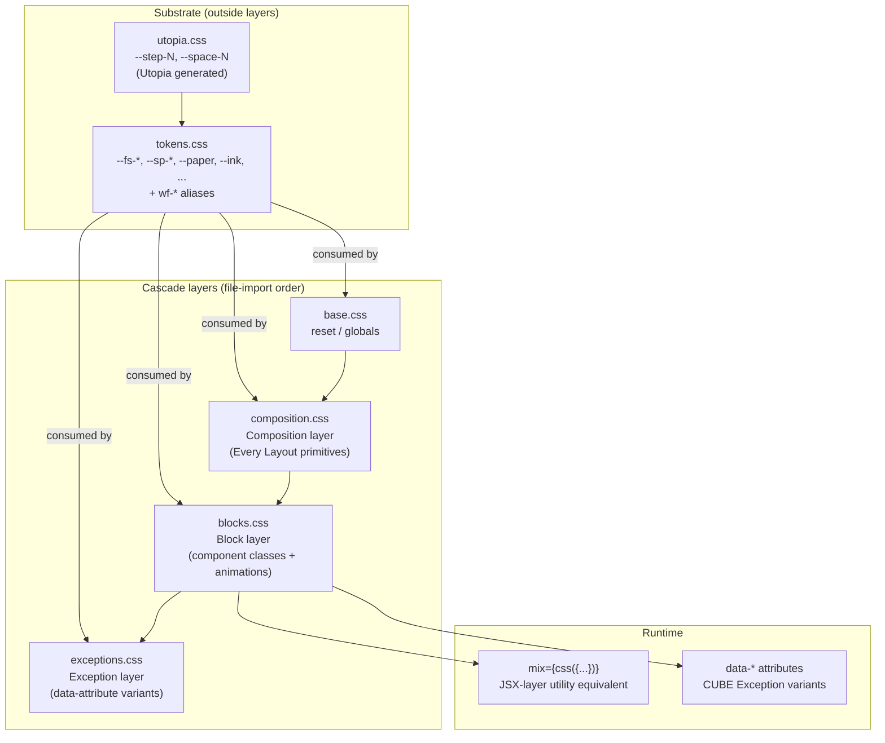

# feat: Redesign Ready view; restructure CSS into strict CUBE layers

## Summary

Revise `services/landing/app/actions/sessions/components/ready.tsx` to match `docs/designs/Two-Links Hi-Fi.html`, restructuring the page through the Every Layout primitives (Stack / Cluster / Switcher / Cover); restructure the CSS into strict CUBE CSS layers (substrate → reset → composition → block → exception), each as a dedicated file under `public/styles/`; adopt the Utopia fluid type/space scales (`utopia.css`, generated from utopia.fyi) for fluid sizing, with semantic OpenVoid tokens in `tokens.css` referencing Utopia steps where the design fits and using static values where it doesn't. The chrome gains a `crumbs` mode for Ready only, Card gains an `elevated` variant, two new primitives ship (`UrlRow`, `Connector`), and two clientEntries (`CopyButton`, `OpenLinkShortcuts`) handle the interactive layer. Five candidate primitives flagged by the doc review (Kbd, LivePill, ReadyPill, IconMark, SplitTip) collapse into inline CSS recipes. Ingress-probe gate, controller behavior, KillConfirm flow, and Stop intent contract are preserved.

---

## Problem Frame

The current Ready view ships wireframe variant 04-A. It reads as a wireframe — the magic-moment payoff feels spec-y rather than welcoming. The Two-Links hi-fi direction restages the page as an editorial hero, a duo of elevated cards joined by an animated flow arrow with role badges and copy-able URL rows, a split-window tip, and a quieter footer.

A second, deeper problem this plan addresses: the existing `theme.css` mixes design tokens (`:root` custom properties), Block-layer component class rules, and Exception-shaped variants in one file; `composition.css` (the CUBE Composition layer) lives in `app/ui/layout/` separate from the rest of the CSS and is inlined into the document `<head>` via a JSX `<style innerHTML={...}>` workaround for raw-text-element escaping. The OpenVoid Tokens reference (`docs/designs/OpenVoid Tokens.html`) and the CUBE methodology (https://cube.fyi) both point to a cleaner architecture: tokens as the substrate outside any cascade layer, with Composition → Utility → Block → Exception layers loaded in order. This plan adopts that structure strictly: every CSS file lives under `public/styles/`, each cascade layer is its own file, and the Document loads them in CUBE-canonical order via `<link>` tags. Utopia's fluid type/space scale (https://utopia.fyi) sits in `utopia.css` as a generated artifact; `tokens.css` references it where appropriate.

None of the controller-side gating logic (ingress probe, status-gated URLs, intent dispatch) changes.

---

## Requirements

- R1. The Ready page renders to the structural shape of `docs/designs/Two-Links Hi-Fi.html`: 56px sticky header with brand mark + workspace/repo crumbs + live-session pill + avatar; centered hero with ready pill + h1 + subtitle; two cards (Agent chat / Live preview) side-by-side, joined by an animated SVG connector, that collapse to a stack on narrow viewports; split-window tip; muted done-line footer.
- R2. The Ready page's structural layout is built from the layout primitives in `services/landing/app/ui/layout/` (Cover for the stage, Stack for vertical flow, Cluster for inline groups, Switcher for the duo).
- R3. The CSS is restructured into strict CUBE layers, each as a dedicated file under `services/landing/public/styles/`:
  - `utopia.css` — substrate (Utopia-generated fluid type/space scales)
  - `tokens.css` — substrate (OpenVoid canonical tokens + `wf-*` aliases)
  - `base.css` — reset / globals (existing, kept)
  - `composition.css` — CUBE Composition layer (Every Layout primitives, moved from `app/ui/layout/`)
  - `blocks.css` — CUBE Block layer (component classes + animations, renamed from `theme.css`)
  - `exceptions.css` — CUBE Exception layer (data-attribute variants)
- R4. The CSS cascade follows CUBE's recommended order via `<link>` tags in `document.tsx`: `utopia.css` → `tokens.css` → `base.css` → `composition.css` → `blocks.css` → `exceptions.css`. Composition.css is no longer inlined; the `innerHTML` workaround for the composition layer is dropped (the per-Switcher `<style>` keeps `innerHTML` because that block is still inline JSX content).
- R5. `tokens.css` carries the OpenVoid Tokens system with semantic names (`--fs-display`, `--sp-11`, `--paper`, `--ink`, etc.). Type and spacing tokens reference `utopia.css` steps where the design value matches Utopia's fluid scale; otherwise the token resolves to a static value at the design's specified size. Existing `--wf-*` variables are aliases of canonical tokens for backwards compatibility.
- R6. Component primitives are reviewed against the Tokens doc's component recipes; thin wrappers with one consumer collapse into inline CSS recipes; only primitives with non-trivial logic (URL parsing, animated SVG) earn dedicated component files.
- R7. The controller-side ingress-probe gate, status-gated URL contract, KillConfirm flow, ActionErrorBanner re-render, and Stop / Cancel intent contracts remain functionally unchanged.
- R8. All new code follows the existing Remix 3 conventions: factory components (`function Name() { return (props) => jsx }`), `class` + `mix={css({...})}` (not `className` / `style`), `RemixNode` (not `ReactNode`), `<style innerHTML={...} />` for inline raw-text element content (e.g., the per-Switcher style block), HTML attribute names per the JSX-attribute-naming learning.
- R9. ClientEntry components carry SSR-only fallbacks: CopyButton renders a focusable static `<button>` without JS; OpenLinkShortcuts is invisible (returns `null`) and degrades to plain `<a target="_blank">` clicks; Stop & save continues to work via the existing `?confirm=stop` link path.
- R10. The new chrome (56px header + crumbs + live pill) ships only on the Ready state. Provisioning / Done / Failed / Stopping / KillConfirm continue to render today's 44px TopBar with the existing `path` slug.
- R11. The existing controller test (`services/landing/test/actions/sessions.controller.test.ts`) keeps satisfying its URL and Stop-related pins; pins that target the old wireframe copy migrate to the new design copy. New per-primitive SSR tests follow the layout-primitives test pattern.

---

## Scope Boundaries

- Body redesigns of `Provisioning`, `Done`, `Failed`, `Stopping`, `KillConfirm` — these states render on today's TopBar and existing body content.
- Home / Create page chrome and body — out of scope.
- Live elapsed-time counter for the live-session pill — v1 ships "Session live" without a numeric duration.
- Threading `Session.repo` / `Session.repoUrl` through the View shape — v1 derives the breadcrumb's `here` segment from the session id (8-char prefix in mono).
- Per-component CSS file structure (Andy Bell's `blocks/card.css` / `blocks/button.css` / etc. convention) — this plan uses monolithic `blocks.css` and `exceptions.css`; per-component splits can land later if the codebase grows.
- A CUBE Utility-layer file (`utilities.css`) — the existing `mix={css({...})}` pattern at the JSX layer covers the same role.
- Migrating every `--wf-*` variable reference in components to bare canonical names — variables become aliases at the `tokens.css` level; existing `var(--wf-fg)` references continue to resolve.
- Migrating every existing `.wf-card` / `.wf-btn-pri` / `.wf-chip` consumer to canonical Tokens dimensions — existing class rules keep their current spec; the redesign uses new class rules at canonical dimensions.
- Adapting the user-provided `utopia.css` — the file is kept verbatim; tokens.css references its steps.
- Re-running Utopia's calculator with adjusted settings to better match design values — the current utopia.css is the canonical fluid scale; design-fidelity drift is handled in `tokens.css` (via static values for tokens Utopia doesn't fit cleanly).

### Deferred to Follow-Up Work

- Body redesigns of the other session states under the new chrome — separate PR. That PR also adopts the canonical Tokens dimensions for `.wf-card`, `.wf-btn-pri`, etc.
- Live-session timer clientEntry (`SessionElapsed`) — needs `Session.createdAt` plumbed through the View.
- Plumbing `Session.repo` / `repoUrl` through `derive.ts` and the View.
- Capture the `<style>` `innerHTML` Remix 3 escape trap as a `docs/solutions/best-practices/` entry.
- Migration of `--wf-warn-*` / `--wf-danger-*` (no Tokens equivalents) into the canonical system.
- Per-component Block files (`blocks/card.css`, `blocks/button.css`, …) when monolithic `blocks.css` outgrows readability.
- A dedicated `utilities.css` (CUBE Utility layer) when shared utility classes earn their keep across multiple consumers.
- Re-generation of `utopia.css` with adjusted scale ratios if design fidelity drift becomes meaningful.

---

## Context & Research

### Relevant Code and Patterns

- `services/landing/app/actions/sessions/components/ready.tsx` — the file being rewritten.
- `services/landing/app/actions/sessions/page.tsx` — composes `<Layout>` + `<Ready>`. Branches chrome shape on `view.kind === 'ready'`.
- `services/landing/app/ui/{layout,top-bar,card,chip,eyebrow,status-dot,avatar,logo,document}.tsx` — primitives reviewed; some grow new props, some get reused as-is.
- `services/landing/app/ui/layout/{stack,cluster,switcher,cover,sidebar,reel,aspect-frame}.tsx` — Every Layout primitives shipped in PR #24. Used directly to structure the page. Note: their default `space` prop references `--space-s/m/l` — the user-provided `utopia.css` defines exactly those names, so the primitives' fluid defaults bind naturally without separate aliasing.
- `services/landing/app/ui/layout/composition.css` — the existing Composition layer. U1 moves it to `services/landing/public/styles/composition.css`.
- `services/landing/public/styles/utopia.css` — already in place; user-generated from utopia.fyi. Kept verbatim.
- `services/landing/public/styles/theme.css` — currently mixes `:root` tokens and Block-layer component class rules. U1 splits it: `:root` block moves to `tokens.css`; component class rules move to `blocks.css`; the `[data-accent-top]` Exception variant moves to `exceptions.css`. The file `theme.css` is removed at the end of U1.
- `services/landing/public/styles/base.css` — element resets. Not edited; keeps its existing `@layer app, rmx;` declaration.
- `services/landing/app/ui/document.tsx` — `<head>` shell. U1 reorders to load six `<link>` tags in CUBE-canonical order, drops the inline `<style innerHTML={COMPOSITION_CSS}>` block.
- `services/landing/app/actions/sessions/client/stop-button.tsx` — canonical clientEntry shape. U6 mirrors this pattern.
- `services/landing/app/actions/sessions/client/status-poller.tsx` — invisible-clientEntry pattern.
- `services/landing/app/actions/home/client/submit-button.tsx` — `handle.queueTask` pattern.
- `services/landing/test/actions/sessions.controller.test.ts` — Ready-state assertions. U7 migrates the hero/pill/button copy pins.
- `services/landing/test/ui/document.test.tsx` — updated to test the new cascade order and the `<link>` to composition.css.

### Institutional Learnings

- `docs/solutions/best-practices/remix-3-jsx-attribute-naming-2026-05-06.md` — only `aria-*`, `data-*`, `className`, `htmlFor`, `tabIndex`, `acceptCharset`, `httpEquiv` translate; everything else lowercases silently. The Connector SVG must use kebab-case attribute names; the Connector test pins them.
- `docs/solutions/runtime-errors/landing-ingress-probe-stuck-running-pre-ingress-2026-05-09.md` — the Ready-render contract depends on the ingress-probe gate. Tests must keep `ingressOk: true`.
- The PR #24 (layout-primitives port) findings carry forward, but with one notable update: the JSX-child-text escape bug for `<style>` content **no longer applies to `composition.css`** because composition.css is now a static `<link>`-loaded file rather than inlined JSX content. The escape concern stays for the per-Switcher inline `<style>` block (still uses `innerHTML`).

### External References

- `docs/designs/OpenVoid Tokens.html` — the canonical design-token system (semantic names, design-fidelity values).
- `docs/designs/Two-Links Hi-Fi.html` — the visual reference for the Ready page composition. Where Two-Links and Tokens diverge on a value, Tokens is canonical.
- `services/landing/public/styles/utopia.css` — Utopia fluid type/space scale, generated from utopia.fyi (min viewport 320px, max 1240px, type ratios 1.2 / 1.25, space scale t-shirt). Kept verbatim.
- **CUBE CSS** (https://cube.fyi) — Composition / Utility / Block / Exception methodology. Tokens are the substrate outside cascade layers. Andy Bell's project boilerplate confirms file-import order as the cascade-control mechanism (no `@layer` directive required).
- **Utopia** (https://utopia.fyi) — fluid type and spacing via `clamp()` between min/max viewports. Calculator-generated; the user produced our `utopia.css` from the calculator.
- **Andy Bell — "Fluid scale and tokens: a match made in heaven"** (https://archive.hankchizljaw.com/wrote/fluid-scale-and-tokens:-a-match-made-in-heaven/) — Utopia + CUBE compose: Utopia tokens are `:root` substrate; CUBE layers consume them.
- **Every Layout** (https://every-layout.dev/layouts/) — Stack / Cluster / Switcher / Cover.

---

## Key Technical Decisions

- **Strict CUBE layer separation, one file per layer, all under `public/styles/`.** Six files: `utopia.css`, `tokens.css`, `base.css`, `composition.css`, `blocks.css`, `exceptions.css`. The cascade is enforced via file-import order in `document.tsx`'s six `<link>` tags. No `@layer` directives. This matches Andy Bell's recommended convention for small codebases.
- **Composition.css moves from `app/ui/layout/` to `public/styles/`.** All cascade-layer files live together. Side benefit: composition.css becomes a regular static-served CSS file (no longer inlined as JSX child text), which means the Remix 3 raw-text-element escape bug no longer applies to it. The per-Switcher `<style>` block keeps using `innerHTML` because that block is still inline JSX content.
- **Theme.css splits into `blocks.css` + `exceptions.css`.** Block rules (existing `.wf-card`, `.wf-btn`, `.wf-chip`, etc., plus the new `.wf-card-elev`, `.wf-btn-action`, `.wf-pill-*`, `.wf-icon-mark`, `.wf-url-row`, `.wf-split-tip`, `.wf-connector`, `.wf-toolbar-tall`, the `.wf-keycap` update, and `@keyframes breathe`/`flow`) move to `blocks.css`. Exception rules (data-attribute variants) move to `exceptions.css` — currently just `.wf-card-elev[data-accent-top]::before`. The `theme.css` file is removed at the end of U1.
- **Utopia is the source of truth for fluid math; tokens.css is the source of truth for design-system semantics.** `utopia.css` carries the canonical `clamp()` formulas (`--step-N`, `--space-{size}`); `tokens.css` carries semantic OpenVoid names (`--fs-display`, `--sp-11`, `--paper`, etc.). For type/space tokens where Utopia's scale fits the design value, the OpenVoid token aliases the Utopia step (e.g., `--fs-h1: var(--step-3)`); otherwise it resolves to a static value at the design's specified size.
- **Concrete type mapping (in `tokens.css`):**

  ```css
  --fs-display: clamp(2rem, 1.6932rem + 1.3636vw, 2.75rem);  /* 32→44px, custom clamp — Utopia step-4 max 49px overshoots */
  --fs-h1:      var(--step-3);   /* 28→39px (≈ design 38px) */
  --fs-h2:      1.125rem;        /* 18px static — design exact */
  --fs-h3:      0.969rem;        /* 15.5px static */
  --fs-body:    0.875rem;        /* 14px static */
  --fs-small:   0.844rem;        /* 13.5px static */
  --fs-meta:    0.781rem;        /* 12.5px static */
  --fs-eyebrow: 0.719rem;        /* 11.5px static */
  --fs-mono-sm: 0.688rem;        /* 11px static */
  ```

- **Concrete space mapping (in `tokens.css`):**

  ```css
  --sp-1:  0.25rem;            /* 4px */
  --sp-2:  0.375rem;           /* 6px */
  --sp-3:  0.5rem;             /* 8px */
  --sp-4:  0.625rem;           /* 10px */
  --sp-5:  0.75rem;            /* 12px */
  --sp-6:  0.875rem;           /* 14px */
  --sp-7:  1.125rem;           /* 18px */
  --sp-8:  1.375rem;           /* 22px */
  --sp-9:  1.75rem;            /* 28px */
  --sp-10: var(--space-l);     /* 32→40px — Utopia max-aligned */
  --sp-11: var(--space-xl);    /* 48→60px — Utopia max-aligned */
  --sp-12: var(--space-2xl);   /* 64→80px — Utopia max-aligned */
  ```

- **Layout-primitive default `--space-s/m/l` resolve naturally.** The user's `utopia.css` defines `--space-s` (16→20px), `--space-m` (24→30px), `--space-l` (32→40px) — exactly the names the layout primitives reference as fallbacks. No alias plumbing needed in `tokens.css`. The defaults bind to Utopia's fluid t-shirt scale automatically.
- **`--wf-*` aliases live in `tokens.css` alongside canonical tokens.** Each `--wf-*` resolves to its canonical equivalent via `var()`. `--wf-warn-*` / `--wf-danger-*` keep their literal hex values (no Tokens equivalents).
- **Animations live in `blocks.css`.** `@keyframes breathe` and `@keyframes flow` are not custom properties; per CUBE, they belong closest to where they're used (the Block-layer rules that consume them).
- **`exceptions.css` starts small.** Just `.wf-card-elev[data-accent-top]::before` (the chat-card gradient strip). The file establishes the Exception layer; future state variants land here.
- **Class rules don't auto-migrate to canonical Tokens dimensions.** `.wf-card` keeps its 10px radius; `.wf-btn-pri` keeps its 30px height; `.wf-chip` keeps its 22px height. The redesign introduces NEW class rules at canonical dimensions: `.wf-card-elev` (14px / `--shadow-2` / 22px), `.wf-btn-action` (36px / 9px / 13px semibold), `.wf-pill-live` and `.wf-pill-ready` (24px / `--r-pill`), `.wf-icon-mark`, `.wf-url-row`, `.wf-split-tip`, `.wf-connector`. The existing `.wf-keycap` is updated in-place to match the Tokens `.kbd` recipe (20px tall, `--r-xs`, paper-2 bg, single inset border). The existing `.wf-btn:focus-visible` outline rule updates to use `--focus-ring`.
- **Application rule: accent for LIVE only.** Replaces 2px solid accent focus outline with `--focus-ring` (4px accent-soft halo). The existing `<Eyebrow tone="ok">` for "Session ready" gives way to `.wf-pill-ready` (accent-soft / accent — LIVE state).
- **Application rule: one primary CTA per screen.** Ready's duo has one ink-filled primary (`wf-btn-action-pri`) on the chat card and one outlined secondary (`wf-btn-action-sec`) on the preview card.
- **Application rule: mono for identifiers only.** Current Ready's mono `<h1>` of the session id is dropped. Mono renders only for: URLs in the UrlRow, kbds in `.wf-keycap`, the session-id prefix in the breadcrumb's `here` segment.
- **Card extends with `variant: 'line' | 'elevated'` and `accentTop?: boolean`.** `'line'` (default) is the existing shape; `'elevated'` is the canonical Tokens card. `accentTop` toggles the `data-accent-top` attribute (CUBE Exception via data attribute); the `[data-accent-top]::before` pseudo-strip in `exceptions.css` renders the gradient bar.
- **Chrome scope: gate the new TopBar shape on `view.kind === 'ready'`.** SessionPage branches; non-Ready states keep today's TopBar.
- **TopBar props are a discriminated union with optional workspace.** `chrome: { mode: 'path'; path?: string } | { mode: 'crumbs'; workspace?: string; here: string }`. When `workspace` is omitted or empty, only the `here` segment renders (no leading workspace span or `/` separator).
- **Workspace breadcrumb is dropped from v1; single-segment crumbs ship.** Until the auth layer plumbs a real workspace value, only the `here` segment renders — the session-id prefix in mono. When auth lands, the workspace segment reintroduces with no JSX changes elsewhere. Avoids shipping `'maria'` (a fixture user-name) as production chrome on a page whose stated identity is "editorial hero".
- **Live-session pill ships without a numeric duration.** "Session live" with the breathing accent dot. Known limitation: degraded for `prefers-reduced-motion` users (no breathe animation) and during status-poller latency windows. v1.1 follow-up: add a `prefers-reduced-motion` fallback (e.g., a static-but-distinct dot color) and tighten the status-poller cadence under the LivePill's lifetime.
- **Connector responsive uses a `@container` query** with `@media (max-width: 760px)` fallback.
- **CopyButton state flip happens only after the clipboard promise resolves.** The `await` resolution branch flips `copied = true` and schedules the 1.2s revert. The catch branch leaves the label unchanged — fully silent on rejection so the user never sees a false-success signal. Renders as a semantic `<button class="wf-chip">`.
- **OpenLinkShortcuts is scoped to non-input focus.** Suppress only when `document.activeElement` is an `<input>`, `<textarea>`, or `[contenteditable]` element — never on the body-only check. The body-only check breaks the shortcut on the very buttons that advertise it (after a click moves focus to that button). `window.open` returning null (popup-blocked) is silent — same pattern as CopyButton's clipboard denial.
- **StopButton's clientEntry SSR fallback IS the done-line prose link.** The clientEntry's outer JSX in `services/landing/app/actions/sessions/client/stop-button.tsx` is rewritten from `<a class="wf-btn wf-btn-danger">Stop & save</a>` to a styled prose link matching the design's done-line copy ("Come back here and end the session"). The controller-test pin migrates from `/Stop &amp; save/` to assert the new prose text. On hydration, click is intercepted as today and the confirm dialog opens.
- **Test scope: clientEntry SSR fallbacks** are tested in `test/actions/sessions/client/`.

---

## Open Questions

### Resolved During Planning

- *Should design tokens live in their own file?* — Yes; new `tokens.css` (CUBE substrate).
- *Should Utopia output live in its own file?* — Yes; existing `utopia.css` (user-provided, kept verbatim).
- *Should `theme.css` split into `blocks.css` + `exceptions.css`?* — Yes; strict CUBE layer separation.
- *Should `composition.css` move to `public/styles/`?* — Yes; all cascade-layer files live together. Side benefit: drops the inline `<style innerHTML={COMPOSITION_CSS}>` workaround for the composition layer.
- *Per-component file structure (`blocks/card.css`, `blocks/button.css`, etc.) or monolithic `blocks.css`?* — Monolithic for now; per-component split is deferred until `blocks.css` outgrows readability.
- *Cascade strategy: `@layer` declarations or file-import order?* — File-import order via the six `<link>` tags in `document.tsx`.
- *Should we use Utopia for fluid type/spacing?* — Yes, where the design value matches Utopia's scale cleanly (h1 via `--step-3`; sp-10/11/12 via `--space-l/xl/2xl`). Display gets a custom clamp(); h2/h3/body and the small cluster stay static at OpenVoid values.
- *Why keep semantic OpenVoid tokens (`--fs-*`, `--sp-*`) at all if Utopia is the underlying source?* — Most OpenVoid tokens aren't covered by Utopia (12-step non-linear spacing scale, 5 distinct values in the body-cluster type range that Utopia's geometric scale can't represent, plus all colors / radii / shadows / motion / layout widths). The semantic-name layer earns its keep through design-doc alignment, call-site readability, and decoupling from Utopia regeneration. Most `--fs-*` and `--sp-*` resolve to static values in `tokens.css`; a few alias Utopia steps where the math fits.
- *Should we introduce a CUBE Utility-layer file?* — No. The existing `mix={css({...})}` pattern at the JSX layer covers the same role.
- *Token-naming strategy?* — Bare canonical names (`--paper`, `--ink`, `--sp-3`, `--r-lg`); `--wf-*` declared as aliases in `tokens.css` for backwards compat.
- *Should the Ready chrome change apply to all session states or only Ready?* — Only Ready.
- *Should we introduce a new `SessionLayout`?* — No. Extend `<Layout>` with `mainKind` and `topBarChrome`.
- *Card primitive: which dimensions — Two-Links's 18px/28px or Tokens's 14px/22px?* — Tokens canonical.
- *`accentTop` as wrapper element vs CSS pseudo?* — CSS pseudo (`::before`) on `.wf-card-elev`, with `[data-accent-top]` toggling visibility (CUBE Exception pattern in `exceptions.css`).
- *Connector responsive trigger?* — Container query with media-query fallback.
- *`topBarCrumbs` / `topBarPath` mutual exclusion: type-level or runtime?* — Compile-time discriminated union.
- *CopyButton: focusable element type?* — Semantic `<button>`.
- *CopyButton: clipboard-denial fallback?* — Silent.
- *OpenLinkShortcuts: hijack behavior?* — Scoped to non-input focus.
- *Stop button SSR fallback path?* — Keep `<StopButton>`.
- *Workspace breadcrumb fallback?* — Hardcoded `'maria'`; JSDoc note.
- *Repo breadcrumb `here` segment without `repoUrl` plumbed?* — `view.sessionId.slice(0, 8)` rendered in mono.
- *Live timer in the live-session pill?* — Drop the number entirely.
- *Test file structure for clientEntry SSR fallbacks?* — Mirror implementation under `test/actions/sessions/client/`.

### Deferred to Implementation

- *Whether `wf-keycap`'s update to match Tokens `.kbd` introduces a visual regression on the home page Submit button.* — Manual `pnpm dev` browser check during U1.
- *Whether to inline the SplitTip / IconMark / pill recipes verbatim in `ready.tsx` or extract a small private helper at the top of the file.* — Either is fine; readability decides.

### Deferred from doc-review 2026-05-10

- *Are `mainKind` and the TopBar `chrome` discriminated union earning their keep with one consumer each, or should they collapse to additive optional props until the other session-state body redesigns ship?* — Revisit when the other-state body-redesign timeline is firm. The discriminated union is currently shaped per Finding 6's optional-workspace fix; any rollback would partially reverse that shape.
- *On a Ready → Stopping / KillConfirm state transition, should the 56px chrome (crumbs + LivePill) reshape immediately to the 44px chrome, or should those states also get the new chrome to avoid the mid-page visible shift?* — Revisit when state-body redesign timeline is firm. Two options: accept the v1 visual shift and document; or expand the chrome branch in `SessionPage` to keep Stopping/KillConfirm on the 56px crumbs chrome (replacing LivePill with a "Stopping…" pill).

---

## Output Structure

```
services/landing/
├── public/styles/
│   ├── utopia.css        — substrate: Utopia fluid type/space (existing; kept verbatim)
│   ├── tokens.css        — substrate: OpenVoid semantic tokens + wf-* aliases (NEW)
│   ├── base.css          — reset / globals (existing; kept)
│   ├── composition.css   — Composition layer (MOVED from app/ui/layout/)
│   ├── blocks.css        — Block layer (renamed from theme.css; :root stripped, Exception rules moved out, new component recipes added)
│   └── exceptions.css    — Exception layer (NEW; data-attribute variants)
└── app/ui/layout/        (composition.css removed; primitive .tsx files stay)
    └── *.tsx
```

Document `<head>` loading order:

```html
<link rel="stylesheet" href="...fonts..." />
<link rel="stylesheet" href="/styles/utopia.css" />        <!-- substrate -->
<link rel="stylesheet" href="/styles/tokens.css" />        <!-- substrate -->
<link rel="stylesheet" href="/styles/base.css" />           <!-- reset -->
<link rel="stylesheet" href="/styles/composition.css" />    <!-- Composition -->
<link rel="stylesheet" href="/styles/blocks.css" />         <!-- Block -->
<link rel="stylesheet" href="/styles/exceptions.css" />     <!-- Exception -->
<script type="module" src="/_rmx/app/assets/run.ts" />
```

Six `<link>` tags. No inline `<style>` block for composition.css. The `fs.readFileSync(composition.css)` and `<style innerHTML={COMPOSITION_CSS}>` machinery in `document.tsx` is removed.

---

## High-Level Technical Design

> *This illustrates the intended approach and is directional guidance for review, not implementation specification. The implementing agent should treat it as context, not code to reproduce.*

### CUBE structure mapping



### tokens.css shape (sketch)

```
:root {
  /* ── Surfaces ── */
  --paper: oklch(0.972 0.006 75);
  --paper-2: oklch(0.955 0.006 75);
  --paper-3: oklch(0.935 0.006 75);
  --card: #ffffff;
  --terminal: #0E0E0E;

  /* ── Ink ── */
  --ink: oklch(0.18 0.005 60);
  --ink-2: oklch(0.42 0.005 60);
  --ink-3: oklch(0.62 0.005 60);
  --ink-4: oklch(0.78 0.005 60);

  /* ── Lines / accent / semantic / fonts ── */
  --line, --line-2, --accent, --accent-soft, --ok, --ok-soft
  --font-sans, --font-mono

  /* ── Type — mostly static, a few alias to Utopia steps ── */
  --fs-display: clamp(2rem, 1.6932rem + 1.3636vw, 2.75rem);  /* 32→44px custom */
  --fs-h1: var(--step-3);     /* 28→39px ≈ design 38 */
  --fs-h2: 1.125rem;          /* 18px static */
  --fs-h3: 0.969rem;          /* 15.5px static */
  --fs-body: 0.875rem;        /* 14px static */
  --fs-small, --fs-meta, --fs-eyebrow, --fs-mono-sm    /* static cluster */

  /* line heights, letter spacings, weights — all static */
  --lh-tight, --lh-snug, --lh-normal, --lh-loose
  --ls-display, --ls-heading, --ls-body, --ls-eyebrow
  --fw-regular, --fw-medium, --fw-semi, --fw-bold

  /* ── Spacing — sp-1 through sp-9 static; sp-10/11/12 alias Utopia ── */
  --sp-1 .. --sp-9 (static at OpenVoid values)
  --sp-10: var(--space-l);     /* 32→40px */
  --sp-11: var(--space-xl);    /* 48→60px */
  --sp-12: var(--space-2xl);   /* 64→80px */

  /* ── Radii / elevation / motion / layout widths ── */
  --r-xs .. --r-pill, --shadow-1/2/3, --focus-ring
  --dur-fast/base/slow/breathe, --ease-std
  --w-prose/card/stage/page, --h-header

  /* ── Backwards-compat aliases ── */
  --wf-bg: var(--paper);
  --wf-fg: var(--ink);
  --wf-fg-muted: var(--ink-2);
  /* … */

  /* ── Kept (no Tokens equivalent) ── */
  --wf-warn, --wf-warn-soft, --wf-danger, --wf-danger-soft
}
```

Note: layout-primitive defaults `--space-s/m/l` are NOT defined in `tokens.css` — they come from `utopia.css` directly (the user's file already declares them). The earlier plan revision's `--space-s: var(--sp-3)` aliases are dropped.

### Page composition (Ready)

```
SessionPage(view.kind === 'ready')
└── Layout(mainKind="full",
            topBarChrome={mode:'crumbs', workspace:'maria', here: sessionIdShort},
            topBarRight=<HeaderSlot> /* LivePill + Avatar */)
    └── Cover(minHeight="calc(100vh - var(--h-header))",
              centered=Stack[
                  Hero(<span class="wf-pill-ready">...</span> + h1 + subtitle),
                  Duo(positioned wrapper + Connector overlay + Switcher[ChatCard, PreviewCard]),
                  SplitTip(inline composition),
                  DoneLine(<a href="?confirm=stop">…</a>)
              ])
```

---

## Implementation Units

### U1. Restructure CSS into strict CUBE layers; create `tokens.css` and `exceptions.css`; rename `theme.css` to `blocks.css`; move `composition.css`; reorder `document.tsx`

**Goal:** Land the strict CUBE substrate-then-layers structure. Six dedicated CSS files under `public/styles/`, loaded via six `<link>` tags in CUBE-canonical cascade order. The inline `<style innerHTML={COMPOSITION_CSS}>` workaround for the composition layer is removed.

**Requirements:** R3, R4, R5, R8

**Dependencies:** None

**Files:**
- Create: `services/landing/public/styles/tokens.css`
- Create: `services/landing/public/styles/exceptions.css`
- Move: `services/landing/app/ui/layout/composition.css` → `services/landing/public/styles/composition.css`
- Rename: `services/landing/public/styles/theme.css` → `services/landing/public/styles/blocks.css`
  - Strip the `:root` block (moves to `tokens.css`)
  - Move the `[data-accent-top]` Exception rule (when added) to `exceptions.css`
  - Add new component-recipe rules (listed in Approach)
  - Update `.wf-keycap` to match Tokens `.kbd` recipe
  - Update `.wf-btn:focus-visible` to use `--focus-ring`
  - Add `@keyframes breathe` and `@keyframes flow`
- Modify: `services/landing/app/ui/document.tsx`
  - Remove `fs.readFileSync(composition.css)` import + `COMPOSITION_CSS` constant
  - Remove `<style innerHTML={COMPOSITION_CSS} />` from `<head>`
  - Add six `<link rel="stylesheet">` tags in CUBE-canonical order: utopia → tokens → base → composition → blocks → exceptions
  - Update the JSDoc comment block on `Document` to describe CUBE cascade order
- Modify: `services/landing/test/ui/document.test.tsx`
  - Update pins to expect six `<link>` tags in cascade order
  - Drop the regression test for the inline `<style>` block (no longer applies; `composition.css` is a regular static file)
  - Add new tests verifying tokens.css / blocks.css / exceptions.css disk content
- Test: `services/landing/test/ui/styles/tokens.test.ts` (new — disk-load assertions for tokens.css)
- Test: `services/landing/test/ui/styles/blocks.test.ts` (new — disk-load assertions for blocks.css)
- Test: `services/landing/test/ui/styles/exceptions.test.ts` (new — disk-load assertions for exceptions.css)

**Approach:**

- **`tokens.css`** carries `:root` only. Sections in order: surfaces, ink, lines, accent/semantic, fonts, type sizes (mostly static; `--fs-h1` aliases `--step-3`; `--fs-display` is custom clamp), line-heights / letter-spacings / weights (static), spacing (sp-1..9 static; sp-10/11/12 alias Utopia space-l/xl/2xl), radii (static), elevation (static), motion (static), layout widths (static), then `--wf-*` backwards-compat aliases, then kept `--wf-warn-*` / `--wf-danger-*` literals. Comment block at the top names the file as CUBE substrate and the Utopia-alias strategy.
- **`utopia.css`** stays as the user pasted it. No edits.
- **`composition.css` move.** `git mv services/landing/app/ui/layout/composition.css services/landing/public/styles/composition.css`. The file content is unchanged.
- **`theme.css` → `blocks.css` rename + restructure.**
  - Remove the `:root` block (moved to tokens.css).
  - Keep existing class rules: `.wf-row`, `.wf-col`, `.wf-spacer`, `.wf-divider`, `.wf-hairline`, `.wf-card`, `.wf-bg-alt`, `.wf-grid-bg`, `.wf-stripe-bg`, `.wf-btn` + variants, `.wf-input`, `.wf-chip` + variants, `.wf-mono`, `.wf-link`, `.wf-h1/h2/h3`, `.wf-eyebrow`, `.wf-muted`, `.wf-faint`, `.wf-dot` + variants, `.wf-keycap`, `.wf-skeleton-line`, `.wf-pulse`, `.wf-blink`, `.wf-spinner`, `.wf-app-icon`, `.wf-progress-track/-fill`, `.wf-toolbar`, `.sr-only`.
  - Update `.wf-keycap` to match Tokens `.kbd` recipe (20px tall, `--r-xs`, paper-2 bg, `box-shadow: inset 0 0 0 1px var(--line)` — single inset border).
  - Update `.wf-btn:focus-visible` outline rule to `box-shadow: var(--focus-ring); outline: none;`.
  - Add new component-recipe rules:
    - `.wf-toolbar-tall` — modifier for the 56px crumbs-mode TopBar.
    - `.wf-card-elev` — elevated card (14px / `--shadow-2` / 22px / hover-lift).
    - `.wf-btn-action` + `.wf-btn-action-pri` + `.wf-btn-action-sec` — 36px / 9px / 13px semibold; primary = ink/paper, secondary = white/line.
    - `.wf-pill-live` (with `.wf-pill-dot.wf-pill-dot-breathe` inner via `@keyframes breathe`) and `.wf-pill-ready` (static dot).
    - `.wf-icon-mark` + `.wf-icon-mark-dark` + `.wf-icon-mark-line` (42×42, 11px radius).
    - `.wf-url-row` + `.wf-url-scheme` + `.wf-url-rest` + `.wf-url-trail` (paper-2, `--r-sm`, mono, scheme-greyed prefix).
    - `.wf-split-tip` + `.wf-split-icon` + `.wf-split-text` + `.wf-split-kbd`.
    - `.wf-connector-host` (container-type: inline-size + position: relative wrapper) + `.wf-connector` (positioning + flow path animation including `@container (max-width: 30rem)` and `@media (max-width: 760px)` fallback).
    - `@keyframes breathe` (per Tokens canonical: scale 0.7→2.6, opacity 0.6→0, 1800ms ease-out infinite).
    - `@keyframes flow` (stroke-dashoffset for the Connector flow path).
  - Do NOT include `[data-accent-top]` rules — those go in `exceptions.css`.
- **`exceptions.css`** starts with the single rule:
  ```css
  /*
   * CUBE Exception Layer
   * Data-attribute variants on Block components.
   * @link https://cube.fyi/exception.html
   */
  .wf-card-elev[data-accent-top]::before {
    content: "";
    position: absolute;
    left: var(--sp-9);
    right: var(--sp-9);
    top: 0;
    height: 2px;
    border-radius: 2px;
    opacity: 0.5;
    background: linear-gradient(90deg, transparent, var(--accent), transparent);
  }
  ```
  Comment block names the file as CUBE Exception layer and documents the convention (data-attribute toggling, never an extra class).
- **`document.tsx` reorder.** Drop the `fs.readFileSync` import and the `COMPOSITION_CSS` module-scope constant. New `<head>` order: fonts `<link>` → utopia `<link>` → tokens `<link>` → base `<link>` → composition `<link>` → blocks `<link>` → exceptions `<link>` → `<script>`. JSDoc on `Document` describes the CUBE cascade order and points to `cube.fyi`.

**Patterns to follow:**
- Andy Bell's CUBE boilerplate (External References) — file-import order as cascade-control mechanism.
- Existing comment-block style in `theme.css` and `composition.css` (`/* ── Section ── */` dividers).
- Existing `services/landing/test/ui/document.test.tsx` for SSR test patterns.

**Test scenarios:**
- Happy path (cascade order in HTML): `renderToString(<Document>)` emits six `<link>` tags in `<head>` in the order: utopia.css, tokens.css, base.css, composition.css, blocks.css, exceptions.css. Pin via index-based regex.
- Happy path (no inline composition style): the emitted HTML does NOT contain a `<style>` block whose contents match `.stack` or `.cluster` — composition.css is now a `<link>`, not inline.
- Happy path (token presence in tokens.css disk-load): `services/landing/public/styles/tokens.css` contains `--paper`, `--ink-4`, `--accent`, `--sp-3`, `--sp-12`, `--r-lg`, `--shadow-2`, `--focus-ring`, `--dur-breathe`, `--h-header`, `--fs-display: clamp(`, `--fs-h1: var(--step-3)`, `--sp-10: var(--space-l)`, `--wf-bg: var(--paper)`, `--wf-fg: var(--ink)`.
- Happy path (cross-file alias dependency in utopia.css disk-load): `services/landing/public/styles/utopia.css` declares `--step-3:` and `--space-l:` / `--space-xl:` / `--space-2xl:` — every Utopia step that `tokens.css` aliases must exist in `utopia.css`. Pins each referenced step explicitly so a future utopia.css regeneration that drops or renames a step breaks the test rather than rendering an unset variable in the browser.
- Happy path (load-order pin in document.tsx): index-based regex on the rendered `<Document>` HTML asserts `utopia.css`'s `<link>` index is strictly less than `tokens.css`'s — guards against a future cascade-order refactor inverting the substrate-layer dependencies (which would silently break every `--fs-h1: var(--step-3)`-style alias).
- Happy path (token absence in blocks.css disk-load): `blocks.css` does NOT contain a `:root` block. Disk-load asserts `assert.doesNotMatch(css, /:root\s*\{/)`.
- Happy path (block rules in blocks.css): `blocks.css` contains existing rules (`.wf-card`, `.wf-btn`, `.wf-chip`, `.wf-keycap`, `.wf-toolbar`) AND new rules (`.wf-card-elev`, `.wf-btn-action`, `.wf-pill-live`, `.wf-pill-ready`, `.wf-icon-mark`, `.wf-url-row`, `.wf-split-tip`, `.wf-connector`, `@keyframes breathe`, `@keyframes flow`).
- Happy path (exception rule in exceptions.css): `exceptions.css` contains `.wf-card-elev[data-accent-top]::before`.
- Happy path (composition.css moved): file exists at `services/landing/public/styles/composition.css`; does NOT exist at `services/landing/app/ui/layout/composition.css`.
- Edge case (theme.css removed): `assert.equal(fs.existsSync('services/landing/public/styles/theme.css'), false)`.
- Edge case (existing pages render unchanged): existing controller tests (home, sessions for non-Ready states) keep passing — the cascade reorder doesn't visibly change rendered HTML for non-Ready states.
- Edge case (--wf-* aliases resolve): tokens.css contains every `--wf-*` alias the existing components reference — disk-load test enumerates them.

**Verification:**
- `pnpm typecheck` passes.
- `pnpm test` — Document tests pass (with updated cascade pins); existing controller tests pass; new disk-load tests for tokens.css / blocks.css / exceptions.css pass.
- Manual: `pnpm dev` browser check on Home / Create / existing session pages — visual regression check on `wf-keycap` (the home page Submit ⌘+↵ label) and `wf-btn:focus-visible` outline (now a 4px halo).

---

### U2. Extend `<TopBar>` with a discriminated `chrome` prop (path | crumbs)

**Goal:** Add the crumbs mode (workspace + here, 56px tall) used by Ready; keep path mode (today's decorative slug, 44px) for every other consumer.

**Requirements:** R1, R8, R10

**Dependencies:** U1

**Files:**
- Modify: `services/landing/app/ui/top-bar.tsx`
- Modify: `services/landing/app/ui/logo.tsx` (accept `tall?: boolean`)
- Test: `services/landing/test/ui/top-bar.test.tsx` (new)
- Test: `services/landing/test/ui/logo.test.tsx` (new)

**Approach:**
- `TopBarProps` becomes a discriminated union: `chrome: { mode: 'path'; path?: string } | { mode: 'crumbs'; workspace?: string; here: string }`. The `right?: RemixNode` slot stays. `workspace` is optional in the crumbs variant.
- `mode: 'path'` renders the existing 44px header + decorative slug + path (unchanged).
- `mode: 'crumbs'` renders 56px header (`.wf-toolbar.wf-toolbar-tall` from U1) + Logo(tall) + the `here` segment in `var(--font-mono)`. When `workspace` is provided AND non-empty, prepend `<span class="wf-meta wf-fg-muted">{workspace}</span><span class="wf-fg-faint">/</span>` before the `here` segment. When `workspace` is omitted or the empty string, render only the `here` segment — no leading workspace span, no `/` separator.
- JSDoc on `crumbs.workspace`: "v1 ships without a workspace segment; auth layer plumbing is deferred. When auth lands, pass the workspace name here and the chrome upgrades to two-segment shape automatically."
- JSDoc on `crumbs.here`: "v1 ships the session-id prefix in mono; full repo-name plumbing is deferred."

**Patterns to follow:**
- Existing `TopBar` shape; discriminated-union pattern in `services/landing/app/ui/input.tsx`.

**Test scenarios:**
- Happy path (path mode): emits the existing slug, no `wf-toolbar-tall` class, no breadcrumb spans.
- Happy path (crumbs mode, workspace omitted): `wf-toolbar-tall` on header, Logo with 22px mark, only the `here` segment rendered in `var(--font-mono)`. No workspace span, no `/` separator.
- Happy path (crumbs mode, workspace present): `wf-toolbar-tall` on header, Logo with 22px mark, both breadcrumb spans, `here` in `var(--font-mono)`.
- Edge case (workspace = empty string): rendered identically to workspace omitted — no vestigial empty span.
- Happy path (right slot): includes the avatar after the spacer.
- Edge case (TypeScript): the discriminated union prevents passing both `path` and `workspace` at compile time.
- Logo: `<Logo tall />` emits 22px mark and 15px wordmark; default emits 16px mark and 13px wordmark.

**Verification:**
- TopBar / Logo tests pass.
- `pnpm typecheck` passes.
- All existing `<TopBar>` consumers keep passing.

---

### U3. Extend `<Layout>` with `mainKind: 'narrow' | 'full'` and pass through `chrome`

**Goal:** Allow Ready to opt into a stage that owns the viewport.

**Requirements:** R1, R8

**Dependencies:** U2

**Files:**
- Modify: `services/landing/app/ui/layout.tsx`
- Test: `services/landing/test/ui/layout.test.tsx` (new)

**Approach:**
- Add to `LayoutProps`: `mainKind?: 'narrow' | 'full'` (default `'narrow'`); `topBarChrome?: TopBarProps['chrome']`.
- `narrow` keeps the existing 960px max-width main wrapper.
- `full` renders `<main mix={css({ width: '100%' })}>{children}</main>` — no max-width, no padding.
- Drop the legacy `topBarPath` prop; SessionPage and home page convert to `topBarChrome={{ mode: 'path', path }}` at the call site (U7).

**Test scenarios:**
- Happy path (narrow default): `<main>` with `max-width: 960px`.
- Happy path (full): `<main>` without max-width / padding.
- Happy path (crumbs passthrough): TopBar receives the crumbs prop.

**Verification:**
- Layout test passes.
- Existing controller tests continue rendering their pages within the narrow main.

---

### U4. Extend `<Card>` with `variant: 'line' | 'elevated'` + `accentTop`

**Goal:** Add the elevated card shape the duo uses, without disturbing the existing six `wf-card` consumers.

**Requirements:** R6, R7, R8

**Dependencies:** U1 (uses `--shadow-2`, `--r-lg`, `--card`, `--accent`, `--sp-8`, plus the `.wf-card-elev` and `[data-accent-top]` CSS rules from blocks.css/exceptions.css)

**Files:**
- Modify: `services/landing/app/ui/card.tsx`
- Test: `services/landing/test/ui/card.test.tsx` (new)

**Approach:**
- Add to `CardProps`: `variant?: 'line' | 'elevated'` (default `'line'`); `accentTop?: boolean`.
- `'line'` renders the existing `<div class="wf-card">` shape.
- `'elevated'` renders `<div class="wf-card-elev"{accentTop && data-accent-top}>` — `.wf-card-elev` rule lives in `blocks.css`; `[data-accent-top]::before` lives in `exceptions.css`.

**Test scenarios:**
- Happy path (default): `<div class="wf-card">x</div>`.
- Happy path (elevated): `<div class="wf-card-elev">x</div>`.
- Happy path (elevated + accentTop): `<div class="wf-card-elev" data-accent-top="">x</div>`.

**Verification:**
- Card test passes.
- Six existing `<Card>` consumers render unchanged.

---

### U5. Add `UrlRow` and `Connector` primitives; inline the rest as recipes

**Goal:** Ship the two primitives that earn their keep. The five thin-wrapper shapes (Kbd, LivePill, ReadyPill, IconMark, SplitTip) are inline CSS recipes consumed at the Ready call sites — composed from class rules added in U1.

**Requirements:** R1, R6, R8

**Dependencies:** U1

**Files:**
- Create: `services/landing/app/ui/url-row.tsx`
- Create: `services/landing/app/ui/connector.tsx`
- Test: `services/landing/test/ui/url-row.test.tsx`
- Test: `services/landing/test/ui/connector.test.tsx`

**Approach:**
- **UrlRow:** `url: string`, `children?: RemixNode`. Renders `<div class="wf-url-row"><span class="wf-url-scheme">{schemeOf(url)}</span><span class="wf-url-rest">{restOf(url)}</span><span class="wf-url-trail">{children}</span></div>`. Inline string ops parse the scheme.
- **Connector:** `direction?: 'right' | 'down'` (default `'right'`). Renders `<div class="wf-connector" aria-hidden="true">{<svg viewBox="0 0 120 60" preserveAspectRatio="none">...</svg>}</div>`. SVG carries an animated flow path (`stroke-dasharray="4 5"`, animated via `@keyframes flow` in blocks.css) and an arrowhead. All SVG attributes use kebab-case.
- The `.wf-connector-host` wrapper is set up by the consumer in `ready.tsx`, not by the primitive.
- **Connector narrow-width spec.** At narrow widths the wrapper renders 60×60 (`width: 60px; height: 60px; margin: -12px auto`). The SVG keeps its `viewBox="0 0 120 60"` and `preserveAspectRatio="none"`, so the 90deg rotation maps the original landscape arrow into a vertical bounding box — the arrowhead lands at the bottom-center, the curve rises to the top-center. Verify visually in browser dev-tools at 320px / 720px viewports during composition; no SVG `viewBox` swap needed.

**Test scenarios:**
- UrlRow: parses scheme separately; trail slot wraps children. Edge cases for missing scheme and empty url.
- Connector: emits SVG with `aria-hidden="true"`, `stroke-dasharray="4 5"`, `wf-connector-flow` class on the flow path.

**Verification:**
- Both primitive tests pass.
- Manual: Ready page renders the Connector with the animated dashed flow visible.

**Inline recipes (composed at the call site in U7):**
- **Kbd:** `<span class="wf-keycap">{symbol}</span>`.
- **LivePill:** `<span class="wf-pill-live"><span class="wf-pill-dot wf-pill-dot-breathe" />Session live</span>`.
- **ReadyPill:** `<span class="wf-pill-ready"><span class="wf-pill-dot" />Sandbox ready</span>`.
- **IconMark:** `<span class="wf-icon-mark wf-icon-mark-dark">{icon-svg}</span>`.
- **SplitTip:** `<div class="wf-split-tip"><div class="wf-split-icon"><span /><span /></div><div class="wf-split-text">…</div><div class="wf-split-kbd"><span class="wf-keycap">⌘</span><span class="wf-keycap">⇧</span><span class="wf-keycap">D</span></div></div>`.

---

### U6. Add clientEntry components — `CopyButton`, `OpenLinkShortcuts`

**Goal:** Add the interactive layer with SSR fallbacks.

**Requirements:** R8, R9

**Dependencies:** U1

**Files:**
- Create: `services/landing/app/actions/sessions/client/copy-button.tsx`
- Create: `services/landing/app/actions/sessions/client/open-link-shortcuts.tsx`
- Test: `services/landing/test/actions/sessions/client/copy-button.test.tsx`
- Test: `services/landing/test/actions/sessions/client/open-link-shortcuts.test.tsx`

**Approach:**
- **CopyButton:** `Handle<{ value: string; label?: string; copiedLabel?: string }>`. Closure flag `copied`. Renders as `<button class="wf-chip" type="button">`. `onCopy` does the following inside a try/catch: `try { await navigator.clipboard.writeText(handle.props.value); copied = true; handle.update(); /* schedule 1.2s revert via handle.signal */ } catch { /* silent — no state flip */ }`. The state flip lives ONLY inside the resolved-promise branch — never synchronously, never optimistically — so a permission-denied or insecure-context rejection produces no false-success signal. The catch branch leaves the label unchanged; users on browsers where clipboard write isn't available simply see the label stay as "Copy".
- **OpenLinkShortcuts:** `Handle<{ chatHref: string; previewHref: string }>`. Renders `() => null`. On hydration: document `keydown` listener (registered with `handle.signal`). Handler short-circuits if `!(e.metaKey || e.ctrlKey)`, if `e.key !== '1' && e.key !== '2'`, or if `document.activeElement` is an `<input>`, `<textarea>`, or `[contenteditable]` element (`activeElement instanceof HTMLInputElement || activeElement instanceof HTMLTextAreaElement || activeElement?.isContentEditable === true`). Otherwise `e.preventDefault()` and `window.open(href, '_blank', 'noopener,noreferrer')`. The previously proposed body-only check (`document.activeElement === document.body`) is wrong: it suppresses the shortcut after any button gets focus — including the Open chat / Open preview buttons that themselves display the `⌘1` / `⌘2` kbd hints — making the shortcut self-defeating. Element-type exclusion preserves the user's text-input experience without breaking the shortcut on the buttons that advertise it. `window.open` returning `null` (popup-blocked, e.g., Safari with strict pop-up blocking) is silent — no in-page feedback. Same pattern as CopyButton's clipboard-denial silence; users recognize their browser configuration.

**Test scenarios:**
- CopyButton (SSR fallback): emits `<button class="wf-chip" type="button">Copy</button>`.
- OpenLinkShortcuts (SSR fallback): emits no visible UI.

**Verification:**
- Both clientEntry tests pass.
- Manual: with focus in the prompt textarea, ⌘1 / ⌘2 still switch browser tabs; with focus on the Open chat / Open preview buttons (after a click or Tab navigation), ⌘1 / ⌘2 open chat / preview in new tabs as expected; in Safari with pop-up blocking enabled, `window.open` silently fails and the page stays put.

---

### U7. Rewrite Ready page composition + branch SessionPage chrome + update tests

**Goal:** Replace the current Ready view with the Two-Links composition; branch the SessionPage chrome on `view.kind === 'ready'`; migrate controller test pins.

**Requirements:** R1, R2, R7, R10, R11

**Dependencies:** U1, U2, U3, U4, U5, U6

**Files:**
- Modify: `services/landing/app/actions/sessions/components/ready.tsx`
- Modify: `services/landing/app/actions/sessions/page.tsx` (covers BOTH the success branch at line ~49 and the `SessionNotFoundPage` at line ~163 — both pass `topBarPath` today, both migrate to `topBarChrome`)
- Modify: `services/landing/app/actions/home/page.tsx` (one-line: `<Layout topBarChrome={{ mode: 'path', path: ... }}>` instead of `<Layout topBarPath={...}>`)
- Modify: `services/landing/app/actions/sessions/client/stop-button.tsx` (rewrite the clientEntry's outer JSX to render the done-line prose link instead of the `<a class="wf-btn wf-btn-danger">Stop & save</a>` fallback — see Approach)
- Modify: `services/landing/test/actions/sessions.controller.test.ts`
- Modify: `services/landing/test/actions/home.controller.test.ts` (only if any pins target Layout's main wrapper structure — likely no change)

**Approach:**

*Ready view (`ready.tsx`):*

- `<Cover minHeight="calc(100vh - var(--h-header))" centered={<Stack space="var(--sp-10)">...stage...</Stack>}>`. Stage stack: Hero → Duo → SplitTip → DoneLine.
- *Hero:* `<Stack space="var(--sp-6)" mix={css({ textAlign: 'center', maxWidth: 'var(--w-prose)', margin: '0 auto' })}>` with `<span class="wf-pill-ready"><span class="wf-pill-dot" />Sandbox ready</span>`, `<h1 mix={css({ fontSize: 'var(--fs-display)', lineHeight: 'var(--lh-tight)', letterSpacing: 'var(--ls-display)', fontWeight: 'var(--fw-semi)', margin: 0 })}>Two tabs, and you're building.</h1>`, `<p mix={css({ fontSize: '15.5px', color: 'var(--ink)', margin: 0, maxWidth: 'var(--w-card)', lineHeight: 'var(--lh-normal)' })}>Drive the agent on one. Watch the app come to life on the other. We'll save your work when you're done.</p>`. Hero h1 wrap behavior: inherits `text-align: center` and `max-width: var(--w-prose)` (520px) from the Hero `Stack`; uses `--lh-tight` (1.05); allowed to wrap onto two lines below ~440px viewport (the natural English break at "Two tabs," / "and you're building." handles it without forced `<br>`).
- *Duo:* `<div class="wf-connector-host" mix={css({ maxWidth: 'var(--w-stage)', width: '100%' })}><Connector /><Switcher limit={2} space="var(--sp-9)"><ChatCard /><PreviewCard /></Switcher></div>`. The `.wf-connector-host` carries `container-type: inline-size`.
- *ChatCard:* `<Card variant="elevated" accentTop padding="var(--sp-8)">` containing: `<Eyebrow mix={css({ position: 'absolute', top: 'var(--sp-7)', right: 'var(--sp-8)' })}>01 · drive</Eyebrow>`; `<Cluster space="var(--sp-5)">` with `<span class="wf-icon-mark wf-icon-mark-dark"><svg.../></span>` and a `<div>` with `<h2 class="wf-h2">Agent chat</h2>` + subtitle; `<UrlRow url={agentUrl}><CopyButton value={agentUrl} /></UrlRow>`; `<Cluster>` with `<a class="wf-btn-action wf-btn-action-pri" href={agentUrl} target="_blank" rel="noopener noreferrer">Open chat <span class="wf-keycap">⌘1</span></a>`.
- *PreviewCard:* identical structure but no `accentTop`, icon mark `wf-icon-mark-line`, role badge `02 · watch`, action button `wf-btn-action wf-btn-action-sec`, kbd `⌘2`.
- *SplitTip:* inline composition per U5's recipe.
- *DoneLine:* the `<StopButton sessionId={sessionId}>` clientEntry IS the done-line. The clientEntry's outer JSX (in `services/landing/app/actions/sessions/client/stop-button.tsx`) is rewritten so the SSR fallback emits the prose link directly — `<div class="wf-row" mix={css({ gap: 'var(--sp-4)', color: 'var(--ink-3)', fontSize: 'var(--fs-meta)' })}>Done for the day? <a href={`/sessions/${sessionId}?confirm=stop`} mix={[css({ textDecoration: 'underline', color: 'var(--ink-2)' }), on<HTMLElement>('click', openDialog)]}>Come back here and end the session</a> — we'll commit your work to Git.</div>`. On hydration the existing dialog-opening logic intercepts the click; with JS off, the anchor navigates to `?confirm=stop` as today. There is no longer a separate visible "Stop & save" button.
- `<OpenLinkShortcuts chatHref={agentUrl} previewHref={previewUrl} />` is rendered at the bottom (invisible).

*SessionPage (`page.tsx`):*

- Branch chrome on the success branch:
  ```ts
  const chrome = view.kind === 'ready'
    ? { mode: 'crumbs' as const, here: view.sessionId.slice(0, 8) }   // workspace omitted — drops 'maria' from v1
    : { mode: 'path' as const, path: `/sessions/${view.sessionId}` }
  const mainKind = view.kind === 'ready' ? 'full' : 'narrow'
  const headerRight = view.kind === 'ready' ? <HeaderSlot view={view} /> : <Avatar />
  ```
- `<SessionNotFoundPage>` (the not-found branch at `sessions/page.tsx:163`) also migrates: `<Layout title="openvoid — session not found" topBarChrome={{ mode: 'path', path: '/sessions/not-found' }}>`. Path mode (today's chrome shape) is correct here — there's no live session to crumb against.
- `<HeaderSlot>` composes `<><span class="wf-pill-live"><span class="wf-pill-dot wf-pill-dot-breathe" />Session live</span><Avatar /></>`. No numeric duration; no `·` separator.

*StopButton clientEntry (`stop-button.tsx`):* rewrite the outer JSX. Today's SSR fallback emits `<a class="wf-btn wf-btn-danger" href="?confirm=stop">Stop & save</a>` (a visible danger-styled button). New SSR fallback: the done-line prose `<div>` wrapping the prose link with the same `?confirm=stop` href. The hydration logic (open the confirm dialog on click, intercept default, run cleanup via `handle.signal`) is unchanged; only the visible affordance moves from a button to an underlined inline link inside the prose. The dialog itself, the form-action submission, and the focus management all stay.

*Home page (`home/page.tsx`):* migrate one call site to `topBarChrome={{ mode: 'path', path: '...' }}`.

*Controller test (`sessions.controller.test.ts`):* migrate `/Session ready/` → `/Sandbox ready/`. Add new pins: `/Two tabs, and you're building/`, `/Open chat/`, `/Open preview/`, `/Drag both tabs into a split window/`, `/Session live/`, plus an absence pin `assert.doesNotMatch(html, /Session live\s*[·]/)` to lock the deferred-numeric-duration decision (so a future regression that adds the `· 0:42` separator without supporting `createdAt` plumbing fails the test). The `/Stop &amp; save/` pin migrates to `/Come back here and end the session/` (the new prose link's text). URL pins stay. Add a pin asserting the new chrome on Ready: `wf-toolbar-tall` class present, only the 8-char id-prefix breadcrumb (no `maria`, no `/` separator span — single-segment crumb), LivePill text "Session live". Add a pin asserting non-Ready states keep the existing chrome.

**Test scenarios:**
- Happy path (Ready): emits the new hero copy, ReadyPill, both URLs in `UrlRow`s, both CopyButtons, both Open buttons, SplitTip prose, done-line prose link with `?confirm=stop` href, no separate "Stop & save" button.
- Happy path (chrome on Ready): `wf-toolbar-tall` class, single-segment crumb (8-char id-prefix in mono only — no `maria`, no separator), LivePill text "Session live", no `·` separator after "Session live".
- Happy path (Cover stage): `<main>` has no max-width/padding (mainKind=full).
- Happy path (chrome on non-Ready): Provisioning emits `wf-toolbar` without `-tall`, no breadcrumb spans, existing slug.
- Happy path (chrome on not-found): SessionNotFoundPage emits `wf-toolbar` (path mode), `/sessions/not-found` slug, no `wf-toolbar-tall`.
- Edge case (URL parsing): URLs with mixed casing in scheme render through UrlRow.
- Integration: existing controller tests for Ready/Provisioning/KillConfirm/intent-dispatch/action-error banner all keep passing — the `?confirm=stop` link still opens the confirm dialog on hydration.

**Verification:**
- Ready test passes with migrated copy pins.
- All existing controller tests pass.
- Full landing test suite passes.
- Manual: `pnpm dev` + browser visits to `/sessions/<a-running-session-id>` and `/sessions/<a-pending-session-id>` confirm both code paths.

---

## System-Wide Impact

- **Interaction graph:** No new server-side pathways. New clientEntries (CopyButton, OpenLinkShortcuts) attach focused / document-scoped listeners cleaned up via `handle.signal`. The existing `StopButton` continues to intercept clicks on the done-line link.
- **Error propagation:** Unchanged.
- **State lifecycle risks:** No new persistence. CopyButton's 1.2s revert timer is registered with `handle.signal`.
- **API surface parity:** `<TopBar>` reshapes its props as a discriminated union with optional `workspace`; three existing call sites migrate (home/page.tsx, sessions/page.tsx success branch, sessions/page.tsx not-found branch). `<Layout>` gains `mainKind` and `topBarChrome` (drops `topBarPath`). `<Card>` gains `variant` and `accentTop`. `<StopButton>` keeps its sessionId prop and clientEntry shape but rewrites its outer JSX from a danger-styled button to a prose link inside the done-line `<div>` — same `?confirm=stop` SSR fallback href.
- **CSS architecture:** Six dedicated files under `public/styles/`, loaded via six `<link>` tags. The Composition layer (`composition.css`) is no longer inlined — JSX-child-text escape risk for that file is gone. The per-Switcher inline `<style>` block keeps using `innerHTML`.
- **Token-system coverage:** `--wf-*` variables become aliases of canonical tokens in `tokens.css`. Existing components keep working without per-component edits. `--wf-warn-*` and `--wf-danger-*` stay as literal hex values.
- **Cascade order:** Strict CUBE: utopia → tokens → base → composition → blocks → exceptions. Existing pages don't render differently because no production element today combines a `.wf-*` Block class with a Composition class on the same element.
- **Integration coverage:** The existing controller test exercises Ready end-to-end through the router. U7's pin migration ensures the integration is green.
- **Unchanged invariants:** Status-gated URL contract, ingress-probe gate, KillConfirm flow, intent-dispatch contracts, StopButton's `?confirm=stop` SSR fallback path, layout-primitives' APIs, asset server / static-files middleware.

---

## Risks & Dependencies

| Risk | Mitigation |
|------|------------|
| Cascade reorder (`utopia → tokens → base → composition → blocks → exceptions`) surfaces a latent specificity bug in an existing page that depended on Block-layer winning over Composition. | Manual smoke check (Home / Create / existing session pages) catches this. Risk is low because no production element combines a `.wf-*` Block class with a Composition class on the same element. |
| Six `<link>` round-trips on every page load add overhead vs the current two `<link>` + one inline `<style>`. | All six are static, browser-cacheable, and small (<10 KB total). Browsers parallelize `<link>` requests. The cache hit on every page-load except first is the dominant case. The previous inline-composition optimization mostly mattered for the cold-cache first paint; on subsequent navigations, six cached links are no slower than two cached links. |
| `wf-keycap` update to match Tokens `.kbd` causes a visible regression on the home page Submit button. | Manual `pnpm dev` check during U1 implementation; if regression looks bad, ship `wf-keycap-flat` modifier instead of updating in place. |
| Aliasing `--wf-*` to canonical tokens via `var()` indirection adds a layer that fails silently if a Tokens variable is misnamed. | U1's disk-load tests pin both canonical tokens and alias declarations, so a missing or misspelled alias breaks the test rather than rendering as an empty string. |
| `--space-s/m/l` now resolve to Utopia's t-shirt scale (16→20px / 24→30px / 32→40px); layout-primitives consumers that previously relied on the literal default fallback see a layout shift. | Layout primitives are only consumed in the test suite and (after this plan) in Ready. No production page consumes a primitive's default `--space` today. |
| `clamp()` for `--fs-display` (custom) and the Utopia-aliased tokens cause unexpected scaling at viewport widths between 320px and 1240px. | Manual `pnpm dev` browser check at 320px / 760px / 1240px confirms fluid scaling reads as intended. |
| `oklch()` color values render slightly differently than the existing hex equivalents on some browsers. | All current browsers support `oklch()`. Visible delta is sub-perceptual for the values OpenVoid uses. |
| Browsers without `@container` support fall back to the `@media (max-width: 760px)` rule (viewport-width based, re-introduces the Switcher-vs-Connector desync). | Modern browsers (Chromium 105+, Firefox 110+, Safari 16+) all support `@container`; the fallback covers older versions where the desync is less impactful. |
| Discriminated-union `TopBarProps['chrome']` reshape requires every `<TopBar>` consumer to migrate. | Two consumers (SessionPage, home/page.tsx); both listed in U7's Files. TypeScript catches misses. |
| Connector SVG attribute names get lowercased by Remix 3. | U5's Connector test pins specific attributes (`stroke-dasharray`, `aria-hidden`) in the rendered HTML. Kebab-case naming follows the JSX-attribute-naming learning. |
| The "Session live" pill carries dual failure modes: (a) `prefers-reduced-motion: reduce` suppresses the breathe animation, leaving a static dot indistinguishable from "Session active" / "Session was live"; (b) during status-poller latency windows, the page can show "Session live" for up to a poll interval after the agent process has died with no contradiction. The breathing dot is the only truthful liveness signal — and reduced-motion users don't get it. | v1 ships with both limitations documented. v1.1 follow-up: ship a `prefers-reduced-motion` fallback (e.g., a static-but-distinct dot color or accent-bordered ring) AND tighten the status-poller cadence to under 5 seconds while the LivePill is rendered. The full live-elapsed ticker work — also gated on `createdAt` plumbing — converges with this follow-up. |
| `OpenLinkShortcuts` scoping to non-input focus might surprise users. | The kbd visual on each Open button signals the binding; scoping is documented in JSDoc. The element-type exclusion (vs body-only) preserves the shortcut on the very buttons that advertise it — without this, the shortcut would silently break the moment the user clicks Open chat once. |
| Splitting `theme.css` into `blocks.css` + `exceptions.css` requires rewriting `document.test.tsx`'s assertions wholesale. | Acceptable cost; the new disk-load test pattern is more robust (asserts on actual file content rather than emitted-HTML proxies). |

---

## Documentation / Operational Notes

- No runtime config, env, or dependency changes.
- Manual verification path: `pnpm dev`, navigate to `/sessions/<a-running-session-id>`; verify chrome (56px header, **single-segment crumb showing only the session-id prefix in mono — no `maria` workspace segment**, "Session live" pill with breathing dot — **no `· 0:42` separator**), hero pill / h1 / subtitle, two cards joined by an animated connector, URL-row Copy interaction (clipboard-allowed → "Copied" briefly, clipboard-denied → label unchanged), ⌘1 / ⌘2 keyboard shortcuts (with body focus → opens new tabs; with focus on the Open chat button itself after a click → still opens; with focus in a text input on the page → tab-switch preserved), SplitTip layout, muted done-line **prose link** (no separate "Stop & save" button — the link itself is StopButton's SSR fallback). Resize the window between 320px and 1240px to confirm fluid scaling on display/h1 + sp-10/11/12 and the duo's container-query collapse with Connector rotation. Verify the per-state chrome branch by visiting `/sessions/<a-pending-session-id>` (Provisioning — existing 44px chrome) and a non-existent session id (NotFound — existing 44px chrome with `/sessions/not-found` slug).
- Capture the `<style>` `innerHTML` workaround as a `docs/solutions/best-practices/` entry post-merge.
- The previous landing-page redesign plan (`docs/plans/2026-05-05-002-feat-landing-page-redesign-plan.md`) framed wireframe variant 04-A as the visual direction for Ready; this plan supersedes that direction.

---

## Sources & References

- **Design tokens (canonical)**: `docs/designs/OpenVoid Tokens.html`
- **Page composition (canonical)**: `docs/designs/Two-Links Hi-Fi.html`
- **Utopia fluid scale (canonical)**: `services/landing/public/styles/utopia.css` (existing; user-generated from utopia.fyi)
- **Page being revised**: `services/landing/app/actions/sessions/components/ready.tsx`
- **Composing module**: `services/landing/app/actions/sessions/page.tsx`
- **Predecessor plan (superseded direction)**: `docs/plans/2026-05-05-002-feat-landing-page-redesign-plan.md`
- **Layout-primitives port plan**: `docs/plans/2026-05-09-001-feat-landing-layout-primitives-remix-port-plan.md`
- **Institutional learnings**:
  - `docs/solutions/best-practices/remix-3-jsx-attribute-naming-2026-05-06.md`
  - `docs/solutions/runtime-errors/landing-ingress-probe-stuck-running-pre-ingress-2026-05-09.md`
- **CUBE CSS methodology**: https://cube.fyi (Composition / Utility / Block / Exception; tokens are the substrate outside cascade layers)
  - https://cube.fyi/composition.html
  - https://cube.fyi/block.html
  - https://cube.fyi/exception.html
  - https://piccalil.li/blog/a-css-project-boilerplate/ — Andy Bell's recommended file-import-order cascade convention
- **Utopia fluid type / spacing**: https://utopia.fyi
  - https://utopia.fyi/type/calculator/
  - https://utopia.fyi/space/calculator/
  - https://utopia.fyi/blog/clamp/
  - https://archive.hankchizljaw.com/wrote/fluid-scale-and-tokens:-a-match-made-in-heaven/ — Andy Bell on Utopia + CUBE compatibility
- **Related code**:
  - `services/landing/app/ui/{layout,top-bar,card,chip,eyebrow,status-dot,avatar,logo,document}.tsx`
  - `services/landing/app/ui/layout/{stack,cluster,switcher,cover,sidebar}.tsx`
  - `services/landing/public/styles/{utopia,base,theme}.css`
  - `services/landing/app/ui/layout/composition.css` (moves to `public/styles/` in U1)
  - `services/landing/app/actions/sessions/client/{stop-button,status-poller,focus-h1}.tsx`
  - `services/landing/app/actions/home/client/submit-button.tsx`
  - `services/landing/test/actions/sessions.controller.test.ts`
- **External methodology references**:
  - Every Layout (https://every-layout.dev/)
  - PR #24 — feat/landing-layout-primitives
