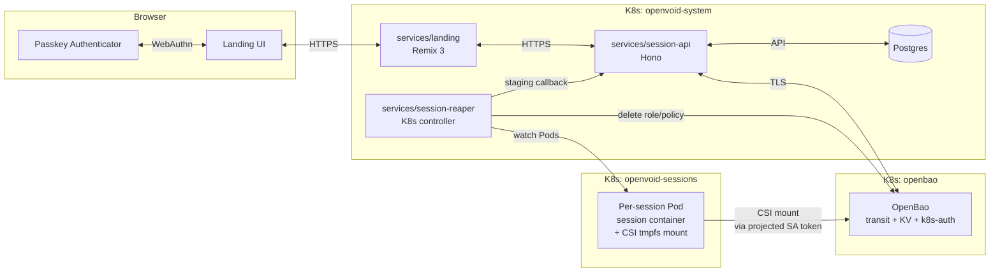

# v1 Auth + Secrets Architecture Implementation

## Summary

Implements the v1 auth + secrets architecture for openvoid: passkey-required signup with consumer OAuth + email magic-link identity, BYOK AgentCredentials at two scopes (user-scope for cross-app keys like the user's own OpenRouter dev key; app-scope for per-app keys like Zapier or a deployed app's runtime LLM key, with app-overrides-user collision resolution), and the OpenBao key model (user KEK from passkey-PRF → user-scope and per-app DEK envelopes → per-session ephemeral K8s SA identity) specified in the four architecture docs. Storage paths are ownership-neutral from day one so v2 multi-user teams extend without path migration. Build-only — DOKS deployment, app CI/CD, and infra DR runbooks defer to platform-cicd (Item 2) and app-publishing (Item 3). Closes with an operator-facing runbook covering rotation, audit interpretation, user support, and key-touching DR procedures.

---

## Problem Frame

openvoid is greenfield for auth: no users, no sessions, no Postgres, no auth primitives. Today the only "auth" is a cluster-scoped agent password injected at the ingress edge. To open to multi-tenant BYOK usage, openvoid needs a security architecture that:

- Holds no plaintext user secrets at rest the platform can read
- Survives operator compromise without total user-secret exposure
- Excludes whole classes of failure mode (Lovable-style key leakage into committed code) by construction
- Is documented as the work portfolio demonstrates this product as something a careful operator built

The architecture docs (threat-model, sequence-diagrams, device-requirements) and roadmap survivors 2/3/9 specify the chosen design in detail. This plan implements it.

---

## Requirements

- R1. Passkey enrolment with WebAuthn-PRF is a hard gate at signup; users on non-PRF-capable devices cannot create accounts (origin: device-requirements.md §1)
- R2. Identity authentication uses consumer OAuth providers (Google / Apple / Microsoft) and email magic-link; no user-facing GitHub OAuth (origin: sequence-diagrams.md Diagram 1)
- R3. User KEK is derived per-request from passkey-PRF output + per-user permanent salt via Argon2id; KEK lives in request-scoped Node.js Buffer only (origin: threat-model A7, sequence-diagrams.md Diagram 1)
- R4. Two DEK families exist, both wrapped by user KEK at rest: `user-dek-{userId}` (one per user, used for cross-app secrets) and `app-dek-{appId}` (one per app, used for app-specific secrets). Storage paths are ownership-neutral: `secret/data/users/{userId}/integrations/{name}` and `secret/data/apps/{appId}/integrations/{name}`. (origin: threat-model §2.1, T2/T3; user request 2026-05-27)
- R5. User secrets are stored at one of two scopes (user-scope or app-scope) chosen by the user at put time. At session start, both scopes are decrypted, merged with app-scope overriding user-scope on environment-variable-name collision, and an audit event records each override. v1 implements OpenRouter as the only wired integration; the schema and CRUD generalize over both scopes. (origin: threat-model §2.1; sequence-diagrams.md Diagram 2)
- R6. Every session creation requires a fresh passkey assertion — no pre-staging between sessions at v1 (origin: threat-model §7)
- R7. Per-session pod receives secrets via CSI Secrets Store Driver → tmpfs only; no plaintext via K8s Secret API surface (origin: sequence-diagrams.md Diagram 3)
- R8. Per-session OpenBao access is scoped via a per-session policy bound to a per-session K8s ServiceAccount. Policy grants read on (a) `secret/data/users/{userId}/integrations/*` + `transit/decrypt/user-dek-{userId}` (user-scope) and (b) `secret/data/apps/{appId}/integrations/*` + `transit/decrypt/app-dek-{appId}` (app-scope). Other apps and other users are denied at policy level. Policy is generated from a membership join so v2 team membership extends without redesign. (origin: threat-model T2/T3, §2.1)
- R13. v1 explicitly assumes single-user-per-app ownership. v2 multi-user teams are out of scope here but the architecture must not require path migration when teams ship — the path layout and policy machinery in R4/R8 are designed v2-ready. (origin: threat-model §2.1 future-work note; user request 2026-05-27)
- R9. Recovery codes (10 per user, Argon2id-hashed, display-once) provide a distinct KDF path to the same user-master after device loss (origin: threat-model T9, sequence-diagrams.md Diagram 4)
- R10. Audit events are produced for every authentication, every secret CRUD, every session creation, every rotation; events ship off-cluster (origin: threat-model A4)
- R11. Key rotation primitives are in place for routine DEK rotation (§6.1), credential-change re-wrap (§6.2), and emergency salt + KEK rotation (§6.3) (origin: threat-model §6)
- R12. An operator runbook gives the on-call human end-to-end clarity on rotation, audit interpretation, user support, and DR procedures touching keys (user request 2026-05-26)

---

## Scope Boundaries

- DOKS deployment, Terraform, ArgoCD, image signing — defers to `docs/ideation/2026-05-25-platform-cicd-and-deployment-ideation.md` (Item 2)
- App publishing CI/CD and generated-app secret consumption — Item 3
- OpenBao HA topology, infra backup procedures, quarterly restore drill, DR failover — Item 2 §7. The operator runbook in this plan cross-references these rather than duplicating them.
- Egress allowlist / NetworkPolicy for per-session pods — separate roadmap survivor
- Convenience-mode pre-staging of user secrets — threat-model §7 deferred
- Per-app DEK auto-rotation cadence enforcement — threat-model §6 deferred
- Corporate IT / SSO-with-hardware-key carve-out — device-requirements §6 deferred
- Accessibility audit of WebAuthn dialog — device-requirements §6 deferred
- v1.5 third-party integration secrets beyond OpenRouter (Stripe, Supabase, etc.) — schema extensible but only OpenRouter wired at v1
- Client-side WebCrypto encryption — sequence-diagrams.md Diagram 2 explicitly rejects for v1
- Browser-side hardening (CSP, COOP/COEP, SRI) — separate hardening pass
- `sodium-native` / `mlock`'d KEK memory — threat-model A7 future-work item; ship best-effort `Buffer.fill(0)` at v1

### Deferred to Follow-Up Work

- Per-app DEK auto-rotation enforcement: post-v1 once usage data informs cadence
- Convenience-mode pre-staging: post-v1, gated on session-creation-frequency telemetry
- Audit log SIEM integration (Splunk/Datadog): Item 2 observability stack ships hash-chained events; SIEM is downstream consumer

---

## Context & Research

### Relevant Code and Patterns

- `services/session-api/src/server.ts:23-76` — boot-time fail-fast loader pattern; the template for `loadDbConfig`, `loadOpenbaoConfig`, `loadWebauthnRpConfig`
- `services/session-api/src/k8s/client.ts:303` — `buildSessionPodManifest`; the seam where per-session ServiceAccount + projected SA token volume + CSI volume mount land
- `services/session-api/src/k8s/client.ts:365` — `automountServiceAccountToken: false` invariant; replaced by projected token volume with `audience: openbao` (not boolean flip)
- `services/session-api/src/k8s/client.ts:491-501` — per-container mount discipline invariant (tests enforce); CSI mount goes on `session` container only
- `services/session-api/src/k8s/client.ts:805` — `findMainSessionId` request-scoped Authorization pattern (F3 invariant); template for KEK material handling
- `services/session-api/src/k8s/client.ts:945` — pod creation rollback try/catch; extended in this plan to also delete OpenBao role + policy + SA on failure
- `services/session-api/src/routes/sessions.ts:103` — `SessionsRouterDeps` interface; the seam for new deps (PG pool, OpenBao client, KEK service, audit sink)
- `services/session-api/src/routes/sessions.ts:93` — `jsonError(code, message)` helper + `ApiError` protocol model; reused by all new routes
- `services/session-api/src/lib/github.ts:61-96` — typed-error class pattern (`GithubClientError`, etc.) + `mapGithubFailure` route mapper; the template for `WebAuthnError`, `OpenBaoError`, etc.
- `packages/protocol/main.tsp` — existing TypeSpec namespace + model + `ApiError` pattern; new namespaces `Auth`, `WebAuthn`, `Integrations` mirror this shape
- `services/landing/app/routes.ts` — Remix 3 declarative route table; new route groups added alongside existing ones
- `services/landing/app/utils/api.ts` — server-only typed wrapper around Session API; template for `app/utils/oauth.ts`, `magic-link.ts`, `webauthn.ts`, `session-cookie.ts`
- `services/landing/app/ui/client/shortcut-hint.tsx` — `clientEntry` SSR + hydrate pattern; passkey ceremony components follow this shape
- `infra/local/session-api.yaml:25-67` — `resourceNames`-scoped Role pattern; template for any new K8s RBAC the plan introduces
- `infra/images/opencode/entrypoint.sh` — PID-1 shell entrypoint; modified to source CSI tmpfs env before exec'ing opencode
- `docs/plans/2026-05-12-002-feat-coding-session-scaffold-bootstrap-plan.md` — closest precedent for the plan's shape (protocol → session-api → pod image → infra → runbook)
- `docs/runbooks/platform-github-org-setup.md` — runbook template/precedent for U16

### Institutional Learnings

- `docs/solutions/best-practices/helm-routing-abstraction-2026-05-03.md` — keep operator cluster-neutral; gate provider differences via Helm values. Apply to OpenBao + CSI: don't bake `provider: openbao` into the session-api Go/TS code; gate via Helm `values.yaml` so a dev cluster without OpenBao is an additive chart change.
- `docs/solutions/best-practices/per-session-pod-pnpm-dev-boot-traps-2026-05-22.md` — credentials-in-stdout audit; every container-side secret material path needs a "no `-u`, no `set -x`, no logging of token prefixes" review. Apply to entrypoint.sh changes in U12.
- `docs/solutions/best-practices/remix-3-jsx-attribute-naming-2026-05-06.md` — Remix 3 silently lowercases camelCase HTML attributes; passkey forms must use `autocomplete="webauthn"` and `autocomplete="username webauthn"` to enable browser passkey discovery. Audit every new form input.
- `docs/solutions/runtime-errors/landing-ingress-probe-stuck-running-pre-ingress-2026-05-09.md` — pod loopback ≠ host loopback; OAuth callback URLs, WebAuthn RP-ID, magic-link verify URLs must be context-aware. Document env-gated escape hatches in three places (function, Deployment, plan).
- `docs/solutions/documentation-gaps/github-pat-createinorg-administration-permissions-2026-05-22.md` — the platform GitHub PAT is a distinct credential from per-user auth. The new operator runbook cross-references the existing platform-github-org-setup runbook rather than duplicating.

### External References

- WebAuthn-PRF: `@simplewebauthn/server` v13.3.0 (2026-03-10). v13 takes `credential` argument (not `authenticator`). PRF helpers under `@simplewebauthn/server/helpers`. Per-credential salt: keep per-user permanent per threat-model §6.3 (rotation primitive). `userVerification: required`, `residentKey: required`, `authenticatorAttachment: undefined` (allow both platform + roaming). Always check `getClientExtensionResults()?.prf?.enabled === true` on register; refuse signup on false.
- Argon2id: `@node-rs/argon2` (no node-gyp; prebuilt arm64/x64/musl). Parameters for KEK derivation: `memoryCost=65536 (64 MiB), timeCost=3, parallelism=1, outputLen=32`. PHC string parse for raw bytes, or `node-argon2` with `raw: true` if PHC parsing is awkward.
- OpenBao 2.5.3 (chart 0.27.2, Apr 2026). API-compatible with Vault 1.14 surface; do not assume anything post-1.14. No official Node client — roll a slim typed HTTP client over the ~6-8 endpoints used (`auth/kubernetes/login`, `transit/keys/{name}`, `transit/encrypt/{name}`, `transit/decrypt/{name}`, `transit/keys/{name}/rotate`, `transit/rewrap/{name}`, `kv/data/{path}`, `sys/policies/acl/{name}`, `auth/kubernetes/role/{name}`).
- CSI Secrets Store Driver: `requiresRepublish: true` mode (v1.6.0+) — disable `--enable-secret-rotation` per-SPC for per-session staging (rotation reconciler will fight the once-and-delete pattern). Driver does not provide native `max_reads=1`; realize via policy-delete in the reaper controller (U13).
- OAuth: Arctic v3 (Pilcrow's successor to Lucia, which was deprecated March 2025). Apple Sign-In: key user lookup by `sub` not email; persist name eagerly on first consent (name returned only once); `email_verified: false` for real emails (don't gate on it).
- Magic links: 32 bytes from CSPRNG, SHA-256 hash at rest, 15min TTL, single-use, rate limit 5/email/hour + 20/IP/hour. No-enumeration response on unknown email.
- Recovery codes: 10 per user, 4 groups × 5 chars from 32-char alphabet (no I/O/0/1), Argon2id-hashed, displayed once at first authentication (industry consensus — not at signup; the signup moment is too noisy).
- Drizzle ORM + `pg` driver: TS-defined schema, `drizzle-kit` migrations, native fit for Hono+TS monorepo. Pool: `pg.Pool` with `max: 10`, created once at module load.
- Audit log integrity: SHA-256 hash chain (each entry includes hash of prior), daily Merkle root anchored to DO Spaces with Object Lock retention.
- Sources: SimpleWebAuthn docs, Corbado Q1 2026 passkey PRF status report, OpenBao docs, kubernetes-sigs/secrets-store-csi-driver issue tracker, Arctic v3 docs, OWASP Authentication Cheat Sheet, NIST SP 800-63B-4.

---

## Key Technical Decisions

- **Two-scope secret hierarchy with app-overrides-user collision rule.** User-scope secrets (one set per user, e.g. the user's OpenRouter dev key) and app-scope secrets (per app, e.g. Zapier or a deployed app's runtime keys) are stored separately, encrypted under separate DEKs (`user-dek-{userId}` and `app-dek-{appId}` respectively), and merged at session start. When the same env-var name exists at both scopes, app-scope wins and an audit event records the override. Rationale: the user's own dev-time spend (OpenRouter for coding sessions across apps) is a different semantic than a deployed app's own keys (Stripe for *that* app's billing) — modelling them with one scope makes either case awkward. See [threat-model §2.1](../architecture/secrets-threat-model.md#21-secret-scope-hierarchy) for the full rationale.
- **Ownership-neutral storage paths from day one (v2-ready).** Paths separate "what scope the secret belongs to" from "who can access it": `secret/data/users/{userId}/integrations/*` and `secret/data/apps/{appId}/integrations/*`. At v1 every app has exactly one owner; the per-session policy generates from a "user X owns app Y" join. v2 multi-user teams replace single-owner with membership without changing path layout. Trade-off: marginal v1 complexity (policy join is trivial when each app has one owner) for zero v2 migration cost.
- **v1 is single-user-per-app; teams are v2.** The crypto envelope architecture supports teams via standard 1Password / Bitwarden per-member-wrap pattern (team-DEK wrapped N times, once per member's KEK); v1 explicitly defers all team UX, membership management, and the team-scope DEK family. Only the path layout above is a v1 concession to keeping the future open.
- **Postgres + Drizzle ORM (vs Prisma, vs MongoDB / NoSQL).** The auth+secrets schema is highly relational (FK chains: users → credentials → recovery codes; users → salts; users → sessions), the security invariants need transactions (single-use enforcement on recovery codes, magic-link tokens, WebAuthn challenges via `UPDATE ... WHERE consumed_at IS NULL RETURNING ...`), the audit-log hash chain needs row-level locking (`SELECT ... FOR UPDATE`), and "constraints as code" (UNIQUE, FK, CHECK, NOT NULL) matters for a security-critical schema. NoSQL has legitimate roles elsewhere (rate limits → Redis; audit at very-large scale → ClickHouse) but the v1 auth+secrets data is wrong-shaped for it. Drizzle picked over Prisma for native Hono fit, SQL transparency (reviewers can read which queries the audit-log writer produces), smaller runtime / attack surface, and one-source-of-truth TS schema. Prisma is a defensible alternative; the margin is small.
- **Server-side KEK derivation with Argon2id (vs HKDF) preserved per threat-model A7.** PRF output is already 256 bits of uniform entropy, so HKDF would be the conventional choice. Argon2id is kept as documented belt-and-suspenders against brute-force on a salt + leaked PRF byte scenario (extremely narrow). Cost is ~50ms per session creation, which is acceptable. If profiling shows this becomes hot, revisit at v1.5.
- **`max_reads=1` realized via reaper-controller-deletes-policy, not native OpenBao primitive.** KV v2 has no `max_reads`. The Session Reaper (U13) watches per-session Pod phase transitions; when the Pod enters `ContainerCreating` (CSI mount in flight), the reaper materializes the staged secrets to the OpenBao path; immediately after CSI mount completes (Pod phase becomes `Running`), the reaper deletes the per-session policy. Functional max_reads=1 against the threats that motivate the original design (no second reader can access the staged path because the policy is gone). The threat-model phrasing is honest about this: "TTL 10min and max_reads=1 — even if compromised, the window for second-reader exfiltration is minimal." The plan's implementation realizes both halves; "max_reads=1" is the policy-revocation half.
- **Two-phase staging (vs eager staging in Diagram 3).** Diagram 3 shows eager staging at session creation. The CSI race-condition research (kubernetes-sigs/secrets-store-csi-driver #1051, #1436) and the cold-image-pull race make this risky: a 9-minute image pull on a cold node would expire the 10min path TTL. Two-phase staging: (a) Session API verifies PRF, derives KEK, unwraps DEK, decrypts plaintexts into request-scoped memory, *but does NOT yet write to OpenBao staging path*; (b) Session API creates per-session SA + policy + Pod; (c) Reaper observes Pod phase = `ContainerCreating`, calls back to Session API's internal endpoint passing the (sessionId, plaintexts) handle; Session API writes to OpenBao staging path and returns; (d) CSI mount completes; (e) Reaper deletes policy. The KEK material still lives only in Session API request-scoped memory for the duration of session creation — but the staged path's TTL window shrinks from "10 minutes from session creation" to "seconds from ContainerCreating". The sequence-diagrams.md Diagram 3 needs amendment in U14 to reflect this realization. **Trade-off**: Session API must hold plaintext in memory for the duration of pod scheduling (could be 10-60 seconds typical, 5+ minutes on a cold node with image pull). Alternative would be re-decrypting at the callback moment with KEK passed through, but that violates F3 (KEK material must not escape the original request handler). Decision: hold plaintexts only, pass via in-process map keyed by sessionId with explicit zeroing on success/timeout/error.
- **Slim typed HTTP client for OpenBao (vs `node-vault` dependency).** Surface area is small (~9 endpoints), `node-vault` is Vault-pinned and may drift from OpenBao, and openvoid's preference is "few well-chosen primitives." Lives in `services/session-api/src/openbao/client.ts`.
- **Drizzle ORM + `pg` driver for Postgres.** TS-defined schema in `services/session-api/src/db/schema.ts`; migrations via `drizzle-kit` output to `services/session-api/src/db/migrations/`. Connection pool created once at module load. Decision rationale: Drizzle is the strongest Hono-monorepo fit per research, Prisma adds codegen/runtime weight, Kysely is less feature-complete. If DO Managed Postgres is the production target (Item 2), the in-process pool routes through DO's pgBouncer-based "connection pool" object in transaction mode.
- **Session Reaper as a separate service (`services/session-reaper/`), not in-process to session-api.** Long-running watch loop has a different lifecycle than HTTP request-response. The pnpm-workspace.yaml already flags `services/session-operator` as a future Go module; the TS reaper is the v1 stepping stone. Single binary, single Deployment, separate K8s SA with narrow RBAC (read Pods in `openvoid-sessions` namespace, plus an OpenBao policy granting only the three delete verbs on `users/+/sessions/+`).
- **Audit table in Postgres with SHA-256 hash chain; daily Merkle root anchored to DO Spaces with Object Lock.** Hash chain gives in-database tamper evidence. Daily root anchored off-cluster gives external tamper evidence. Real-time off-cluster streaming (per A4) ships every event to DO Spaces append-write; consolidation/SIEM is Item 2 territory.
- **OAuth + magic-link with rolled session cookie**; no Lucia, no Better Auth. Arctic v3 for OAuth protocol primitives, `remix/auth` + `remix/session` for cookie/session machinery, hand-written magic-link primitives. Session cookie is `HttpOnly`, `Secure`, `SameSite=Lax`, signed with a server-side secret; cookie value is a Postgres-stored session token (not a JWT).
- **Recovery codes generated at first authentication, not signup.** Sequence-diagrams.md Diagram 1 shows them at signup; U8 amends this. Industry consensus (GitHub, Google, Bitwarden) — signup is too noisy for the user to internalize importance. Display-once flow requires explicit user actions before "continue" is enabled.
- **Operator runbook is a single file (`docs/runbooks/auth-secrets-operator.md`) containing R1-R5 procedures as sections, not five separate files.** 3am operator should grep one file, not five.

---

## Open Questions

### Resolved During Planning

- **Secret scope hierarchy**: two scopes (user-scope + app-scope), app-overrides-user on env-var-name collision, audit event per override. Confirmed 2026-05-27.
- **Storage path layout — ownership-encoded vs ownership-neutral**: ownership-neutral (Option A). v2-team-ready from day one; v1 marginal complexity is the policy join (trivial when each app has one owner). Confirmed 2026-05-27.
- **v1 single-user-per-app vs introduce teams now**: v1 stays single-user-per-app; team feature deferred to v2 per R13. The crypto architecture supports per-member envelope wrapping without breaking changes. Confirmed 2026-05-27.
- **Postgres vs Mongo / NoSQL**: Postgres. Schema is highly relational; single-use enforcement on credentials needs transactions; audit hash chain needs row-level locking. NoSQL has legitimate roles elsewhere in the stack but is wrong-shaped for v1 auth+secrets data.
- **Drizzle vs Prisma**: Drizzle. Native Hono fit, smaller runtime / attack surface for security-critical paths, TS-defined schema as single source of truth, SQL transparency aids audit. Prisma is a defensible alternative.
- **Argon2id vs HKDF for KEK derivation from PRF output**: kept Argon2id per threat-model A7. Defensible belt-and-suspenders; documented as such.
- **Native `max_reads=1` vs policy-realized**: policy-realized via reaper. Threat-model wording stays accurate.
- **Eager vs two-phase staging**: two-phase, with Session API holding plaintexts in-process during the staging window. Diagram 3 amended in U14.
- **Drizzle vs Kysely vs Prisma vs pg+raw**: Drizzle.
- **Reaper service location**: separate `services/session-reaper/` (TS, will likely become the future Go session-operator).
- **`node-vault` vs slim typed client**: slim typed client (`services/session-api/src/openbao/client.ts`).
- **Lucia vs Arctic vs Better Auth**: Arctic v3 for OAuth, hand-rolled for magic-link + session cookies + WebAuthn-PRF orchestration. SimpleWebAuthn for WebAuthn primitives.
- **`automountServiceAccountToken: false` flip**: do NOT flip the boolean. Keep `false`; add a projected SA token volume with `audience: openbao` mounted to the CSI driver location. CSI driver reads the projected token; agent never gains broader K8s API access.
- **Recovery codes at signup vs first authentication**: first authentication. Diagram 1 amended in U8.

### Deferred to Implementation

- Exact Argon2id parameters (`memoryCost=65536, timeCost=3, parallelism=1` baseline; production benchmarking may tune)
- Exact OpenBao policy template ACL fields (will be derived from the actual `auth/kubernetes/role` schema during U12-U13)
- Exact Postgres pool sizing (depends on session-api replica count + DO connection budget; tune in Item 2 deployment work)
- Exact magic-link rate-limit storage (in-memory leaky bucket vs Postgres counter — implementation choice, neither affects threat model)
- Whether the audit anchoring goes to DO Spaces directly or via a small relay service (operational choice; Item 2 may install a relay)
- Tilt setup for OpenBao in dev mode (single-node, auto-unseal, in-cluster) — straightforward but not pre-specified

---

## Output Structure

```
services/session-api/src/
  auth/
    kek.ts              # KEK derivation; request-scoped Buffer lifecycle
    sessions.ts         # session cookie validation + Postgres session lookup
    user.ts             # user record helpers
    challenges.ts       # WebAuthn challenge store (Postgres, single-use, TTL)
  db/
    client.ts           # pg.Pool + drizzle client (module-load singleton)
    schema.ts           # drizzle schema definitions
    migrations/         # drizzle-kit output (committed)
  openbao/
    client.ts           # slim typed HTTP client
    types.ts            # request/response models
  oauth/
    providers.ts        # arctic-backed Google/Apple/Microsoft adapters
    state.ts            # PKCE verifier + state cookie helpers
  magic_link/
    tokens.ts           # generation, hashing, verification
    rate_limit.ts       # per-email + per-IP limiter
  webauthn/
    register.ts         # registration ceremony (PRF probe + persistence)
    authenticate.ts     # authentication ceremony + KEK derivation entry
    recovery_codes.ts   # generation, hashing, verification
  audit/
    sink.ts             # append-only writer + hash chain + off-cluster shipper
    events.ts           # event type registry
  routes/
    auth.ts             # OAuth begin/callback, magic-link request/verify
    webauthn.ts         # register/authenticate begin/finish
    integrations.ts     # BYOK secret CRUD
    sessions.ts         # extended for PRF assertion + staged-secret handle
    internal/
      reaper.ts         # reaper callback endpoint for two-phase staging
services/landing/app/
  actions/
    auth/
      oauth/             # provider, callback controllers
      magic-link/        # request, verify controllers
      sign-out/
    webauthn/
      register/          # register controller + page + client component
      authenticate/      # authenticate controller + page + client component
    settings/
      integrations/      # BYOK CRUD UI
  ui/client/
    passkey-register.tsx
    passkey-authenticate.tsx
    recovery-code-display.tsx
  utils/
    oauth.ts
    magic-link.ts
    webauthn.ts
    session-cookie.ts
services/session-reaper/
  src/
    main.ts              # controller entrypoint + boot config
    watcher.ts           # K8s Pod watcher + phase event handlers
    staging.ts           # two-phase staging materialization callback
    cleanup.ts           # OpenBao role/policy/SA delete on Pod terminal phase
  Dockerfile
  package.json
packages/protocol/
  main.tsp               # extended with Auth, WebAuthn, Integrations namespaces
infra/
  helm/
    openbao/              # OpenBao chart values
    csi-secrets-store/    # CSI driver chart values
  local/
    openbao.yaml          # kind-local OpenBao single-node dev mode
    postgres.yaml         # kind-local Postgres
    csi-secrets-store.yaml
docs/runbooks/
  auth-secrets-operator.md  # scope-model reference + R-routine + R1-R5 procedures
```

**OpenBao path layout (ownership-neutral, v2-team-ready):**

```
transit/
  keys/
    user-dek-{userId}           # user-scope DEK per user
    app-dek-{appId}             # app-scope DEK per app
    (future v2) team-dek-{teamId}

kv/data/
  users/{userId}/integrations/{name}    # user-scope ciphertexts (cross-app)
  apps/{appId}/integrations/{name}      # app-scope ciphertexts (per-app)
  sessions/{sessionId}/staged/*         # ephemeral merged plaintexts, TTL 10min
  (future v2) teams/{teamId}/integrations/{name}

sys/policies/acl/
  session-{sessionId}           # per-session, scoped to that session's staging path
auth/kubernetes/role/
  session-{sessionId}           # per-session, bound to SA session-{sessionId}
```

---

## High-Level Technical Design

> *This illustrates the intended runtime topology and is directional guidance for review, not implementation specification. The implementing agent should treat it as context, not code to reproduce.*



Two-phase staging flow (amended Diagram 3, realized in U13/U14):

```
1. Browser → Session API: POST /sessions { app_id, assertion, prf_output }
2. Session API: validate caller owns app_id (app_owners join); verify assertion → derive KEK
3. Session API → OpenBao: unwrap user-dek; unwrap app-dek (if app has app-scope secrets)
4. Session API → OpenBao: fetch user-scope ciphertexts at secret/data/users/{userId}/integrations/*
5. Session API → OpenBao: fetch app-scope ciphertexts at secret/data/apps/{appId}/integrations/*
6. Session API: decrypt both scopes; merge with app-overrides-user on env-var-name collision; emit secret.scope_collision_overridden audit event per override
7. Session API: hold merged plaintexts in in-process map keyed by sessionId; zero KEK + both DEKs
8. Session API → OpenBao: create per-session policy (read scoped to staging path) + k8s-auth role bound to SA name
9. Session API → K8s: create per-session ServiceAccount + Pod (Pod references SPC that points at staging path)
10. Reaper observes Pod phase = ContainerCreating → callback to Session API internal endpoint
11. Session API → OpenBao: KV put staging path with merged plaintexts; TTL 10min
12. Session API: zero plaintexts from in-process map
13. CSI mount completes → Pod phase = Running
14. Reaper observes phase transition → delete OpenBao policy (functional max_reads=1)
15. Pod runs; entrypoint sources tmpfs into env; agent uses env vars (e.g. OPENROUTER_API_KEY from user-scope unless overridden by app-scope)
16. Pod terminates → Reaper deletes OpenBao role + K8s SA (idempotent)
```

---

## Implementation Units

### U1. Postgres + Drizzle foundation

**Goal:** Stand up Postgres in-cluster, Drizzle ORM client + connection pool, drizzle-kit migration tooling, initial schema for users, credentials, salts, sessions, and challenges.

**Requirements:** R1, R2, R3, R9

**Dependencies:** None

**Files:**
- Create: `services/session-api/src/db/client.ts`
- Create: `services/session-api/src/db/schema.ts`
- Create: `services/session-api/src/db/migrations/0000_initial.sql` (drizzle-kit generated)
- Create: `services/session-api/drizzle.config.ts`
- Create: `infra/local/postgres.yaml`
- Modify: `services/session-api/src/server.ts` (add `loadDbConfig` + module-load pool init)
- Modify: `services/session-api/package.json` (add `drizzle-orm`, `drizzle-kit`, `pg`, `@types/pg`)
- Modify: `Tiltfile` (apply postgres.yaml; ensure ordering before session-api)
- Test: `services/session-api/test/db/client.test.ts`
- Test: `services/session-api/test/db/schema.test.ts`

**Approach:**
- Schema covers: `users` (id, email, oauth_provider, oauth_sub, name, created_at), `user_salts` (user_id, salt_bytes, kdf_context, created_at), `webauthn_credentials` (id, user_id, credential_id, public_key, counter, transports, created_at), `recovery_code_hashes` (id, user_id, code_hash, salt, used_at), `magic_link_tokens` (token_hash, email, expires_at, consumed_at, created_at), `webauthn_challenges` (challenge, user_id, purpose, expires_at, consumed_at), `sessions` (id, user_id, expires_at, created_at, last_used_at, ip, user_agent), `oauth_state` (state, code_verifier_hash, redirect_to, expires_at), `apps` (id, slug, display_name, created_at), `app_owners` (app_id, user_id, role, added_at). All tables get `created_at TIMESTAMPTZ DEFAULT now()`.
- `app_owners` is the v2-ready ownership join. At v1 every app has exactly one row in `app_owners` with `role='owner'`; v2 adds multi-member rows with additional roles. The per-session policy template in U14 reads from this join to derive which apps a user can access.
- Pool: `pg.Pool` with `max: 10` (tunable via `OPENVOID_PG_POOL_MAX`), module-load singleton, `SELECT 1` healthcheck in liveness probe.
- Migrations applied via `drizzle-kit push:pg` in dev (Tilt), `drizzle-kit migrate` in CI/prod.
- Boot-time fail-fast: `loadDbConfig` throws on missing `OPENVOID_PG_URL`; `main()` rethrows → CrashLoopBackOff with diagnostic message referencing the operator runbook (R3 in U16).

**Execution note:** Test-first for `schema.ts` constraints (unique indexes, FK relationships) — these are load-bearing for downstream units and silent-default-wrongness here is expensive later.

**Patterns to follow:**
- Boot-time loader: `services/session-api/src/server.ts:23-76` (`loadOpencodeAuthHeader`, `loadPlatformGithub`)
- Env-var conventions: `OPENVOID_PG_URL`, `OPENVOID_PG_POOL_MAX`, declared in `infra/local/session-api.yaml`
- Test stubs: `vi.stubEnv` from existing session-api tests

**Test scenarios:**
- Happy path: pool initializes with valid `OPENVOID_PG_URL`; `SELECT 1` succeeds
- Edge case: `OPENVOID_PG_POOL_MAX` unset → default 10
- Error path: missing `OPENVOID_PG_URL` → `loadDbConfig` throws with operator-facing message
- Error path: unreachable Postgres → pool init fails fast at boot, not at first query
- Schema: every table has the expected columns with NOT NULL / DEFAULT / FK constraints (snapshot-style assertion)
- Schema: unique indexes on (`users.email` UNIQUE, `webauthn_credentials.credential_id` UNIQUE, `magic_link_tokens.token_hash` UNIQUE, `apps.slug` UNIQUE, composite UNIQUE on `app_owners(app_id, user_id)`)
- Schema: FK constraints on `app_owners(app_id) REFERENCES apps(id) ON DELETE CASCADE` and `app_owners(user_id) REFERENCES users(id) ON DELETE CASCADE`
- Migrations: `drizzle-kit migrate` applies cleanly to an empty database

**Verification:**
- `pnpm --filter @openvoid/session-api test db/` passes
- `tilt up` provisions Postgres; session-api connects on boot; liveness probe returns 200

---

### U2. OpenBao + CSI Secrets Store Driver infrastructure

**Goal:** Deploy OpenBao in-cluster (single-node dev mode for kind; production HA defers to Item 2) with transit engine, KV v2, and Kubernetes auth method enabled. Install CSI Secrets Store Driver + OpenBao provider.

**Requirements:** R4, R5, R7, R8

**Dependencies:** None (parallel with U1)

**Files:**
- Create: `infra/local/openbao.yaml`
- Create: `infra/local/csi-secrets-store.yaml`
- Create: `infra/helm/openbao/values.yaml` (DOKS-targeted defaults; Item 2 will Terraform-apply)
- Create: `infra/helm/csi-secrets-store/values.yaml`
- Modify: `Tiltfile` (apply OpenBao + CSI driver before session-api; await readiness)
- Test: `services/session-api/test/openbao/bootstrap.test.ts` (integration, `INTEGRATION=1`-gated)

**Approach:**
- Dev mode for kind (`openbao server -dev` with predictable root token + listener); production HA + Shamir unseal designed in Item 2 deferred work
- Enable transit engine: `bao secrets enable -path=transit transit`
- Enable KV v2: `bao secrets enable -path=kv -version=2 kv`
- Enable K8s auth method: `bao auth enable kubernetes` + configure with `disable_iss_validation=true`, in-cluster CA, audience `openbao`
- CSI driver installed via Helm; per-SPC `--enable-secret-rotation=false` for session staging paths (avoid rotation reconciler fighting once-and-delete pattern)
- Bootstrap script lives in `infra/local/openbao-bootstrap.sh` for kind dev; Item 2 Terraform takes ownership for DOKS

**Patterns to follow:**
- Helm chart abstraction: `docs/solutions/best-practices/helm-routing-abstraction-2026-05-03.md` — provider differences live in values.yaml, not in caller code
- Tilt ordering: existing `infra/local/session-api.yaml` apply order

**Test scenarios:**
- Integration: kind cluster has OpenBao reachable at `http://openbao.openbao.svc:8200`; transit + KV + k8s-auth all enabled
- Integration: CSI driver DaemonSet running on all nodes; OpenBao provider DaemonSet registered

**Verification:**
- `tilt up` brings cluster to ready state with OpenBao + CSI driver healthy
- `bao status` (via kubectl exec) shows transit + KV + kubernetes auth enabled

---

### U3. Protocol additions for Auth, WebAuthn, Integrations

**Goal:** Extend `packages/protocol/main.tsp` with new namespaces and models; regenerate OpenAPI + TS types. No behavior change — types only.

**Requirements:** R1, R2, R5, R9

**Dependencies:** None (parallel with U1, U2)

**Files:**
- Modify: `packages/protocol/main.tsp`
- Regenerate: `packages/protocol/generated/openapi.yaml`, `packages/protocol/generated/types.ts`
- Test: `packages/protocol/test/types.test.ts` (compile-time assertion that new namespaces have expected models)

**Approach:**
- New namespaces:
  - `Auth` @ `/auth/*`: `OAuthBeginRequest`, `OAuthCallbackRequest`, `MagicLinkRequestRequest`, `MagicLinkVerifyRequest`
  - `WebAuthn` @ `/webauthn/*`: `RegisterBeginRequest`, `RegisterBeginResponse` (`PublicKeyCredentialCreationOptions` shape including `extensions.prf.eval.first`), `RegisterFinishRequest`, `AuthenticateBeginRequest`, `AuthenticateBeginResponse`, `AuthenticateFinishRequest`
  - `Integrations` @ `/settings/integrations/*`: `IntegrationScope` enum (`user` | `app`), `PutIntegrationSecretRequest` (includes `scope`, optional `appId` required iff `scope == "app"`), `IntegrationSecretRecord` (name + scope + appId-or-null + created_at, NEVER the secret value)
- Extend `CreateSessionRequest`: add `assertion` (WebAuthn assertion bytes, base64url) and `prfOutput` (base64url 32 bytes)
- New `User` model (id, email, oauth_provider, name, has_passkey, has_recovery_codes_acknowledged)
- Reuse `ApiError`; no parallel error shape

**Patterns to follow:**
- Existing `Sessions` namespace shape in `packages/protocol/main.tsp`
- `@doc` annotation discipline on every model + field (house style)

**Test scenarios:**
- Generated `types.ts` contains expected `paths['/webauthn/register/begin']['post']['responses']['200']['content']['application/json']` shape
- OpenAPI lint passes
- No breaking changes to existing `Sessions` types (consumer in landing + session-api compiles unchanged)

**Verification:**
- `pnpm --filter @openvoid/protocol generate` produces clean output
- `pnpm --filter @openvoid/session-api typecheck` + `pnpm --filter @openvoid/landing typecheck` both pass

---

### U4. Consumer OAuth + magic-link + session cookies

**Goal:** End-to-end identity flow — user can sign up via Google / Apple / Microsoft OAuth or email magic-link, and receive a session cookie that persists across requests.

**Requirements:** R2

**Dependencies:** U1, U3

**Files:**
- Create: `services/session-api/src/oauth/providers.ts` (Arctic v3 Google + Apple + Microsoft adapters)
- Create: `services/session-api/src/oauth/state.ts` (PKCE + state cookie helpers)
- Create: `services/session-api/src/magic_link/tokens.ts`
- Create: `services/session-api/src/magic_link/rate_limit.ts`
- Create: `services/session-api/src/auth/sessions.ts` (session cookie validation + Postgres lookup)
- Create: `services/session-api/src/routes/auth.ts`
- Create: `services/landing/app/utils/oauth.ts`
- Create: `services/landing/app/utils/magic-link.ts`
- Create: `services/landing/app/utils/session-cookie.ts`
- Create: `services/landing/app/actions/auth/oauth/begin/controller.tsx` + `page.tsx`
- Create: `services/landing/app/actions/auth/oauth/callback/controller.tsx`
- Create: `services/landing/app/actions/auth/magic-link/request/controller.tsx` + `page.tsx`
- Create: `services/landing/app/actions/auth/magic-link/verify/controller.tsx`
- Create: `services/landing/app/actions/auth/sign-out/controller.tsx`
- Modify: `services/landing/app/routes.ts` (add auth route group)
- Modify: `services/session-api/src/server.ts` (mount auth router)
- Modify: `services/session-api/package.json` (add `arctic`, `jose`, `nodemailer` or chosen email lib)
- Modify: `services/landing/app/router.ts` (add auth-aware middleware if needed)
- Test: `services/session-api/test/oauth/*.test.ts`
- Test: `services/session-api/test/magic_link/*.test.ts`
- Test: `services/session-api/test/routes/auth.test.ts`
- Test: `services/landing/test/actions/auth/oauth/*.test.ts`
- Test: `services/landing/test/actions/auth/magic-link/*.test.ts`

**Approach:**
- Arctic v3 used for Google/Apple/Microsoft. Apple-specific: register sender domain at Apple Developer console as documented in U16 runbook; persist `name` payload eagerly on first consent; key user lookup by `sub` not email; do not gate on `email_verified`
- Magic-link: `crypto.randomBytes(32).toString('base64url')` token, SHA-256 hashed at rest, 15min TTL, single-use, response time and message identical for known/unknown email
- Rate limiting: 5 requests / email / hour + 20 / IP / hour, leaky-bucket in Postgres
- Session cookie: `HttpOnly`, `Secure`, `SameSite=Lax`, signed with `OPENVOID_SESSION_SIGNING_SECRET`, value is opaque ID looked up in `sessions` table
- After successful OAuth or magic-link verify: if no passkey, redirect to `/onboarding/passkey`; if has passkey, redirect to dashboard
- Email sending: `nodemailer` with SMTP transport (provider-agnostic); transactional provider (Resend/Postmark/SES) is an env-config decision deferred

**Patterns to follow:**
- Landing controller shape: existing `services/landing/app/actions/home/controller.tsx`
- Session-API router factory: `services/session-api/src/routes/sessions.ts:115`
- Typed error mapping: `services/session-api/src/lib/github.ts` + `mapGithubFailure`

**Test scenarios:**
- Happy path Google: OAuth begin sets state + PKCE cookies → callback verifies state + exchanges code → creates user → sets session cookie → redirects to passkey onboarding
- Happy path Apple: as above, plus `email_verified: false` does not block, plus name persisted eagerly on first consent
- Happy path Microsoft: as above
- Happy path magic-link: request sends email → verify consumes token → creates user (if new) → sets session cookie
- Edge case: OAuth state mismatch (cookie vs query) → 400 with generic error
- Edge case: OAuth PKCE verifier mismatch → 400
- Edge case: magic-link token expired → 400
- Edge case: magic-link token re-used → 400 (single-use invariant)
- Edge case: magic-link unknown email → identical response shape + identical timing as known email (no enumeration)
- Edge case: rate limit hit → 429 with retry-after
- Edge case: Apple second sign-in returns no name → existing name preserved
- Error path: OAuth provider returns 5xx → user sees clear error, not raw provider message
- Integration: session cookie signed + verified across landing ↔ session-api boundary (landing reads cookie, session-api validates signature, both agree on user_id)
- Security: session cookie tampering (signature mismatch) → 401
- Security: SameSite=Lax allows OAuth callback navigation (covers AE — F-OAuth)

**Verification:**
- `pnpm --filter @openvoid/session-api test oauth/` `magic_link/` `routes/auth.test.ts` all pass
- `pnpm --filter @openvoid/landing test actions/auth/` passes
- Manual smoke: sign up via Google in Tilt-dev cluster; session cookie persists across page reloads

---

### U5. Post-login surface: dashboard skeleton + onboarding routing

**Goal:** Minimum viable post-login UI — a dashboard page that shows passkey enrollment status and routes users to `/onboarding/passkey` if not enrolled. Provides the surface where passkey enrollment + recovery code display + BYOK settings live in subsequent units.

**Requirements:** R1, R9

**Dependencies:** U4

**Files:**
- Create: `services/landing/app/actions/dashboard/controller.tsx` + `page.tsx`
- Create: `services/landing/app/actions/onboarding/passkey/controller.tsx` + `page.tsx`
- Create: `services/landing/app/utils/auth-guard.ts` (require-session middleware)
- Modify: `services/landing/app/routes.ts`
- Modify: `services/landing/app/router.ts` (auth-guard middleware where appropriate)
- Test: `services/landing/test/actions/dashboard/controller.test.ts`
- Test: `services/landing/test/utils/auth-guard.test.ts`

**Approach:**
- Dashboard reads session cookie via U4 helpers; calls session-api for user record + passkey status
- Unauthed users get redirected to `/` (home, with OAuth/magic-link options)
- Authed-but-no-passkey users get redirected to `/onboarding/passkey`
- Authed-with-passkey users see the dashboard (initially: "you're set up; create a session" + future BYOK settings link)
- Layout follows `docs/solutions/design-patterns/remix-3-layout-primitive-composition-2026-05-10.md`: Cover → max-width wrapper → Stack

**Patterns to follow:**
- Existing layout primitive composition (Ready page, Create page redesigns)
- `app/utils/api.ts` server-only wrapper pattern

**Test scenarios:**
- Happy path: authed user with passkey sees dashboard
- Edge case: authed user without passkey redirects to onboarding
- Edge case: unauthed user redirects to home
- Edge case: invalid session cookie redirects to home + clears cookie

**Verification:**
- Manual smoke: sign-up → land on dashboard → see "enrol a passkey" CTA → click → arrive at onboarding/passkey page (which is the U8 surface)

---

### U6. Audit event production + hash-chained audit table

**Goal:** Append-only audit table in Postgres with SHA-256 hash chain; structured event types; off-cluster shipper to DO Spaces with Object Lock retention. Wired through every downstream unit that produces auth or secret events.

**Requirements:** R10

**Dependencies:** U1

**Files:**
- Create: `services/session-api/src/audit/sink.ts`
- Create: `services/session-api/src/audit/events.ts`
- Create: `services/session-api/src/audit/chain.ts` (hash chain computation + verification)
- Create: `services/session-api/src/audit/shipper.ts` (off-cluster shipping; pluggable backend)
- Modify: `services/session-api/src/db/schema.ts` (add `audit_log` table)
- Modify: `services/session-api/src/db/migrations/` (new migration)
- Modify: `services/session-api/src/server.ts` (boot-time audit sink init)
- Test: `services/session-api/test/audit/*.test.ts`

**Approach:**
- `audit_log` table: `id BIGSERIAL`, `event_type TEXT`, `actor_user_id UUID NULL`, `target TEXT`, `metadata JSONB`, `created_at TIMESTAMPTZ DEFAULT now()`, `prev_hash BYTEA`, `entry_hash BYTEA`
- Hash chain: `entry_hash = SHA256(prev_hash || event_type || actor_user_id || target || metadata || created_at)`
- Event types registered as a union string type in `events.ts`: `auth.oauth.success`, `auth.oauth.failure`, `auth.magic_link.sent`, `auth.magic_link.verified`, `webauthn.register.began`, `webauthn.register.finished`, `webauthn.register.prf_probe_failed`, `webauthn.authenticate.success`, `webauthn.authenticate.failure`, `secret.put`, `secret.get`, `secret.delete`, `secret.scope_collision_overridden`, `session.create.start`, `session.create.complete`, `session.create.failure`, `session.terminate`, `session.bulk_revoke`, `recovery_code.consumed`, `recovery_code.regenerated`, `recovery_code.generated`, `recovery_code.acknowledged`, `kek.rotate`, `user_dek.rotate`, `app_dek.rotate`, `salt.rotate`, `reaper.staging_materialized`, `reaper.policy_delete`, `reaper.cleanup_failure`, `reaper.orphan_cleanup`
- Shipper writes each event to DO Spaces bucket with Object Lock; daily Merkle root computed and anchored as a separate object
- Audit-event production is best-effort blocking: write to Postgres, then async ship; if Postgres fails, the operation fails (auditability is a precondition)
- A4 SLA: shipper drift ≤5min triggers alerter (Item 2 alerting wires this); chain-integrity verifier runs nightly

**Execution note:** Test-first for `chain.ts` — chain integrity is what makes audit tamper-evident; verification logic correctness is load-bearing.

**Patterns to follow:**
- Append-only DB pattern with FK to `users` allowed-null (system-initiated events have no actor)
- Structured error handling in shipper: typed `AuditShippingError` → metrics + alerter

**Test scenarios:**
- Happy path: write event → row inserted with correct `entry_hash` chained from previous `entry_hash`
- Happy path: first event in chain has `prev_hash = '\x00...'` (32 bytes of zero)
- Edge case: concurrent writes preserve chain (FOR UPDATE locking on the latest row when computing prev_hash; serialized chain)
- Edge case: shipper retry on transient failure; circuit-breaker after N failures
- Error path: Postgres write failure → operation aborts; no orphan ship
- Security: chain verifier detects single-row tampering (changed `metadata`)
- Security: chain verifier detects row deletion (gap in `id` sequence + broken hash)
- Security: chain verifier detects row insertion in the middle (broken hash propagation)
- Integration: end-to-end event from a session-creation in U14 surfaces in audit_log with correct hash chain

**Verification:**
- `pnpm --filter @openvoid/session-api test audit/` passes
- Chain integrity check passes on a populated dev cluster

---

### U7. KEK derivation service

**Goal:** Request-scoped KEK derivation from passkey-PRF output + per-user salt via Argon2id; explicit request-scoped lifetime; best-effort buffer zeroing per A7.

**Requirements:** R3

**Dependencies:** U1

**Files:**
- Create: `services/session-api/src/auth/kek.ts`
- Modify: `services/session-api/package.json` (add `@node-rs/argon2`)
- Test: `services/session-api/test/auth/kek.test.ts`

**Approach:**
- `deriveKek(prfOutput: Buffer, salt: Buffer): Promise<Buffer>` returns a fresh 32-byte Buffer
- Parameters: `memoryCost=65536 (64 MiB), timeCost=3, parallelism=1, outputLen=32, algorithm=Argon2id`; loaded from `OPENVOID_KEK_ARGON2_*` env with conservative defaults
- KEK lifetime contract: caller must invoke `withKek(prfOutput, salt, async (kek) => { ... })` which derives, awaits the body, then zeroes the buffer in `finally`. The KEK Buffer never escapes the closure. This is the F3 invariant carrier for KEK material.
- Branded TS type `type Kek = Buffer & { readonly __brand: 'Kek' }` prevents accidental `console.log(kek)` (linter rejects toString on branded types; runtime is unchanged)
- A7 honest framing: JSDoc comment on `withKek` explicitly states V8 string-conversion copies are unrecoverable; the contract is best-effort
- No exports of raw KEK bytes outside `auth/`; callers pass operations to `withKek` callbacks

**Execution note:** Test-first. KEK correctness + lifetime invariants are the security foundation; bugs here are catastrophic and silent.

**Patterns to follow:**
- F3 invariant: `services/session-api/src/k8s/client.ts:805` (`findMainSessionId` request-scoped Authorization)
- Branded type pattern: TBD (greenfield); use TS `unique symbol` brand

**Test scenarios:**
- Happy path: same `(prfOutput, salt)` produces same KEK bytes (deterministic)
- Happy path: different salt → different KEK
- Happy path: KEK is exactly 32 bytes
- Happy path: `withKek` callback receives the KEK; on return, the original buffer is zeroed (read-back assertion before GC observation)
- Edge case: callback throws → buffer still zeroed (try/finally invariant)
- Edge case: PRF output length validation (must be 32 bytes; rejects others)
- Edge case: salt length validation (must be 16 bytes; rejects others)
- Security: branded type catches accidental `toString` (compile-time)
- Security: no module-level cache of KEK material (grep + manual review during PR)

**Verification:**
- `pnpm --filter @openvoid/session-api test auth/kek.test.ts` passes
- Manual code review of every caller of `withKek` to confirm closure discipline

---

### U8. WebAuthn registration ceremony

**Goal:** Browser + server flow for `navigator.credentials.create()` with PRF extension, including PRF capability probe; persists credential + per-user salt + wrapped user-master in OpenBao; refuses signup on PRF unavailable. Recovery codes generated at first authentication (not signup) per industry consensus — sequence-diagrams.md Diagram 1 amended.

**Requirements:** R1, R9

**Dependencies:** U1, U2, U3, U4, U5, U6, U7

**Files:**
- Create: `services/session-api/src/webauthn/register.ts`
- Create: `services/session-api/src/auth/challenges.ts`
- Create: `services/session-api/src/routes/webauthn.ts` (registration endpoints; authentication endpoints added in U9)
- Create: `services/landing/app/actions/webauthn/register/controller.tsx` + `page.tsx`
- Create: `services/landing/app/ui/client/passkey-register.tsx`
- Create: `services/landing/app/utils/webauthn.ts`
- Modify: `services/session-api/package.json` (add `@simplewebauthn/server` v13.x)
- Modify: `services/landing/package.json` (add `@simplewebauthn/browser` v13.x)
- Modify: `services/landing/app/routes.ts`
- Test: `services/session-api/test/webauthn/register.test.ts`
- Test: `services/session-api/test/routes/webauthn.register.test.ts`
- Test: `services/landing/test/actions/webauthn/register.test.ts`

**Approach:**
- `POST /webauthn/register/begin`: generates challenge (32B), per-user salt (16B if new user), PRF eval bytes; persists to `webauthn_challenges` with TTL 5min; returns `PublicKeyCredentialCreationOptions` including `extensions.prf.eval.first=salt`
- `authenticatorSelection`: `userVerification: required`, `residentKey: required`, `authenticatorAttachment: undefined` (allow both platform + roaming)
- `POST /webauthn/register/finish`: verifies attestation via `@simplewebauthn/server` v13 (uses `credential` argument); checks PRF capability via `getClientExtensionResults().prf?.enabled === true`; if false → delete the user row (no partial account) + redirect to `/signup/device-not-supported`
- On PRF success: derive KEK via U7's `withKek`; generate 32B user-master; OpenBao `transit/keys/create user-{userId}`; wrap user-master with KEK; store wrapped form (DEK envelope pattern for user-master)
- Persist credential (`credential_id`, `public_key`, `counter`, `transports`) in `webauthn_credentials`
- Audit events: `webauthn.register.began`, `webauthn.register.finished`, `webauthn.register.prf_probe_failed`
- Browser ceremony component (`passkey-register.tsx`): calls `navigator.credentials.create()`, posts the response back; uses `autocomplete="webauthn"` form attribute correctly (lower-case per Remix 3 attr-naming learning)
- Sequence-diagrams.md Diagram 1 amendment to be made in U16's runbook section: clarify that recovery codes are deferred to first authentication; this unit ends after credential persisted and user redirected to `/dashboard` (which will route them through first-authentication on next login)

**Execution note:** Test-first for the PRF probe gate — the no-partial-account invariant is load-bearing.

**Patterns to follow:**
- Boot-time RP config loader: new `loadWebauthnRpConfig` reading `OPENVOID_WEBAUTHN_RP_ID`, `OPENVOID_WEBAUTHN_RP_NAME`, `OPENVOID_WEBAUTHN_RP_ORIGIN`
- `clientEntry` browser-side component pattern: `services/landing/app/ui/client/shortcut-hint.tsx`
- Server-side validation + typed-error class pattern: `services/session-api/src/lib/github.ts` style

**Test scenarios:**
- Happy path (Touch ID / Face ID via @simplewebauthn fixture): begin → finish with PRF enabled → user has credential row + per-user salt + wrapped user-master in OpenBao
- Happy path (YubiKey 5 fixture): same as above; `authenticatorAttachment` not pinned
- Edge case: PRF probe returns `enabled: false` → user row deleted, redirect to `/signup/device-not-supported`, no salt persisted, no OpenBao key created
- Edge case: challenge expired → 400 with clear error
- Edge case: challenge consumed twice → second attempt 400 (single-use enforced)
- Edge case: rpIdHash mismatch → 400
- Edge case: signature invalid → 400
- Edge case: attestation verify fails for an unknown attestation format → 400 (use `attestationType: 'none'` to accept any format that supplies public key and credential ID)
- Security: salt is created exactly once per user (idempotent on retry)
- Security: PRF output never logged (grep audit)
- Security: KEK held only inside `withKek` closure (code review)
- Integration: PRF probe failure leaves no orphan rows (users, salts, credentials, webauthn_challenges all clean)
- Integration: full begin → finish flow produces correct audit events with chained hashes
- UI: form has `autocomplete="webauthn"` literally (view-source assert per Remix 3 attr-lowercasing learning)

**Verification:**
- `pnpm --filter @openvoid/session-api test webauthn/register` `routes/webauthn.register` passes
- `pnpm --filter @openvoid/landing test actions/webauthn/register` passes
- Manual smoke: register passkey via Touch ID in Tilt-dev; row appears in `webauthn_credentials`; OpenBao has `transit/keys/user-{userId}` and a wrapped user-master

---

### U9. WebAuthn authentication ceremony + first-authentication recovery codes

**Goal:** `navigator.credentials.get()` with PRF; verifies assertion; derives KEK; consumes any pending challenge. On *first* authentication post-registration, generates + displays 10 recovery codes (display-once); subsequent authentications skip this step.

**Requirements:** R3, R9

**Dependencies:** U7, U8

**Files:**
- Create: `services/session-api/src/webauthn/authenticate.ts`
- Create: `services/session-api/src/webauthn/recovery_codes.ts`
- Modify: `services/session-api/src/routes/webauthn.ts` (add authenticate endpoints + recovery-code endpoints)
- Create: `services/landing/app/actions/webauthn/authenticate/controller.tsx` + `page.tsx`
- Create: `services/landing/app/ui/client/passkey-authenticate.tsx`
- Create: `services/landing/app/ui/client/recovery-code-display.tsx`
- Modify: `services/landing/app/utils/webauthn.ts`
- Test: `services/session-api/test/webauthn/authenticate.test.ts`
- Test: `services/session-api/test/webauthn/recovery_codes.test.ts`
- Test: `services/landing/test/actions/webauthn/authenticate.test.ts`

**Approach:**
- `POST /webauthn/authenticate/begin`: generates challenge; returns `PublicKeyCredentialRequestOptions` including `extensions.prf.eval.first=salt`
- `POST /webauthn/authenticate/finish`: verifies assertion; updates `counter`; derives KEK via U7
- First-authentication recovery-code flow (if `users.recovery_codes_acknowledged_at IS NULL`):
  1. Generate 10 codes: 4 groups × 5 chars from `ABCDEFGHJKLMNPQRSTUVWXYZ23456789`
  2. For each code, derive `KEK_recovery = Argon2id(code, salt, kdf_context="recovery")` and re-wrap user-master under `KEK_recovery`; store wrapped form alongside Argon2id-hash of code
  3. Display codes once; UI gates "continue" on (a) download or copy clicked, AND (b) explicit checkbox ticked, AND (c) typed-back verification of one randomly-chosen code
  4. On completion, set `users.recovery_codes_acknowledged_at = now()`
- Subsequent authentications: skip the recovery-code flow; proceed normally
- Audit events: `webauthn.authenticate.success`, `webauthn.authenticate.failure`, `recovery_code.generated` (does not log code values), `recovery_code.acknowledged`

**Execution note:** Test-first for the no-second-display invariant — recovery codes must NEVER be displayable after `acknowledged_at` is set.

**Patterns to follow:**
- Argon2id usage: U7 patterns (raw output mode for KEK_recovery; PHC string for code hash verification)
- Display-once UI gating: explicit state machine in `recovery-code-display.tsx` clientEntry

**Test scenarios:**
- Happy path first auth: assertion verifies → KEK derived → 10 recovery codes generated + displayed → user completes acknowledgment → `acknowledged_at` set → codes never displayed again
- Happy path subsequent auth: assertion verifies → KEK derived → no recovery code flow
- Edge case: assertion counter regression → 400 (replay protection)
- Edge case: challenge expired → 400
- Edge case: challenge consumed → 400 (single-use)
- Edge case: signature invalid → 400
- Edge case: PRF missing on a previously-PRF-enabled credential → 500 + audit alert (this indicates browser regression and is treated as suspicious)
- Edge case: user abandons recovery-code display partway → on next login, the unconsumed codes are invalidated and a fresh set is generated; user is re-routed through acknowledgment
- Security: recovery codes Argon2id-hashed with per-code salt; original code never stored
- Security: typed-back verification rejects partial matches via `crypto.timingSafeEqual`
- UI: download triggers a `.txt` file with all codes; copy triggers clipboard write
- UI: checkbox cannot be ticked before download or copy completed (state-machine gate)
- Integration: full flow produces correct audit events with chained hashes

**Verification:**
- `pnpm --filter @openvoid/session-api test webauthn/authenticate webauthn/recovery_codes` passes
- Manual smoke: first sign-in after registration triggers recovery-code display; second sign-in does not

---

### U10. OpenBao slim typed HTTP client

**Goal:** Hand-rolled typed HTTP client for the ~9 OpenBao endpoints used by openvoid; no `node-vault` dependency.

**Requirements:** R4, R5, R8, R11

**Dependencies:** U2

**Files:**
- Create: `services/session-api/src/openbao/client.ts`
- Create: `services/session-api/src/openbao/types.ts`
- Create: `services/session-api/src/openbao/errors.ts`
- Modify: `services/session-api/src/server.ts` (boot-time `loadOpenbaoConfig` + auth-via-k8s-SA)
- Test: `services/session-api/test/openbao/client.test.ts` (mocked HTTP)
- Test: `services/session-api/test/openbao/integration.test.ts` (INTEGRATION-gated)

**Approach:**
- Endpoints: `POST /v1/auth/kubernetes/login`, `POST /v1/transit/keys/{name}` (create), `POST /v1/transit/encrypt/{name}`, `POST /v1/transit/decrypt/{name}`, `POST /v1/transit/keys/{name}/rotate`, `POST /v1/transit/rewrap/{name}`, `POST /v1/kv/data/{path}` (put), `GET /v1/kv/data/{path}` (get), `DELETE /v1/kv/data/{path}`, `POST /v1/sys/policies/acl/{name}` (create policy), `DELETE /v1/sys/policies/acl/{name}`, `POST /v1/auth/kubernetes/role/{name}` (create role), `DELETE /v1/auth/kubernetes/role/{name}`
- Client authenticates via K8s SA token (Session API's own SA, projected with `audience: openbao`); token cached + auto-refreshed on 403
- Typed errors: `OpenBaoUnauthorizedError`, `OpenBaoNotFoundError`, `OpenBaoRateLimitedError`, `OpenBaoServerError`
- Each method returns a typed response; no `any` leakage
- Uses `undici` (Node built-in) or `fetch`; no axios

**Patterns to follow:**
- Typed error pattern: `services/session-api/src/lib/github.ts`
- Boot-time loader: `loadOpenbaoConfig` reading `OPENVOID_OPENBAO_ADDR`, `OPENVOID_OPENBAO_K8S_ROLE`, `OPENVOID_OPENBAO_K8S_AUDIENCE`

**Test scenarios:**
- Unit (mocked): each endpoint's happy path returns parsed typed response
- Unit (mocked): each endpoint's 4xx maps to correct typed error
- Unit (mocked): expired SA-token triggers refresh + retry once
- Unit (mocked): refresh fails twice → unauthorized error bubbles
- Integration: against real OpenBao in kind, create transit key + encrypt + decrypt round-trip
- Integration: rotate key + rewrap ciphertext + decrypt with old + new versions
- Integration: KV put + get + delete

**Verification:**
- `pnpm --filter @openvoid/session-api test openbao/client` passes
- `INTEGRATION=1 pnpm --filter @openvoid/session-api test openbao/integration` passes in Tilt-dev

---

### U11. BYOK integration secret CRUD

**Goal:** User-facing endpoints + UI to put / list / delete BYOK secrets (OpenRouter at v1). Implements sequence-diagrams.md Diagram 2 flow.

**Requirements:** R4, R5

**Dependencies:** U7, U8, U9, U10

**Files:**
- Create: `services/session-api/src/routes/integrations.ts`
- Create: `services/landing/app/actions/settings/integrations/list/controller.tsx` + `page.tsx`
- Create: `services/landing/app/actions/settings/integrations/put/controller.tsx`
- Create: `services/landing/app/actions/settings/integrations/delete/controller.tsx`
- Modify: `services/landing/app/routes.ts`
- Test: `services/session-api/test/routes/integrations.test.ts`
- Test: `services/landing/test/actions/settings/integrations/*.test.ts`

**Approach:**
- `POST /settings/integrations`: body = `{ assertion, prf_output, scope: "user" | "app", appId?: string, secretName, secretValue }`; flow per Diagram 2
  - Verify assertion → derive KEK via `withKek`
  - If `scope == "app"`: validate caller owns `appId` via `app_owners` join; reject 403 otherwise
  - Determine target transit key (`user-dek-{userId}` for user-scope, `app-dek-{appId}` for app-scope) and storage path (`secret/data/users/{userId}/integrations/{secretName}` or `secret/data/apps/{appId}/integrations/{secretName}`)
  - If the target DEK does not yet exist: create the transit key; generate DEK; wrap with KEK; persist wrapped form
  - Unwrap DEK with KEK; OpenBao `transit/encrypt` plaintext → ciphertext; OpenBao KV put at the scope-appropriate path
  - Zero all key material before response
- `GET /settings/integrations`: lists secrets by `{ name, scope, appId? }` only across both scopes for the requesting user (NEVER returns values)
- `DELETE /settings/integrations/{scope}/{appIdOrNone}/{secretName}`: removes from the scope-appropriate OpenBao KV path
- App ID at v1: each user has at least one app via the existing session-creation flow (one per "main" workspace they create). v1.5 widens this; team-shared apps land in v2 per R13.
- Audit events: `secret.put`, `secret.get` (only when staged for a session, not for list), `secret.delete`, all tagged with `scope` and `appId` (when applicable)

**Execution note:** Test-first for the "agent never sees the secret value" invariant — only env-var-name surfaces.

**Patterns to follow:**
- Diagram 2 flow exactly; F3 invariant via `withKek`

**Test scenarios:**
- Happy path (user-scope): put with `scope: "user"` → ciphertext appears at `secret/data/users/{userId}/integrations/{name}`; plaintext never persists in Postgres or server logs
- Happy path (app-scope): put with `scope: "app"` and `appId` → ciphertext appears at `secret/data/apps/{appId}/integrations/{name}`
- Happy path: list returns secret records `{ name, scope, appId? }` across both scopes for the user; no values
- Happy path: delete removes from the scope-appropriate path
- Edge case: put with assertion for the wrong user → 403
- Edge case: put with `scope: "app"` for an app the user does not own (`app_owners` row absent) → 403
- Edge case: put with `scope: "app"` but no `appId` → 400 with clear validation error
- Edge case: put with `scope: "user"` but `appId` supplied → 400 (reject ambiguous input rather than silently ignore)
- Edge case: assertion expired → 401
- Edge case: PRF output mismatch (wrong salt) → 401 (KEK derivation correct but DEK unwrap fails; surface as auth error, not 500)
- Edge case: put twice with same `{ scope, secretName }` → overwrites (KV v2 versioning preserves history)
- Edge case: same `secretName` at both scopes for the same user → both stored independently; collision-resolution happens at session start, not at put time
- Security: plaintext never appears in `audit_log.metadata` (only `{ name, scope, appId? }`)
- Security: user-DEK wrapped only once per user; app-DEK wrapped only once per app (idempotent on retry)
- Integration: full Diagram 2 round-trip for both scopes produces correct audit events

**Verification:**
- `pnpm --filter @openvoid/session-api test routes/integrations` passes
- Manual smoke: store OpenRouter key via UI; verify ciphertext in OpenBao via kubectl exec

---

### U12. Per-session pod manifest + SecretProviderClass + opencode entrypoint

**Goal:** Update `buildSessionPodManifest` to add per-session SA, projected SA token volume with `audience: openbao`, CSI volume + mount on `session` container only. Add SecretProviderClass builder. Modify opencode entrypoint to source CSI tmpfs into env then unset before exec.

**Requirements:** R7, R8

**Dependencies:** U2

**Files:**
- Modify: `services/session-api/src/k8s/client.ts` (extend `buildSessionPodManifest`; new builders for `buildSessionServiceAccount`, `buildSessionSecretProviderClass`)
- Modify: `infra/images/opencode/entrypoint.sh`
- Modify: `infra/local/session-api.yaml` (RBAC for SA + SPC creation in `openvoid-sessions` namespace)
- Test: `services/session-api/test/k8s/client.session-pod.test.ts` (extend with SA + CSI mount snapshot assertions)
- Test: `services/session-api/test/k8s/client.spc.test.ts`

**Approach:**
- `automountServiceAccountToken` stays `false`; add an explicit `volumes[]` entry with `projected.sources[0].serviceAccountToken` with `audience: openbao` and `expirationSeconds: 3600`. Mount path: `/var/run/secrets/openbao` on `session` container only
- New `volumes[]` entry of type `csi.driver: secrets-store.csi.k8s.io` referencing the SPC; mount path `/var/run/secrets/integrations` on `session` container only
- SPC references the staging KV path `kv/data/sessions/{sessionId}/staged` (path materialized later by U13 reaper); `--enable-secret-rotation=false` per-SPC
- Mount discipline invariant preserved: `workspace-init`, `git-finalizer` do not get the projected SA token or the CSI mount
- opencode entrypoint: `set -a; source /var/run/secrets/integrations/env; set +a; unset $(grep -v '^#' /var/run/secrets/integrations/env | cut -d= -f1); exec /usr/local/bin/opencode "$@"` — env vars exist on the child process but not on the parent shell's `/proc/<pid>/environ`
- Update lockstep constant `INTEGRATIONS_MOUNT_PATH = '/var/run/secrets/integrations'` referenced by both manifest builder and entrypoint

**Patterns to follow:**
- Mount discipline invariant: existing test for `opencode-auth`/`git-creds` per-container constraints at `services/session-api/test/k8s/client.session-pod.test.ts`
- Lockstep constants: `MAIN_SESSION_TITLE` pattern at `services/session-api/src/k8s/client.ts:173`

**Test scenarios:**
- Snapshot: `buildSessionPodManifest` output for a typical session has the projected token volume + CSI volume on `session` container only
- Snapshot: `buildSessionServiceAccount` output is correct namespace + name pattern
- Snapshot: `buildSessionSecretProviderClass` output references the right OpenBao role + staging path + `enable-secret-rotation=false`
- Edge case: mount discipline — `workspace-init` and `git-finalizer` do NOT have integrations CSI mount or openbao projected token (invariant test)
- Integration (kind): manifest applies cleanly; SPC visible before pod schedules (Race-1 mitigated via U13 ordering)
- Entrypoint script: env vars set before exec; unset on parent shell after exec (`ps eww` on child shows them; on parent shell does not)

**Verification:**
- `pnpm --filter @openvoid/session-api test k8s/client.session-pod` `k8s/client.spc` passes
- Manual smoke: create a session in Tilt-dev; verify CSI mount appears at `/var/run/secrets/integrations` inside the session pod

---

### U13. Session Reaper controller — two-phase staging + cleanup

**Goal:** Stand up `services/session-reaper/` as a new TS service: watches per-session Pod phase transitions in `openvoid-sessions` namespace; calls back to Session API to materialize staged secrets at `ContainerCreating`; deletes OpenBao policy on `Running` (functional max_reads=1); deletes OpenBao role + K8s SA on terminal phase.

**Requirements:** R7, R8

**Dependencies:** U2, U10, U12

**Files:**
- Create: `services/session-reaper/src/main.ts`
- Create: `services/session-reaper/src/watcher.ts`
- Create: `services/session-reaper/src/staging.ts`
- Create: `services/session-reaper/src/cleanup.ts`
- Create: `services/session-reaper/Dockerfile`
- Create: `services/session-reaper/package.json`
- Create: `services/session-reaper/tsconfig.json`
- Create: `services/session-reaper/vitest.config.ts`
- Create: `infra/local/session-reaper.yaml` (Deployment + SA + Role + RoleBinding + ClusterRole for cross-namespace pod watch)
- Create: `services/session-api/src/routes/internal/reaper.ts` (internal staging-callback endpoint)
- Modify: `services/session-api/src/routes/sessions.ts` (in-process plaintext map keyed by sessionId)
- Modify: `Tiltfile`
- Test: `services/session-reaper/test/watcher.test.ts`
- Test: `services/session-reaper/test/staging.test.ts`
- Test: `services/session-reaper/test/cleanup.test.ts`
- Test: `services/session-api/test/routes/internal/reaper.test.ts`

**Approach:**
- Reaper Deployment: 1 replica, K8s SA `session-reaper`, Role permits `watch/list/get Pods` in `openvoid-sessions`; separate OpenBao policy permits `DELETE` on `sys/policies/acl/session-{*}`, `DELETE` on `auth/kubernetes/role/session-{*}`
- Watcher uses `@kubernetes/client-node` Informer; per-Pod state machine:
  - `Pending` → `ContainerCreating` (detected via `status.containerStatuses[*].state.waiting.reason === 'ContainerCreating'` for the `session` container): call POST to `services/session-api`'s internal `/internal/reaper/stage/{sessionId}` endpoint; Session API writes plaintexts from in-process map to OpenBao staging path with TTL 10min; zeroes the plaintext entry
  - `Running` (session container ready): delete OpenBao policy `session-{sessionId}`
  - Terminal (`Succeeded`, `Failed`): delete OpenBao role `session-{sessionId}` + K8s SA `session-{sessionId}` (idempotent — 404 = success)
- Internal staging-callback endpoint requires a shared secret header (`OPENVOID_REAPER_SHARED_SECRET`) — both services load from a K8s Secret at boot
- Session API map: `Map<sessionId, { plaintexts: Record<string, Buffer>, createdAt: Date }>`; entries TTL 5min (timeout protection if reaper never calls back); zero buffers on TTL expiry, on successful staging callback, or on session-creation error
- Quarterly safety-net job: `infra/local/session-reaper-orphan-cleanup-cron.yaml` lists OpenBao roles + policies matching `session-{*}` whose K8s SA no longer exists, deletes them; catches anything the controller missed
- Audit events: `reaper.staging_materialized`, `reaper.policy_delete`, `reaper.cleanup_failure`, `reaper.orphan_cleanup`

**Execution note:** Test-first for the state machine — race-condition correctness is the entire reason for this unit.

**Patterns to follow:**
- K8s Informer pattern from `@kubernetes/client-node` examples
- Idempotent cleanup: every delete is `if-exists`

**Test scenarios:**
- Happy path: Pod Pending → ContainerCreating → reaper calls staging endpoint → Session API materializes path → Pod Running → reaper deletes policy → Pod terminates → reaper deletes role + SA
- Edge case: reaper restart mid-flight — informer replays events from cache; idempotent ops complete without error
- Edge case: Session API plaintext map TTL expires before reaper callback (e.g. pod scheduling stuck >5min) → in-process buffers zeroed; reaper callback receives 410 Gone; alerter fires
- Edge case: OpenBao deletes return 404 → treat as success (already cleaned)
- Edge case: OpenBao deletes return 5xx → retry with exponential backoff; if persistent, alert; do NOT delete K8s SA (orphan-safer)
- Edge case: pod stuck in ContainerCreating > 5min → audit `reaper.cleanup_failure`; quarterly safety-net catches it
- Security: shared-secret auth on internal staging endpoint; missing header → 401
- Security: Session API rejects callback for sessionId not in its in-process map → 404
- Integration: full lifecycle (create session in Tilt-dev → reaper observes phases → verify OpenBao policy gone after Running → terminate session → verify role + SA gone)

**Verification:**
- `pnpm --filter @openvoid/session-reaper test` passes
- `pnpm --filter @openvoid/session-api test routes/internal/reaper` passes
- Manual smoke: full session lifecycle in Tilt-dev; kubectl get on the SA, the OpenBao policy (via `bao policy list`), the OpenBao role all return empty after pod termination

---

### U14. Session creation flow extension (Diagram 3 amended)

**Goal:** Extend `POST /sessions` to accept `assertion` + `prf_output`, verify the assertion, derive KEK, unwrap both user-DEK and app-DEK, decrypt user-scope + app-scope ciphertexts, merge with app-overrides-user collision rule (emitting audit events per override), stage merged plaintexts into the in-process map for the reaper to pick up, mint per-session OpenBao role + policy, then proceed with existing Pod creation. End-to-end realization of two-phase staging + two-scope merge.

**Requirements:** R3, R4, R5, R6, R7, R8

**Dependencies:** U7, U8, U9, U10, U11, U12, U13

**Files:**
- Modify: `services/session-api/src/routes/sessions.ts` (extend `POST /sessions` handler)
- Modify: `services/session-api/src/k8s/client.ts` (lift rollback to include OpenBao role + policy + SA delete; preserve existing Pod-first ordering)
- Modify: `services/landing/app/actions/home/controller.tsx` (gather PRF assertion before calling Session API)
- Modify: `services/landing/app/utils/api.ts` (pass assertion + prf through `createSession`)
- Modify: `docs/architecture/secrets-sequence-diagrams.md` (amend Diagram 3 to reflect two-phase staging; reference U14 of this plan)
- Test: `services/session-api/test/routes/sessions.create.auth.test.ts`
- Test: `services/landing/test/actions/home/controller.auth.test.ts`

**Approach:**
- New `CreateSessionRequest.assertion` + `prf_output` fields (from U3)
- Handler ordering:
  1. Authenticate session cookie → load user
  2. Validate `appId` is owned by user via `app_owners` join (R8/R13); reject 403 otherwise
  3. Verify assertion (`@simplewebauthn/server`); reject if invalid
  4. `withKek(prfOutput, salt, async (kek) => { ... })`:
     - Unwrap `user-dek-{userId}` via OpenBao `transit/decrypt`
     - If app has any app-scope secrets, unwrap `app-dek-{appId}` via OpenBao `transit/decrypt`
     - Fetch ciphertexts at `secret/data/users/{userId}/integrations/*` (user-scope) and `secret/data/apps/{appId}/integrations/*` (app-scope)
     - Decrypt each set with the appropriate DEK; hold both plaintext maps in request-scoped memory
     - **Merge** maps into a single env-var → value dictionary: app-scope values override user-scope values on name collision. For each override, emit a `secret.scope_collision_overridden` audit event with `{ user_id, app_id, secret_name }` (no values).
     - Stash merged plaintexts in in-process map (U13) keyed by yet-to-be-allocated sessionId
  5. Mint OpenBao role `session-{sessionId}` bound to SA `session-{sessionId}` with audience `openbao`, TTL 4h
  6. Mint OpenBao policy `session-{sessionId}` permitting `read` on `kv/data/sessions/{sessionId}/staged/*`
  7. Existing Pod creation flow runs (Pod, Service, Ingress; with ownerReferences); rollback extended to also delete OpenBao role + policy + SA on failure
  8. Reaper takes over the rest (U13)
- Browser ceremony: existing home controller's "Create" CTA now triggers `navigator.credentials.get()` first; assertion + PRF passed to `createSession`
- Sequence-diagram amendment recorded in `docs/architecture/secrets-sequence-diagrams.md` Diagram 3 — reflects both two-phase staging AND two-scope merge with collision rule

**Execution note:** Test-first for the rollback path — if any step 4-6 fails, all earlier-created resources must be cleaned up.

**Patterns to follow:**
- Existing rollback try/catch: `services/session-api/src/k8s/client.ts:945`
- F3 KEK lifetime: every key handle scoped to `withKek` callback

**Test scenarios:**
- Happy path: assertion + prf_output verified → user-DEK + app-DEK unwrapped → both scope ciphertexts fetched + decrypted → merged with app-overrides-user → plaintexts staged in map → SA + role + policy minted → Pod created → reaper completes the rest
- Happy path (no app-scope secrets): app has no app-scope secrets; flow skips app-DEK unwrap; only user-scope plaintexts staged
- Happy path (no user-scope secrets): user has no user-scope secrets; flow skips user-DEK unwrap; only app-scope plaintexts staged
- Happy path (no secrets at either scope): both unwraps skipped; empty staging path created; pod boots without any integration env vars (legitimate state for a user not yet using BYOK)
- Happy path (collision): user has `OPENROUTER_API_KEY` at user-scope; app has `OPENROUTER_API_KEY` at app-scope; merged map carries the app-scope value; one `secret.scope_collision_overridden` audit event emitted with the secret name and app/user IDs (no values)
- Edge case: caller does not own `appId` (no `app_owners` row) → 403; no resources created
- Edge case: assertion invalid → 401; no resources created
- Edge case: PRF output wrong (e.g. salt rotated) → DEK unwrap fails → 401; no resources created
- Edge case: OpenBao role creation fails → no resources created
- Edge case: OpenBao policy creation fails → role deleted (rollback)
- Edge case: K8s SA creation fails → role + policy deleted (rollback)
- Edge case: Pod creation fails → role + policy + SA deleted (rollback); reaper observes no pod and does not callback
- Edge case: in-process map TTL expires before reaper callback → entries zeroed; sessionId no longer materialisable; user sees "session creation timed out" error
- Security: KEK zeroed in `withKek` finally regardless of throw
- Security: both DEKs zeroed before Pod is created (only plaintexts persist in map)
- Security: plaintexts zeroed in map on TTL expiry, on successful staging, and on error
- Security: collision audit events do NOT include secret values (only names + scope identifiers)
- Integration: full Diagram-3 flow end-to-end in Tilt-dev with both scopes populated

**Verification:**
- `pnpm --filter @openvoid/session-api test routes/sessions.create.auth` passes
- Manual smoke: create a session with a stored OpenRouter key; verify the agent in the pod has `OPENROUTER_API_KEY` in env; verify the OpenBao staging path is empty after Pod Running (reaper deleted it)

---

### U15. Key rotation primitives

**Goal:** Implement the three rotation flows from threat-model §6, covering both DEK families: routine rotation of user-DEK and per-app DEKs (§6.1), KEK rotation on credential change that re-wraps user-master + user-DEK + every app-DEK (§6.2), emergency salt + KEK rotation that walks the same re-wrap chain plus rotates every DEK version (§6.3).

**Requirements:** R11

**Dependencies:** U7, U8, U9, U10, U11

**Files:**
- Create: `services/session-api/src/routes/rotation.ts`
- Modify: `services/session-api/src/webauthn/register.ts` (extend with credential-add re-wrap flow)
- Modify: `services/session-api/src/webauthn/authenticate.ts` (extend with quarterly DEK rotation bundled into login when due)
- Modify: `services/landing/app/actions/settings/security/controller.tsx` + `page.tsx` (new emergency-rotation UI)
- Test: `services/session-api/test/routes/rotation.test.ts`
- Test: `services/landing/test/actions/settings/security/*.test.ts`

**Approach:**
- §6.1 routine DEK rotation (both families): `transit/keys/user-dek-{userId}/rotate` + `transit/rewrap` for every ciphertext under `secret/data/users/{userId}/integrations/*`; same for each `app-dek-{appId}` + its `secret/data/apps/{appId}/integrations/*`. Bundled into user's next login when due. Independent cadences per DEK; default quarterly. Audit events `user_dek.rotate` and `app_dek.rotate` distinguish the family.
- §6.2 credential-change re-wrap: when user adds or removes a passkey, gather both previous and new PRF outputs in the same flow. Re-wrap chain under new KEK: user-master → user-dek → every app-dek the user owns (via `app_owners` join). Reuses U7's `withKek` pattern with two concurrent closures. Single transactional intent: either every wrap completes under the new KEK or the old credential remains usable for retry.
- §6.3 emergency rotation: user-initiated from `/settings/security/emergency-rotate`. Steps:
  1. Force salt rotation: generate new salt; persist; KEK derivation now uses new salt going forward
  2. Re-derive KEK with new salt
  3. Re-wrap user-master under new KEK
  4. Re-wrap user-dek under new KEK; re-wrap every app-dek under new KEK (via `app_owners` join)
  5. Rotate user-dek (`transit/keys/user-dek-{userId}/rotate`) + every app-dek (`transit/keys/app-dek-{appId}/rotate`); rewrap existing ciphertexts under new versions
  6. Invalidate all recovery codes; user prompted to generate new ones
  7. Revoke all active sessions (clear `sessions` table for user)
- Audit events: `user_dek.rotate`, `app_dek.rotate`, `kek.rotate`, `salt.rotate`, `recovery_code.regenerated`, `session.bulk_revoke`

**Execution note:** Test-first for the mid-flow-interruption invariants — partial rotation must not lock the user out.

**Patterns to follow:**
- F3 closure discipline; explicit zeroing in `finally`
- Audit event production at each rotation step (granular for incident-response traceability)

**Test scenarios:**
- §6.1 happy path: routine DEK rotation runs at login when `last_rotated_at` is older than threshold; new key version exists; old ciphertexts rewrapped
- §6.1 edge case: rewrap interrupted (network glitch); next login retries; idempotent
- §6.2 happy path: user adds new passkey; both KEKs held in single flow; re-wrap completes; old credential can still log in (until explicitly revoked)
- §6.2 edge case: re-wrap completes; old credential then revoked → user-master only decryptable by new KEK
- §6.2 edge case: re-wrap fails partway → user-master remains decryptable by old KEK; re-wrap retried on next login
- §6.3 happy path: full emergency rotation; user re-authenticates with same passkey + new salt; all secrets readable; old session cookies invalidated
- §6.3 edge case: rotation interrupted between salt-update and KEK-rewrap → next login detects inconsistency; runs catch-up step
- §6.3 edge case: all old recovery codes invalidated; new codes mandatory before user can complete login
- Security: every rotation step emits an audit event; reviewer can reconstruct the full flow from audit log
- Security: KEK material never escapes `withKek` closures in any flow

**Verification:**
- `pnpm --filter @openvoid/session-api test routes/rotation` passes
- Manual smoke: walk each of the three flows in Tilt-dev; verify audit log entries

---

### U16. Operator runbook

**Goal:** A single operator-facing runbook (`docs/runbooks/auth-secrets-operator.md`) covering the procedures the platform operator needs to execute v1 auth + secrets safely: key rotation (R-routine), suspected-compromise responses (R1-R2), OpenBao unseal (R3), audit log shipping failure (R4), CSI mount failures (R5). Each procedure follows the well-tested runbook structure (Symptoms, Impact, Prerequisites, Verification, Mitigation, Verification of Mitigation, Rollback, Post-Incident). Cross-references Item 2 for infra-side procedures.

**Requirements:** R12

**Dependencies:** U1–U15 (the procedures reference real surfaces; written after they exist)

**Files:**
- Create: `docs/runbooks/auth-secrets-operator.md`
- Modify: `services/session-api/src/server.ts` (boot-time fail-fast error messages reference runbook URLs)
- Modify: `docs/architecture/secrets-sequence-diagrams.md` (add note pointing to U14 amendment + this runbook)
- Modify: `AGENTS.md` (add the new runbook to the documentation map; reference in stack-overview if appropriate)

**Approach:**
- Runbook header: title, last-verified date (today), owner (platform team), Slack channel placeholder, severity criteria, estimated time per procedure
- Section structure per procedure: Symptoms (specific alert text), Impact (who's affected, SLA timer), Prerequisites (exact credentials, Shamir share locations, on-call rosters), Verification (commands to confirm this is the situation), Mitigation (numbered steps with exact commands), Verification of Mitigation, Rollback, Post-Incident
- Procedures included:
  - **R-scope-model: Secret scope hierarchy reference** — short operator-facing explanation of user-scope vs app-scope, the app-overrides-user collision rule, the ownership-neutral storage paths, the `app_owners` membership table, and what changes in v2 when teams ship. This is the orientation an operator reads before any of the rotation procedures, so they understand which DEK family they're rotating and why.
  - **R-routine: Quarterly DEK rotation review (both families)** — verify which user-dek and app-dek instances are due; spot-check that user-driven rotation has happened on schedule; alert if a user's KEK hasn't rotated in N quarters (suggests inactive user)
  - **R1: Suspected user-account compromise** — user-initiated emergency rotation flow (§6.3); platform-side: lock user from login, invoke `/admin/rotate?user_id=...`, verify rotation completed, force user to enroll new passkey on next login, notify user out-of-band
  - **R2: Suspected Session API or OpenBao compromise (mass)** — identify exposure window from audit log; force-logout all users in window; rotate every DEK (user-DEK for each user + every app-DEK); public timeline; coordinate with Item 2 runbook for image re-deployment + key rotation
  - **R3: OpenBao unseal after restart** — Shamir 3-of-5 share assembly (procedure detail deferred to Item 2 runbook; this runbook cross-references); auth/transit/kv accessibility verification; audit shipping resume verification
  - **R4: Audit log shipping failure** — gap detection (>5min in off-cluster sink), investigation order (sink-side first, then OpenBao audit device, then network), recovery (replay missed entries from local secondary device), permanent fix (alerting tuning + secondary device health)
  - **R5: CSI mount failures for session pods** — top symptoms (Pod stuck in ContainerCreating, "SecretProviderClass not found", "Vault auth failed"), investigation steps (SPC visibility, staging path TTL, K8s SA token audience, CSI driver logs), mitigation (delete + recreate session, manually verify OpenBao auth role, escalate to platform team if pattern is system-wide)
  - **R-cross-ref: Platform-owned secrets compromise** — cross-references `docs/runbooks/platform-github-org-setup.md`
- Cross-cutting: every procedure has explicit commands (no placeholders for genuinely-variable values); expected outputs; rollback step; post-incident capture for postmortem
- Each procedure has a "Tested on" date with quarterly staleness alert (Item 2 monitoring stack carries the calendar reminder)

**Patterns to follow:**
- Existing runbook template: `docs/runbooks/platform-github-org-setup.md`
- Industry best practice runbook structure (Google SRE workbook; cited in research)

**Test scenarios:**
- N/A — runbook content. Verification = operator walkthrough.

**Verification:**
- Operator walkthrough of each procedure in Tilt-dev (where applicable; some procedures require multi-cluster setup deferred to Item 2)
- Doc-review pass for completeness against threat-model §6 + §6.3 + A4
- Operator can grep the runbook for the alert text in 30 seconds at 3am (manual test)

---

## System-Wide Impact

- **Interaction graph:** Every new auth surface introduces a Postgres write + OpenBao call + audit event. Failure paths must propagate consistently — typed errors at the Hono boundary, redirects on the Remix side. The Reaper introduces a new async actor whose state machine touches Pods (read), OpenBao (write), and Session API (callback). Health of all three is now linked.
- **Error propagation:** Crypto errors (`OpenBaoUnauthorizedError`, `WebAuthnVerifyError`, `KekDerivationError`) MUST surface as 401 not 500 — they are user-side auth failures, not server bugs. Reaper failures (callback timeout, OpenBao delete failure) surface as audit events + alerts, not user-facing errors (the user already has the secrets in their pod by then).
- **State lifecycle risks:** Two-phase staging holds plaintexts in Session API memory for the duration of pod scheduling. If Session API restarts during this window, in-process map entries are lost; in-flight session creations fail. Frontend retry is safe (idempotent at the Session API layer via `Idempotency-Key` header). Multi-replica Session API requires sticky routing for the staging-callback (or persistent staging state — but persistence weakens the threat model). v1 keeps Session API at single replica to dodge this; Item 2 addresses multi-replica.
- **API surface parity:** New endpoints follow the existing `ApiError` shape (one error model, no parallel shape). Generated OpenAPI is the contract; consumers (landing) type-check against it.
- **Integration coverage:** Audit event production cuts across every unit. Cross-layer integration tests should verify: an event produced in U8 (registration) appears in audit_log with chained hash; an event produced in U14 (session creation) appears in audit_log; an event produced in U13 (reaper policy delete) appears in audit_log. The chain integrity verifier (U6) runs against all of them.
- **Unchanged invariants:** Per-session pod tenancy model (one Pod = one user × one app), mount-discipline invariant (per-container secret access), F3 (request-scoped auth values never escape closures), idempotency model (`Idempotency-Key` header for session creation), `automountServiceAccountToken: false` (preserved; CSI uses projected token volume instead). These are explicitly preserved by this plan; reviewers should look for regressions.

---

## Risks & Dependencies

| Risk | Likelihood | Impact | Mitigation |
|------|-----------|--------|------------|
| CSI mount race conditions cause session-creation failures under cold-image-pull | Med | Med | Two-phase staging (U13/U14) collapses path-creation-to-CSI-read window to seconds; image pre-warm on session-eligible nodes; explicit user-facing error on timeout with retry |
| PRF browser variance breaks signup for niche browser/authenticator combos | High | Low | Hard-gate at signup with clear "device not supported" page (U8); device-requirements doc lists known-good combos; iOS roaming-authenticator gap documented |
| KEK material leaks via accidental logging or string conversion | Low | Critical | Branded TS types (U7); `withKek` closure discipline (F3); grep audit on every PR touching auth/; honest A7 docs |
| OpenBao Node client greenfield — bugs in the slim typed client cause silent crypto failures | Med | Critical | Test-first for client (U10); integration tests against real OpenBao in kind; v1.5 hardening considers `node-vault` adoption if pain accumulates |
| Two-phase staging adds operational complexity (Session Reaper) | Med | Med | Single-purpose service with simple state machine; idempotent reconcile; quarterly orphan-cleanup safety net; pnpm-workspace already anticipated a session-operator |
| Postgres adoption introduces new failure surface (migrations, pool, connectivity) | Med | Med | Drizzle-kit migrations applied in CI; pool sized within DO budget; healthcheck on `SELECT 1`; boot-time fail-fast |
| Audit log chain integrity bugs make audit untrustworthy (defeats A4) | Low | Critical | Test-first for chain.ts (U6); verifier runs nightly; daily Merkle root anchored to DO Spaces; concurrent-write serialization via FOR UPDATE |
| Apple Sign-In `name` lost on first failure | Low | Low | Persist eagerly on first consent (U4); audit `auth.oauth.failure` events surface lost-name incidents |
| In-process plaintext map TTL window exposes secrets to Session API restart timing attacks | Low | Med | 5min TTL with explicit zeroing on success/timeout/error; restarted handler aborts in-flight session creation; user retries |
| Single Session API replica becomes a bottleneck at low scale | Low | Low | v1 is single-replica anyway; Item 2 addresses multi-replica with sticky-routing for staging-callback |

### Dependencies / Prerequisites

- DO Managed Postgres (production deployment, Item 2); kind-local Postgres for dev (U1)
- DO Spaces bucket with Object Lock retention for audit anchoring (Item 2 provisioning); skip in dev
- DNS configured for `OPENVOID_WEBAUTHN_RP_ID` and OAuth callback URLs (per environment)
- Apple Sign-In Service ID + Apple Developer setup; sender domain registered with Apple private email relay
- Google Cloud OAuth client + verified domain
- Microsoft Entra ID app registration
- Email provider account (Resend/Postmark/SES, env-config decision)
- Container registry (GHCR or DO Container Registry per Item 2 decision)
- OpenBao Helm chart values for production (Item 2)

---

## Phased Delivery

### Phase A: Foundations (U1, U2, U3)
Postgres + Drizzle, OpenBao + CSI driver, protocol additions. Parallelizable; can land as three small PRs.

### Phase B: Identity + sessions (U4, U5)
OAuth + magic-link + session cookies; minimal post-login surface. Lands as two PRs (U5 depends on U4).

### Phase C: Audit + crypto core (U6, U7, U8, U9)
Audit foundation, KEK service, WebAuthn registration + authentication (with first-authentication recovery codes). Lands sequentially.

### Phase D: BYOK secrets (U10, U11)
OpenBao client + BYOK CRUD. Two PRs.

### Phase E: Per-session ephemeral identity (U12, U13, U14)
Pod manifest + reaper + session creation extension. Sequential — U14 depends on both U12 and U13. This is the highest-risk phase; expect iteration on race conditions.

### Phase F: Rotation + runbook (U15, U16)
Rotation primitives, operator runbook. U16 is the final unit and depends on every prior unit being in place to reference real surfaces.

---

## Documentation Plan

- New: `docs/runbooks/auth-secrets-operator.md` (U16)
- Amended: `docs/architecture/secrets-sequence-diagrams.md` — Diagram 3 reflects two-phase staging (U14); Diagram 1 footnote on recovery-codes-at-first-authentication (U8)
- Amended: `AGENTS.md` — new runbook in documentation map; stack overview gets OpenBao + Postgres references
- New `docs/solutions/` entries expected as `/ce-compound` captures land (research flagged 9 unmapped areas — WebAuthn-PRF, Argon2id parameters, OpenBao K8s auth, CSI tmpfs semantics, Drizzle migration patterns, Arctic v3 + Remix 3 integration, audit-log hash-chain implementation, reaper controller patterns, recovery-code UX)

---

## Operational / Rollout Notes

- Single Session API replica at v1; multi-replica strategy lives in Item 2 (sticky routing for staging-callback, or persistent staging state with weakened threat model)
- OpenBao single-node dev mode in kind; HA + Shamir unseal in Item 2 production deployment
- Audit log local-write happens synchronously; off-cluster ship is async with 5min SLA on backlog
- Operator runbook (U16) is the rollout's centerpiece; until R1-R5 are walked through in production-like environment, the system is not safe to expose to non-pilot users

---

## Sources & References

- Origin documents:
  - `docs/architecture/secrets-threat-model.md`
  - `docs/architecture/secrets-sequence-diagrams.md`
  - `docs/architecture/secrets-device-requirements.md`
  - `docs/ideation/2026-05-23-roadmap-to-public-do-release-ideation.md` (Survivors 2, 3, 9)
- Related plans:
  - `docs/plans/2026-05-12-002-feat-coding-session-scaffold-bootstrap-plan.md` (precedent for the protocol → session-api → pod → infra → runbook shape)
  - `docs/plans/2026-05-23-001-feat-agent-ui-deep-link-plan.md` (F3 request-scoped auth pattern)
- Related ideation:
  - `docs/ideation/2026-05-25-platform-cicd-and-deployment-ideation.md` (Item 2 — handles infra-side procedures cross-referenced from U16)
- External:
  - SimpleWebAuthn v13 docs — https://simplewebauthn.dev/
  - Arctic v3 — https://arcticjs.dev/
  - OpenBao docs — https://openbao.org/docs/
  - kubernetes-sigs/secrets-store-csi-driver — https://secrets-store-csi-driver.sigs.k8s.io/
  - NIST SP 800-63B-4 — https://nvlpubs.nist.gov/nistpubs/SpecialPublications/NIST.SP.800-63B-4.pdf
  - OWASP Authentication Cheat Sheet — https://cheatsheetseries.owasp.org/cheatsheets/Authentication_Cheat_Sheet.html
